# End User Guide


**Important**: We are in the process of updating screenshots and content in the End User Guide to reflect our new branding. These updates will be available soon, thank you for your patience!


This document serves as a concise guide for end users, providing comprehensive step-by-step information on the features and functionalities offered by Inji Verify.

### **Feature 1 Flow: Scan QR Code**

**Step 1: Initiate Scan Request:**

* Begin by accessing the Inji Verify portal and selecting the tab “Scan the QR Code” where the Scan QR code section will come up and click on the “Scan” button to initiate the scanning process.

**Desktop View**

<figure>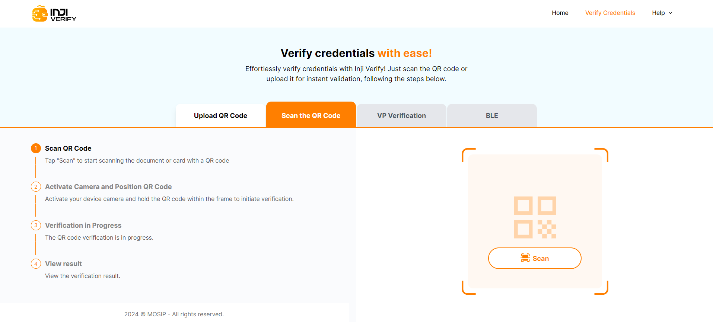<figcaption>
Scan QR Code Desktop View
</figcaption></figure>

**Mobile View**

<figure>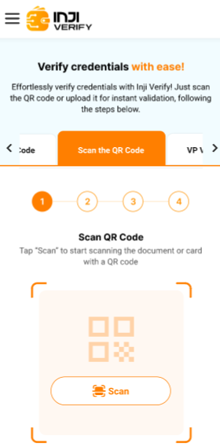<figcaption>
Scan QR Code Mobile View
</figcaption></figure>

**Step 2: Camera Permissions:**

When the scan is initiated, you will be prompted to grant the necessary camera permissions for the Inji Verify portal. Please click the "Allow" button to give the portal access to your device's camera.

**Desktop View**

<figure><figcaption>
Camera Permission Desktop View
</figcaption></figure>

**Mobile View**

<figure>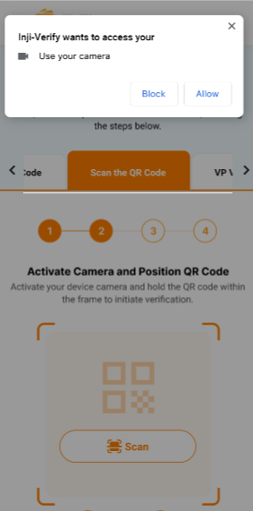<figcaption>
Camera Permission Mobile View
</figcaption></figure>

**Step 3: Scan QR Code:**

* Position the device's camera in front of the QR code you wish to scan.
* Capture the QR code by aligning it within the frame displayed on your device's screen.
* Once the QR code is captured, the data is sent to the Inji Verify portal for processing.


* **Decoding and Verification:**
  * The QR data is passed to the Pixel Pass library for decoding.
  * Pixel Pass returns the decoded data to Inji Verify for further processing.
  * Inji Verify then verifies the decoded data using the Verification SDK.


**Desktop View**

<figure>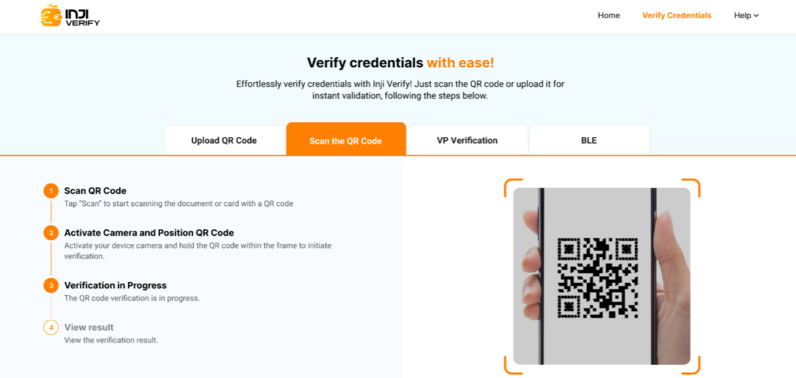<figcaption>
Scan QR Code Desktop View
</figcaption></figure>

**Mobile View**

<figure>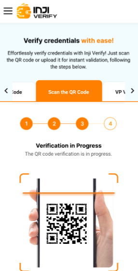<figcaption>
Scan QR Code Mobile View
</figcaption></figure>

**Step 4: Display Credential Details:**

* After successful verification, Inji Verify retrieves the display properties of the credential from the issuer's configuration.
* The credential details are displayed on the portal's interface using the fetched display properties.

**Desktop View**

<figure>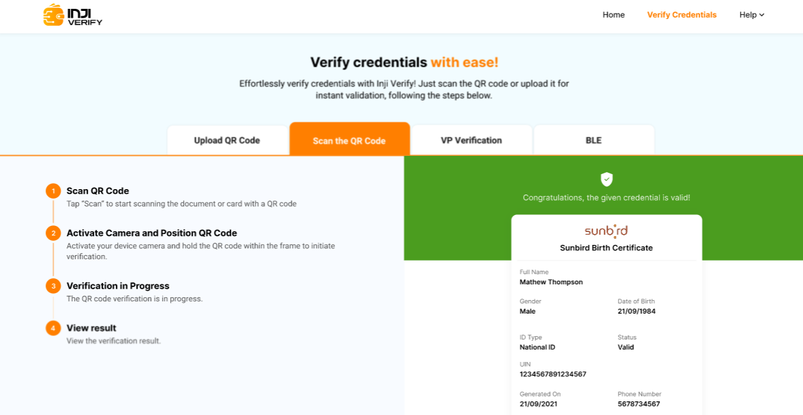<figcaption>
Display Credential Details Desktop View
</figcaption></figure>

**Mobile View**

<figure>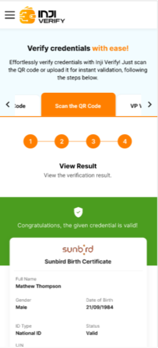<figcaption>
Display Credential Details Mobile View
</figcaption></figure>

### **Feature 2 Flow: Upload QR Flow:**

**Step 1: Upload QR Code:**

* Begin by accessing the Inji Verify portal and selecting the tab “Upload QR Code” where the Upload QR code section will come up and click on the “Upload” button to initiate the process.

**Desktop View**

<figure>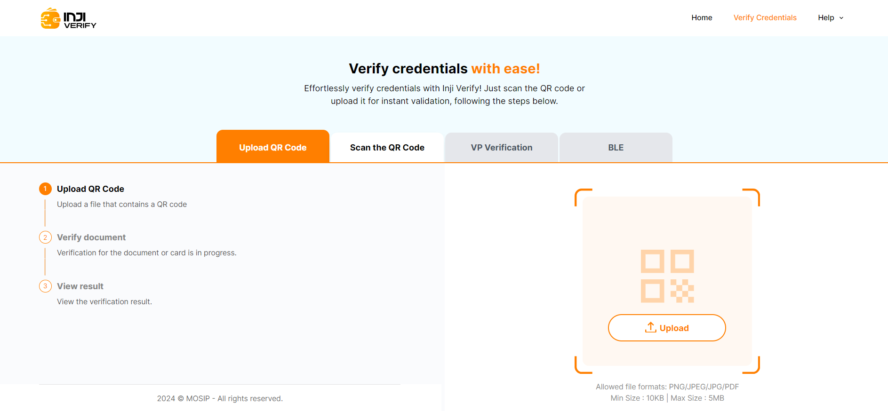<figcaption>
Upload QR Code Desktop View
</figcaption></figure>

**Mobile View**

<figure>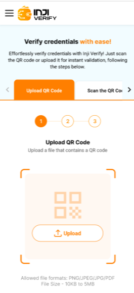<figcaption>
Upload QR Code Mobile View
</figcaption></figure>

* Click on the **“Upload”** button on the “Upload QR Code” Page as you select the option to upload a file containing the QR code or credential document you wish to verify from your device's file explorer. Click on the file to proceed.
* Inji Verify passes the QR data from the uploaded file to the Pixel Pass library for processing.


* **Decoding and Verification:**
  * The QR data is passed to the Pixel Pass SDK for decoding.
  * Pixel Pass returns the decoded data to Inji Verify for further processing.
  * Inji Verify then verifies the decoded data using the Verification SDK.


**Desktop View**

<figure>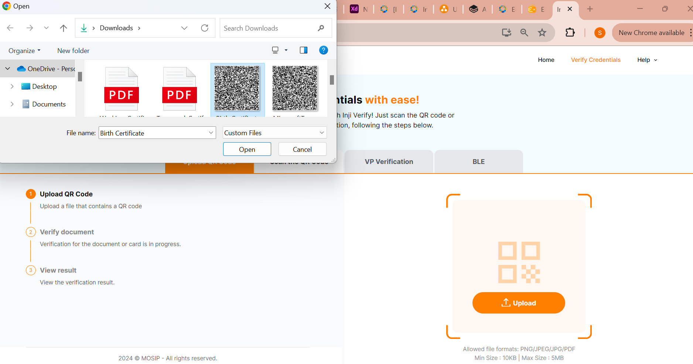<figcaption>
Upload QR file Desktop View
</figcaption></figure>

**Mobile View**

<figure>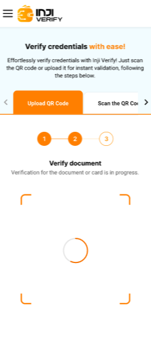<figcaption>
Verify Document Mobile View
</figcaption></figure>

**Step 2: Display Credential Details:**

* Upon successful verification, Inji Verify retrieves the display properties of the credential and presents the details on the portal's interface.

**Desktop View**

<figure><figcaption>
Display Credentials Desktop View
</figcaption></figure>

**Mobile View**

<figure>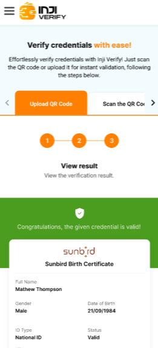<figcaption>
Display Credentials Mobile View
</figcaption></figure>

### **Error Handling:**

**Scenario 1:** If Pixel Pass encounters difficulties in decoding the data or encounters an unsupported QR code format, Inji Verify returns to the home screen.

* An error message stating "**QR code format not supported"** is displayed to the user.

**Desktop View**

<figure>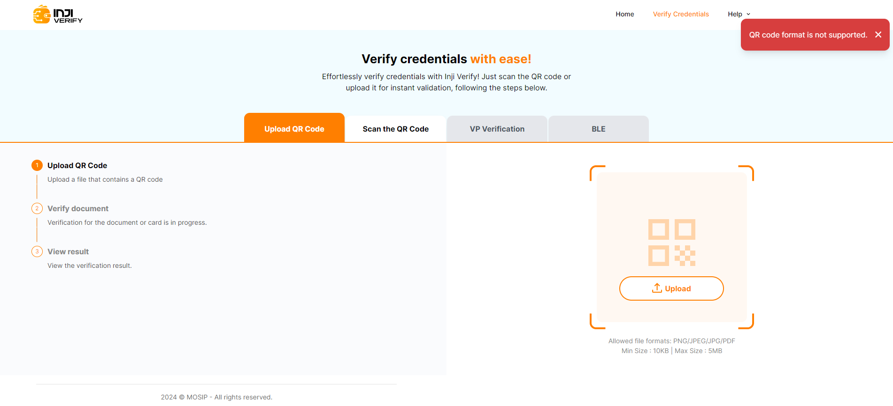<figcaption>
QR Code not supported Desktop View
</figcaption></figure>

**Scenario 2:** If the QR code size or file size exceeds the permissible limit where the maximum size is 5MB, Inji Verify returns to the home screen.

* An error message stating "**File size not supported. The file should be between 10Kb and 5 MB.**"

**Desktop View**

<figure>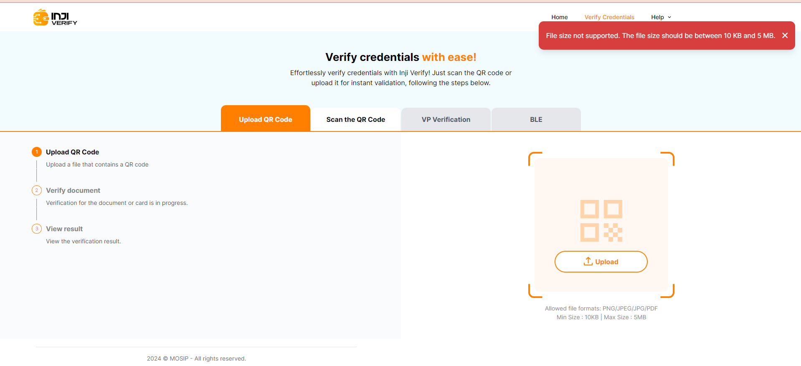<figcaption>
File Size Not Supported Desktop View
</figcaption></figure>

**Scenario 3:** If the QR code is unreadable or blurry then Inji Verify returns to the home screen.

* An error message stating**"No multi-format readers were able to read the QR code."**

**Desktop View**

<figure>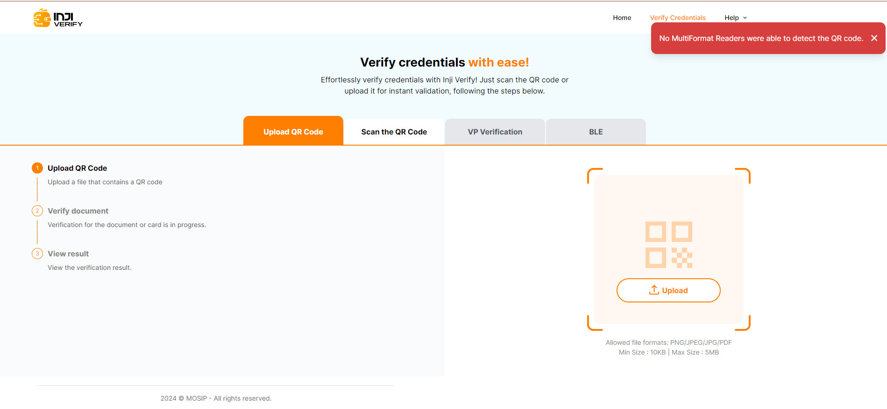<figcaption>
Unreadable QR Code Desktop View
</figcaption></figure>

**Scenario 4:** If the user fails to scan the QR code within the 60-second timeframe then Inji Verify returns to the home screen.

* An error message stating "**The scan session has expired due to inactivity. Please initiate a new scan**."

**Desktop View**

<figure>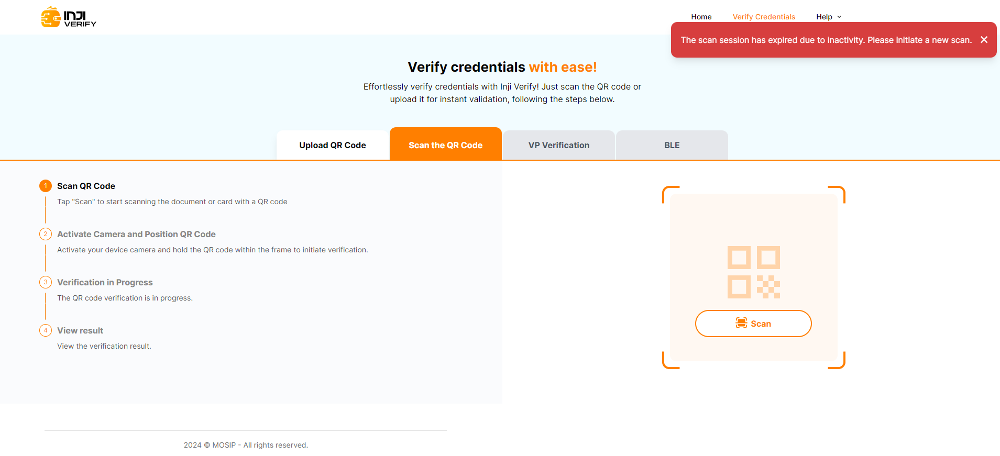<figcaption>
Scan Session Expired Desktop View
</figcaption></figure>

**Scenario 5:** When a PDF containing VC is uploaded and the QR Code is not valid, then the following error message is displayed- ‘Something went wrong with your request. Please check and try again.’

<figure>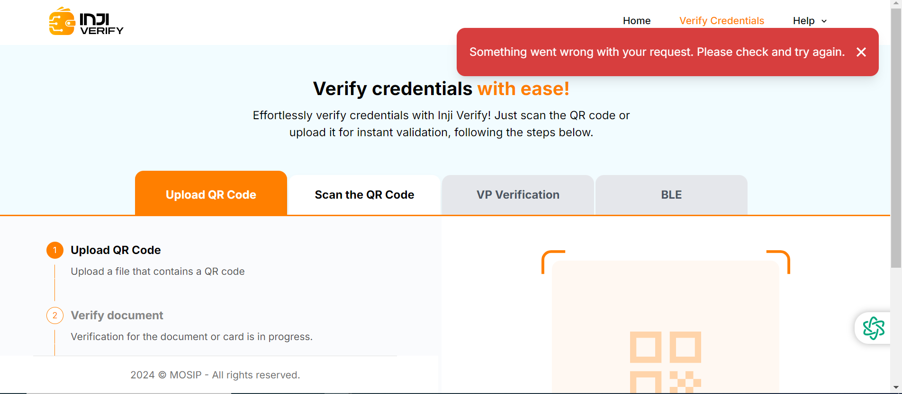<figcaption></figcaption></figure>

**Scenario 6:** If there is no internet connectivity, the following error message is displayed while using Inji Verify - ‘No Internet Connection! Oops! We can’t seem to connect. Check your internet connection and try again'

<figure>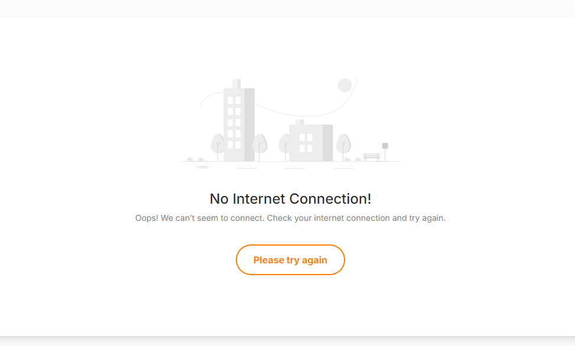<figcaption></figcaption></figure>

**Scenario 7:** When the request in the application url is invalid, the error message displayed- ‘The requested resource is invalid’.

<figure>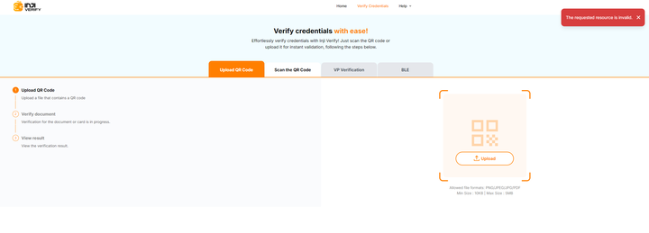<figcaption></figcaption></figure>

**Scenario 8:** When the server is done, then the error message displayed is- ‘The service is currently unavailable. Please try again later’.

<figure>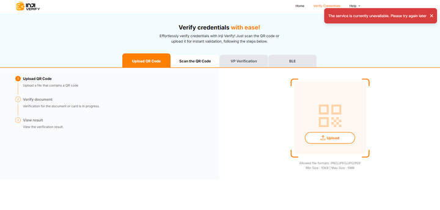<figcaption></figcaption></figure>

### **Header Section:** 

#### **Home** 

* The “Home” Screen is not available now so you will be able to see the “Upload QR Code” Page instead.

#### **Verify Credentials** 

* The Verify Credentials Page will showcase two main features of Inji Verify that is “Upload QR Code” and “Scan the QR Code”.

**Desktop View**

<figure>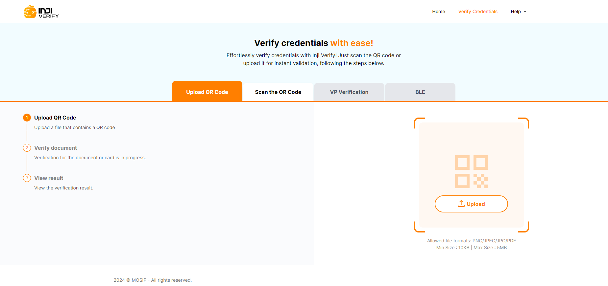<figcaption>
Verify Credentials Desktop View
</figcaption></figure>

#### **Help** 

* The Help section includes three sub-sections or sub-menus:
  * **Contact Us**: This directs you to our MOSIP Community where you can write to us with any queries related to Inji Verify or general inquiries.
  * **Documentation**: This directs you to the Inji Verify documentation page for detailed information about Inji Verify.
  * **FAQ**: This section is still under development.

**Desktop View**

<figure>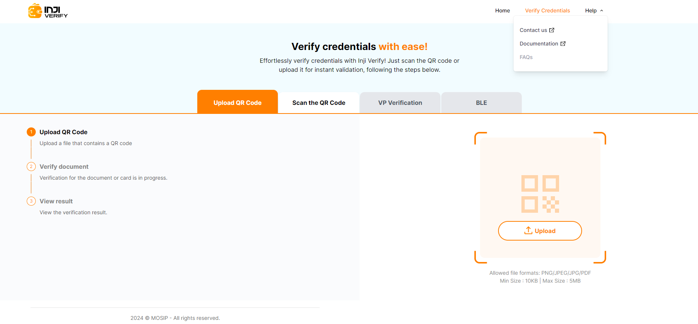<figcaption>
Help Desktop View
</figcaption></figure>

### **Credential Display Capability** 

**Valid Credentials**

* These credentials are currently active and verified using the Inji Verify Portal.

**Desktop View**

<figure>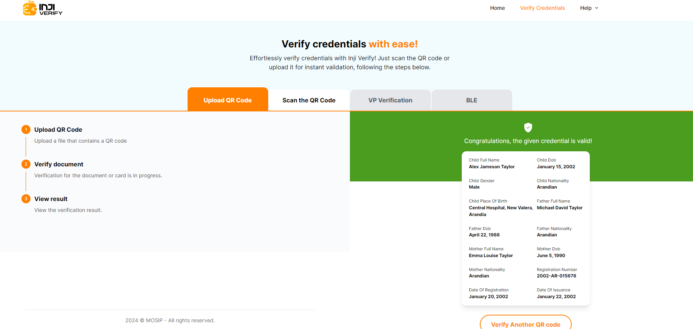<figcaption>
Valid Credentials Desktop View
</figcaption></figure>

**Invalid Credentials**:

* These credentials are currently active but invalid.

**Desktop View**

<figure>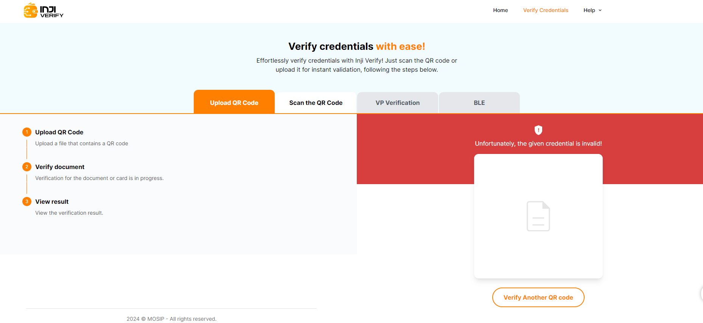<figcaption>
Invalid Credentials Desktop View
</figcaption></figure>

**Expired Credentials**

* These credentials have passed their validity period and are no longer active.

**Desktop View**

<figure>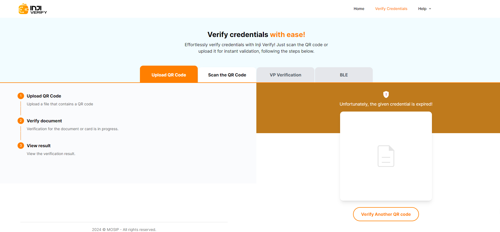<figcaption>
Expired Credentials Desktop View
</figcaption></figure>
