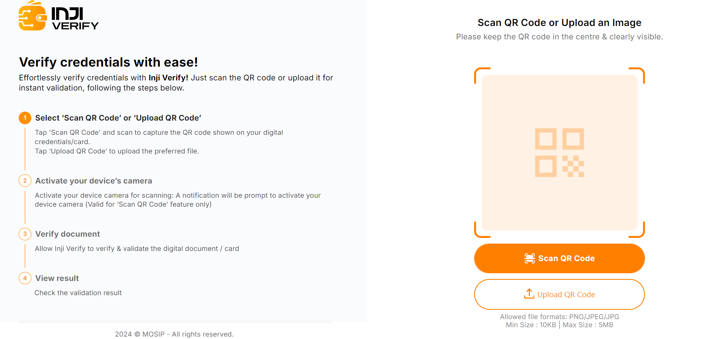
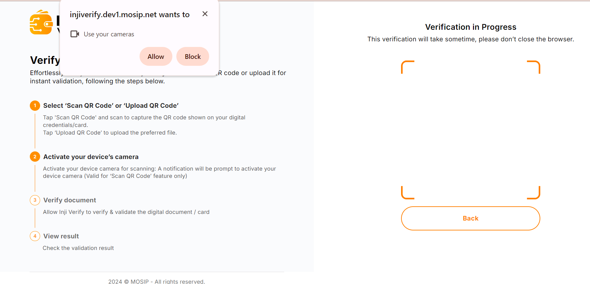
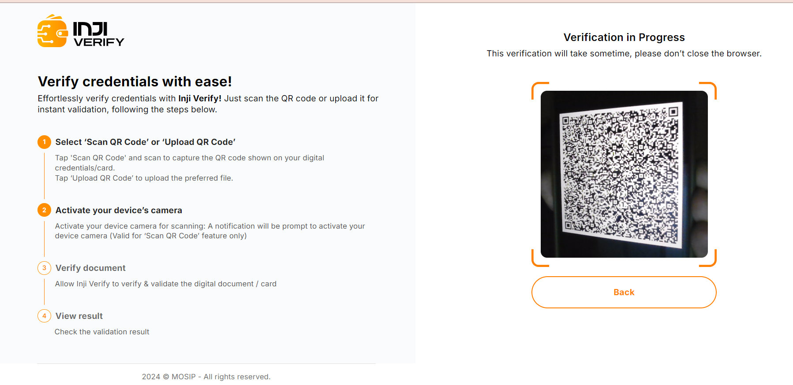
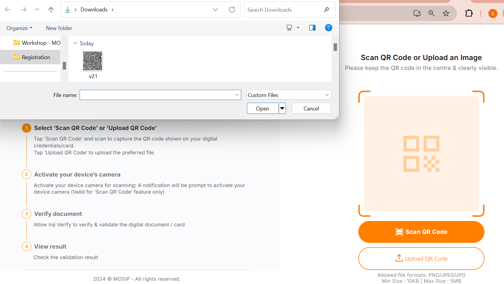
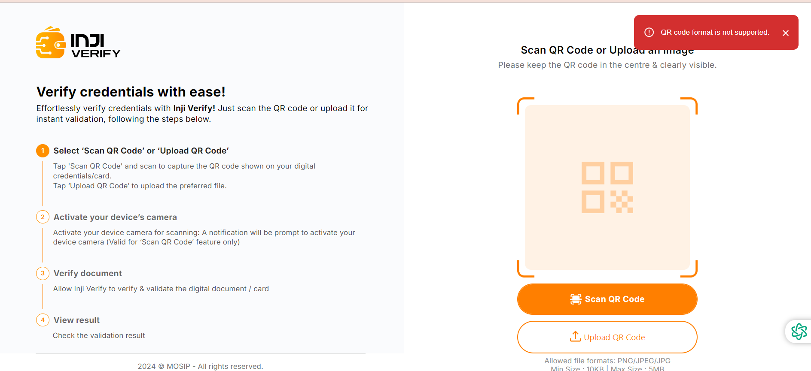
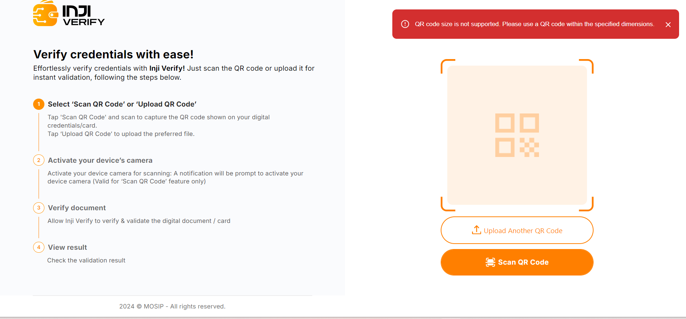
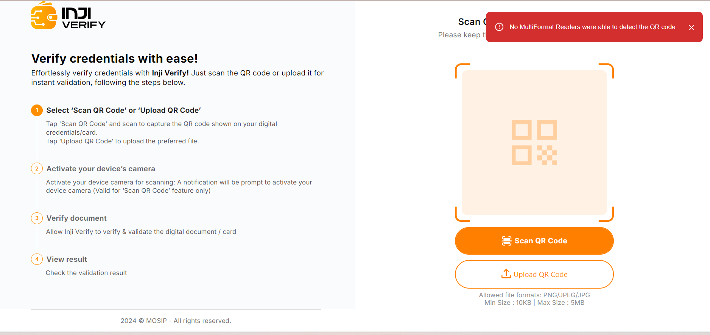
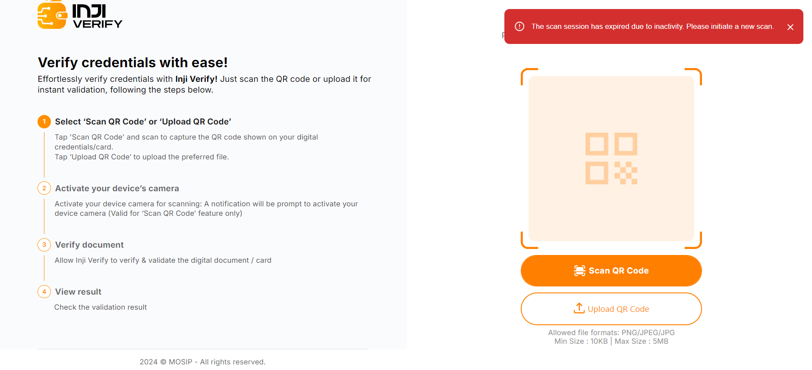

# End User Guide

This document serves as a concise guide for end users, providing comprehensive step-by-step information on the features and functionalities offered by Inji Verify.

### **Feature 1 Flow: Scan QR Code**

**Step 1: Initiate Scan Request:**

* Begin by accessing the Inji Verify portal and selecting the option to scan a QR code by clicking on **“Scan QR Code”**.

<figure><figcaption></figcaption></figure>

**Step 2: Camera Permissions:**

If prompted, grant the necessary camera permissions to the Inji Verify portal to allow access to your device's camera by clicking on the “Allow” button.

<figure><figcaption></figcaption></figure>

**Step 3: Scan QR Code:**

* Position the device's camera in front of the QR code you wish to scan.
* Capture the QR code by aligning it within the frame displayed on your device's screen.

<figure><figcaption></figcaption></figure>

**Step 4: QR Code Processing:**

* Once the QR code is captured, the data is sent to the Inji Verify portal for processing.
* **Decoding and Verification:**
  * The QR data is passed to the Pixel Pass library for decoding.
  * Pixel Pass returns the decoded data to Inji Verify for further processing.
  * Inji Verify then verifies the decoded data using the Verification SDK.

<figure><figcaption></figcaption></figure>

**Step 5: Display Credential Details:**

* After successful verification, Inji Verify retrieves the display properties of the credential from the issuer's configuration.
* The credential details are displayed on the portal's interface using the fetched display properties.

<figure><figcaption></figcaption></figure>

### **Feature 2 Flow: Upload QR Flow:**

**Step 1: Upload QR Code:**

* Click on the **“Upload QR Code”** button as you select the option to upload a file containing the QR code or credential document you wish to verify from your device's file explorer. Simply click on the file to proceed.

<figure><figcaption></figcaption></figure>

**Step 2: QR Code Processing:**

* Inji Verify passes the QR data from the uploaded file to the Pixel Pass library for processing.
* **Decoding and Verification:**
  * The QR data is passed to the Pixel Pass SDK for decoding.
  * Pixel Pass returns the decoded data to Inji Verify for further processing.
  * Inji Verify then verifies the decoded data using the Verification SDK.

<figure><figcaption></figcaption></figure>

**Step 3: Display Credential Details:**

* Upon successful verification, Inji Verify retrieves the display properties of the credential and presents the details on the portal's interface.

<figure><figcaption></figcaption></figure>

### **Error Handling:**

**Scenario 1:** If Pixel Pass encounters difficulties in decoding the data or encounters an unsupported QR code format, Inji Verify returns to the home screen.

* An error message stating "**QR code format not supported" is displayed to the user.”**

<figure><figcaption></figcaption></figure>

**Scenario 2:** If the QR code size or file size exceeds the permissible limit where the maximum size is 5MB, Inji Verify returns to the home screen.

* An error message stating "**QR code size is not supported. Please use a QR code within the specified limit.**"

<figure><figcaption></figcaption></figure>

**Scenario 3:** If the QR code is unreadable or blurry then Inji Verify returns to the home screen.

* An error message stating**"No multi-format readers were able to read the QR code."**

<figure><figcaption></figcaption></figure>

**Scenario 4:** If the user fails to scan the QR code within the 60-second timeframe then Inji Verify returns to the home screen.

* An error message stating "**The scan session has expired due to inactivity. Please initiate a new scan**."

<figure><figcaption></figcaption></figure>

\
\
