# Inji Verify End-User Guide


**Important**: We are in the process of updating screenshots and content in the End User Guide to reflect our new branding. These updates will be available soon, thank you for your patience!


This document serves as a concise guide for end users, providing comprehensive step-by-step information on the features and functionalities offered by Inji Verify.

## Verify by scanning the QR Code

1. **Initiate Scan Request:** Go to the Inji Verify portal and select the tab "Scan the QR Code" where the Scan QR code section will come up.

2. Click on the Scan button to initiate the scanning process.

  <figure style="margin: 0;">
    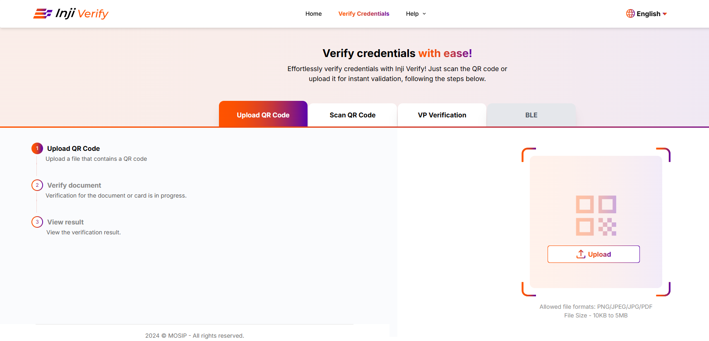
    <figcaption></figcaption>
  </figure>
  <figure style="margin: 0;">
    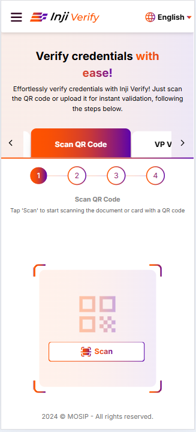
    <figcaption></figcaption>
  </figure>

<!-- 

earlier one

<figure><figcaption>

</figcaption></figure>, <figure><figcaption>

</figcaption></figure>

-->

3. Camera Permissions: When the scan is initiated, you will be prompted to grant the necessary camera permissions for the Inji Verify portal, Click the Allow button to give the portal access to your device's camera.
<figure>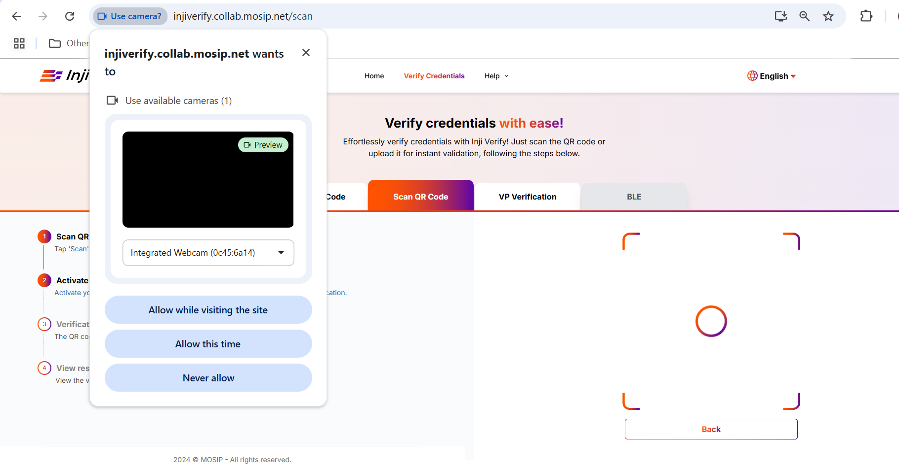<figcaption>

</figcaption></figure>, <figure>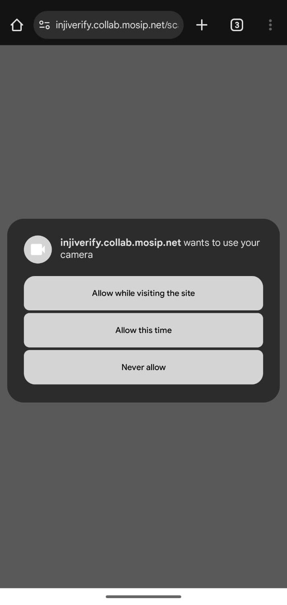<figcaption>

</figcaption></figure>

4. If camera access is denied the screen displays a message indicating the camera permission is denied.
<figure>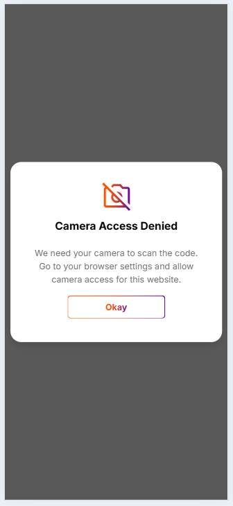<figcaption>
Camera Permission Denied
</figcaption></figure>

5. **Scan the QR Code**
* Scan QR Code
    * Position the device's camera in front of the QR code you wish to
    scan.
    * Capture the QR code by aligning it within the frame displayed on
    your device's screen.
    * Once the QR code is captured, the data is sent to the Inji Verify
    portal for processing.
* **How is QR Code decoded?:**
    * The QR data is passed to the Pixel Pass library for decoding.
    * Pixel Pass returns the decoded data to Inji Verify for further processing.
    * Inji Verify then verifies the decoded data using the Verification SDK.

<figure>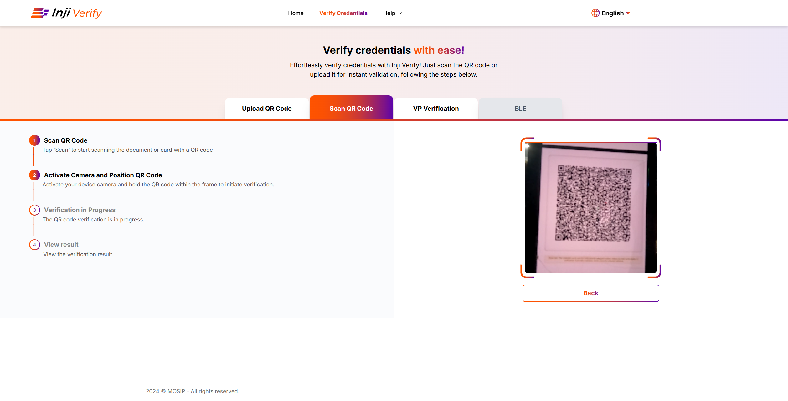<figcaption>

</figcaption></figure>, <figure>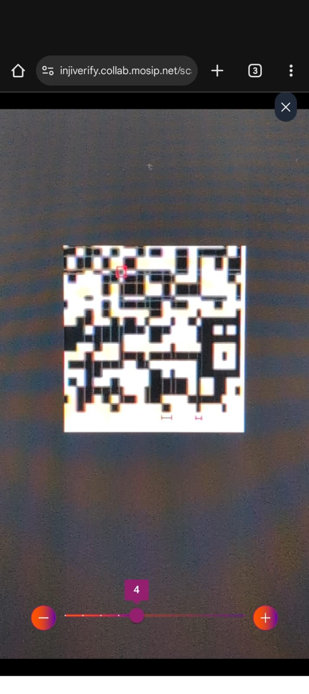<figcaption>
Zoom Slider
</figcaption></figure>

6. **Display Credential Details:** - On successful verification, Inji Verify retrieves the display 
    properties of the credential from the issuer's configuration. The credential details are displayed on the portal's interface
    using the fetched display properties.
<figure>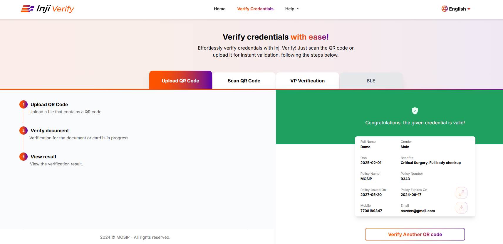<figcaption>

</figcaption></figure>,  <figure>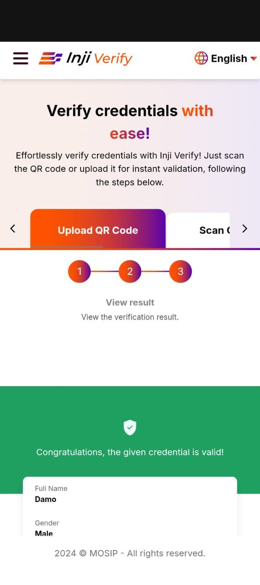<figcaption>

</figcaption></figure>

## Verify by uploading the QR Code

1. **Upload QR Code:** - Go to the Inji Verify portal and select the tab **Upload QR Code** where the Upload QR code section will come up and click on the **Upload** button to initiate the process.

<figure>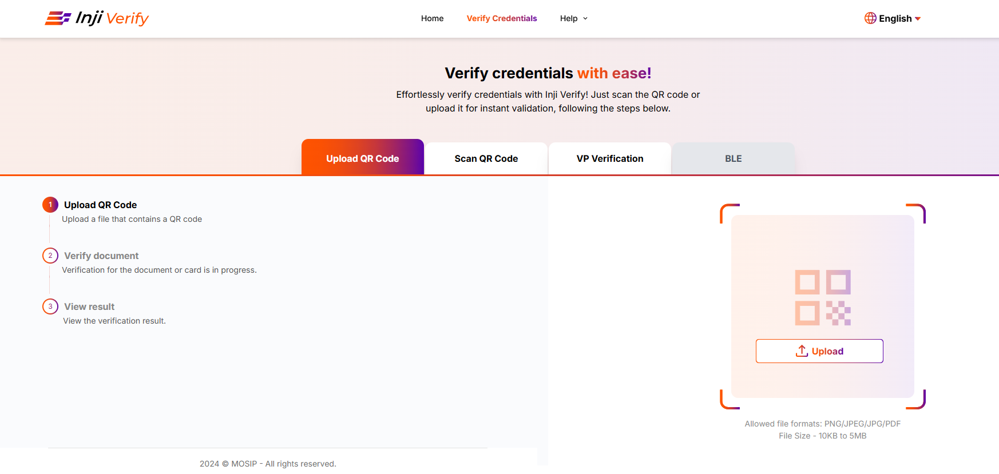<figcaption>

</figcaption></figure> , <figure>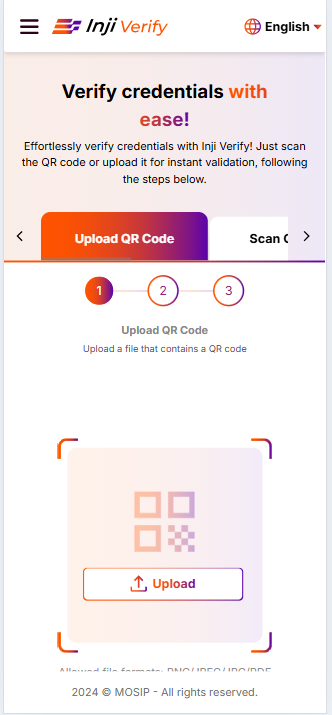<figcaption>

</figcaption></figure>

2. Click on the **"Upload"** button on the **Upload QR Code** Page as you select the option to upload a file containing the QR code or credential document you wish to verify from your device's (Desktop or Mobile browser) file explorer. Click on the file to proceed.

3. **How is QR Code decoded and verified once you have uploaded it?:** Inji Verify passes the QR data from the uploaded file to the Pixel Pass library for processing.
    * The QR data is passed to the Pixel Pass SDK for decoding.
    * Pixel Pass returns the decoded data to Inji Verify for further processing.
    * Inji Verify then verifies the decoded data using the Verification SDK.

<figure>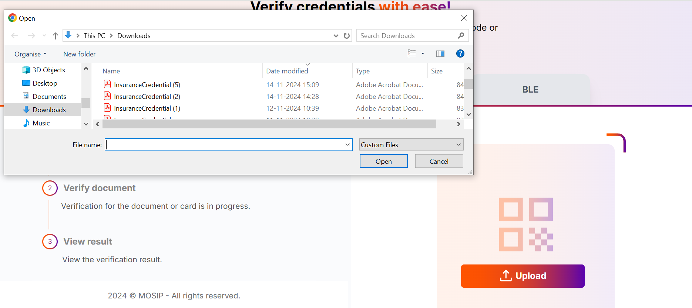<figcaption>

</figcaption></figure>, <figure>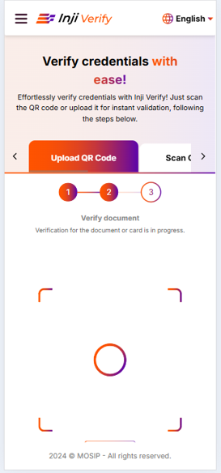<figcaption>

</figcaption></figure>

4. **Display Credential Details:** - Upon successful verification, Inji Verify retrieves the display properties of the credential and presents the details on the portal's interface.

<figure>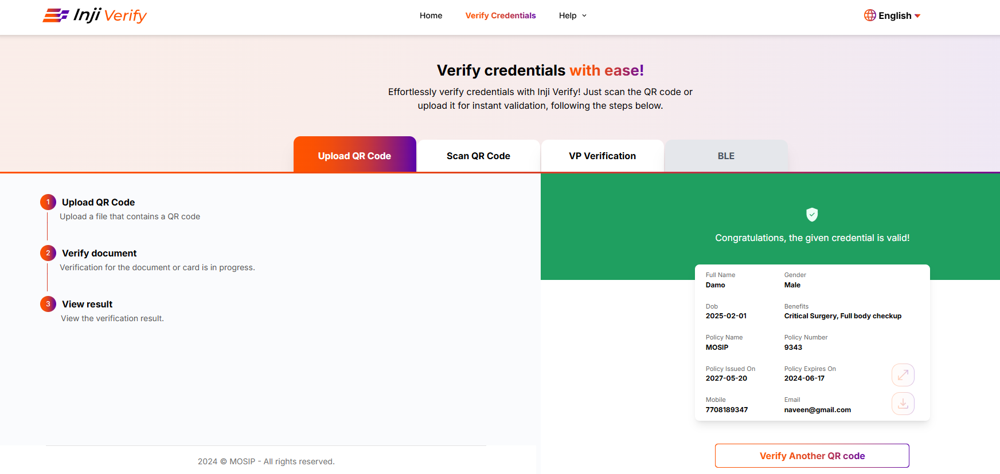<figcaption>

</figcaption></figure>, <figure><figcaption>

</figcaption></figure>

## VP Verification (Cross Device Flow)

**Step 1:** **Initiate VP Request Process**

Initiate VP Request Process by clicking on '**Request Verifiable
Credentials'** to begin the verification process.

<figure>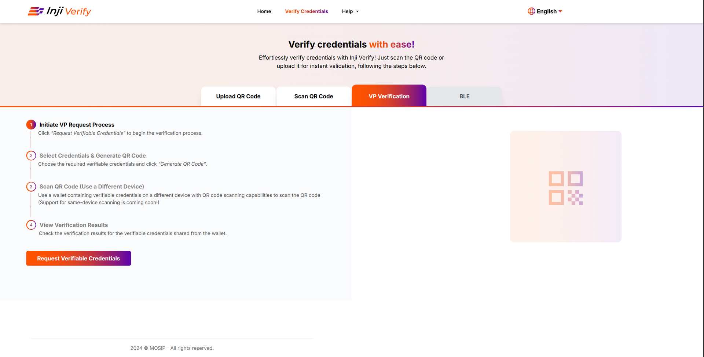<figcaption>

</figcaption></figure>

**Step 2:** **Select Credentials & Generate QR Code**

-   The verifier is presented with a list of verifiable credential types
    with specific credentials already pre-selected(configurable) based
    on a specific usecase.

-   Pre-selected credential types are listed on the top and rest of the
    credentials (non-selected ones) are displayed in alphabetical order.

-   The list of VCs can also be sorted in ascending or descending order
    using Sort option.

-   Each credential type is displayed with a checkbox next to it.

-   The verifier reviews the list and selects the desired credentials by
    clicking the checkboxes provided in the list.

    -   Verifier can also search for a credential by entering the
        credential type (1 or more letters to be entered in the search
        box and filtered results appear in the dropdown).

<figure>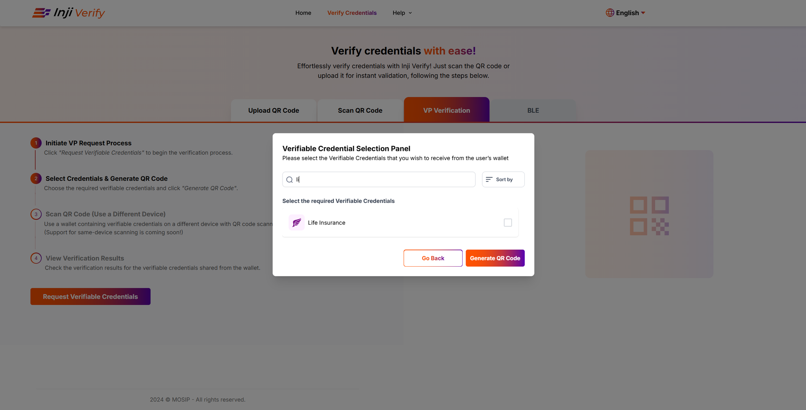<figcaption>

</figcaption></figure>

-   Choose the required verifiable credentials from the popup window and
    click '**Generate QR Code'**.

    -   If the verifier does not wish to select any credentials, he can
        click on Go Back Button. Clicking on it navigates to main screen
        of 'VP Verification' tab in Inji Verify portal

<figure>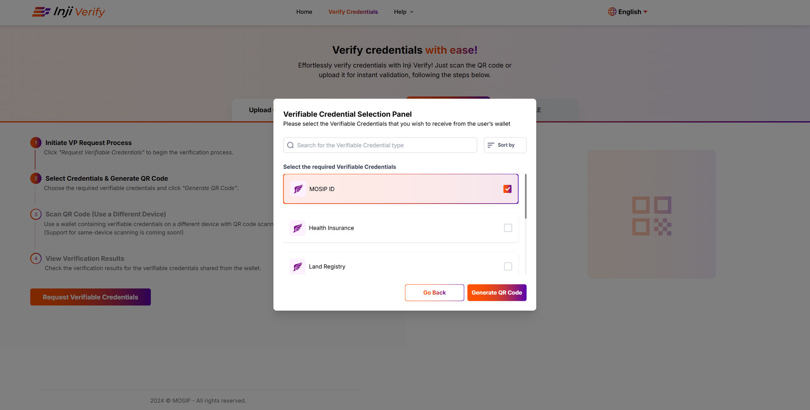<figcaption>

</figcaption></figure>

**Step 3: Scan QR Code from Mobile wallet (Use a Different Device)**

Use a wallet containing verifiable credentials on a different device
with QR code scanning capabilities to scan the QR code.

<figure>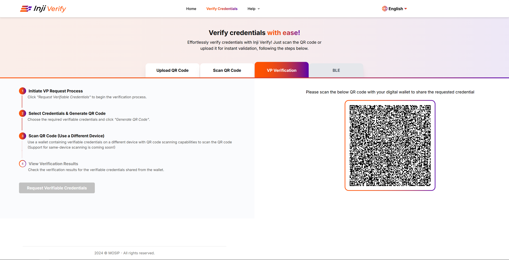<figcaption>

</figcaption></figure>

Note: The steps that Inji wallet performs to support this interaction
are:

-   The Wallet interprets the VP request and lists all the matching
    credentials available in the Wallet.

-   The Wallet prompts the user to authenticate and then seeks consent
    to share the requested credential(s).

-   The Wallet sends the VP response via HTTPS POST to the Inji Verify
    portal.

**Step 4: View Verification Results in Inji Verify**

Inji Verify displays the verification results of the verifiable
credentials shared from the wallet which could be either 'Valid', 'Valid
but Expired', 'Invalid\' .

-   **Single VC display- Valid VC**

<figure>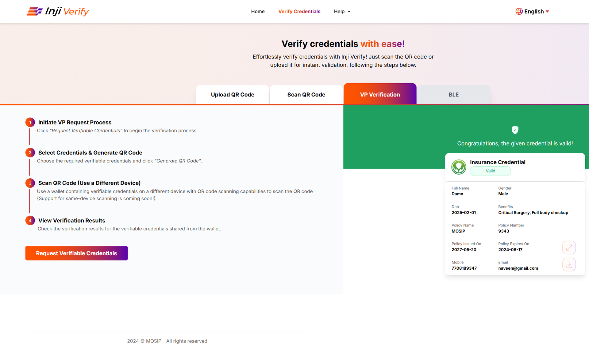<figcaption>

</figcaption></figure>

Click on full screen option to view the Verifiable Credentials data as
an enlarged view.

<figure>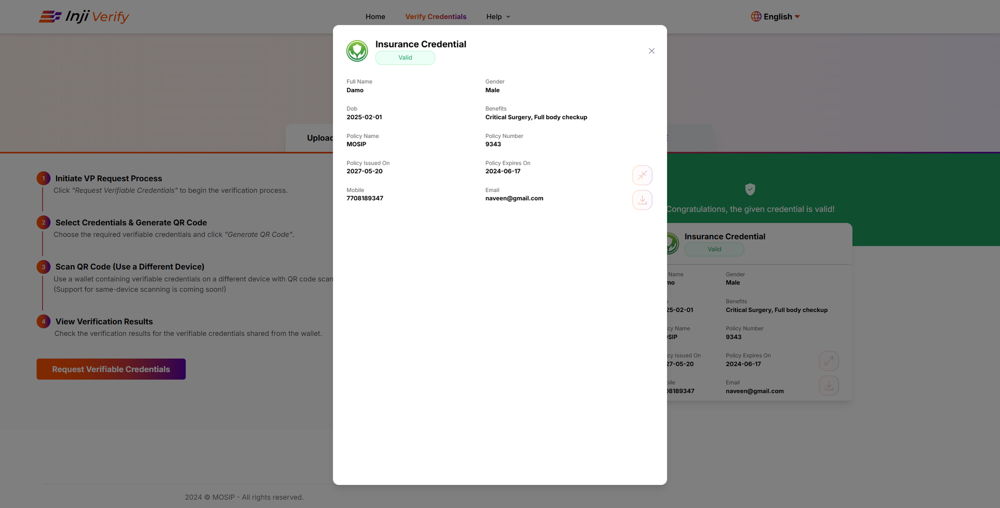<figcaption>

</figcaption></figure>

Click on download option to download the VC data as a json file.

<figure>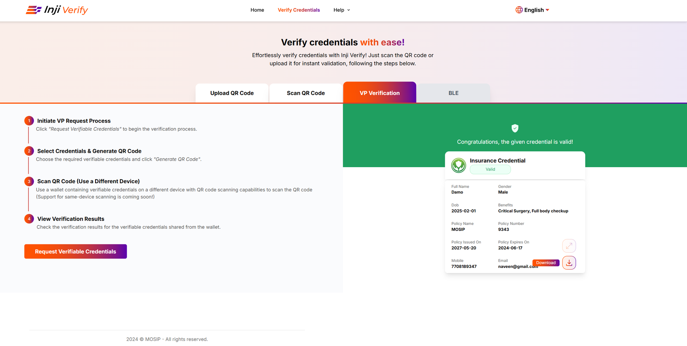<figcaption>

</figcaption></figure>

-   **Single VC display- Expired VC**

<figure>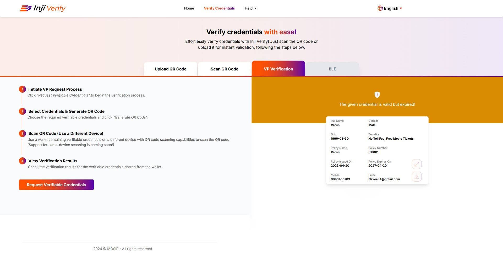<figcaption>

</figcaption></figure>

-   **Single VC display- Invalid VC**

<figure>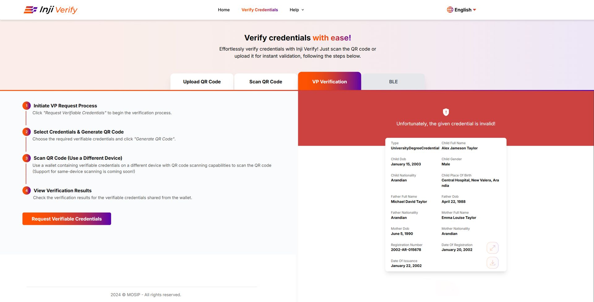<figcaption>

</figcaption></figure>

-   **Multiple VCs display**

<figure>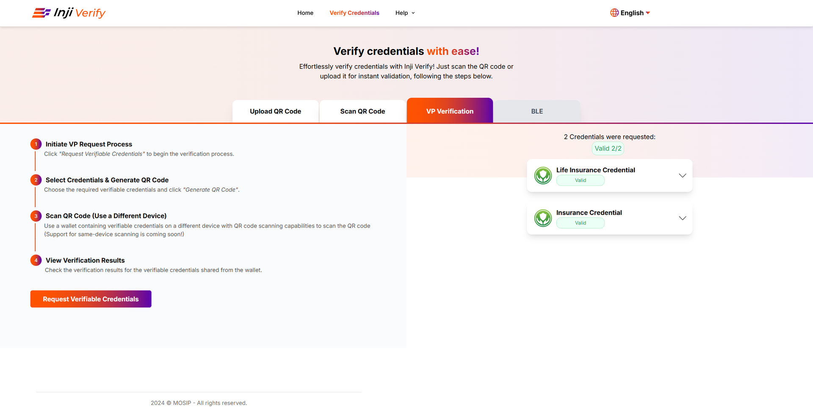<figcaption>

</figcaption></figure>

-   **Partial sharing of requested credentials**

If not all the requested VCs are shared from wallet, then the status of
missing VC result area is displayed as 'Not Shared'

<figure>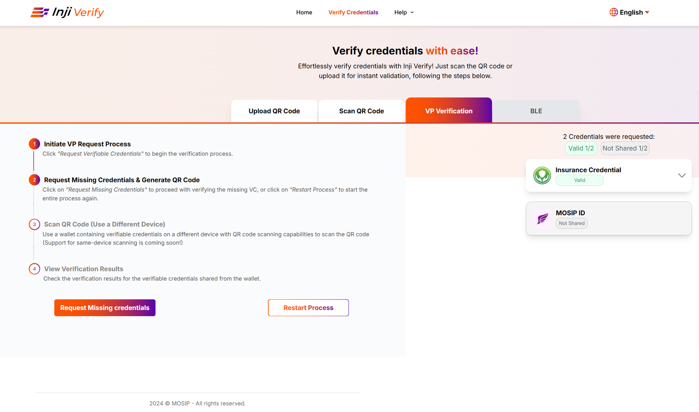<figcaption>

</figcaption></figure>

As the verifier is informed of the missing credentials in VC result
section, the verifier has to **either Generate Request for Missing
Credentials or Generate a New Request for restarting the VP sharing
flow.** The verifier can request for missing credentials by continuing
the flow by clicking on \' Request Missing Credentials\' to generate
another QR code that requests the missing credentials. Another button-
\' Restart Process\' helps user to re-initiate the VP Request process
all over again (by displaying the popup window to select the credentials
and rest of the process continues to be the same), if required.

-   **Re-Generation of VP Request:**

    -   Upon clicking \"Request Missing Credentials\" button, the
        Verifier portal automatically identifies the credentials that
        were not received in the previous transaction.

    -   A new Verifiable Presentation (VP) request is generated,
        containing only the missing credentials.

<figure>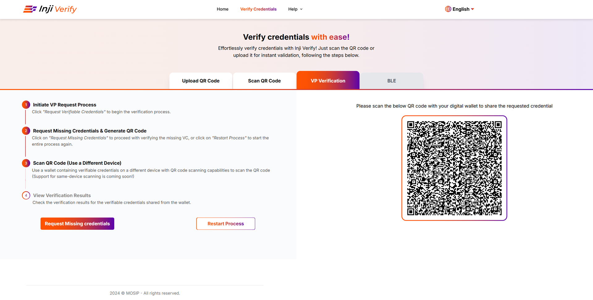<figcaption>

</figcaption></figure>

-   **QR Code/Link Display:**

    -   The new VP request is encoded into a QR code.

    -   The QR code is displayed on the Verifier portal and is ready for
        the Holder to scan or access.

<figure>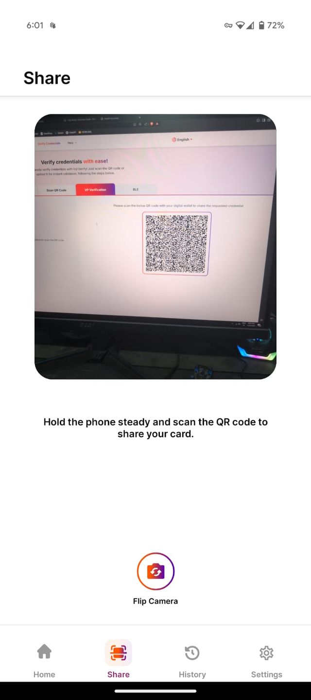<figcaption>

</figcaption></figure>

-   **Holder Interaction:**

    -   The Holder (Inji Wallet) scans the new QR code or accesses the
        link.

    -   The Wallet fetches the new VP request and lists the pending
        credentials (if they are available in the Wallet) along with the
        list of previously verified credentials from our original
        request.

<figure>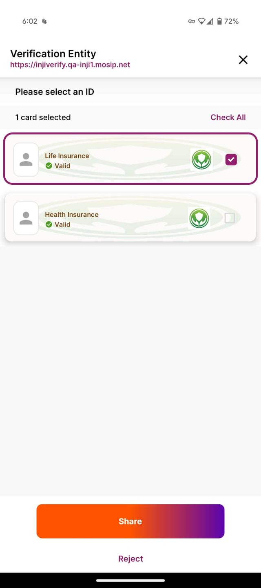<figcaption>

</figcaption></figure>

-   **Credential Sharing and Verification:**

    -   The process of selecting credentials, providing user consent,
        and sending the VP response follows the standard flow.

    -   The Verifier receives the pending credentials and completes the
        verification process.

<figure><figcaption>

</figcaption></figure>

-   **Final Verification Completion:**

    -   Once all credentials are received and verified, the Verifier
        portal displays a final confirmation message indicating that all
        requested credentials have been successfully verified.

    -   The process is marked as complete.

<figure>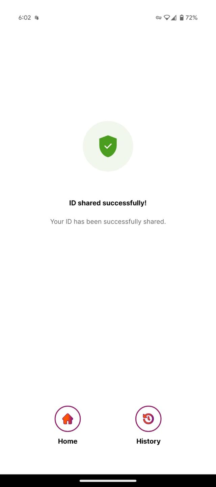<figcaption>

</figcaption></figure>

**Note:**

1.  For any VCs displayed after verification, the verifier is provided
    with an option to download the VCs in json format.

2.  For any VCs displayed after verification, the verifier is provided
    with an option to expand the VCs to full view.

## **Error Handling:** 

**Scenario 1:** If Pixel Pass encounters difficulties in decoding the data or encounters an unsupported QR code format, Inji Verify returns to the home screen.

-   An error message stating "**QR code format not supported"** is displayed to the user.

<figure><figcaption>

</figcaption></figure>

**Scenario 2:** If the QR code size or file size exceeds the permissible
limit where the maximum size is 5MB, Inji Verify returns to the home
screen.

-   An error message stating "**File size not supported. The file should be between 10Kb and 5 MB.**"

<figure>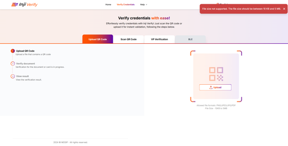<figcaption>

</figcaption></figure>

**Scenario 3:** If the QR code is unreadable or blurry then Inji Verify
returns to the home screen.

-   An error message stating **"No multi-format readers were able to read the QR code."**

<figure>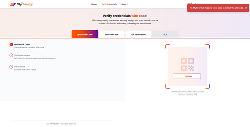<figcaption>

</figcaption></figure>

**Scenario 4:** If the user fails to scan the QR code within the 60-second timeframe then Inji Verify returns to the home screen.

-   An error message stating "**The scan session has expired due to inactivity. Please initiate a new scan**."

<figure>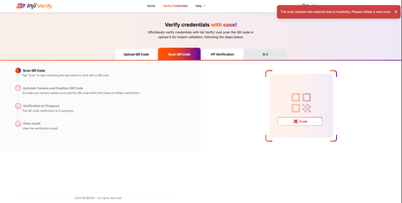<figcaption>

</figcaption></figure>

**Scenario 5:** When a PDF containing VC is uploaded and the QR Code is not valid, then the following error message is  displayed- 'Something went wrong with your request. Please check and try again.'

**Scenario 6:** If there is no internet connectivity, the following error message is displayed while using Inji Verify - 'No Internet Connection! Oops! We can't seem to connect. Check your internet connection and try again'

<figure>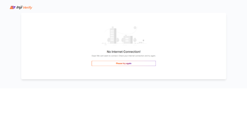<figcaption>

</figcaption></figure>

**Scenario 7:** When the request in the application url is invalid, the error message displayed- 'The requested resource is invalid'.

<figure>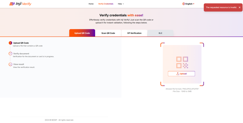<figcaption>

</figcaption></figure>

**Scenario 8:** When the server is down, then the error message displayed is - 'The service is currently unavailable. Please try again later'.

## **Header Section:**

### **Home**

-   The "Home" Screen is not available now so you will be able to see the "Upload QR Code" Page instead.

### **Verify Credentials**

-   The Verify Credentials Page will showcase two main features of Inji Verify that is "Upload QR Code" and "Scan the QR Code".

<figure>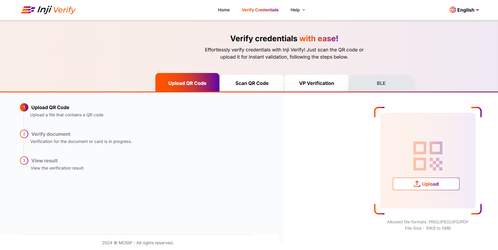<figcaption>

</figcaption></figure>

### **Help**

The Help section includes three sub-sections or sub-menus:

    -   **Contact Us**: This directs you to our MOSIP Community where you can write to us with any queries related to Inji  Verify or general inquiries.

    -   **Documentation**: This directs you to the Inji Verify documentation page for detailed information about Inji Verify.

    -   **FAQ**: This section is still under development.

<figure>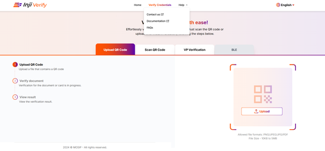<figcaption>

</figcaption></figure>

### **Language Selection**

Language dropdown is provided for verifier to select a language of his interest for better readability . The languages currently supported are: Portuguese, Spanish, French, English, Arabic, Tamil, Khmer, Hindi and Kannada.

<figure>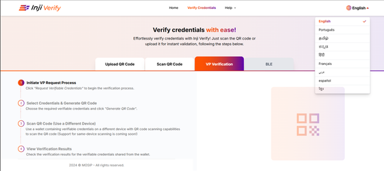<figcaption>

</figcaption></figure>

## **Credential Display Capability**

**Valid Credentials**

-   These credentials are currently active and verified using the Inji Verify Portal.

<figure><figcaption>

</figcaption></figure>

**Invalid Credentials**:

-   These credentials are currently active but invalid.

<figure>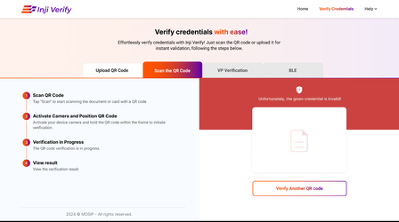<figcaption>

</figcaption></figure>

**Expired Credentials**

-   These credentials have passed their validity period and are no longer active.

<figure>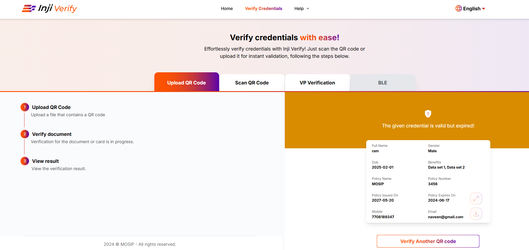<figcaption>

</figcaption></figure>

<!--

# End User Guide


**Important**: We are in the process of updating screenshots and content in the End User Guide to reflect our new branding. These updates will be available soon, thank you for your patience!


This document serves as a concise guide for end users, providing comprehensive step-by-step information on the features and functionalities offered by Inji Verify.

### **Feature 1 Flow: Scan QR Code**

**Step 1: Initiate Scan Request:**

* Begin by accessing the Inji Verify portal and selecting the tab “Scan the QR Code” where the Scan QR code section will come up and click on the “Scan” button to initiate the scanning process.

**Desktop View**

<figure>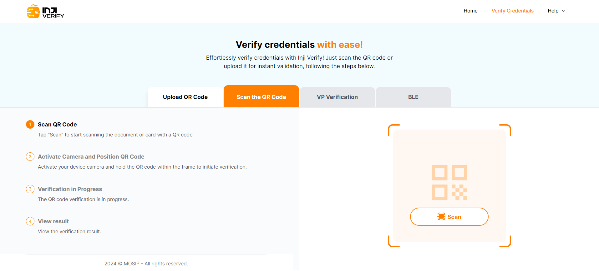<figcaption>
Scan QR Code Desktop View
</figcaption></figure>

**Mobile View**

<figure>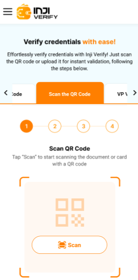<figcaption>
Scan QR Code Mobile View
</figcaption></figure>

**Step 2: Camera Permissions:**

When the scan is initiated, you will be prompted to grant the necessary camera permissions for the Inji Verify portal. Please click the "Allow" button to give the portal access to your device's camera.

**Desktop View**

<figure>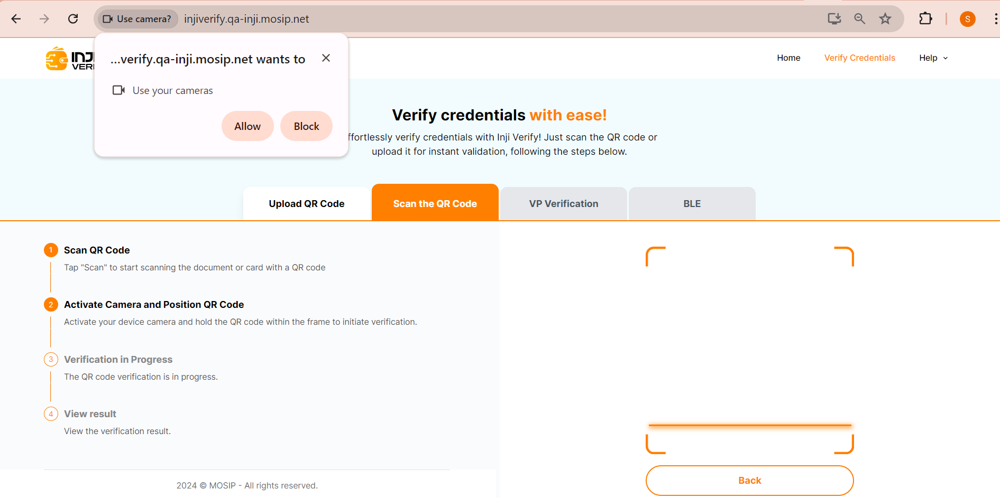<figcaption>
Camera Permission Desktop View
</figcaption></figure>

**Mobile View**

<figure>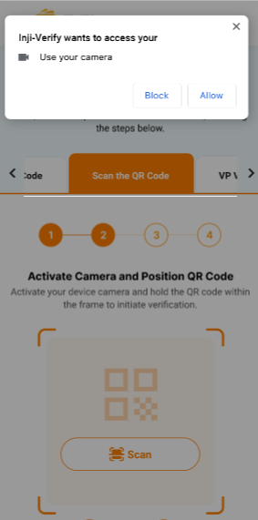<figcaption>
Camera Permission Mobile View
</figcaption></figure>

**Step 3: Scan QR Code:**

* Position the device's camera in front of the QR code you wish to scan.
* Capture the QR code by aligning it within the frame displayed on your device's screen.
* Once the QR code is captured, the data is sent to the Inji Verify portal for processing.


- **Decoding and Verification:**
  * The QR data is passed to the Pixel Pass library for decoding.
  * Pixel Pass returns the decoded data to Inji Verify for further processing.
  * Inji Verify then verifies the decoded data using the Verification SDK.


**Desktop View**

<figure>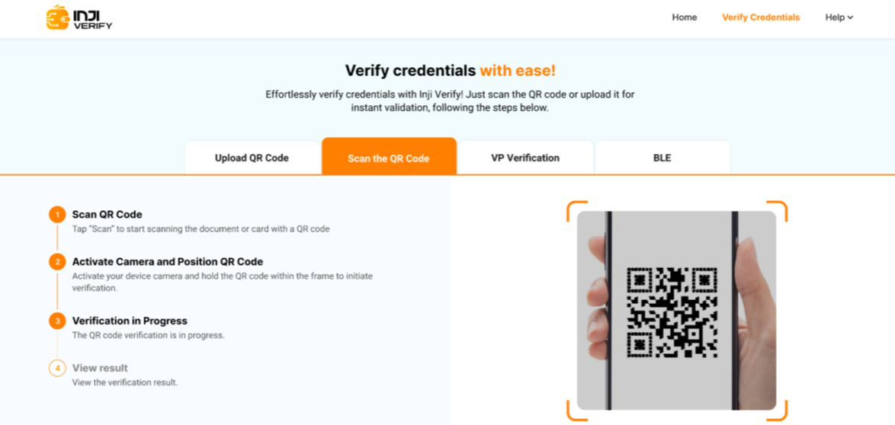<figcaption>
Scan QR Code Desktop View
</figcaption></figure>

**Mobile View**

<figure>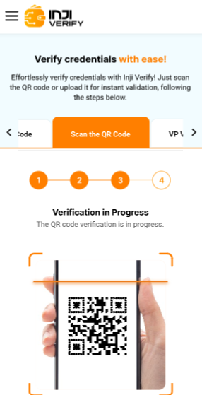<figcaption>
Scan QR Code Mobile View
</figcaption></figure>

**Step 4: Display Credential Details:**

* After successful verification, Inji Verify retrieves the display properties of the credential from the issuer's configuration.
* The credential details are displayed on the portal's interface using the fetched display properties.

**Desktop View**

<figure>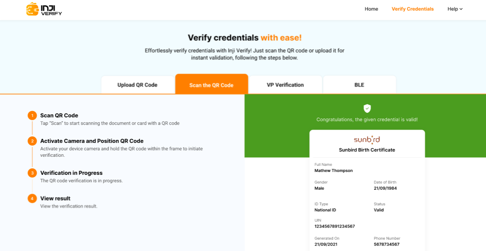<figcaption>
Display Credential Details Desktop View
</figcaption></figure>

**Mobile View**

<figure>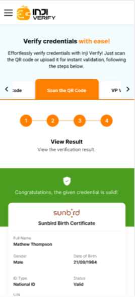<figcaption>
Display Credential Details Mobile View
</figcaption></figure>

### **Feature 2 Flow: Upload QR Flow:**

**Step 1: Upload QR Code:**

* Begin by accessing the Inji Verify portal and selecting the tab “Upload QR Code” where the Upload QR code section will come up and click on the “Upload” button to initiate the process.

**Desktop View**

<figure>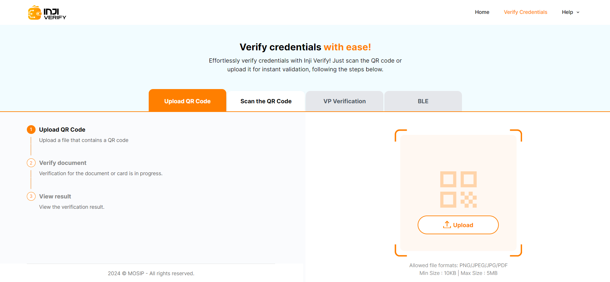<figcaption>
Upload QR Code Desktop View
</figcaption></figure>

**Mobile View**

<figure>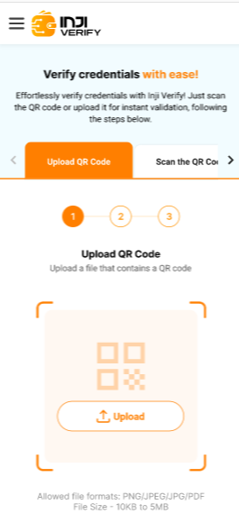<figcaption>
Upload QR Code Mobile View
</figcaption></figure>

* Click on the **“Upload”** button on the “Upload QR Code” Page as you select the option to upload a file containing the QR code or credential document you wish to verify from your device's file explorer. Click on the file to proceed.
* Inji Verify passes the QR data from the uploaded file to the Pixel Pass library for processing.


- **Decoding and Verification:**
  * The QR data is passed to the Pixel Pass SDK for decoding.
  * Pixel Pass returns the decoded data to Inji Verify for further processing.
  * Inji Verify then verifies the decoded data using the Verification SDK.


**Desktop View**

<figure>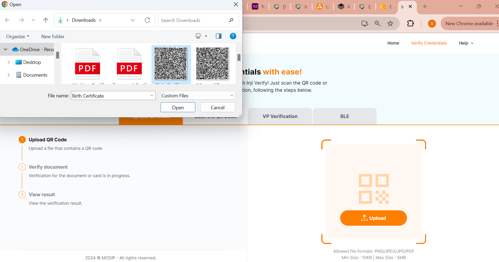<figcaption>
Upload QR file Desktop View
</figcaption></figure>

**Mobile View**

<figure>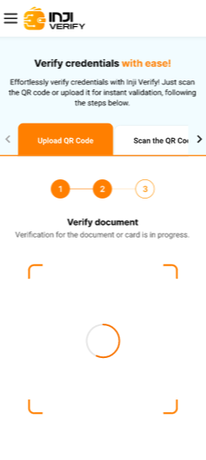<figcaption>
Verify Document Mobile View
</figcaption></figure>

**Step 2: Display Credential Details:**

* Upon successful verification, Inji Verify retrieves the display properties of the credential and presents the details on the portal's interface.

**Desktop View**

<figure><figcaption>
Display Credentials Desktop View
</figcaption></figure>

**Mobile View**

<figure>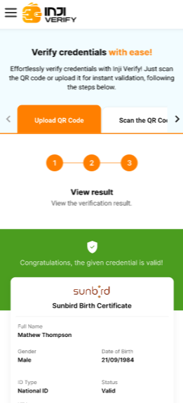<figcaption>
Display Credentials Mobile View
</figcaption></figure>

### **Error Handling:**

**Scenario 1:** If Pixel Pass encounters difficulties in decoding the data or encounters an unsupported QR code format, Inji Verify returns to the home screen.

* An error message stating "**QR code format not supported"** is displayed to the user.

**Desktop View**

<figure>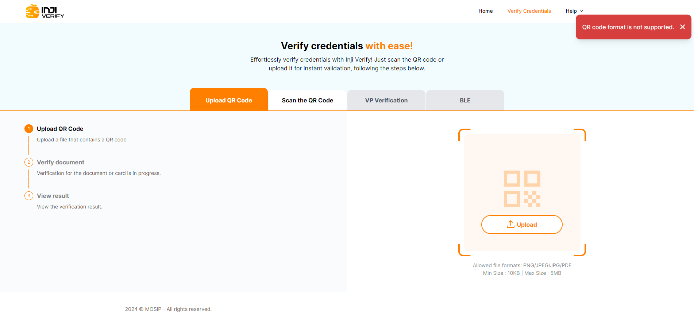<figcaption>
QR Code not supported Desktop View
</figcaption></figure>

**Scenario 2:** If the QR code size or file size exceeds the permissible limit where the maximum size is 5MB, Inji Verify returns to the home screen.

* An error message stating "**File size not supported. The file should be between 10Kb and 5 MB.**"

**Desktop View**

<figure>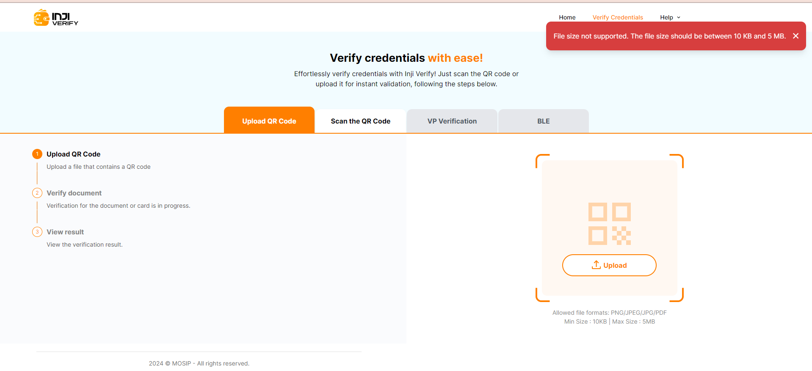<figcaption>
File Size Not Supported Desktop View
</figcaption></figure>

**Scenario 3:** If the QR code is unreadable or blurry then Inji Verify returns to the home screen.

* An error message statin&#x67;**"No multi-format readers were able to read the QR code."**

**Desktop View**

<figure>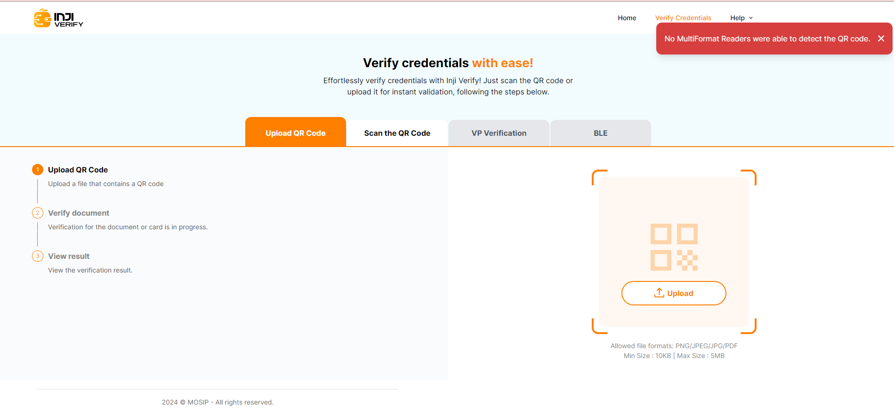<figcaption>
Unreadable QR Code Desktop View
</figcaption></figure>

**Scenario 4:** If the user fails to scan the QR code within the 60-second timeframe then Inji Verify returns to the home screen.

* An error message stating "**The scan session has expired due to inactivity. Please initiate a new scan**."

**Desktop View**

<figure>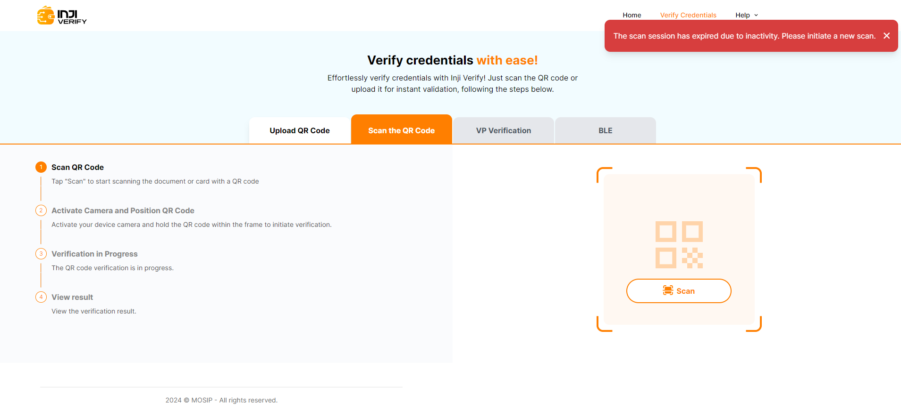<figcaption>
Scan Session Expired Desktop View
</figcaption></figure>

**Scenario 5:** When a PDF containing VC is uploaded and the QR Code is not valid, then the following error message is displayed- ‘Something went wrong with your request. Please check and try again.’

<figure>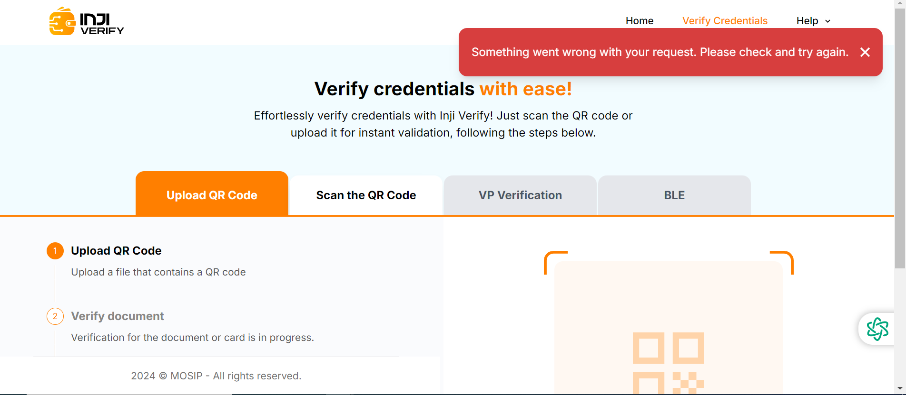<figcaption></figcaption></figure>

**Scenario 6:** If there is no internet connectivity, the following error message is displayed while using Inji Verify - ‘No Internet Connection! Oops! We can’t seem to connect. Check your internet connection and try again'

<figure>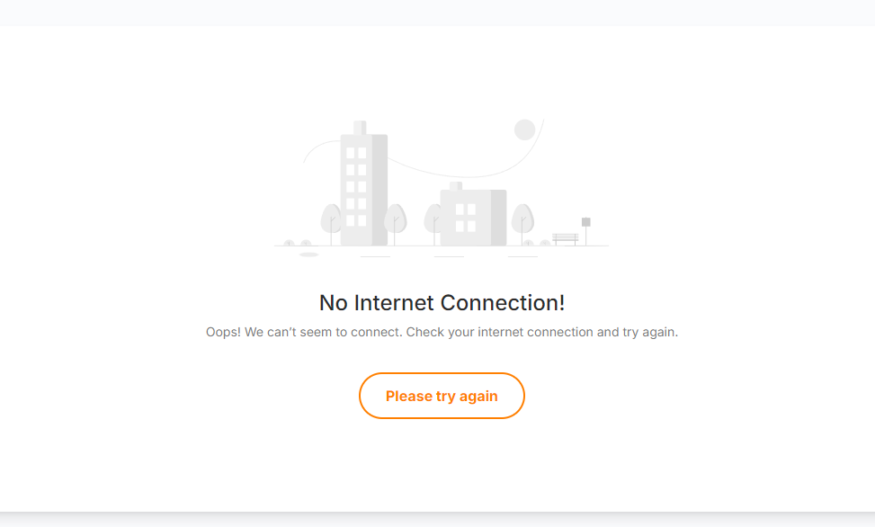<figcaption></figcaption></figure>

**Scenario 7:** When the request in the application url is invalid, the error message displayed- ‘The requested resource is invalid’.

<figure>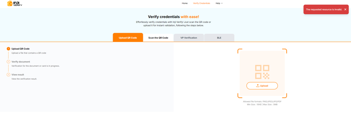<figcaption></figcaption></figure>

**Scenario 8:** When the server is done, then the error message displayed is- ‘The service is currently unavailable. Please try again later’.

<figure>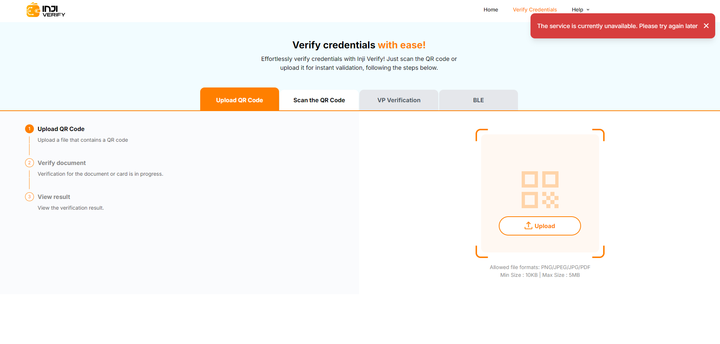<figcaption></figcaption></figure>

### **Header Section:** 

#### **Home** 

* The “Home” Screen is not available now so you will be able to see the “Upload QR Code” Page instead.

#### **Verify Credentials** 

* The Verify Credentials Page will showcase two main features of Inji Verify that is “Upload QR Code” and “Scan the QR Code”.

**Desktop View**

<figure>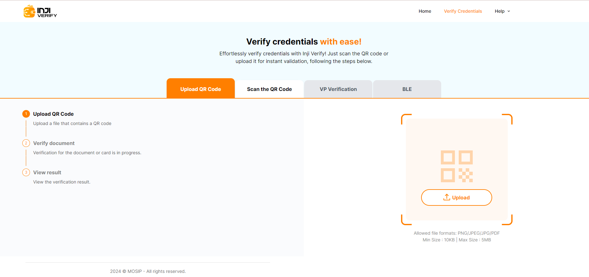<figcaption>
Verify Credentials Desktop View
</figcaption></figure>

#### **Help** 

* The Help section includes three sub-sections or sub-menus:
  * **Contact Us**: This directs you to our MOSIP Community where you can write to us with any queries related to Inji Verify or general inquiries.
  * **Documentation**: This directs you to the Inji Verify documentation page for detailed information about Inji Verify.
  * **FAQ**: This section is still under development.

**Desktop View**

<figure>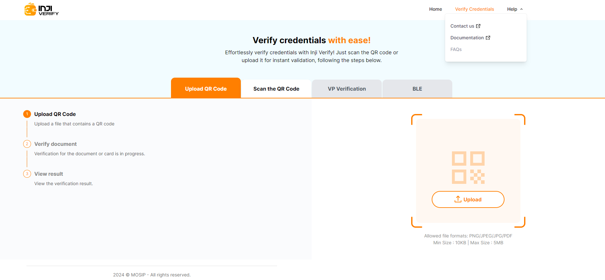<figcaption>
Help Desktop View
</figcaption></figure>

### **Credential Display Capability** 

**Valid Credentials**

* These credentials are currently active and verified using the Inji Verify Portal.

**Desktop View**

<figure>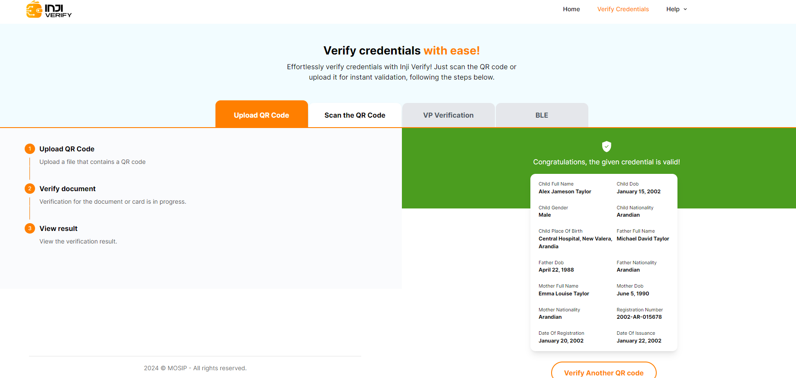<figcaption>
Valid Credentials Desktop View
</figcaption></figure>

**Invalid Credentials**:

* These credentials are currently active but invalid.

**Desktop View**

<figure>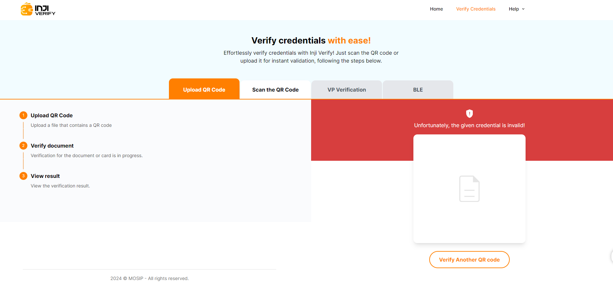<figcaption>
Invalid Credentials Desktop View
</figcaption></figure>

**Expired Credentials**

* These credentials have passed their validity period and are no longer active.

**Desktop View**

<figure>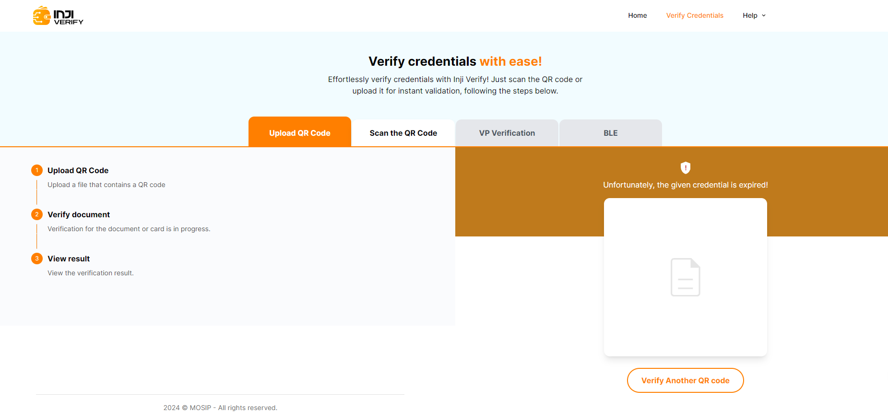<figcaption>
Expired Credentials Desktop View
</figcaption></figure>

-->

...

<!-- 

Comment Note: This is very old content

Overview

The End-User-Guide for Inji Verify helps you to understand:

- Upload and Verify a VC (Verifiable Credential). 
- Scan and Verify a Verifiable Credential (PDF / Image with QR code).

 - Scan and Verify a Verifiable Credential (PDF / Image with QR code, Print copy of VC having a QR code).

**Step 1: Initiate Scan Request:**

* Launch / Access the Inji Verify portal and select the “Scan the QR Code” tab
* Click on the “Scan” button to initiate the scanning process.

**Desktop View**

<figure><figcaption>
Scan QR Code Desktop View
</figcaption></figure>

**Mobile View**

<figure><figcaption>
Scan QR Code Mobile View
</figcaption></figure>

**Step 2: Camera Permissions:**

When the scan is initiated, you will be prompted to grant the necessary camera permissions for the Inji Verify portal. Please click the "Allow" button to give the portal access to your device's camera.

**Desktop View**

<figure><figcaption>
Camera Permission Desktop View
</figcaption></figure>

**Mobile View**

<figure><figcaption>
Camera Permission Mobile View
</figcaption></figure>

**Step 3: Scan QR Code:**

* Position the device's camera in front of the QR code you wish to scan (It can be a pdf on your phone or a paper based printed copy of your VC).
* Capture the QR code by aligning it within the frame displayed on your device's screen.
* Once the QR code is captured, the data is sent to the Inji Verify portal for processing.


- **Decoding and Verification:**
  * The QR data is passed to the Pixel Pass library for decoding.
  * Pixel Pass returns the decoded data to Inji Verify for further processing.
  * Inji Verify then verifies the decoded data using the Verification SDK.


**Desktop View**

<figure><figcaption>
Scan QR Code Desktop View
</figcaption></figure>

**Mobile View**

<figure><figcaption>
Scan QR Code Mobile View
</figcaption></figure>

**Step 4: Display Credential Details:**

* After successful verification, Inji Verify retrieves the display properties of the credential from the issuer's configuration.
* The credential details are displayed on the portal's interface using the fetched display properties.

**Desktop View**

<figure><figcaption>
Display Credential Details Desktop View
</figcaption></figure>

**Mobile View**

<figure><figcaption>
Display Credential Details Mobile View
</figcaption></figure>

## Upload and Verify a VC (Verifiable Credential)

**Step 1: Upload QR Code:**

* Access/ launch the Inji Verify portal and select the “Upload QR Code” tab where the Upload QR code section will come up and click on the “Upload” button to initiate the process.

**Desktop View**

<figure><figcaption>
Upload QR Code Desktop View
</figcaption></figure>

**Mobile View**

<figure><figcaption>
Upload QR Code Mobile View
</figcaption></figure>

* Click on the **“Upload”** button on the “Upload QR Code” Page as you select the option to upload a file containing the QR code or credential document you wish to verify from your device's file explorer. Click on the file to proceed.
* Inji Verify passes the QR data from the uploaded file to the Pixel Pass library for processing.


- **Decoding and Verification:**
  * The QR data is passed to the Pixel Pass SDK for decoding.
  * Pixel Pass returns the decoded data to Inji Verify for further processing.
  * Inji Verify then verifies the decoded data using the Verification SDK.


**Desktop View**

<figure><figcaption>
Upload QR file Desktop View
</figcaption></figure>

**Mobile View**

<figure><figcaption>
Verify Document Mobile View
</figcaption></figure>

**Step 2: Display Credential Details:**

* Upon successful verification, Inji Verify retrieves the display properties of the credential and presents the details on the portal's interface.

**Desktop View**

<figure><figcaption>
Display Credentials Desktop View
</figcaption></figure>

**Mobile View**

<figure><figcaption>
Display Credentials Mobile View
</figcaption></figure>

### **Error Handling:**

**Scenario 1:** If Pixel Pass encounters difficulties in decoding the data or encounters an unsupported QR code format, Inji Verify returns to the home screen.

* An error message stating "**QR code format not supported"** is displayed to the user.

**Desktop View**

<figure><figcaption>
QR Code not supported Desktop View
</figcaption></figure>

**Scenario 2:** If the QR code size or file size exceeds the permissible limit where the maximum size is 5MB, Inji Verify returns to the home screen.

* An error message stating "**File size not supported. The file should be between 10Kb and 5 MB.**"

**Desktop View**

<figure><figcaption>
File Size Not Supported Desktop View
</figcaption></figure>

**Scenario 3:** If the QR code is unreadable or blurry then Inji Verify returns to the home screen.

* An error message statin&#x67;**"No multi-format readers were able to read the QR code."**

**Desktop View**

<figure><figcaption>
Unreadable QR Code Desktop View
</figcaption></figure>

**Scenario 4:** If the user fails to scan the QR code within the 60-second timeframe then Inji Verify returns to the home screen.

* An error message stating "**The scan session has expired due to inactivity. Please initiate a new scan**."

**Desktop View**

<figure><figcaption>
Scan Session Expired Desktop View
</figcaption></figure>

**Scenario 5:** When a PDF containing VC is uploaded and the QR Code is not valid, then the following error message is displayed- ‘Something went wrong with your request. Please check and try again.’

<figure><figcaption></figcaption></figure>

**Scenario 6:** If there is no internet connectivity, the following error message is displayed while using Inji Verify - ‘No Internet Connection! Oops! We can’t seem to connect. Check your internet connection and try again'

<figure><figcaption></figcaption></figure>

**Scenario 7:** When the request in the application url is invalid, the error message displayed- ‘The requested resource is invalid’.

<figure><figcaption></figcaption></figure>

**Scenario 8:** When the server is done, then the error message displayed is- ‘The service is currently unavailable. Please try again later’.

<figure><figcaption></figcaption></figure>

### **Header Section:** 

#### **Home** 

* The “Home” Screen is not available now so you will be able to see the “Upload QR Code” Page instead.

#### **Verify Credentials** 

* The Verify Credentials Page will showcase two main features of Inji Verify that is “Upload QR Code” and “Scan the QR Code”.

**Desktop View**

<figure><figcaption>
Verify Credentials Desktop View
</figcaption></figure>

## **Help** 

* The Help section includes three sub-sections or sub-menus:
  * **Contact Us**: This directs you to our MOSIP Community where you can write to us with any queries related to Inji Verify or general inquiries.
  * **Documentation**: This directs you to the Inji Verify documentation page for detailed information about Inji Verify.
  * **FAQ**: This section is still under development.

**Desktop View**

<figure><figcaption>
Help Desktop View
</figcaption></figure>

### **Credential Display Capability** 

**Valid Credentials**

* These credentials are currently active and verified using the Inji Verify Portal.

**Desktop View**

<figure><figcaption>
Valid Credentials Desktop View
</figcaption></figure>

**Invalid Credentials**:

* These credentials are currently active but invalid.

**Desktop View**

<figure><figcaption>
Invalid Credentials Desktop View
</figcaption></figure>

**Expired Credentials**

* These credentials have passed their validity period and are no longer active.

**Desktop View**

<figure><figcaption>
Expired Credentials Desktop View
</figcaption></figure>

-->