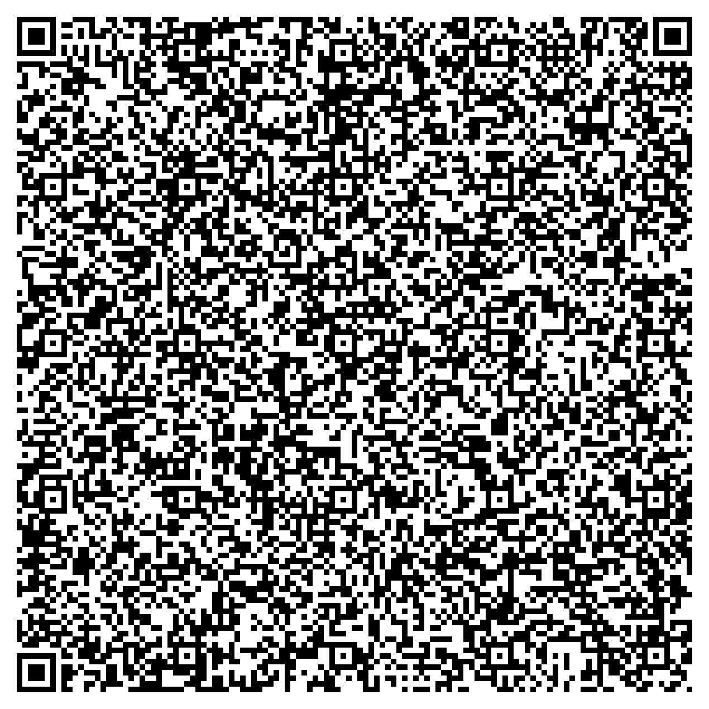
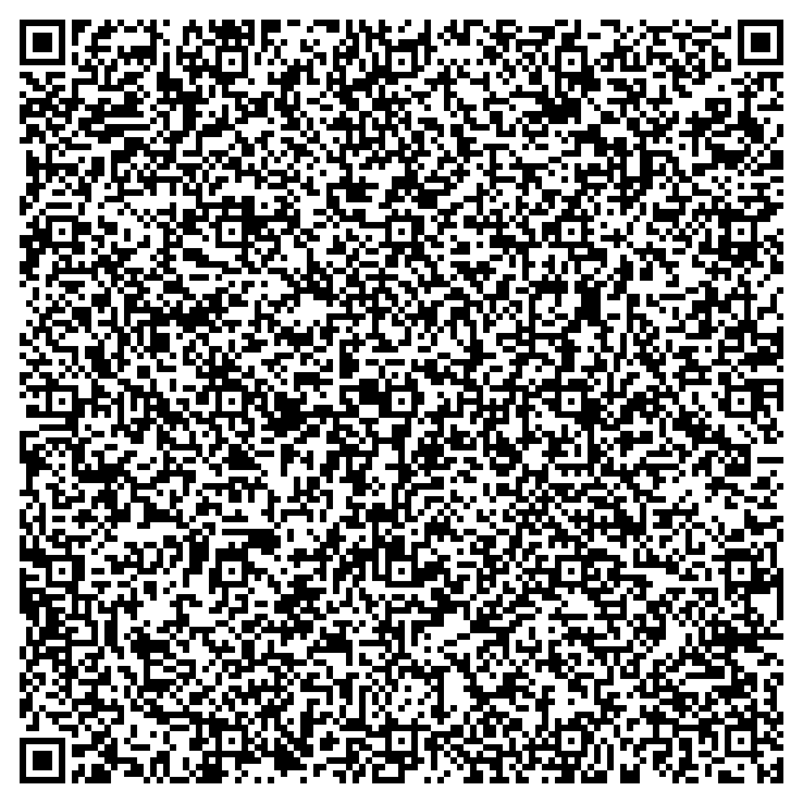
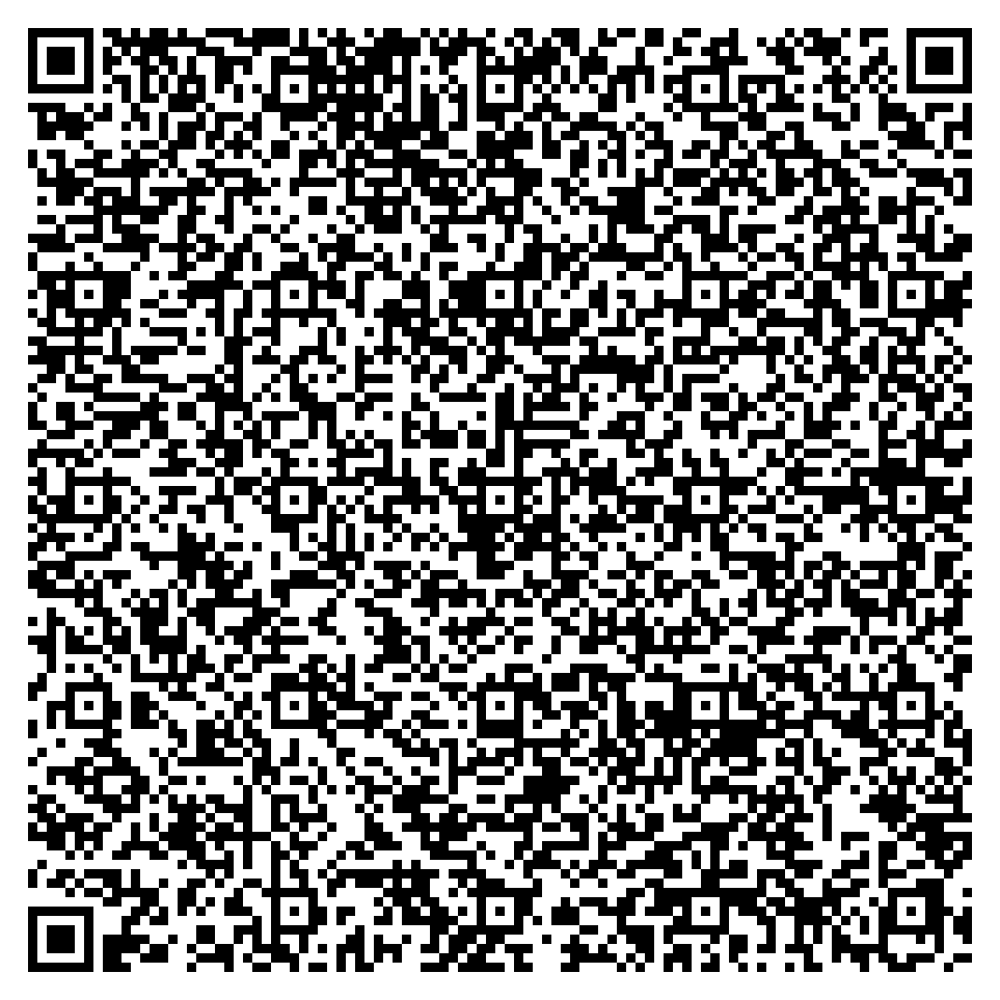

**Inji Verify Collab Guide** helps you with exploring [Inji Verify](../../overview/README.md) in our [Sandbox Collab Environment](https://collab.mosip.net/).
Whether you're a Developer, System Integrator, or an enthusiast eager to dive into the world of verifiable credentials, this guide provides you with the necessary information to get started with Inji Verify in our [Collab Environment](https://collab.mosip.net/).

### Where can you access the Collab Environment and Inji Verify Portal?
Visit the following links to access Inji Verify in Collab Environment:
* [Collab Environment](https://collab.mosip.net/)
* [Inji Verify Portal](https://injiverify.collab.mosip.net/)

### Which are the two ways you can get sample verifiable credentials to explore the Inji Verify portal in 'Collab Environment'?

* **Generate your own Verifiable Credentials and QR codes**: 
  * To generate your own verifiable credentials and QR codes, follow the instructions provided in the [Generate QR Code](https://docs.mosip.io/inji/inji-verify/build-and-deploy/creating-verifiable-credentials-and-generating-qr-codes) guide. This guide will walk you through the steps required to create verifiable credentials and produce QR codes for testing in the Inji Verify portal.
* **Use Sample QR Codes**: 
  * If you want it quick and can't wait to explore 'Inji Verify' in 'Collab Environment', you can use the 'Sample QR Codes' provided in this guide only, under [Explore with mock data](#explore-with-mock-data) section.


### Which all features you can explore in 'Collab Environment'?

* Verify by scanning the QR Code
* Verify by uploading the QR Code
* VP Verification - Cross Device flow Feature
* VP Verification - Same Device flow Feature

#### Verify by scanning the QR Code

There are two ways you can explore the feature:

* Use the [Generate QR Code](https://docs.mosip.io/inji/inji-verify/build-and-deploy/creating-verifiable-credentials-and-generating-qr-codes) guide to get the QR code to explore the scan feature as per the given instructions in the [User Guide](https://docs.inji.io/inji-verify/functional-overview/end-user-guide#verify-by-scanning-the-qr-code).

* Use the given sample QR codes from under [Explore with mock data](#explore-with-mock-data) section to explore the scan feature of the Inji Verify portal and as per the instructions provided in the [User Guide](https://docs.inji.io/inji-verify/functional-overview/end-user-guide#verify-by-scanning-the-qr-code).

#### Verify by uploading the QR Code

There are two ways you can explore the feature:

* Use the [Generate QR Code](https://docs.mosip.io/inji/inji-verify/build-and-deploy/creating-verifiable-credentials-and-generating-qr-codes) guide to get the QR code to explore the upload feature as per the given instructions in the [User Guide](https://docs.inji.io/inji-verify/functional-overview/end-user-guide#verify-by-uploading-the-qr-code).

* Use the given sample QR codes from under [Explore with mock data](#explore-with-mock-data) section to explore the upload feature of the Inji Verify portal as per the given instructions in the [User Guide](https://docs.inji.io/inji-verify/functional-overview/end-user-guide#verify-by-uploading-the-qr-code).


#### VP Verification - Cross Device flow Feature

* This feature follows the OpenID4VP cross device flow
[specifications](https://openid.net/specs/openid-4-verifiable-presentations-1_0.html).

* If you wish to test this feature against Inji mobile wallet, utilize the [Inji Wallet - Try It Out](https://docs.inji.io/inji-wallet/inji-mobile/sandbox-details) page to setup the Inji wallet and download VCs.

* On the Inji Verify portal, open on your device, navigate to the **VP Verification** tab.

* Select the VCs that you wish the wallet to share and click on 'Generate QR code' in same portal following the steps provided in [User Guide](https://docs.inji.io/inji-verify/functional-overview/end-user-guide#vp-verification-cross-device-flow).
* Scan the QR with wallet and share the VCs filtered based on the request.


#### VP Verification - Same Device flow Feature

* This feature follows the OpenID4VP same device flow [specifications](https://openid.net/specs/openid-4-verifiable-presentations-1_0.html).

* If you wish to test this feature against Inji mobile wallet, utilize
the "[**Inji Wallet - Try It Out**](https://docs.inji.io/inji-wallet/inji-mobile/sandbox-details)"
page to setup the Inji wallet and download VCs.

* On the Inji Verify portal, open on your mobile device, navigate to the **VP Verification** tab. .

* Select the VCs that you wish the wallet to share and click on 'Open Wallet' in same mobile device following the steps provided in [User Guide](https://docs.inji.io/inji-verify/functional-overview/end-user-guide#vp-verification-same-device-flow) to share the required VCs from any of the pre-installed mobile wallets.

* Share the VCs filtered based on the request.


## Explore with 'Mock-Data' (Sample QR Codes)

Use the QR codes provided below to explore the Inji Verify application for [Scan](https://docs.inji.io/inji-verify/functional-overview/end-user-guide#verify-by-scanning-the-qr-code) and [Upload](https://docs.inji.io/inji-verify/functional-overview/end-user-guide#verify-by-uploading-the-qr-code) features.


## Verifiable QR Code - Valid VC

### Sample QR code - Valid VC Data

<div align="center"><figure><figcaption><p>Valid Verifiable Credentials - Data Model v2.0</p></figcaption></figure></div>


### Data Model v2.0

```json
{
    "credential": {
        "credentialSubject": {
            "gender": "Male",
            "primaryCropType": "Maize",
            "mobileNumber": "9876543210",
            "postalCode": "453000",
            "landArea": "3 hectares",
            "fullName": "John Doe",
            "secondaryCropType": "Rice",
            "dateOfBirth": "25-05-1990",
            "face": "data:image/png;base64,iVBORw0KGgoAAAANSUhEUgAAABwAAAAFCAYAAABW1IzHAAAAHklEQVQokWNgGPaAkZHxPyMj439sYrSQo51PBgsAALa0ECF30JSdAAAAAElFTkSuQmCC",
            "farmerID": "987654321",
            "villageOrTown": "Koramangala",
            "district": "Bangalore",
            "id": "did:jwk:eyJrdHkiOiJSU0EiLCJlIjoiQVFBQiIsInVzZSI6InNpZyIsImtpZCI6Iml3Qkl1Q2QzaFU1NlBWM3VTc3gzekhMc1E4SXdYckdHdmh6YkE1VlJuQkEiLCJhbGciOiJSUzI1NiIsIm4iOiJtMWlMQ0prNzA5VkpIbUF2MURsWUxsblA0UDEtLXFfU3Q3aVo3WjhWbXk0d0Mxb2FTQWxXdjFXZjlKQXg2YmQ3OXdMbDhINEkwa25GeG9FbkktTUhvOUtGRXpFcGdJNXZIUHY2X0M2dWI4RmUwaXphRVFXTlY3VEpVRG54MVZ5OU5UZS15ekFVd2dfWk91Y0pFb3hyQW54VXM5OFcyTWpyUmtZdHVQcTlKRUxVTzRJM0wxX1B5S21hRG8zN0xCR3NVamhLVmQ0X0VzTkVPQ3AwQTZwbnBaUUd1S1RteXVhMUVYSDhLWUVTSEZ4alA4NGVCaGk0YmZPSWMwQjQ2VlZrVG81WG9TeUtnRi1xemRyTGFQRGJwZGxBaVNKMEJ5Vk5jaUE3Z2ctWEJLQkV0QVd1b19EQ3pYZUsxREJKT2txMXlkWEJzeWdjeGtpVmdobnFtUTFsVHcifQ==",
            "state": "Karnataka",
            "landOwnershipType": "Owner"
        },
        "validUntil": "2027-10-09T03:08:19.711Z",
        "validFrom": "2025-10-09T03:08:19.711Z",
        "type": [
            "VerifiableCredential",
            "FarmerCredential"
        ],
        "@context": [
            "https://www.w3.org/ns/credentials/v2",
            "https://piyush7034.github.io/my-files/farmer.json",
            "https://w3id.org/security/suites/ed25519-2020/v1"
        ],
        "issuer": "did:web:piyush7034.github.io:my-files:sample-ed25519",
        "credentialStatus": {
            "statusPurpose": "revocation",
            "statusListIndex": "7",
            "id": "http://localhost:8090/v1/certify/credentials/status-list/649d3d36-2719-42eb-9f00-ac479a906059#7",
            "type": "BitstringStatusListEntry",
            "statusListCredential": "http://localhost:8090/v1/certify/credentials/status-list/649d3d36-2719-42eb-9f00-ac479a906059"
        },
        "proof": {
            "type": "Ed25519Signature2020",
            "created": "2025-10-08T21:38:19Z",
            "proofPurpose": "assertionMethod",
            "verificationMethod": "did:web:piyush7034.github.io:my-files:sample-ed25519#LYs95rEHKsqm1_TIFJxffLUXHZL1rM_h-UuwRi6PtN4",
            "proofValue": "z5Z3Rj9rhV5b6whiq4EgZaD8gmtsBtfMEqwNXAgasCxtBRCpc35DkiGFyRfy8NYDtXBDX6RjAUpWfgNGn94t2ywgm"
        }
    }
}
```

### Sample QR code - Valid VC Data

<div align="center"><figure><figcaption><p>Valid Verifiable Credentials - Data Model v1.1</p></figcaption></figure></div>

### Data Model v1.1

```json
{
    "credential": {
        "issuanceDate": "2025-10-09T03:05:40.782Z",
        "credentialSubject": {
            "gender": "Male",
            "primaryCropType": "Maize",
            "mobileNumber": "9876543210",
            "postalCode": "453000",
            "landArea": "3 hectares",
            "fullName": "John Doe",
            "secondaryCropType": "Rice",
            "dateOfBirth": "25-05-1990",
            "face": "data:image/png;base64,iVBORw0KGgoAAAANSUhEUgAAABwAAAAFCAYAAABW1IzHAAAAHklEQVQokWNgGPaAkZHxPyMj439sYrSQo51PBgsAALa0ECF30JSdAAAAAElFTkSuQmCC",
            "farmerID": "987654321",
            "villageOrTown": "Koramangala",
            "district": "Bangalore",
            "id": "did:jwk:eyJrdHkiOiJSU0EiLCJlIjoiQVFBQiIsInVzZSI6InNpZyIsImtpZCI6IkVIdXU5eU5MN1VFcnFDd0hWOUdPTk5KWWdxQmVvMVhUTmY0OU95Tk1LN0EiLCJhbGciOiJSUzI1NiIsIm4iOiJ2VmF1dFFYa3JMUXVaU2hGWWFDNkRMNEZOcnMzcm5meTVkVjhyWVJRQnhyOW1oZllfdGxwTzc5QzRiZnplS1BzaVBXN0c4NEMtZGt4QlNOR3RXV0wwdy1oX3JOd3Y2eUFMT1VZaGdtcnZVeGhWakhCRzFMdTFtTUhERF9JZlpJb0lpV1JRZkpvMGZYMFBzZ2FrRWhIZmxjWHdPNk1DaVItNGVNTUdhNU0zR2ViTVQtUHlsQVVKYzJiN2NoaGFvTlJYQWNWbTBsZTFmUG5RRGJfQ21XMENxOW9kOHFjQUwtellqc0F3MnJzMWxhZ3RDcTdsSXVIWkszUnF2U0NQb2lmSG1ZZEZvdzZnNkF5eTlyNzhxc2VwYkU3d3JDYS1aRF92TkxHblpTbXVac3RicmxxZkxfelFfdnlwNjM1NTMtRmNPNGlKNW1Md0w4Z2pwTWRrVmVMRFEifQ==",
            "state": "Karnataka",
            "landOwnershipType": "Owner"
        },
        "type": [
            "VerifiableCredential",
            "FarmerCredential"
        ],
        "@context": [
            "https://www.w3.org/2018/credentials/v1",
            "https://piyush7034.github.io/my-files/farmer.json",
            "https://w3id.org/security/suites/ed25519-2020/v1"
        ],
        "issuer": "did:web:piyush7034.github.io:my-files:sample-ed25519",
        "expirationDate": "2027-10-09T03:05:40.782Z",
        "proof": {
            "type": "Ed25519Signature2020",
            "created": "2025-10-08T21:35:40Z",
            "proofPurpose": "assertionMethod",
            "verificationMethod": "did:web:piyush7034.github.io:my-files:sample-ed25519#LYs95rEHKsqm1_TIFJxffLUXHZL1rM_h-UuwRi6PtN4",
            "proofValue": "z3BW5Tx6ZHJ53rriixAwkrbjGEurLP5eNWwZQQkmEMEEWtLK5qJRThA6wyuyaiin7ucfaUDk4H2BKVBLpSAqcDPcu"
        }
    }
}
```


## Verifiable QR Code - Expired VC

<div align="center"><figure><figcaption><p>Expired Verifiable Credentials</p></figcaption></figure></div>


### Sample QR code - Expired VC Data

```json

{
    "id": "did:rcw:ab01ec3f-9f67-4ce8-ade1-8fce82a9bee1",
    "type": [
        "VerifiableCredential",
        "LifeInsuranceCredential",
        "InsuranceCredential"
    ],
    "proof": {
        "type": "Ed25519Signature2020",
        "created": "2024-05-03T12:53:39Z",
        "proofValue": "z4GVSorSVms65uTSLHRdqJB7Km7UuyzGzYbu9uKuwBPRLgHLmBMa8YnBczVh4id2PMsrB31kjCbe6NVLdA9jThURs",
        "proofPurpose": "assertionMethod",
        "verificationMethod": "did:web:challabeehyv.github.io:DID-Resolve:3313e611-d08a-49c8-b478-7f55eafe62f2#key-0"
    },
    "issuer": "did:web:challabeehyv.github.io:DID-Resolve:3313e611-d08a-49c8-b478-7f55eafe62f2",
    "@context": [
        "https://www.w3.org/2018/credentials/v1",
        "https://holashchand.github.io/test_project/insurance-context.json",
        {
            "LifeInsuranceCredential": {
                "@id": "InsuranceCredential"
            }
        },
        "https://w3id.org/security/suites/ed25519-2020/v1"
    ],
    "issuanceDate": "2024-05-03T12:53:39.113Z",
    "expirationDate": "2024-06-02T12:53:39.110Z",
    "credentialSubject": {
        "id": "did:jwk:eyJrdHkiOiJFQyIsInVzZSI6InNpZyIsImNydiI6IlAtMjU2Iiwia2lkIjoic3pGa2cyOVFFalpiQ1VheFRfbFdiZElEU1ZQNWhlREhTeGR6UlhTOW1WZyIsIngiOiJzeVZ2Y2pEX1k0Y0xFS2NUTGR3a1dEWnR1RGpGWGxwcUtLZ2l5TDB2ZUY0IiwieSI6Ii13eGZIMDZRclRCZGljOG1yRDRBM2E0alhGREx1RnlBa0NPMm56Z3BNUGMiLCJhbGciOiJFUzI1NiJ9",
        "dob": "1991-08-13",
        "email": "challarao@beehyv.com",
        "gender": "Male",
        "mobile": "0123456789",
        "benefits": [
            "Critical Surgery",
            "Full body checkup"
        ],
        "fullName": "Challarao V",
        "policyName": "Start Insurance Gold Premium",
        "policyNumber": "1234567",
        "policyIssuedOn": "2023-04-20T20:48:17.684Z",
        "policyExpiresOn": "2033-04-20T20:48:17.684Z"
    }
}

```


## Verifiable QR Code - Invalid VC

<div align="center"><figure><figcaption><p>Invalid Verifiable Credentials</p></figcaption></figure></div>


### Sample QR code - Invalid VC Data


```json
{
    "id": "did:cbse:327b6c3f-ce17-4c00-ae4f-7fb2313b0626",
    "type": [
        "VerifiableCredential",
        "UniversityDegreeCredential"
    ],
    "proof": {
        "type": "Ed25519Signature2020",
        "created": "2024-05-16T07:27:43Z",
        "proofValue": "z56crqnnjmvDa46FqmAnVhEttqKtFMTQ1et1mM5dA3WSHtb5ncQ36sS8fG3fxw6dpvtqbqvaE5FzaqwJTBX6dGH3P",
        "proofPurpose": "assertionMethod",
        "verificationMethod": "did:web:Sreejit-K.github.io:VCTest:d40bdb68-6a8d-4b71-9c2a-f3002513ae0e#key-0"
    },
    "issuer": "did:web:Sreejit-K.github.io:VCTest:d40bdb68-6a8d-4b71-9c2a-f3002513ae0e",
    "@context": [
        "https://www.w3.org/2018/credentials/v1",
        "https://sreejit-k.github.io/VCTest/udc-context2.json",
        "https://w3id.org/security/suites/ed25519-2020/v1"
    ],
    "issuanceDate": "2023-02-06T11:56:27.259Z",
    "expirationDate": "2025-02-08T11:56:27.259Z",
    "credentialSubject": {
        "id": "did:example:2002-AR-015678",
        "type": "UniversityDegreeCredential",
        "ChildFullName": "Alex Jameson Taylor",
        "ChildDob": "January 15, 2003",
        "ChildGender": "Male",
        "ChildNationality": "Arandian",
        "ChildPlaceOfBirth": "Central Hospital, New Valera, Arandia",
        "FatherFullName": "Michael David Taylor",
        "FatherDob": "April 22, 1988",
        "FatherNationality": "Arandian",
        "MotherFullName": "Emma Louise Taylor",
        "MotherDob": "June 5, 1990",
        "MotherNationality": "Arandian",
        "RegistrationNumber": "2002-AR-015678",
        "DateOfRegistration": "January 20, 2002",
        "DateOfIssuance": "January 22, 2002"
    }
}

```

# Documentation

* [Inji Verify Video Walkthrough](https://www.youtube.com/watch?v=0mDMG-4anaE&amp;index=12)
* [Overview](https://docs.inji.io/inji-verify/overview)
* [Features](https://docs.inji.io/inji-verify/overview/features)
* [User Guide](https://docs.inji.io/inji-verify/functional-overview/end-user-guide)


<!--
Welcome to the Inji Verify Guide tailored specifically for our Collab Environment!\
This guide is designed to assist you in exploring the [**Inji Verify**](https://docs.mosip.io/inji/inji-verify/overview) portal in our sandbox Collab environment. By following the steps outlined in this guide, you will be able to smoothly utilize the Inji Verify portal, empowering you to explore its features and functionalities effectively. Whether you're a Developer, System Integrator, or an enthusiast eager to dive into the world of verifiable credentials, this guide will provide you with the necessary information to get started with Inji Verify in our [**Collab**](https://collab.mosip.net/) environment. Let's begin this journey of seamless setup and exploration.

### **Explore with mock data** <a href="#explore-with-mock-data" id="explore-with-mock-data"></a>

If you are looking to try out Inji Verify in our Collab environment, please follow the below procedure:

1. To obtain sample verifiable credentials embedded in a QR code, please initiate the process by following the steps to generate the QR code, click [**here**](https://docs.mosip.io/inji/inji-verify/build-and-deploy/creating-verifiable-credentials-and-generating-qr-codes)!
2. To use the QR code with verifiable credentials and test out the Inji Verify application, exploring the scan and upload features, please use the QR codes provided below:

### **Verifiable QR Code - Valid VC**

<div align="center"><figure><figcaption><p>Valid Verifiable Credentials</p></figcaption></figure></div>

### **Sample QR code - Valid VC Data**

```json
{
    "credential": {
        "id": "did:cbse:327b6c3f-ce17-4c00-ae4f-7fb2313b0626",
        "type": [
            "VerifiableCredential",
            "UniversityDegreeCredential"
        ],
        "proof": {
            "type": "Ed25519Signature2020",
            "created": "2024-05-16T07:27:43Z",
            "proofValue": "z56crqnnjmvDa46FqmAnVhEttqKtFMTQ1et1mM5dA3WSHtb5ncQ36sS8fG3fxw6dpvtqbqvaE5FzaqwJTBX6dGH3P",
            "proofPurpose": "assertionMethod",
            "verificationMethod": "did:web:Sreejit-K.github.io:VCTest:d40bdb68-6a8d-4b71-9c2a-f3002513ae0e#key-0"
        },
        "issuer": "did:web:Sreejit-K.github.io:VCTest:d40bdb68-6a8d-4b71-9c2a-f3002513ae0e",
        "@context": [
            "https://www.w3.org/2018/credentials/v1",
            "https://sreejit-k.github.io/VCTest/udc-context2.json",
            "https://w3id.org/security/suites/ed25519-2020/v1"
        ],
        "issuanceDate": "2023-02-06T11:56:27.259Z",
        "expirationDate": "2025-02-08T11:56:27.259Z",
        "credentialSubject": {
            "id": "did:example:2002-AR-015678",
            "type": "UniversityDegreeCredential",
            "ChildFullName": "Alex Jameson Taylor",
            "ChildDob": "January 15, 2002",
            "ChildGender": "Male",
            "ChildNationality": "Arandian",
            "ChildPlaceOfBirth": "Central Hospital, New Valera, Arandia",
            "FatherFullName": "Michael David Taylor",
            "FatherDob": "April 22, 1988",
            "FatherNationality": "Arandian",
            "MotherFullName": "Emma Louise Taylor",
            "MotherDob": "June 5, 1990",
            "MotherNationality": "Arandian",
            "RegistrationNumber": "2002-AR-015678",
            "DateOfRegistration": "January 20, 2002",
            "DateOfIssuance": "January 22, 2002"
        }
    },
    "credentialSchemaId": "did:schema:e2e6b5b7-8af7-4018-a472-3f1e396c3c1e",
    "createdAt": "2024-05-16T07:27:43.831Z",
    "updatedAt": "2024-05-16T07:27:43.831Z",
    "createdBy": "",
    "updatedBy": "",
    "tags": [
        "tag1",
        "tag2",
        "tag3"
    ]
}
```

### **Verifiable QR Code - Expired VC**

<div align="center"><figure><figcaption><p>Expired Verifiable Credentials</p></figcaption></figure></div>

### **Sample QR code - Expired VC Data**

```json
{
    "id": "did:rcw:ab01ec3f-9f67-4ce8-ade1-8fce82a9bee1",
    "type": [
        "VerifiableCredential",
        "LifeInsuranceCredential",
        "InsuranceCredential"
    ],
    "proof": {
        "type": "Ed25519Signature2020",
        "created": "2024-05-03T12:53:39Z",
        "proofValue": "z4GVSorSVms65uTSLHRdqJB7Km7UuyzGzYbu9uKuwBPRLgHLmBMa8YnBczVh4id2PMsrB31kjCbe6NVLdA9jThURs",
        "proofPurpose": "assertionMethod",
        "verificationMethod": "did:web:challabeehyv.github.io:DID-Resolve:3313e611-d08a-49c8-b478-7f55eafe62f2#key-0"
    },
    "issuer": "did:web:challabeehyv.github.io:DID-Resolve:3313e611-d08a-49c8-b478-7f55eafe62f2",
    "@context": [
        "https://www.w3.org/2018/credentials/v1",
        "https://holashchand.github.io/test_project/insurance-context.json",
        {
            "LifeInsuranceCredential": {
                "@id": "InsuranceCredential"
            }
        },
        "https://w3id.org/security/suites/ed25519-2020/v1"
    ],
    "issuanceDate": "2024-05-03T12:53:39.113Z",
    "expirationDate": "2024-06-02T12:53:39.110Z",
    "credentialSubject": {
        "id": "did:jwk:eyJrdHkiOiJFQyIsInVzZSI6InNpZyIsImNydiI6IlAtMjU2Iiwia2lkIjoic3pGa2cyOVFFalpiQ1VheFRfbFdiZElEU1ZQNWhlREhTeGR6UlhTOW1WZyIsIngiOiJzeVZ2Y2pEX1k0Y0xFS2NUTGR3a1dEWnR1RGpGWGxwcUtLZ2l5TDB2ZUY0IiwieSI6Ii13eGZIMDZRclRCZGljOG1yRDRBM2E0alhGREx1RnlBa0NPMm56Z3BNUGMiLCJhbGciOiJFUzI1NiJ9",
        "dob": "1991-08-13",
        "email": "challarao@beehyv.com",
        "gender": "Male",
        "mobile": "0123456789",
        "benefits": [
            "Critical Surgery",
            "Full body checkup"
        ],
        "fullName": "Challarao V",
        "policyName": "Start Insurance Gold Premium",
        "policyNumber": "1234567",
        "policyIssuedOn": "2023-04-20T20:48:17.684Z",
        "policyExpiresOn": "2033-04-20T20:48:17.684Z"
    }
}
```

### **Verifiable QR Code - Invalid VC**

<div align="center"><figure><figcaption><p>Invalid Verifiable Credential</p></figcaption></figure></div>

### **Sample QR code - Invalid VC Data**

```json
{
    "id": "did:cbse:327b6c3f-ce17-4c00-ae4f-7fb2313b0626",
    "type": [
        "VerifiableCredential",
        "UniversityDegreeCredential"
    ],
    "proof": {
        "type": "Ed25519Signature2020",
        "created": "2024-05-16T07:27:43Z",
        "proofValue": "z56crqnnjmvDa46FqmAnVhEttqKtFMTQ1et1mM5dA3WSHtb5ncQ36sS8fG3fxw6dpvtqbqvaE5FzaqwJTBX6dGH3P",
        "proofPurpose": "assertionMethod",
        "verificationMethod": "did:web:Sreejit-K.github.io:VCTest:d40bdb68-6a8d-4b71-9c2a-f3002513ae0e#key-0"
    },
    "issuer": "did:web:Sreejit-K.github.io:VCTest:d40bdb68-6a8d-4b71-9c2a-f3002513ae0e",
    "@context": [
        "https://www.w3.org/2018/credentials/v1",
        "https://sreejit-k.github.io/VCTest/udc-context2.json",
        "https://w3id.org/security/suites/ed25519-2020/v1"
    ],
    "issuanceDate": "2023-02-06T11:56:27.259Z",
    "expirationDate": "2025-02-08T11:56:27.259Z",
    "credentialSubject": {
        "id": "did:example:2002-AR-015678",
        "type": "UniversityDegreeCredential",
        "ChildFullName": "Alex Jameson Taylor",
        "ChildDob": "January 15, 2003",
        "ChildGender": "Male",
        "ChildNationality": "Arandian",
        "ChildPlaceOfBirth": "Central Hospital, New Valera, Arandia",
        "FatherFullName": "Michael David Taylor",
        "FatherDob": "April 22, 1988",
        "FatherNationality": "Arandian",
        "MotherFullName": "Emma Louise Taylor",
        "MotherDob": "June 5, 1990",
        "MotherNationality": "Arandian",
        "RegistrationNumber": "2002-AR-015678",
        "DateOfRegistration": "January 20, 2002",
        "DateOfIssuance": "January 22, 2002"
    }
}
```


Feel free to scan or upload these QR codes to experience the functionality firsthand.


### Step-by-Step Process

### **Step 1: Access Collab Environment Resources**

* **Launch the link**: [**Collab Environment**](https://collab.mosip.net/)
  * Click the provided link to access the collab environment.

### **Step 2: Launch Inji Verify Portal**

* **Click on the Inji Verify link**:
  * Click the [**Inji Verify Portal**](https://injiverify.collab.mosip.net/) to launch the Inji Verify portal in your browser.

### **Step 3: Exploring Inji Verify Features** <a href="#step-3-exploring-inji-verify-features" id="step-3-exploring-inji-verify-features"></a>

* **Refer to the end-user guide to explore the features of Inji Verify**:
  * Navigate to the [**end-user guide**](https://docs.mosip.io/inji/inji-verify/functional-overview/end-user-guide) page.
* **Scan QR Code Feature :**
  * Use the provided steps to generate a QR code as mentioned above:
    * Utilize this “[**Generate QR Code**](https://docs.mosip.io/inji/inji-verify/build-and-deploy/creating-verifiable-credentials-and-generating-qr-codes)” page to get the QR code to explore the scan feature as per the given instructions in the [**end-user guide**](https://docs.mosip.io/inji/inji-verify/functional-overview/end-user-guide).
  * Use the provided mock data above:
    * Utilize the given QR codes to explore the scan feature of the Inji Verify portal as per the given instructions in the [**end-user guide**](https://docs.mosip.io/inji/inji-verify/functional-overview/end-user-guide).
    * These QR codes contain sample verifiable credentials for testing purposes.
* **Upload QR Code Feature:**
  * Use the provided steps to generate a QR code as mentioned above:
    * Utilize this “[**Generate QR Code**](https://docs.mosip.io/inji/inji-verify/build-and-deploy/creating-verifiable-credentials-and-generating-qr-codes)” page to get the QR code to explore the upload feature as per the given instructions in the [**end-user guide**](https://docs.mosip.io/inji/inji-verify/functional-overview/end-user-guide).
  * Use the provided mock data above:
    * Utilize the given QR codes to explore the upload feature of the Inji Verify portal as per the given instructions in the [**end-user guide**](https://docs.mosip.io/inji/inji-verify/functional-overview/end-user-guide).
    * These QR codes contain sample verifiable credentials for testing purposes.
* **OpenID4VP Sharing Feature**:
  * This feature follows the OpenID4VP cross device flow [specifications](https://openid.net/specs/openid-4-verifiable-presentations-1_0.html).
  * Utilize the [Inji Wallet - Try It Out](https://docs.inji.io/inji-wallet/inji-mobile/sandbox-details) page to setup the Inji wallet and download VCs.
  * In the portal navigate to the VP Verification tab.
  * Generate a QR code in same portal following the steps to share the VC wanted.
  * Scan the QR with wallet and share the VC filtered based on the request.
* **OpenID4VP Sharing Feature:**
  * This feature follows the OpenID4VP cross device flow [specifications](https://openid.net/specs/openid-4-verifiable-presentations-1_0.html).
  * Utilize the “[**Inji Wallet - Try It Out**](https://docs.inji.io/inji-wallet/inji-mobile/sandbox-details)“ page to setup the Inji wallet and download VCs.
  * In the portal navigate to the **VP Verification** tab.
  * Generate a QR code in same portal following the steps to share the VC wanted.
  * Scan the QR with wallet and share the VC filtered based on the request.

### **Additional Resources** <a href="#additional-resources" id="additional-resources"></a>

Click [**here**](https://docs.mosip.io/inji/inji-verify/functional-overview/end-user-guide) for detailed information about Inji Verify.

> By following these instructions, you will be equipped to seamlessly set up the Inji Verify portal and effectively verify your Verifiable Credentials.

An informative video of Inji Verify for a visual walk-through of the features will be available soon.


-->
