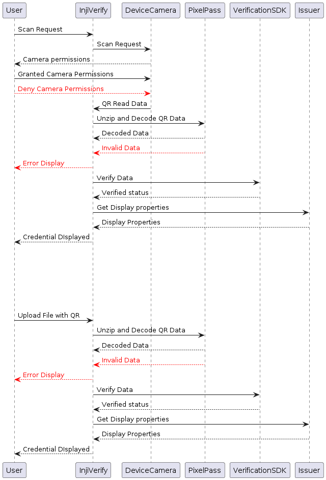

# Workflow

#### **Sequence Diagram**

<figure><figcaption></figcaption></figure>

Visit [https://www.plantuml.com/plantuml/uml](https://www.plantuml.com/plantuml/uml) and import the following file to edit the above sequence diagram as UML

\<UML File Spec>

### **Understanding the workflow**:

#### **Scan flow:**

* The user sends a scan request to the Inji verify portal.
* Inji verify portal sends a scan request to the Device camera.
* The user will be prompted to ask for Device camera permissions.
* The user grants camera permissions.
  * The user scans the QR code using the device camera, and the QR data is returned to the Inji Verify portal.
  * Inji Verify passes the QR data to the Pixel Pass SDK.
  * The Pixel Pass SDK returns the decoded data to Inji Verify.
    * Inji Verify then passes the decoded data to the Verification SDK for verification.
    * The status is returned to the Inji Verify portal from the Verification SDK.
    * Inji Verify retrieves the display properties of the credential from the issuer’s well-known configuration.
    * Finally, Inji Verify displays the credential details using the fetched display properties.
  * The [**pixel-pass library**](https://www.npmjs.com/package/@mosip/pixelpass/v/0.1.4) fails to decode the data
    * Inji verify goes back to the home screen and displays the _QR code format not supported_ error
* The user denies the camera permissions and the _Camera permissions denied_ screen appears on the Inji verify portal

#### **Upload QR flow:**

* The user uploads a file with a QR Code.
* Inji Verify passes the QR data to the Pixel Pass SDK.
* The Pixel Pass SDK returns the decoded data to Inji Verify.
  * Inji Verify then passes the decoded data to the Verification SDK for verification.
  * The status is returned to the Inji Verify portal from the Verification SDK.
  * Inji Verify retrieves the display properties of the credential from the issuer’s well-known configuration.
  * Finally, Inji Verify displays the credential details using the fetched display properties.
* However, if [**Pixel Pass**](https://www.npmjs.com/package/@mosip/pixelpass/v/0.1.4) fails to decode the data:
  * Inji Verify navigates back to the home screen and displays the "QR code format not supported" error.


**Note**: To understand the Inji Verify components in detail please refer to the topic **Components** under **Technical Overview** section.

