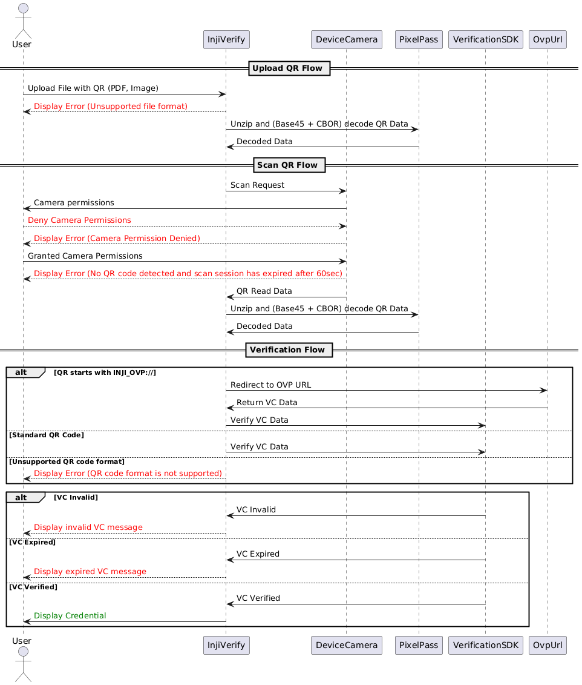

# Workflow

#### **Sequence Diagram**

<figure><figcaption></figcaption></figure>

### **Understanding the workflow**:

#### **Embedded VC data in QR code:**

* The user sends a scan request to the Inji verify portal.
* Inji verify portal sends a scan request to the Device camera.
* The user will be prompted to ask for Device camera permissions.
* The user grants camera permissions.
  * The user scans the QR code using the device camera, and the QR data is returned to the Inji Verify portal.
  * Inji Verify passes the QR data to the Pixel Pass SDK.
  * The Pixel Pass SDK returns the decoded data to Inji Verify.
    * Inji Verify then passes the decoded data to the Verification SDK for verification.
    * The status is returned to the Inji Verify portal from the Verification SDK.
    * Inji Verify retrieves the display properties of the credential from the issuer’s well-known configuration.
    * Finally, Inji Verify displays the credential details using the fetched display properties.
  * The [**pixel-pass library**](https://www.npmjs.com/package/@mosip/pixelpass/v/0.1.6) fails to decode the data
    * Inji verify goes back to the home screen and displays the _QR code format not supported_ error
* The user denies the camera permissions and the _Camera permissions denied_ screen appears on the Inji verify portal

**OpenID4VP (Online Sharing)**

* **User Scans QR Code:**
  * The user opens the Inji Verify portal and scans the QR code using the provided scanner interface in the portal.
  * The QR code contains an authorization request with the URL of the Inji Web **authorize endpoint** and parameters like `response_type`, `presentation_definition`, and the **resource URL** from Durian.
* **Inji Verify Constructs Authorization Request:**
  * Inji Verify appends the necessary parameters to the authorization request:
    * **client\_id**: Identifies the verifier (Inji Verify).
    * **redirect\_uri**: Specifies where the user should be redirected after the authorization process.
* **GET Request to Inji Web Authorization Endpoint:**
  * Inji Verify makes a secure GET call to the **authorize endpoint** of Inji Web, sending the constructed authorization request.
* **Verification of Verifier (Inji Verify) by Inji Web:**
  * Inji Web checks its internal configuration for trusted verifiers. It verifies the `client_id` sent by Inji Verify to ensure it is authorized to request access to the VC stored in Durian.
* **Retrieving the VC from Inji Web:**
  * Upon successful verification, Inji Web retrieves the Verifiable Credential (VC) from the Durian storage (or any specified secure VC storage).
  * Inji Web generates a **vp\_token** containing the VC in JSON format and redirects the user back to Inji Verify with the **vp\_token** as part of the response.
* **Inji Verify Receives and Verifies VC:**
  * Inji Verify receives the **vp\_token** containing the VC.
  * It performs a thorough verification of the received VC by checking:
    * The validity of the VC against the issuer's key (issuer key verification).
    * The integrity of the credential ensures it has not been tampered with.
* **Displaying the Verified Credential:**
  * After successful verification, Inji Verify showcases the verified credential in the user interface.
* **Completion of Verification:**
  * The user is presented with the verified credential, confirming successful online sharing and validation using OpenID4VP standards.

#### **Upload QR flow:**

**Embedded VC data in QR code**

* The user uploads a file with a QR Code.
* Inji Verify passes the QR data to the Pixel Pass SDK.
* The Pixel Pass SDK returns the decoded data to Inji Verify.
  * Inji Verify then passes the decoded data to the Verification SDK for verification.
  * The status is returned to the Inji Verify portal from the Verification SDK.
  * Inji Verify retrieves the display properties of the credential from the issuer’s well-known configuration.
  * Finally, Inji Verify displays the credential details using the fetched display properties.
* However, if [**Pixel Pass**](https://www.npmjs.com/package/@mosip/pixelpass/v/0.1.6) fails to decode the data:
  * Inji Verify navigates back to the home screen and displays the "QR code format not supported" error.

**OpenID4VP (Online Sharing)**

* **User Uploads QR Code:**
  * The user opens the Inji Verify portal and uploads a QR code file using the upload functionality in the portal.
* **QR Code Details:**
  * The uploaded QR code contains an authorization request with the URL of the Inji Web **authorize endpoint** and parameters like `response_type`, `presentation_definition`, and the **resource URL** from Durian.
* **Inji Verify Constructs Authorization Request:**
  * Inji Verify appends the necessary parameters to the authorization request:
    * **client\_id**: Identifies the verifier (Inji Verify).
    * **redirect\_uri**: Specifies where the user should be redirected after the authorization process.
* **GET Request to Inji Web Authorization Endpoint:**
  * Inji Verify makes a secure GET call to the **authorize endpoint** of Inji Web, sending the constructed authorization request.
* **Verification of Verifier (Inji Verify) by Inji Web:**
  * Inji Web checks its internal configuration for trusted verifiers. It verifies the `client_id` sent by Inji Verify to ensure it is authorized to request access to the VC stored in Durian.
* **Retrieving the VC from Inji Web:**
  * Upon successful verification, Inji Web retrieves the Verifiable Credential (VC) from Durian storage (or any specified secure VC storage).
  * Inji Web generates a **vp\_token** containing the VC in JSON format and redirects the user back to Inji Verify with the **vp\_token** as part of the response.
* **Inji Verify Receives and Verifies VC:**
  * Inji Verify receives the **vp\_token** containing the VC.
  * It performs a thorough verification of the received VC by checking:
    * The validity of the VC against the issuer's key (issuer key verification).
    * The integrity of the credential, ensuring it has not been tampered with.
* **Displaying the Verified Credential:**
  * After successful verification, Inji Verify showcases the verified credential in the user interface.
* **Completion of Verification:**
  * The user is presented with the verified credential, confirming successful online sharing and validation using OpenID4VP standards.

#### Additional Features:

* The Pixel Pass library now supports decoding CBOR QR codes and can provide details of verifiable credential (VC) data.
* Inji Verify can now handle the display of expired credentials, in addition to valid and invalid credential displays, using the same verification and display processes.


**Note**: To understand the Inji Verify components in detail please refer to the topic [**Components**](../technical-overview/components.md) under [**Technical Overview**](../technical-overview/) section.

