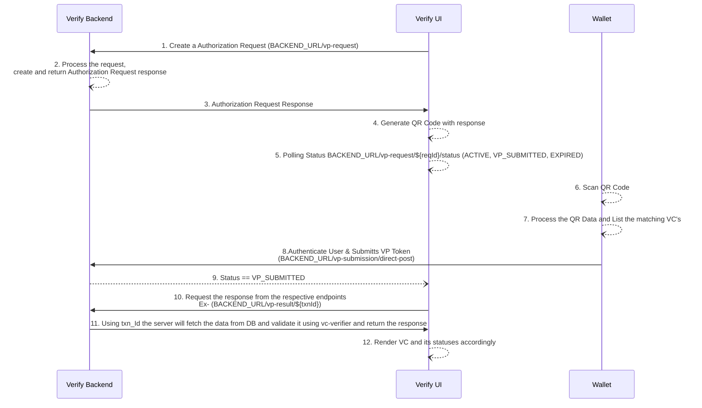
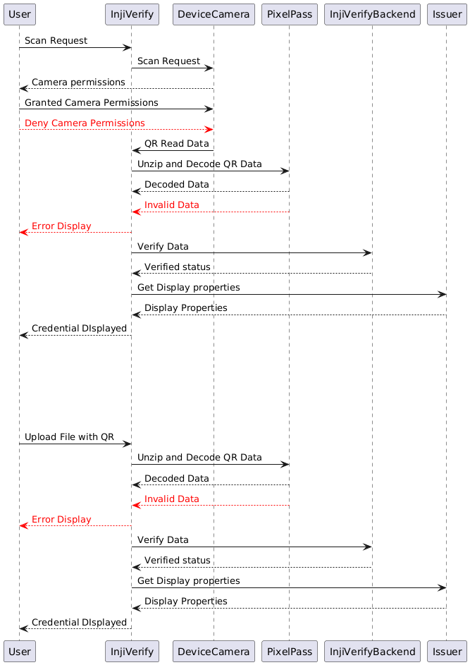
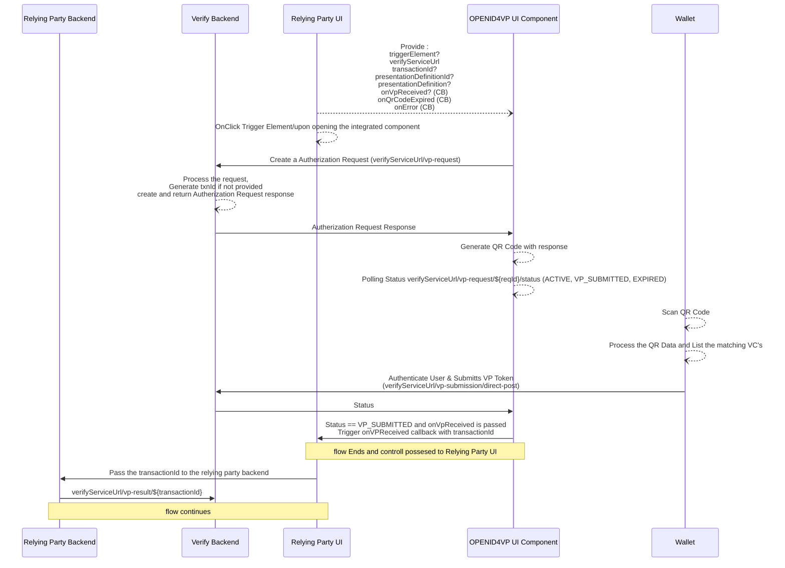
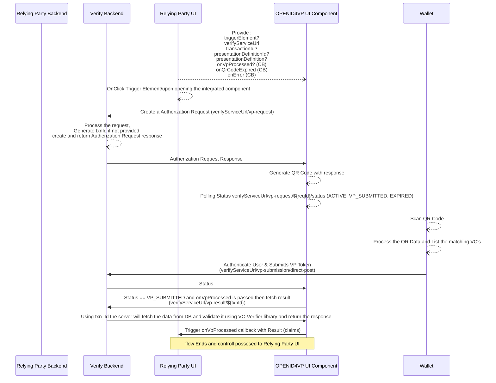
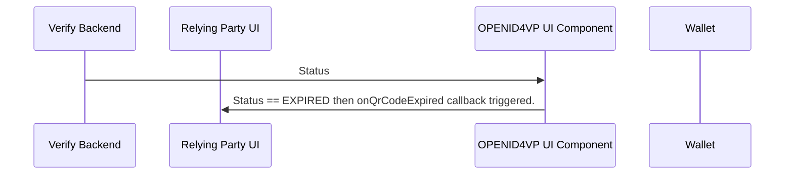

# Workflow

## Sequence Diagram: OpenID4VP Cross Device Flow

In this flow, Inji Verify prepares an Authorization Request and renders it as a QR Code. The End-User then uses the Wallet to scan the QR Code. The Verifiable Presentations are sent to the Inji Verify backed in a direct HTTP POST request to a URL controlled by Inji Verify. The flow uses the Response Type `vp_token` in conjunction with the Response Mode `direct_post`, both defined in this specification.

```mermaid
sequenceDiagram

    participant Verify Backend
    participant Verify UI
    participant Wallet

    Verify UI->>Verify Backend: 1. Create a Authorization Request (BACKEND_URL/vp-request)
    Verify Backend--)Verify Backend: 2. Process the request,<br> create and return Authorization Request response
    Verify Backend->>Verify UI: 3. Authorization Request Response
    Verify UI--)Verify UI: 4. Generate QR Code with response
    Verify UI--)Verify UI: 5. Polling Status BACKEND_URL/vp-request/${reqId}/status (ACTIVE, VP_SUBMITTED, EXPIRED)
    Wallet--)Wallet: 6. Scan QR Code
    Wallet--)Wallet: 7. Process the QR Data and List the matching VC's
    Wallet->>Verify Backend: 8.Authenticate User & Submitts VP Token <br> (BACKEND_URL/vp-submission/direct-post)
    Verify Backend--)Verify UI: 9. Status == VP_SUBMITTED
    Verify UI->>Verify Backend: 10. Request the response from the respective endpoints <br> Ex- (BACKEND_URL/vp-result/${txnId})
    Verify Backend->>Verify UI: 11. Using txn_Id the server will fetch the data from DB and validate it using vc-verifier and return the response
    Verify UI--)Verify UI: 12. Render VC and its statuses accordingly
    
```

1. Inji Verify UI sends a POST request to create a new Authorization Request with

* `clientId`: (required) - ID of the client requesting the Verifiable Presentation.
* `presentationDefinition`: One of **presentationDefinitionID** or **presentationDefinition** (required) - Presentation Definition for the Verifiable Presentation.
* `presentationDefinitionID`: One of **presentationDefinitionID** or **presentationDefinition** (required) - Presentation Definition ID for the Verifiable Presentation requesting, which is saved in backend.
* `transactionID` - (optional) - A unique identifier for the current authorization request transaction.

2. Inji Verify backend creates a new Authorization Request
3. Inji Verify backend returns the newly created Authorization Request
4. Inji Verify UI generates a QR code with response
5. Inji Verify UI Starts polling for the current transaction status
6. Wallet Scans QR code
7. Wallet reads the QR code data and initiates a OpenId4VP flow on wallets end.
8. Wallet creates a VP based on the VP selected VCs and POST it to responseUri from the QR code
9. Inji Verify UI Starts polling status becomes `VP_SUBMITTED`
10. Inji Verify UI requests for the submitted result with its verification statuses
11. Using transactionId Inji v will fetch the data from DB and validate it using vc-verifier and return the response(11) Using transactionId Inji Verify Backed will fetch the data from DB and validate it using `vc-verifier` and returns the response
12. Inji Verify UI renders the response accordingly

#### Sequence Diagram - Upload/ Scan QR Code flow

<figure><figcaption></figcaption></figure>

### **Understanding the workflow**:

#### **Embedded VC data in QR code:**

* The user sends a scan request to the Inji verify portal.
* Inji verify portal sends a scan request to the Device camera.
* The user will be prompted to ask for Device camera permissions.
* The user grants camera permissions.
  * The user scans the QR code using the device camera, and the QR data is returned to the Inji Verify portal.
  * Inji Verify passes the QR data to the Pixel Pass SDK.
  * The Pixel Pass SDK returns the decoded data to Inji Verify.
    * Inji Verify then passes the decoded data to the Verification SDK for verification.
    * The status is returned to the Inji Verify portal from the Verification SDK.
    * Inji Verify retrieves the display properties of the credential from the issuer’s well-known configuration.
    * Finally, Inji Verify displays the credential details using the fetched display properties.
  * The [**pixel-pass library**](https://www.npmjs.com/package/@mosip/pixelpass/v/0.1.6) fails to decode the data
    * Inji verify goes back to the home screen and displays the _QR code format not supported_ error
* The user denies the camera permissions and the _Camera permissions denied_ screen appears on the Inji verify portal

**OpenID4VP (Online Sharing)**

* **User Scans QR Code:**
  * The user opens the Inji Verify portal and scans the QR code using the provided scanner interface in the portal.
  * The QR code contains an authorization request with the URL of the Inji Web **authorize endpoint** and parameters like `response_type`, `presentation_definition`, and the **resource URL** from Durian.
* **Inji Verify Constructs Authorization Request:**
  * Inji Verify appends the necessary parameters to the authorization request:
    * **client\_id**: Identifies the verifier (Inji Verify).
    * **redirect\_uri**: Specifies where the user should be redirected after the authorization process.
* **GET Request to Inji Web Authorization Endpoint:**
  * Inji Verify makes a secure GET call to the **authorize endpoint** of Inji Web, sending the constructed authorization request.
* **Verification of Verifier (Inji Verify) by Inji Web:**
  * Inji Web checks its internal configuration for trusted verifiers. It verifies the `client_id` sent by Inji Verify to ensure it is authorized to request access to the VC stored in Durian.
* **Retrieving the VC from Inji Web:**
  * Upon successful verification, Inji Web retrieves the Verifiable Credential (VC) from the Durian storage (or any specified secure VC storage).
  * Inji Web generates a **vp\_token** containing the VC in JSON format and redirects the user back to Inji Verify with the **vp\_token** as part of the response.
* **Inji Verify Receives and Verifies VC:**
  * Inji Verify receives the **vp\_token** containing the VC.
  * It performs a thorough verification of the received VC by checking:
    * The validity of the VC against the issuer's key (issuer key verification).
    * The integrity of the credential ensures it has not been tampered with.
* **Displaying the Verified Credential:**
  * After successful verification, Inji Verify showcases the verified credential in the user interface.
* **Completion of Verification:**
  * The user is presented with the verified credential, confirming successful online sharing and validation using OpenID4VP standards.

#### **Upload QR flow:**

**Embedded VC data in QR code**

* The user uploads a file with a QR Code.
* Inji Verify passes the QR data to the Pixel Pass SDK.
* The Pixel Pass SDK returns the decoded data to Inji Verify.
  * Inji Verify then passes the decoded data to the Verification SDK for verification.
  * The status is returned to the Inji Verify portal from the Verification SDK.
  * Inji Verify retrieves the display properties of the credential from the issuer’s well-known configuration.
  * Finally, Inji Verify displays the credential details using the fetched display properties.
* However, if [**Pixel Pass**](https://www.npmjs.com/package/@mosip/pixelpass/v/0.1.6) fails to decode the data:
  * Inji Verify navigates back to the home screen and displays the "QR code format not supported" error.

**OpenID4VP (Online Sharing)**

* **User Uploads QR Code:**
  * The user opens the Inji Verify portal and uploads a QR code file using the upload functionality in the portal.
* **QR Code Details:**
  * The uploaded QR code contains an authorization request with the URL of the Inji Web **authorize endpoint** and parameters like `response_type`, `presentation_definition`, and the **resource URL** from Durian.
* **Inji Verify Constructs Authorization Request:**
  * Inji Verify appends the necessary parameters to the authorization request:
    * **client\_id**: Identifies the verifier (Inji Verify).
    * **redirect\_uri**: Specifies where the user should be redirected after the authorization process.
* **GET Request to Inji Web Authorization Endpoint:**
  * Inji Verify makes a secure GET call to the **authorize endpoint** of Inji Web, sending the constructed authorization request.
* **Verification of Verifier (Inji Verify) by Inji Web:**
  * Inji Web checks its internal configuration for trusted verifiers. It verifies the `client_id` sent by Inji Verify to ensure it is authorized to request access to the VC stored in Durian.
* **Retrieving the VC from Inji Web:**
  * Upon successful verification, Inji Web retrieves the Verifiable Credential (VC) from Durian storage (or any specified secure VC storage).
  * Inji Web generates a **vp\_token** containing the VC in JSON format and redirects the user back to Inji Verify with the **vp\_token** as part of the response.
* **Inji Verify Receives and Verifies VC:**
  * Inji Verify receives the **vp\_token** containing the VC.
  * It performs a thorough verification of the received VC by checking:
    * The validity of the VC against the issuer's key (issuer key verification).
    * The integrity of the credential, ensuring it has not been tampered with.
    * The VC verification happens at Inji Verify Backend, the Verify UI sends the VC to its backend and performs the verification using [vc-verfier](https://github.com/mosip/vc-verifier/tree/master/vc-verifier/kotlin) library.
* **Displaying the Verified Credential:**
  * After successful verification, Inji Verify showcases the verified credential in the user interface.
* **Completion of Verification:**
  * The user is presented with the verified credential, confirming successful online sharing and validation using OpenID4VP standards.

#### Additional Features:

* The Pixel Pass library now supports decoding CBOR QR codes and can provide details of verifiable credential (VC) data.
* Inji Verify can now handle the display of expired credentials, in addition to valid and invalid credential displays, using the same verification and display processes.


**Note**: To understand the Inji Verify components in detail please refer to the topic [**Components**](../technical-overview/components.md) under [**Technical Overview**](../technical-overview/) section.


### Sequence Diagram: Inji Verify SDK

**The below diagram illustrates the flow in which Relaying party backend is directly fetching the result from verify backend.**

```mermaid
%% Sequence diagram for VP Verification Process
sequenceDiagram
    participant Relying Party Backend
    participant Verify Backend
    participant Relying Party UI
    participant OPENID4VP UI Component
    participant Wallet


    Relying Party UI--)OPENID4VP UI Component: Provide : <br> triggerElement? <br> verifyServiceUrl <br> transactionId? <br>  presentationDefinitionId? <br> presentationDefinition? <br> onVpReceived? (CB) <br> onQrCodeExpired (CB) <br> onError (CB) 
    Relying Party UI--)Relying Party UI: OnClick Trigger Element/upon opening the integrated component
    OPENID4VP UI Component->>Verify Backend: Create a Autherization Request (verifyServiceUrl/vp-request) 
    Verify Backend--)Verify Backend: Process the request,<br>Generate txnId if not provided<br> create and return Autherization Request response
    Verify Backend->>OPENID4VP UI Component: Autherization Request Response
    OPENID4VP UI Component--)OPENID4VP UI Component: Generate QR Code with response
    OPENID4VP UI Component--)OPENID4VP UI Component: Polling Status verifyServiceUrl/vp-request/${reqId}/status (ACTIVE, VP_SUBMITTED, EXPIRED)
    Wallet--)Wallet: Scan QR Code
    Wallet--)Wallet: Process the QR Data and List the matching VC's
    Wallet->>Verify Backend: Authenticate User & Submitts VP Token <br> (verifyServiceUrl/vp-submission/direct-post)
    Verify Backend->>OPENID4VP UI Component: Status
    OPENID4VP UI Component->>Relying Party UI: Status == VP_SUBMITTED and onVpReceived is passed <br>Trigger onVPReceived callback with transactionId
    Note over OPENID4VP UI Component,Relying Party UI: flow Ends and controll possesed to Relying Party UI
    Relying Party UI->>Relying Party Backend: Pass the transactionId to the relying party backend
    Relying Party Backend->>Verify Backend: verifyServiceUrl/vp-result/${transactionId}
    Note over Relying Party Backend,Relying Party UI: flow continues 
```

1. **Relying Party UI initiates the process:** The user interacts with the Relying Party's User Interface (UI) and triggers a verification action.
2. **OPENID4VP UI Component communicates with Verify Backend:** Upon the user's action, the Relying Party UI sends a request to Verify Backend. This request contains information needed to initiate the verification.
3. **Verify Backend processes the request:** The Verify Backend receives the request from the UI. It then processes this request. As part of the processing, the Verify Backend creates an Authorization Request.
4. **Verify Backend sends the Authorization Request to the OPENID4VP UI Component:** The generated Authorization Request is then sent back to the Relying Party UI ( OPENID4VP UI Component ).
5. **OPENID4VP UI Component generates a QR Code:** The component receives the Authorization Request and, based on its content, generates a QR code. This QR code will contain information that the user's wallet can scan. The generated QR code is then presented to the user through the Relying Party UI.
6. **OPENID4VP UI Component Starts Status polling a QR Code:** The component starts to poll for the current status of the Authorization request created.
7. **User scans the QR Code with their Wallet:** The user uses their digital wallet application to scan the QR code displayed by the Relying Party UI.
8. **Wallet processes the QR Code and matching VC(s):** The user's wallet application reads the data from the QR code and identifies the Verifiable Credential(s) (VCs) that are relevant to the verification request.
9. **Wallet authenticates the user and submits the VP Token:** The user authenticates themselves within their wallet application. Following authentication, the wallet constructs a Verifiable Presentation (VP) Token containing the necessary VCs and submits it to the Verify Backend (via a direct post to verifyService/vp-submission/direct-post).
10. **Verify Backend sends a Status update to the OPENID4VP UI Component:** Based on the validation result, the Verify Backend sends a status update to the OPENHVP UI Component. This status could indicate success (VP\_SUBMITTED), ongoing processing (ACTIVE), or failure (EXPIRED).
11. **Flow Ends and Control is passed to the Relying Party UI:** The core verification flow concludes, and the Relying Party UI now has the status of the verification.
12. **Relying Party UI passes the transaction result to the Relying Party Backend:** The Relying Party UI communicates the outcome of the verification (including the verifyService/vp-result and potentially the transaction details) to its backend (Relying Party Backend).
13. **Relying Party Backend acts based on the verification result:** The Relying Party Backend receives the verification result and proceeds with the next steps in its application logic based on whether the verification was successful or not.

#### **The below diagram illustrates the flow in which Relaying party UI is directly fetching the result from verify backend.**

```mermaid
%% Sequence diagram for VP Verification Process
sequenceDiagram
    participant Relying Party Backend
    participant Verify Backend
    participant Relying Party UI
    participant OPENID4VP UI Component
    participant Wallet


     Relying Party UI--)OPENID4VP UI Component: Provide : <br> triggerElement? <br> verifyServiceUrl <br> transactionId? <br>  presentationDefinitionId? <br> presentationDefinition? <br> onVpProcessed? (CB) <br> onQrCodeExpired (CB) <br> onError (CB) 
    Relying Party UI--)Relying Party UI: OnClick Trigger Element/upon opening the integrated component
    OPENID4VP UI Component->>Verify Backend: Create a Autherization Request (verifyServiceUrl/vp-request) 
    Verify Backend--)Verify Backend: Process the request,<br> Generate txnId if not provided, <br> create and return Autherization Request response
    Verify Backend->>OPENID4VP UI Component: Autherization Request Response
    OPENID4VP UI Component--)OPENID4VP UI Component: Generate QR Code with response
    OPENID4VP UI Component--)OPENID4VP UI Component: Polling Status verifyServiceUrl/vp-request/${reqId}/status (ACTIVE, VP_SUBMITTED, EXPIRED)
    Wallet--)Wallet: Scan QR Code
    Wallet--)Wallet: Process the QR Data and List the matching VC's
    Wallet->>Verify Backend: Authenticate User & Submitts VP Token <br> (verifyServiceUrl/vp-submission/direct-post)
    Verify Backend->>OPENID4VP UI Component: Status
    OPENID4VP UI Component->>Verify Backend: Status == VP_SUBMITTED and onVpProcessed is passed then fetch result <br> (verifyServiceUrl/vp-result/${txnId})
    Verify Backend->>OPENID4VP UI Component: Using txn_Id the server will fetch the data from DB and validate it using VC-Verifier library and return the response
    OPENID4VP UI Component->>Relying Party UI: Trigger onVpProcessed callback with Result (claims)
    Note over OPENID4VP UI Component,Relying Party UI: flow Ends and controll possesed to Relying Party UI


```

1. **Relying Party UI initiates the process:** The user interacts with the Relying Party's User Interface (UI) and triggers a verification action.
2. **OPENID4VP UI Component communicates with Verify Backend:** Upon the user's action, the Relying Party UI sends a request to Verify Backend. This request contains information needed to initiate the verification.
3. **Verify Backend processes the request:** The Verify Backend receives the request from the UI. It then processes this request. As part of the processing, the Verify Backend creates an Authorization Request.
4. **Verify Backend sends the Authorization Request to the OPENID4VP UI Component:** The generated Authorization Request is then sent back to the Relying Party UI ( OPENID4VP UI Component ).
5. **OPENID4VP UI Component generates a QR Code:** The component receives the Authorization Request and, based on its content, generates a QR code. This QR code will contain information that the user's wallet can scan. The generated QR code is then presented to the user through the Relying Party UI.
6. **OPENID4VP UI Component Starts Status polling a QR Code:** The component starts to poll for the current status of the Authorization request created.
7. **User scans the QR Code with their Wallet:** The user uses their digital wallet application to scan the QR code displayed by the Relying Party UI.
8. **Wallet processes the QR Code and matching VC(s):** The user's wallet application reads the data from the QR code and identifies the Verifiable Credential(s) (VCs) that are relevant to the verification request.
9. **Wallet authenticates the user and submits the VP Token:** The user authenticates themselves within their wallet application. Following authentication, the wallet constructs a Verifiable Presentation (VP) Token containing the necessary VCs and submits it to the Verify Backend (via a direct post to verifyService/vp-submission/direct-post).
10. **Verify Backend sends a Status update to the OPENID4VP UI Component:** Based on the validation result, the Verify Backend sends a status update to the OPENHVP UI Component. This status could indicate success (VP\_SUBMITTED), ongoing processing (ACTIVE), or failure (EXPIRED).
11. **OPENID4VP UI Component triggers 'onProcessed' callback with the result:** When the status indicates VP\_SUBMITTED and the onProcessed callback is passed, the OPENID4VP UI Component triggers this callback, providing the result of the initial submission.
12. **Relying Party UI receives the final result via the 'onProcessed' callback:** The Relying Party UI receives the final verification result through the onProcessed callback, which now includes the validated claims.
13. **Flow Ends and Control is passed to the Relying Party UI:** The complete verification flow concludes, and the Relying Party UI can now use the validated claims to proceed with the application logic.

#### **The below diagram illustrates the flow in which a authorization request gets expired.**

```mermaid
sequenceDiagram
    participant Verify Backend
    participant Relying Party UI
    participant OPENID4VP UI Component
    participant Wallet


    Verify Backend->>OPENID4VP UI Component: Status
    OPENID4VP UI Component->>Relying Party UI: Status == EXPIRED then onQrCodeExpired callback triggered.
```

1. **OPENID4VP UI Component sends a Status update:** The Verify Backend sends a Status update to the OPENID4VP UI Component. At this point, the status is something like EXPIRED or PENDING, indicating that the QR code is currently valid.
2. **Time passes and the QR code expires:** The Verify Backend sends a Status update to the OPENID4VP UI Component. At this point, the status is EXPIRED, indicating that the authorization request is currently expired valid.
3. **OPENID4VP UI Component triggers the** onQrCodeExpired **callback:** Upon detecting the expiration, the OPENID4VP UI Component triggers a callback function onQrCodeExpired .

#### **The below diagram illustrates the flow in which an error occurs**

1. **An error occurs at OPENID4VP UI Component :** An error occurs at OPENID4VP UI Component due to some response error, exceptions or expected errors.
2. **OPENID4VP UI Component triggers the** onError **callback:** Upon detecting the\
   error, the OPENID4VP UI Component triggers a callback function onError .

