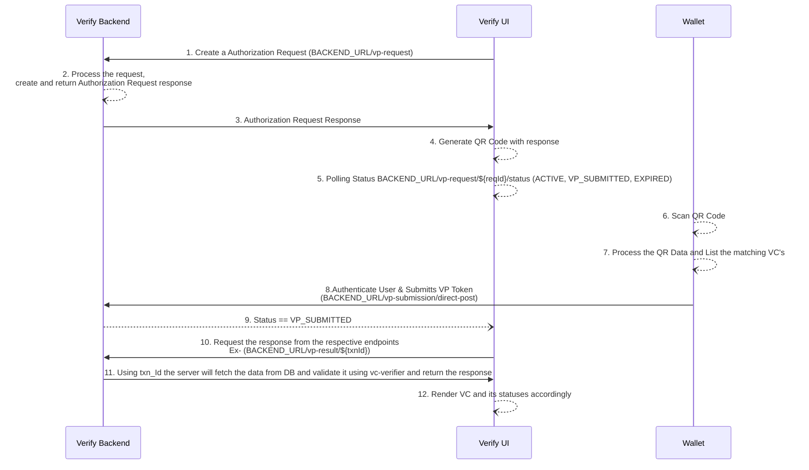
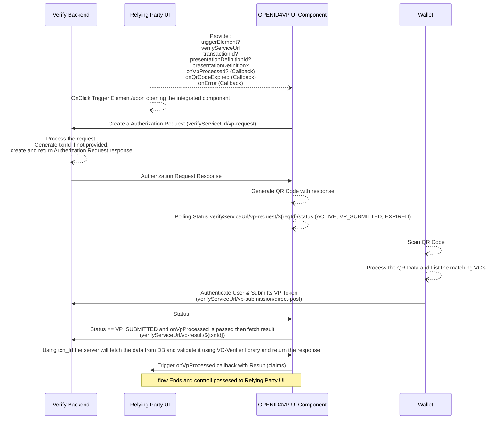
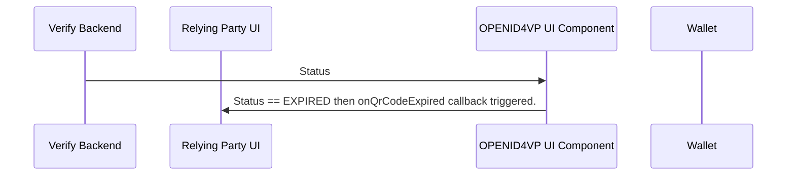
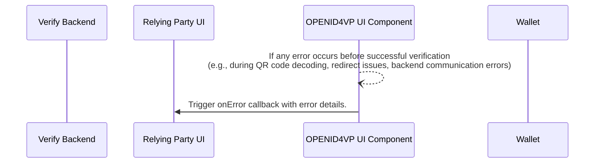
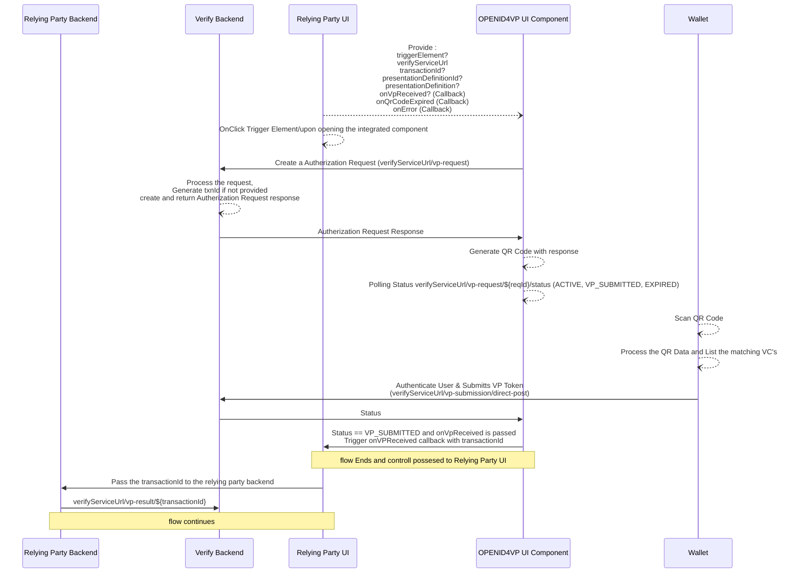
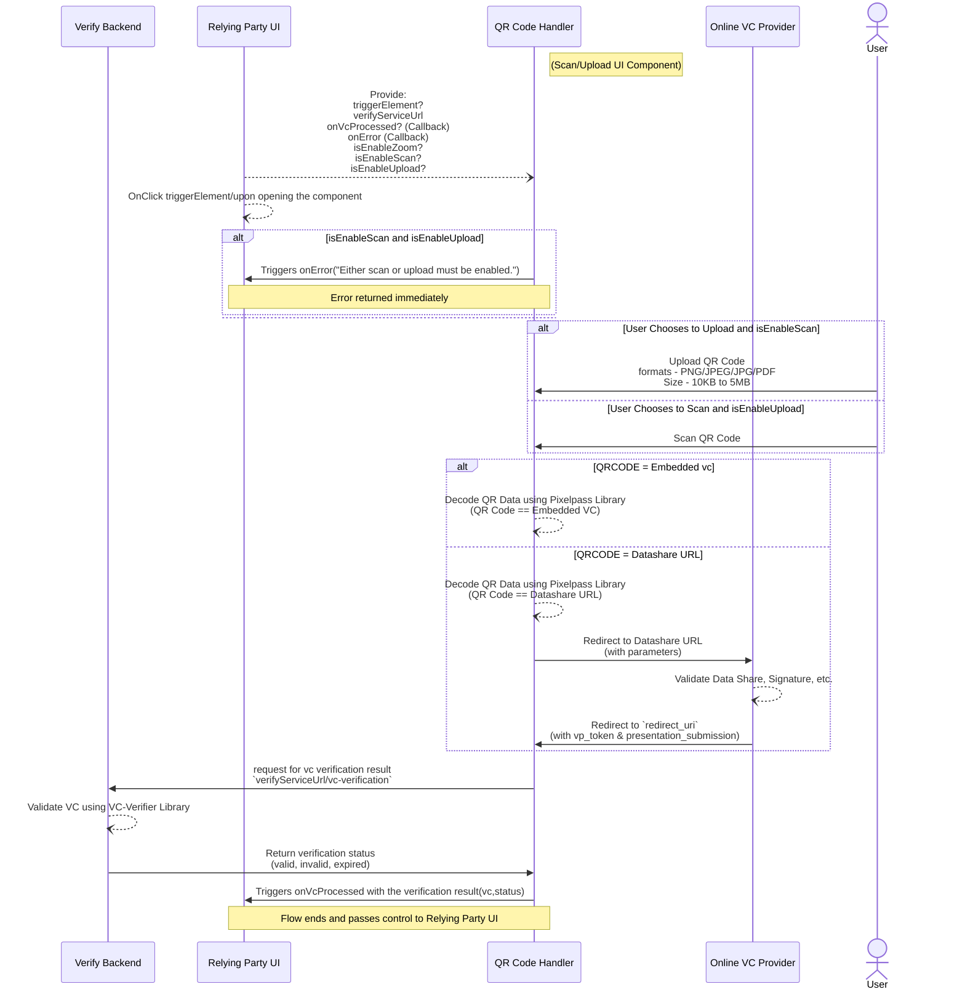
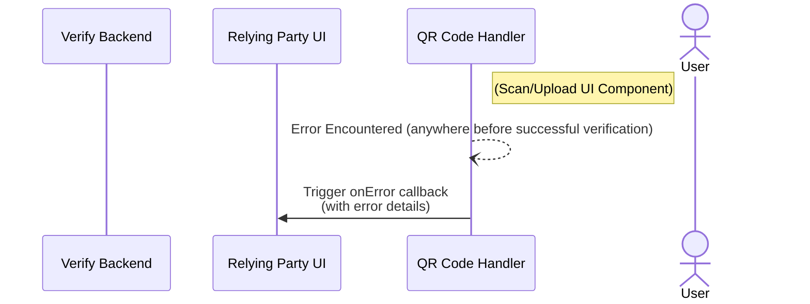
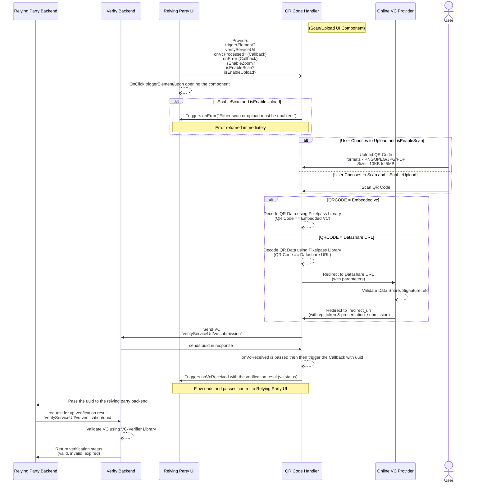

# Workflow

## Workflow

### Sequence Diagram: OpenID4VP Cross Device Flow

In this flow, Inji Verify prepares an Authorization Request and renders it as a QR Code. The End-User then uses the Wallet to scan the QR Code. The Verifiable Presentations are sent to the Inji Verify backed in a direct HTTP POST request to a URL controlled by Inji Verify. The flow uses the Response Type `vp_token` in conjunction with the Response Mode `direct_post`, both defined in this specification.

```mermaid
sequenceDiagram
participant Verify Backend
participant Verify UI
participant Wallet
Verify UI->>Verify Backend: 1. Create a Authorization Request (BACKEND_URL/vp-request)
Verify Backend--)Verify Backend: 2. Process the request,<br> create and return Authorization Request response
Verify Backend->>Verify UI: 3. Authorization Request Response
Verify UI--)Verify UI: 4. Generate QR Code with response
Verify UI--)Verify UI: 5. Polling Status BACKEND_URL/vp-request/${reqId}/status (ACTIVE, VP_SUBMITTED, EXPIRED)
Wallet--)Wallet: 6. Scan QR Code
Wallet--)Wallet: 7. Process the QR Data and List the matching VC's
Wallet->>Verify Backend: 8.Authenticate User & Submitts VP Token <br> (BACKEND_URL/vp-submission/direct-post)
Verify Backend--)Verify UI: 9. Status == VP_SUBMITTED
Verify UI->>Verify Backend: 10. Request the response from the respective endpoints <br> Ex- (BACKEND_URL/vp-result/${txnId})
Verify Backend->>Verify UI: 11. Using txn_Id the server will fetch the data from DB and validate it using vc-verifier and return the response
Verify UI--)Verify UI: 12. Render VC and its statuses accordingly    
```

1. Inji Verify UI sends a POST request to create a new Authorization Request with

* `clientId`: (required) - ID of the client requesting the Verifiable Presentation.
* `presentationDefinition`: One of **presentationDefinitionID** or **presentationDefinition** (required) - Presentation Definition for the Verifiable Presentation.
* `presentationDefinitionID`: One of **presentationDefinitionID** or **presentationDefinition** (required) - Presentation Definition ID for the Verifiable Presentation requesting, which is saved in backend.
* `transactionID` - (optional) - A unique identifier for the current authorization request transaction.

2. Inji Verify backend creates a new Authorization Request
3. Inji Verify backend returns the newly created Authorization Request
4. Inji Verify UI generates a QR code with response
5. Inji Verify UI Starts polling for the current transaction status
6. Wallet Scans QR code
7. Wallet reads the QR code data and initiates a OpenId4VP flow on wallets end.
8. Wallet creates a VP based on the VP selected VCs and POST it to responseUri from the QR code
9. Inji Verify UI Starts polling status becomes `VP_SUBMITTED`
10. Inji Verify UI requests for the submitted result with its verification statuses
11. Using transactionId Inji v will fetch the data from DB and validate it using vc-verifier and return the response(11) Using transactionId Inji Verify Backed will fetch the data from DB and validate it using `vc-verifier` and returns the response
12. Inji Verify UI renders the response accordingly

### Flow Diagram: OpenID4VP Same Device Flow 

[Image]

#### Same Device Flow Overview
**Description of the Flow**
The Same Device Flow in the OpenID for Verifiable Presentations enables the interaction between a verifier and a wallet where both the applications are on the same device, Unlike Scanning the QR code from the wallet application manually as we do in cross-device flow

The flow here utilizes the simple redirection to pass the Authorization request and Authorization response between the verifier and the wallet

**Key Steps in the Flow**
1. **Initiation**:   The flow begins when the user in the Verifier application selects an option to verify their credentials or when the user wishes to present the credentials as Verifiable Credentials from their wallet to the application they are using

2. **Authorization Request**: The Verifier App constructs an authorization request that contains several parameters like

* response_type: Specifies the type of response expected from the authorization server(wallet) for example in our case response_type = vp_token

* Client_id: The unique identifier for the client (Verifier) application making the request

* redirect_uri: This is the URI where the authorization server (Wallet) will send the authorization response and redirect the user back to the verifier(client) application

* request_uri: This is a URL where the verifier application directs the Wallet to retrieve the actual Authorization Request, used when the request object is too large to be transmitted directly, helping to keep the Request Object size smaller.

* response_mode: This parameter tells the wallet that how it should send the vp_token to the verifier application

[Table]

* presentation_definition (Required)- It is an JSON object which contains the info about the credentials that are being requested by the verifier. 
* presentation_definition_uri - to reduce the size of the request or QR code sometimes the verifier stores the presentation_definition Json object at some resource endpoint and sends that resource uri to wallet and wallet call this endpoint and gets the presentation definition object.
* client_id_scheme -  this value used by the Verifier to tell wallet about how it needs to interpret the client identifier provided by the verifier based on the scheme selected.
* client_metadata - Json object which contains the verifier metadata

* state - It contains request-id and it is a random value generated by verifier cryptographically and it is used for binding the Authorization request and response.
* nonce- it is a random value generated by verifier cryptographically and used for preventing the replay attacks. Here this random value will be binded to the authorization response so that even if attacker intercepts the VP response, they cannot replay the VP response again.
* response_uri- if verifier send the response mode as Direct post, then verifier is expecting the response to be sent to some resource which will be under the control of the verifier and verifier will get the response from this response-uri.

3. Request Transmission: The constructed authorization request is sent directly to the wallet application on the same device. This transmission can occur via a custom URL scheme or domain-bound links, depending on the implementation.

The Authorization Request can be of by value or by reference

Then the Wallet app is invoked, and the authorization Request is passed to it

4. User Consent: Upon receiving the request, the wallet displays a consent page to the user which has the options to accept or decline the request

once the user accepts to share the credentials to the verifier application wallet proceeds to create a verifiable presentation, if the user declines the request, then the wallet prompts a reason or simply cancel request

5. Authorization Response: After the user accepts the request then wallet checks for the credentials which matches as per the presentation definition (which the verifier Requested for) and if there are any wallet shows the list to the user allowing them to select and then it constructs a VP response and signs using its private key.

* Response Parameters:

  * vp_token - JSON string or object which contains either a single VP or array of VP’s. Each VC in every VP can be either encoded using base64url or sent as JSON object.

  * presentation_submission - It contains mappings between the requested Verifiable Credentials and where to find them within the returned VP Token.

  * other parameters include - state(request-id), code, id_token

6. Transmission of Authorization Response: Once the Wallet prepares the VP, Wallet sends it back to verifier application (using redirect URI) based on the response_mode and the response_type specified by the verifier application in the Authorization Request

7. Validation of the Authorization Response: Upon receiving the Response (Authorization Response) from the Wallet, the verifier validates the signature of the Verifiable Presentation (VP) using its public key. Additionally, the verifier checks the signature of each Verifiable Credential (VC) by examining the proof details provided in each VC by the issuer.

If validation is successful, the verifier grants access or approval to the user. If validation fails, the verifier notifies the user of the failure

### Sequence Diagram - Upload/ Scan QR Code flow

<figure><figcaption></figcaption></figure>

#### Understanding the workflow

**Embedded VC data in QR code**

* The user sends a scan request to the Inji verify portal.
* Inji verify portal sends a scan request to the Device camera.
* The user will be prompted to ask for Device camera permissions.
* The user grants camera permissions.
  * The user scans the QR code using the device camera, and the QR data is returned to the Inji Verify portal.
  * Inji Verify passes the QR data to the Pixel Pass SDK.
  * The Pixel Pass SDK returns the decoded data to Inji Verify.
    * Inji Verify then passes the decoded data to the Verification SDK for verification.
    * The status is returned to the Inji Verify portal from the Verification SDK.
    * Inji Verify retrieves the display properties of the credential from the issuer’s well-known configuration.
    * Finally, Inji Verify displays the credential details using the fetched display properties.
  * The [**pixel-pass library**](https://www.npmjs.com/package/@mosip/pixelpass/v/0.1.6) fails to decode the data
    * Inji verify goes back to the home screen and displays the _QR code format not supported_ error
* The user denies the camera permissions and the _Camera permissions denied_ screen appears on the Inji verify portal

**OpenID4VP (Online Sharing)**

* **User Scans QR Code:**
  * The user opens the Inji Verify portal and scans the QR code using the provided scanner interface in the portal.
  * The QR code contains an authorization request with the URL of the Inji Web **authorize endpoint** and parameters like `response_type`, `presentation_definition`, and the **resource URL** from Durian.
* **Inji Verify Constructs Authorization Request:**
  * Inji Verify appends the necessary parameters to the authorization request:
    * **client\_id**: Identifies the verifier (Inji Verify).
    * **redirect\_uri**: Specifies where the user should be redirected after the authorization process.
* **GET Request to Inji Web Authorization Endpoint:**
  * Inji Verify makes a secure GET call to the **authorize endpoint** of Inji Web, sending the constructed authorization request.
* **Verification of Verifier (Inji Verify) by Inji Web:**
  * Inji Web checks its internal configuration for trusted verifiers. It verifies the `client_id` sent by Inji Verify to ensure it is authorized to request access to the VC stored in Durian.
* **Retrieving the VC from Inji Web:**
  * Upon successful verification, Inji Web retrieves the Verifiable Credential (VC) from the Durian storage (or any specified secure VC storage).
  * Inji Web generates a **vp\_token** containing the VC in JSON format and redirects the user back to Inji Verify with the **vp\_token** as part of the response.
* **Inji Verify Receives and Verifies VC:**
  * Inji Verify receives the **vp\_token** containing the VC.
  * It performs a thorough verification of the received VC by checking:
    * The validity of the VC against the issuer's key (issuer key verification).
    * The integrity of the credential ensures it has not been tampered with.
* **Displaying the Verified Credential:**
  * After successful verification, Inji Verify showcases the verified credential in the user interface.
* **Completion of Verification:**
  * The user is presented with the verified credential, confirming successful online sharing and validation using OpenID4VP standards.

### Upload QR flow

#### Embedded VC data in QR code

* The user uploads a file with a QR Code.
* Inji Verify passes the QR data to the Pixel Pass SDK.
* The Pixel Pass SDK returns the decoded data to Inji Verify.
  * Inji Verify then passes the decoded data to the Verification SDK for verification.
  * The status is returned to the Inji Verify portal from the Verification SDK.
  * Inji Verify retrieves the display properties of the credential from the issuer’s well-known configuration.
  * Finally, Inji Verify displays the credential details using the fetched display properties.
* However, if [**Pixel Pass**](https://www.npmjs.com/package/@mosip/pixelpass/v/0.1.6) fails to decode the data:
  * Inji Verify navigates back to the home screen and displays the "QR code format not supported" error.

#### OpenID4VP (Online Sharing)

* **User Uploads QR Code:**
  * The user opens the Inji Verify portal and uploads a QR code file using the upload functionality in the portal.
* **QR Code Details:**
  * The uploaded QR code contains an authorization request with the URL of the Inji Web **authorize endpoint** and parameters like `response_type`, `presentation_definition`, and the **resource URL** from Durian.
* **Inji Verify Constructs Authorization Request:**
  * Inji Verify appends the necessary parameters to the authorization request:
    * **client\_id**: Identifies the verifier (Inji Verify).
    * **redirect\_uri**: Specifies where the user should be redirected after the authorization process.
* **GET Request to Inji Web Authorization Endpoint:**
  * Inji Verify makes a secure GET call to the **authorize endpoint** of Inji Web, sending the constructed authorization request.
* **Verification of Verifier (Inji Verify) by Inji Web:**
  * Inji Web checks its internal configuration for trusted verifiers. It verifies the `client_id` sent by Inji Verify to ensure it is authorized to request access to the VC stored in Durian.
* **Retrieving the VC from Inji Web:**
  * Upon successful verification, Inji Web retrieves the Verifiable Credential (VC) from Durian storage (or any specified secure VC storage).
  * Inji Web generates a **vp\_token** containing the VC in JSON format and redirects the user back to Inji Verify with the **vp\_token** as part of the response.
* **Inji Verify Receives and Verifies VC:**
  * Inji Verify receives the **vp\_token** containing the VC.
  * It performs a thorough verification of the received VC by checking:
    * The validity of the VC against the issuer's key (issuer key verification).
    * The integrity of the credential, ensuring it has not been tampered with.
    * The VC verification happens at Inji Verify Backend, the Verify UI sends the VC to its backend and performs the verification using [vc-verfier](https://github.com/mosip/vc-verifier/tree/master/vc-verifier/kotlin) library.
* **Displaying the Verified Credential:**
  * After successful verification, Inji Verify showcases the verified credential in the user interface.
* **Completion of Verification:**
  * The user is presented with the verified credential, confirming successful online sharing and validation using OpenID4VP standards.

**Additional Features**

* The Pixel Pass library now supports decoding CBOR QR codes and can provide details of verifiable credential (VC) data.
* Inji Verify can now handle the display of expired credentials, in addition to valid and invalid credential displays, using the same verification and display processes.


**Note**: To understand the Inji Verify components in detail please refer to the topic [**Components**](../technical-overview/components.md) under [**Technical Overview**](../technical-overview/) section.


***

## Sequence Diagram: Inji Verify SDK

### OpenID4VPVerification Component

**The below diagram illustrates the flow in which Relaying party UI is directly fetching the result from verify backend. Which is the current implementation of Inji Verify UI.**

```mermaid
sequenceDiagram
    participant Verify Backend
    participant Relying Party UI
    participant OPENID4VP UI Component
    participant Wallet
    
     Relying Party UI--)OPENID4VP UI Component: Provide : <br> triggerElement? <br> verifyServiceUrl <br> transactionId? <br>  presentationDefinitionId? <br> presentationDefinition? <br> onVpProcessed? (Callback) <br> onQrCodeExpired (Callback) <br> onError (Callback) 
    Relying Party UI--)Relying Party UI: OnClick Trigger Element/upon opening the integrated component
    OPENID4VP UI Component->>Verify Backend: Create a Autherization Request (verifyServiceUrl/vp-request) 
    Verify Backend--)Verify Backend: Process the request,<br> Generate txnId if not provided, <br> create and return Autherization Request response
    Verify Backend->>OPENID4VP UI Component: Autherization Request Response
    OPENID4VP UI Component--)OPENID4VP UI Component: Generate QR Code with response
    OPENID4VP UI Component--)OPENID4VP UI Component: Polling Status verifyServiceUrl/vp-request/${reqId}/status (ACTIVE, VP_SUBMITTED, EXPIRED)
    Wallet--)Wallet: Scan QR Code
    Wallet--)Wallet: Process the QR Data and List the matching VC's
    Wallet->>Verify Backend: Authenticate User & Submitts VP Token <br> (verifyServiceUrl/vp-submission/direct-post)
    Verify Backend->>OPENID4VP UI Component: Status
    OPENID4VP UI Component->>Verify Backend: Status == VP_SUBMITTED and onVpProcessed is passed then fetch result <br> (verifyServiceUrl/vp-result/${txnId})
    Verify Backend->>OPENID4VP UI Component: Using txn_Id the server will fetch the data from DB and validate it using VC-Verifier library and return the response
    OPENID4VP UI Component->>Relying Party UI: Trigger onVpProcessed callback with Result (claims)
    Note over OPENID4VP UI Component,Relying Party UI: flow Ends and controll possesed to Relying Party UI
```

1. **Relying Party UI initiates the process:** The user interacts with the Relying Party's User Interface (UI) and triggers a verification action.
2. **OPENID4VP UI Component communicates with Verify Backend:** Upon the user's action, the Relying Party UI sends a request to Verify Backend. This request contains information needed to initiate the verification.
3. **Verify Backend processes the request:** The Verify Backend receives the request from the UI. It then processes this request. As part of the processing, the Verify Backend creates an Authorization Request.
4. **Verify Backend sends the Authorization Request to the OPENID4VP UI Component:** The generated Authorization Request is then sent back to the Relying Party UI ( OPENID4VP UI Component ).
5. **OPENID4VP UI Component generates a QR Code:** The component receives the Authorization Request and, based on its content, generates a QR code. This QR code will contain information that the user's wallet can scan. The generated QR code is then presented to the user through the Relying Party UI.
6. **OPENID4VP UI Component Starts Status polling a QR Code:** The component starts to poll for the current status of the Authorization request created.
7. **User scans the QR Code with their Wallet:** The user uses their digital wallet application to scan the QR code displayed by the Relying Party UI.
8. **Wallet processes the QR Code and matching VC(s):** The user's wallet application reads the data from the QR code and identifies the Verifiable Credential(s) (VCs) that are relevant to the verification request.
9. **Wallet authenticates the user and submits the VP Token:** The user authenticates themselves within their wallet application. Following authentication, the wallet constructs a Verifiable Presentation (VP) Token containing the necessary VCs and submits it to the Verify Backend (via a direct post to verifyService/vp-submission/direct-post).
10. **Verify Backend sends a Status update to the OPENID4VP UI Component:** Based on the validation result, the Verify Backend sends a status update to the OPENHVP UI Component. This status could indicate success (VP\_SUBMITTED), ongoing processing (ACTIVE), or failure (EXPIRED).
11. **Flow Ends and Control is passed to the Relying Party UI:** The core verification flow concludes, and the Relying Party UI now has the status of the verification.
12. **Relying Party UI passes the transaction result to the Relying Party Backend:** The Relying Party UI communicates the outcome of the verification (including the verifyService/vp-result and potentially the transaction details) to its backend (Relying Party Backend).
13. **Relying Party Backend acts based on the verification result:** The Relying Party Backend receives the verification result and proceeds with the next steps in its application logic based on whether the verification was successful or not.

**The below diagram illustrates the flow in which a authorization request gets expired.**

```mermaid

sequenceDiagram
    participant Verify Backend
    participant Relying Party UI
    participant OPENID4VP UI Component
    participant Wallet


    Verify Backend->>OPENID4VP UI Component: Status
    OPENID4VP UI Component->>Relying Party UI: Status == EXPIRED then onQrCodeExpired callback triggered.
```

1. **OPENID4VP UI Component sends a Status update:** The Verify Backend sends a Status update to the OPENID4VP UI Component. At this point, the status is something like EXPIRED or PENDING, indicating that the QR code is currently valid.
2. **Time passes and the QR code expires:** The Verify Backend sends a Status update to the OPENID4VP UI Component. At this point, the status is EXPIRED, indicating that the authorization request is currently expired valid.
3. **OPENID4VP UI Component triggers the** onQrCodeExpired **callback:** Upon detecting the expiration, the OPENID4VP UI Component triggers a callback function onQrCodeExpired .

**The below diagram illustrates the flow in which an error occurs**&#x20;

```mermaid
sequenceDiagram
    participant Verify Backend
    participant Relying Party UI
    participant OPENID4VP UI Component
    participant Wallet
    OPENID4VP UI Component--)OPENID4VP UI Component: If any error occurs before successful verification <br> (e.g., during QR code decoding, redirect issues, backend communication errors)
    OPENID4VP UI Component->>Relying Party UI: Trigger onError callback with error details.
```

1. **An error occurs at OPENID4VP UI Component :** An error occurs at OPENID4VP UI Component due to some response error, exceptions or expected errors.
2. **OPENID4VP UI Component triggers the** onError **callback:** Upon detecting the\
   error, the OPENID4VP UI Component triggers a callback function onError .

**There is an alternate flow available to implement if the Relaying party has a backend and the results needs to be fetched in the backend. The below diagram illustrates the flow in which Relaying party backend is directly fetching the result from verify backend.**

```mermaid
sequenceDiagram
    participant Relying Party Backend
    participant Verify Backend
    participant Relying Party UI
    participant OPENID4VP UI Component
    participant Wallet


    Relying Party UI--)OPENID4VP UI Component: Provide : <br> triggerElement? <br> verifyServiceUrl <br> transactionId? <br>  presentationDefinitionId? <br> presentationDefinition? <br> onVpReceived? (Callback) <br> onQrCodeExpired (Callback) <br> onError (Callback) 
    Relying Party UI--)Relying Party UI: OnClick Trigger Element/upon opening the integrated component
    OPENID4VP UI Component->>Verify Backend: Create a Autherization Request (verifyServiceUrl/vp-request) 
    Verify Backend--)Verify Backend: Process the request,<br>Generate txnId if not provided<br> create and return Autherization Request response
    Verify Backend->>OPENID4VP UI Component: Autherization Request Response
    OPENID4VP UI Component--)OPENID4VP UI Component: Generate QR Code with response
    OPENID4VP UI Component--)OPENID4VP UI Component: Polling Status verifyServiceUrl/vp-request/${reqId}/status (ACTIVE, VP_SUBMITTED, EXPIRED)
    Wallet--)Wallet: Scan QR Code
    Wallet--)Wallet: Process the QR Data and List the matching VC's
    Wallet->>Verify Backend: Authenticate User & Submitts VP Token <br> (verifyServiceUrl/vp-submission/direct-post)
    Verify Backend->>OPENID4VP UI Component: Status
    OPENID4VP UI Component->>Relying Party UI: Status == VP_SUBMITTED and onVpReceived is passed <br>Trigger onVPReceived callback with transactionId
    Note over OPENID4VP UI Component,Relying Party UI: flow Ends and controll possesed to Relying Party UI
    Relying Party UI->>Relying Party Backend: Pass the transactionId to the relying party backend
    Relying Party Backend->>Verify Backend: verifyServiceUrl/vp-result/${transactionId}
    Note over Relying Party Backend,Relying Party UI: flow continues 
```

1. **Relying Party UI initiates the process:** The user interacts with the Relying Party's User Interface (UI) and triggers a verification action.
2. **OPENID4VP UI Component communicates with Verify Backend:** Upon the user's action, the Relying Party UI sends a request to Verify Backend. This request contains information needed to initiate the verification.
3. **Verify Backend processes the request:** The Verify Backend receives the request from the UI. It then processes this request. As part of the processing, the Verify Backend creates an Authorization Request.
4. **Verify Backend sends the Authorization Request to the OPENID4VP UI Component:** The generated Authorization Request is then sent back to the Relying Party UI ( OPENID4VP UI Component ).
5. **OPENID4VP UI Component generates a QR Code:** The component receives the Authorization Request and, based on its content, generates a QR code. This QR code will contain information that the user's wallet can scan. The generated QR code is then presented to the user through the Relying Party UI.
6. **OPENID4VP UI Component Starts Status polling a QR Code:** The component starts to poll for the current status of the Authorization request created.
7. **User scans the QR Code with their Wallet:** The user uses their digital wallet application to scan the QR code displayed by the Relying Party UI.
8. **Wallet processes the QR Code and matching VC(s):** The user's wallet application reads the data from the QR code and identifies the Verifiable Credential(s) (VCs) that are relevant to the verification request.
9. **Wallet authenticates the user and submits the VP Token:** The user authenticates themselves within their wallet application. Following authentication, the wallet constructs a Verifiable Presentation (VP) Token containing the necessary VCs and submits it to the Verify Backend (via a direct post to verifyService/vp-submission/direct-post).
10. **Verify Backend sends a Status update to the OPENID4VP UI Component:** Based on the validation result, the Verify Backend sends a status update to the OPENHVP UI Component. This status could indicate success (VP\_SUBMITTED), ongoing processing (ACTIVE), or failure (EXPIRED).
11. **OPENID4VP UI Component triggers 'onProcessed' callback with the result:** When the status indicates VP\_SUBMITTED and the onProcessed callback is passed, the OPENID4VP UI Component triggers this callback, providing the result of the initial submission.
12. **Relying Party UI receives the final result via the 'onProcessed' callback:** The Relying Party UI receives the final verification result through the onProcessed callback, which now includes the validated claims.
13. **Flow Ends and Control is passed to the Relying Party UI:** The complete verification flow concludes, and the Relying Party UI can now use the validated claims to proceed with the application logic.

### Scan/Upload Component

**The below diagram illustrates the flow in which Relaying party UI is directly fetching the result from verify backend. Which is the current implementation of Inji Verify UI.**

```mermaid
sequenceDiagram
    participant Verify Backend
    participant Relying Party UI
    participant QR Code Handler
    note right of QR Code Handler: (Scan/Upload UI Component)
    participant Online VC Provider
    actor User


    Relying Party UI --) QR Code Handler: Provide: <br> triggerElement? <br> verifyServiceUrl <br> onVcProcessed? (Callback) <br> onError (Callback) <br> isEnableZoom? <br> isEnableScan? <br> isEnableUpload?     
    Relying Party UI --) Relying Party UI: OnClick triggerElement/upon opening the component
    alt isEnableScan and isEnableUpload
        QR Code Handler ->> Relying Party UI: Triggers onError("Either scan or upload must be enabled.")
        Note over QR Code Handler, Relying Party UI: Error returned immediately
    else 
    end
    alt User Chooses to Upload and isEnableScan
            User ->> QR Code Handler: Upload QR Code <br> formats - PNG/JPEG/JPG/PDF <br> Size - 10KB to 5MB
    else User Chooses to Scan and isEnableUpload
            User ->> QR Code Handler: Scan QR Code
    end
    alt QRCODE = Embedded vc
        QR Code Handler --) QR Code Handler: Decode QR Data using Pixelpass Library <br> (QR Code == Embedded VC)
    else QRCODE = Datashare URL
        QR Code Handler --) QR Code Handler: Decode QR Data using Pixelpass Library <br> (QR Code == Datashare URL)
        QR Code Handler ->> Online VC Provider: Redirect to Datashare URL <br> (with parameters)
       Online VC Provider --) Online VC Provider: Validate Data Share, Signature, etc.
        Online VC Provider ->> QR Code Handler: Redirect to `redirect_uri` <br> (with vp_token & presentation_submission)
    end
    QR Code Handler ->> Verify Backend: request for vc verification result <br> `verifyServiceUrl/vc-verification`
    Verify Backend --) Verify Backend: Validate VC using VC-Verifier Library
    Verify Backend ->> QR Code Handler: Return verification status <br> (valid, invalid, expired)
    QR Code Handler ->> Relying Party UI: Triggers onVcProcessed with the verification result(vc,status)
    Note over QR Code Handler, Relying Party UI: Flow ends and passes control to Relying Party UI
```

1. **Initial Component Trigger and State (Relying Party UI):**

* **Provider triggers component display:** The Relaying Party initiates the process by initializing the QRCodeVerification component. This call includes several parameters:
  * triggerElement: The HTML element that triggers the component.
  * verifyServiceUrl: The backend service URL.
  * onVcReceived: A callback function for when the VC is received.
  * onError: A callback function for error handling.
  * isEnableZoom: A boolean to enable the zoom option.
  * isEnableUpload: A boolean to enable the upload option.
  * isEnableScan: A boolean to enable the scan option.
* **On-click trigger opens component (Relying Party UI):** An onClick event on the Relying Party UI opens the component.

2. **Handling Initial Errors (Relying Party UI):**
   1. **Error returned immediately:** If both isEnableScan and isEnableUpload are enabled (meaning neither scan nor upload is allowed), the component immediately returns an error.
3. **User Interaction and QR Code Handling (User, Relying Party UI, QR Code Handler):**
   1. **User chooses to upload and disable scan:** The User makes a choice within the Relying Party UI to upload a QR code and disables the scan option.
   2. **Upload QR code:** The Relying Party UI then handles the upload of the QR code, specifying accepted formats (PNG, JPEG, JPG, PDF).
   3. **User chooses to scan and disable upload:** Alternatively, the User can choose to scan a QR code and disable the upload option.
   4. **Scan QR Code:** The Relying Party UI proceeds with scanning the QR code.
   5. **QR Code Handler processes:** In both upload and scan scenarios, the QR Code Handler receives the QR code data.
4. **Decoding QR Code Data (QR Code Handler, Online VC Provider):**
   1. **Decode QR data (Embedded VC):** If the QR code contains an embedded Verifiable Credential (VC), the QR Code Handler decodes the QR data using the Pixelpass Library. This results in an embedded VC.
   2. **Decode QR data (Datashare URL):** If the QR code contains a URL for the Online VC Provider, the QR Code Handler decodes the QR data using the Pixelpass Library to extract the Datashare URL.
5. **Interaction with Online VC Provider and Redirection (QR Code Handler, Online VC Provider, Relying Party UI):**
   1. **Redirect to Datashare URL:** If an Datashare URL was obtained, the QR Code Handler redirects to this Datashare URL, passing along relevant parameters.
   2. **Validate data (Online VC Provider):** The Online VC Provider validates data such as the signature.
   3. **Redirect to** redirect\_ur&#x6C;**:** The Online VC Provider then redirects back to a redirect\_url, including the vp\_token and presentation\_submission.
6. **Verification (QR Code Handler,** **Relying Party UI, Verify Backend):**
   1. **Request for VC verification result (QR Code Handler to Verify Backend):** The component requests the Verifiable Credential verification result from the Verify Backend using the decoded VC (verifyServiceUrl/vc-verification).
   2. **Validate VC using VC Verifier Library (Verify Backend):** The Verify Backend validates the Verifiable Credential (VC) using the internal VC Verifier Library.
   3. **Triggers** onVcProcessed **with the verification result (Relying Party UI):** The onVcProcessed callback on the Relying Party UI is triggered with the vc and status.

**The below diagram illustrates the flow in which an error occurs**

```mermaid

sequenceDiagram
    participant Verify Backend
    participant Relying Party UI
    participant QR Code Handler
    note right of QR Code Handler: (Scan/Upload UI Component)
    actor User


    QR Code Handler --) QR Code Handler: Error Encountered (anywhere before successful verification)
    QR Code Handler ->> Relying Party UI: Trigger onError callback <br> (with error details)
```

1. **Initiation of Scan/Upload UI Component (User, QR Code Handler):**

* **Scan/Upload UI Component:** The User interacts with a "Scan/Upload UI Component." This component is likely facilitated or provided by the QR Code Handler as suggested by the previous diagrams where the QR Code Handler was responsible for scanning/uploading.

2. **Error :**

* **Error Encountered (anywhere before successful verification):** An error occurs at some point in the process _before_ a successful verification can be achieved. This implies that the error can originate from various points:
  * Within the QR Code Handler (e.g., failed scan, invalid QR code format, network issues during OVP URL redirection).
  * Within the Relying Party UI (e.g., issues with component rendering, user input validation failures).
  * During communication between the Relying Party UI and QR Code Handler.
  * During communication between Relying Party UI and Verify Backend, or Relying Party Backend and Verify Backend.

3. **Error Handling and Callback (QR Code Handler, Relying Party UI):**

* **Trigger** onError callback (with error details): When the error is encountered, the component or module where the error occurred is responsible for triggering an onError callback function. This callback is directed towards the Relying Party UI.

**There is an alternate flow available to implement if the Relaying party has a backend and the results needs to be fetched in the backend. The below diagram illustrates the flow in which Relaying party backend is directly fetching the result from verify backend.**

```mermaid

sequenceDiagram
    participant Relying Party Backend
    participant Verify Backend
    participant Relying Party UI
    participant QR Code Handler
    note right of QR Code Handler: (Scan/Upload UI Component)
    participant Online VC Provider
    actor User

   Relying Party UI --) QR Code Handler: Provide: <br> triggerElement? <br> verifyServiceUrl <br> onVcProcessed? (Callback) <br> onError (Callback) <br> isEnableZoom? <br> isEnableScan? <br> isEnableUpload?     
    Relying Party UI --) Relying Party UI: OnClick triggerElement/upon opening the component
    alt isEnableScan and isEnableUpload
        QR Code Handler ->> Relying Party UI: Triggers onError("Either scan or upload must be enabled.")
        Note over QR Code Handler, Relying Party UI: Error returned immediately
    else 
    end
    alt User Chooses to Upload and isEnableScan
            User ->> QR Code Handler: Upload QR Code <br> formats - PNG/JPEG/JPG/PDF <br> Size - 10KB to 5MB
    else User Chooses to Scan and isEnableUpload
            User ->> QR Code Handler: Scan QR Code
    end
    alt QRCODE = Embedded vc
        QR Code Handler --) QR Code Handler: Decode QR Data using Pixelpass Library <br> (QR Code == Embedded VC)
    else QRCODE = Datashare URL
        QR Code Handler --) QR Code Handler: Decode QR Data using Pixelpass Library <br> (QR Code == Datashare URL)
        QR Code Handler ->> Online VC Provider: Redirect to Datashare URL <br> (with parameters)
        Online VC Provider --) Online VC Provider: Validate Data Share, Signature, etc.
        Online VC Provider ->> QR Code Handler: Redirect to `redirect_uri` <br> (with vp_token & presentation_submission)
    end
    QR Code Handler ->> Verify Backend: Send VC  <br> `verifyServiceUrl/vc-submission`
    Verify Backend ->> QR Code Handler: sends uuid in response
    QR Code Handler --) QR Code Handler: onVcReceived is passed then then trigger the Callback with uuid
    QR Code Handler ->> Relying Party UI: Triggers onVcReceived with the verification result(vc,status)
    Note over QR Code Handler, Relying Party UI: Flow ends and passes control to Relying Party UI
    Relying Party UI ->> Relying Party Backend: Pass the uuid to the relying party backend
    Relying Party Backend ->> Verify Backend: request for vp verification result <br> `verifyServiceUrl/vc-verification/uuid`
    Verify Backend --) Verify Backend: Validate VC using VC-Verifier Library
    Verify Backend ->> Relying Party Backend: Return verification status <br> (valid, invalid, expired)
```

1. **Initial Component Trigger and State (Relying Party UI):**

* **Provider triggers component display:** The Relaying Party initiates the process by initializing the QRCodeVerification component. This call includes several parameters:
  * triggerElement: The HTML element that triggers the component.
  * verifyServiceUrl: The backend service URL.
  * onVcReceived: A callback function for when the VC is received.
  * onError: A callback function for error handling.
  * isEnableZoom: A boolean to enable the zoom option.
  * isEnableUpload: A boolean to enable the upload option.
  * isEnableScan: A boolean to enable the scan option.
* **On-click trigger opens component (Relying Party UI):** An onClick event on the Relying Party UI opens the component.

2. **Handling Initial Errors (Relying Party UI):**
   1. **Error returned immediately:** If both isEnableScan and isEnableUpload are enabled (meaning neither scan nor upload is allowed), the component immediately returns an error.
3. **User Interaction and QR Code Handling (User, Relying Party UI, QR Code Handler):**
   1. **User chooses to upload and disable scan:** The User makes a choice within the Relying Party UI to upload a QR code and disables the scan option.
   2. **Upload QR code:** The Relying Party UI then handles the upload of the QR code, specifying accepted formats (PNG, JPEG, JPG, PDF).
   3. **User chooses to scan and disable upload:** Alternatively, the User can choose to scan a QR code and disable the upload option.
   4. **Scan QR Code:** The Relying Party UI proceeds with scanning the QR code.
   5. **QR Code Handler processes:** In both upload and scan scenarios, the QR Code Handler receives the QR code data.
4. **Decoding QR Code Data (QR Code Handler, Online VC Provider):**
   1. **Decode QR data (Embedded VC):** If the QR code contains an embedded Verifiable Credential (VC), the QR Code Handler decodes the QR data using the Pixelpass Library. This results in an embedded VC.
   2. **Decode QR data (Datashare URL):** If the QR code contains a URL for the Online VC Provider, the QR Code Handler decodes the QR data using the Pixelpass Library to extract the Datashare URL.
5. **Interaction with Online VC Provider and Redirection (QR Code Handler, Online VC Provider, Relying Party UI):**
   1. **Redirect to Datashare URL:** If an Datashare URL was obtained, the QR Code Handler redirects to this Datashare URL, passing along relevant parameters.
   2. **Validate data (Online VC Provider):** The Online VC Provider validates data such as the signature.
   3. **Redirect to** redirect\_ur&#x6C;**:** The Online VC Provider then redirects back to a redirect\_url, including the vp\_token and presentation\_submission.
6. **Verification and Submission (Relying Party UI, Verify Backend, Relying Party Backend):**
   1. **Send VC (Relying Party UI to Verify Backend):** The Relying Party UI sends the Verifiable Credential (VC) to the Verify Backend for verifyServiceUrl/vc-submission
   2. **Sends UUID in response (Verify Backend to Relying Party UI):** The Verify Backend sends a UUID back to the Relying Party UI in response.
   3. **Trigger** onVcReceived **(Relying Party UI):** The onVcReceived callback function on the Relying Party UI is triggered, passing the vc\_status (verification result).
   4. **Flow ends and passes control to Relying Party UI:** The main flow concludes, and control is passed back to the Relying Party UI.
   5. **Pass UUID to Relying Party Backend:** The Relying Party UI passes the received UUID to the Relying Party Backend.
   6. **Request for VP verification result (Relying Party Backend to Verify Backend):** The Relying Party Backend requests the Verifiable Presentation (VP) verification result from the Verify Backend using the UUID (verifyServiceUrl/vc-verification/{uuid}).
   7. **Validate VC using VC Verifier Library (Verify Backend):** The Verify Backendvalidates the Verifiable Credential (VC) using a VC Verifier Library.
   8. **Return verification status (Verify Backend to Relying Party Backend):** Finally, the Verify Backend returns the verification status (e.g., valid, invalid, expired) to the Relying Party Backend.
