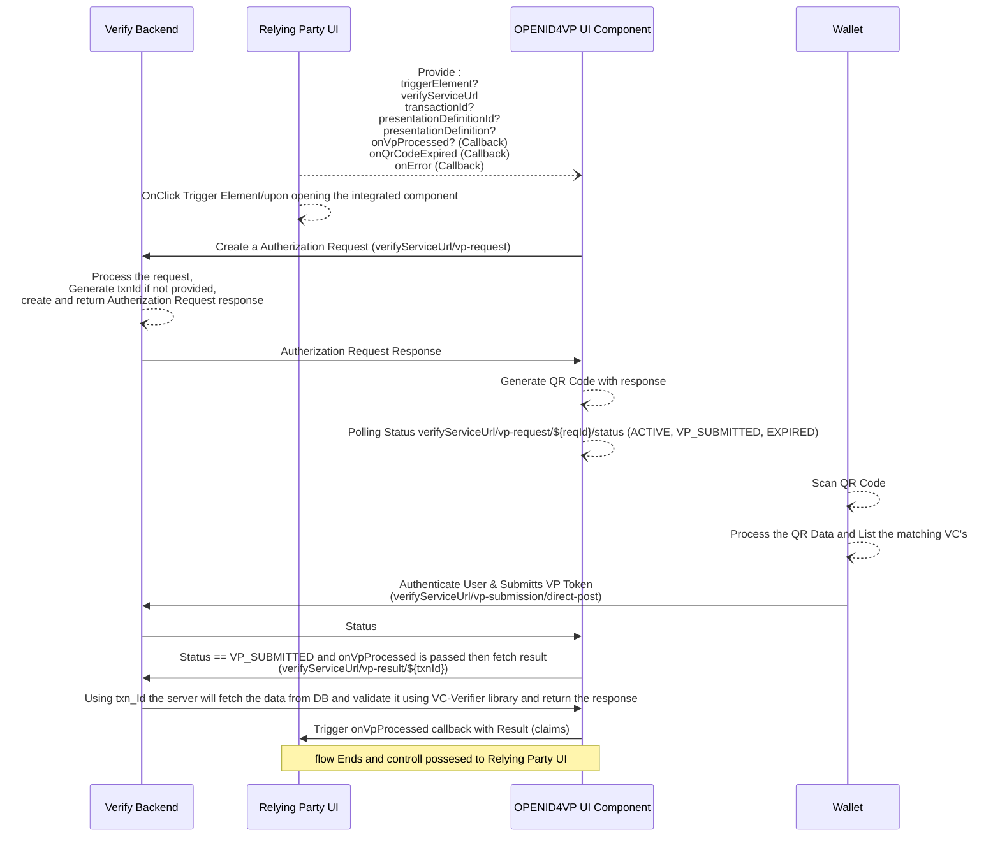
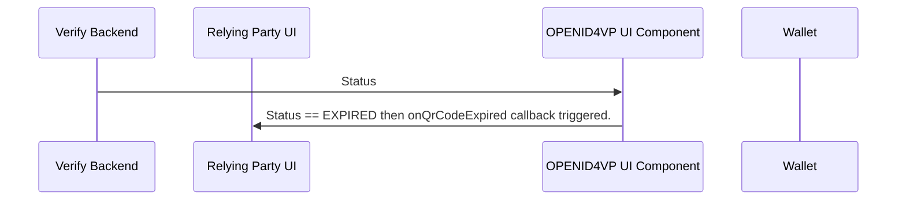
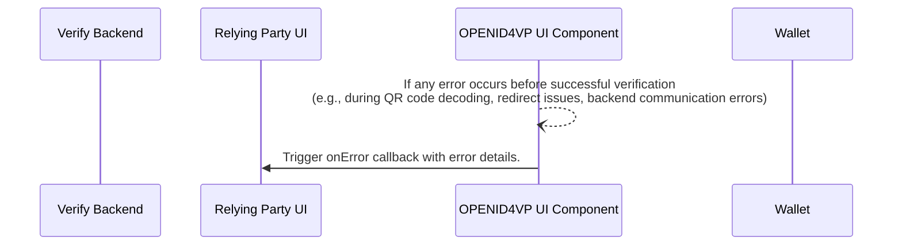
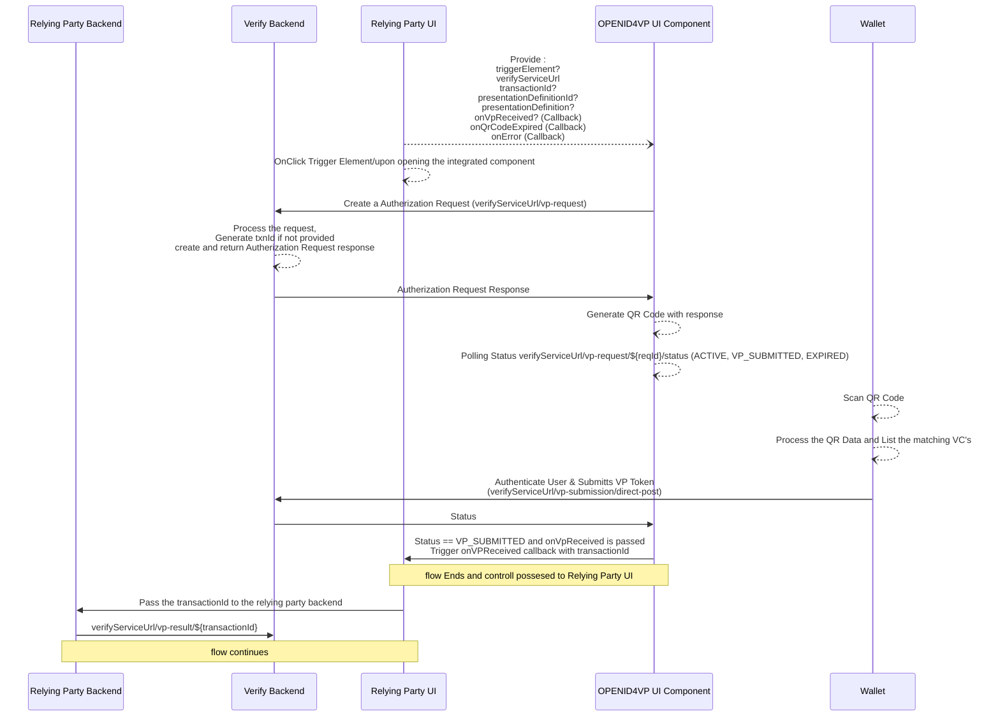
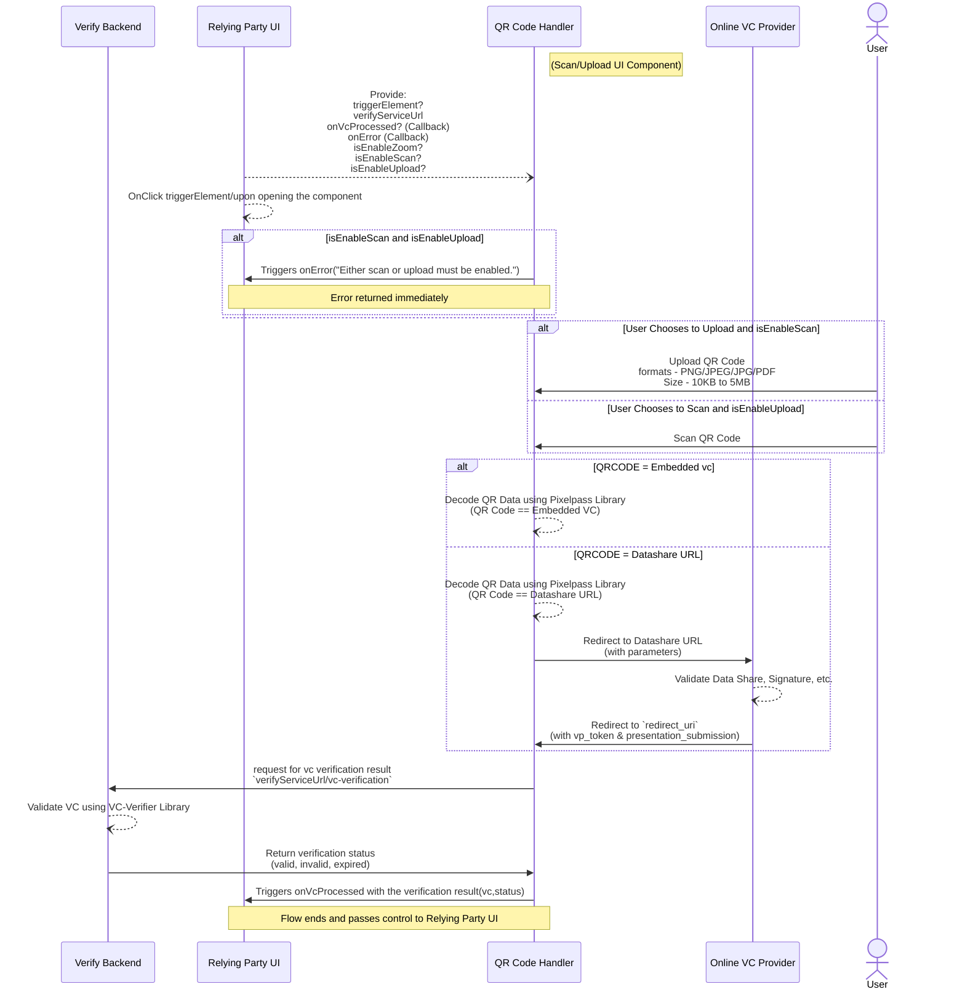
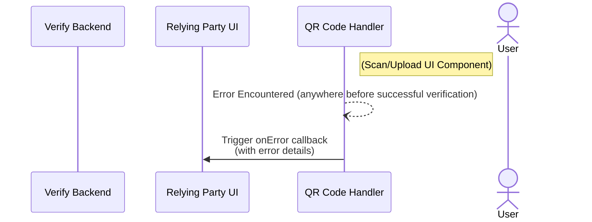
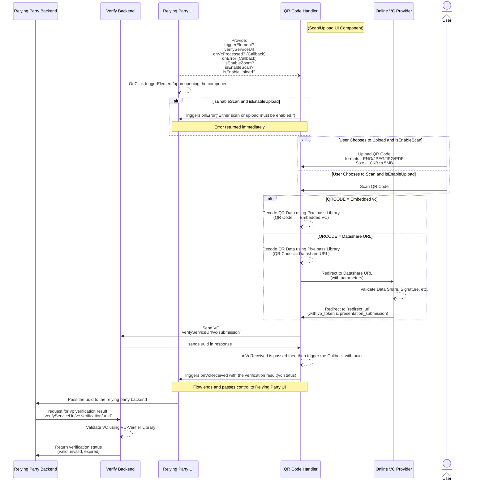

# Inji Verify SDK

### OpenID4VPVerification Component

**The below diagram illustrates the flow in which Relaying party UI is directly fetching the result from verify backend. Which is the current implementation of Inji Verify UI.**



1. **Relying Party UI initiates the process:** The user interacts with the Relying Party's User Interface (UI) and triggers a verification action.
2. **OPENID4VP UI Component communicates with Verify Backend:** Upon the user's action, the Relying Party UI sends a request to Verify Backend. This request contains information needed to initiate the verification.
3. **Verify Backend processes the request:** The Verify Backend receives the request from the UI. It then processes this request. As part of the processing, the Verify Backend creates an Authorization Request.
4. **Verify Backend sends the Authorization Request to the OPENID4VP UI Component:** The generated Authorization Request is then sent back to the Relying Party UI ( OPENID4VP UI Component ).
5. **OPENID4VP UI Component generates a QR Code:** The component receives the Authorization Request and, based on its content, generates a QR code. This QR code will contain information that the user's wallet can scan. The generated QR code is then presented to the user through the Relying Party UI.
6. **OPENID4VP UI Component Starts Status polling a QR Code:** The component starts to poll for the current status of the Authorization request created.
7. **User scans the QR Code with their Wallet:** The user uses their digital wallet application to scan the QR code displayed by the Relying Party UI.
8. **Wallet processes the QR Code and matching VC(s):** The user's wallet application reads the data from the QR code and identifies the Verifiable Credential(s) (VCs) that are relevant to the verification request.
9. **Wallet authenticates the user and submits the VP Token:** The user authenticates themselves within their wallet application. Following authentication, the wallet constructs a Verifiable Presentation (VP) Token containing the necessary VCs and submits it to the Verify Backend (via a direct post to verifyService/vp-submission/direct-post).
10. **Verify Backend sends a Status update to the OPENID4VP UI Component:** Based on the validation result, the Verify Backend sends a status update to the OPENHVP UI Component. This status could indicate success (VP\_SUBMITTED), ongoing processing (ACTIVE), or failure (EXPIRED).
11. **Flow Ends and Control is passed to the Relying Party UI:** The core verification flow concludes, and the Relying Party UI now has the status of the verification.
12. **Relying Party UI passes the transaction result to the Relying Party Backend:** The Relying Party UI communicates the outcome of the verification (including the verifyService/vp-result and potentially the transaction details) to its backend (Relying Party Backend).
13. **Relying Party Backend acts based on the verification result:** The Relying Party Backend receives the verification result and proceeds with the next steps in its application logic based on whether the verification was successful or not.

**The below diagram illustrates the flow in which a authorization request gets expired.**



1. **OPENID4VP UI Component sends a Status update:** The Verify Backend sends a Status update to the OPENID4VP UI Component. At this point, the status is something like EXPIRED or PENDING, indicating that the QR code is currently valid.
2. **Time passes and the QR code expires:** The Verify Backend sends a Status update to the OPENID4VP UI Component. At this point, the status is EXPIRED, indicating that the authorization request is currently expired valid.
3. **OPENID4VP UI Component triggers the** onQrCodeExpired **callback:** Upon detecting the expiration, the OPENID4VP UI Component triggers a callback function onQrCodeExpired .

**The below diagram illustrates the flow in which an error occurs**



1. **An error occurs at OPENID4VP UI Component :** An error occurs at OPENID4VP UI Component due to some response error, exceptions or expected errors.
2. **OPENID4VP UI Component triggers the** onError **callback:** Upon detecting the\
   error, the OPENID4VP UI Component triggers a callback function onError .

**There is an alternate flow available to implement if the Relaying party has a backend and the results needs to be fetched in the backend. The below diagram illustrates the flow in which Relaying party backend is directly fetching the result from verify backend.**



1. **Relying Party UI initiates the process:** The user interacts with the Relying Party's User Interface (UI) and triggers a verification action.
2. **OPENID4VP UI Component communicates with Verify Backend:** Upon the user's action, the Relying Party UI sends a request to Verify Backend. This request contains information needed to initiate the verification.
3. **Verify Backend processes the request:** The Verify Backend receives the request from the UI. It then processes this request. As part of the processing, the Verify Backend creates an Authorization Request.
4. **Verify Backend sends the Authorization Request to the OPENID4VP UI Component:** The generated Authorization Request is then sent back to the Relying Party UI ( OPENID4VP UI Component ).
5. **OPENID4VP UI Component generates a QR Code:** The component receives the Authorization Request and, based on its content, generates a QR code. This QR code will contain information that the user's wallet can scan. The generated QR code is then presented to the user through the Relying Party UI.
6. **OPENID4VP UI Component Starts Status polling a QR Code:** The component starts to poll for the current status of the Authorization request created.
7. **User scans the QR Code with their Wallet:** The user uses their digital wallet application to scan the QR code displayed by the Relying Party UI.
8. **Wallet processes the QR Code and matching VC(s):** The user's wallet application reads the data from the QR code and identifies the Verifiable Credential(s) (VCs) that are relevant to the verification request.
9. **Wallet authenticates the user and submits the VP Token:** The user authenticates themselves within their wallet application. Following authentication, the wallet constructs a Verifiable Presentation (VP) Token containing the necessary VCs and submits it to the Verify Backend (via a direct post to verifyService/vp-submission/direct-post).
10. **Verify Backend sends a Status update to the OPENID4VP UI Component:** Based on the validation result, the Verify Backend sends a status update to the OPENHVP UI Component. This status could indicate success (VP\_SUBMITTED), ongoing processing (ACTIVE), or failure (EXPIRED).
11. **OPENID4VP UI Component triggers 'onProcessed' callback with the result:** When the status indicates VP\_SUBMITTED and the onProcessed callback is passed, the OPENID4VP UI Component triggers this callback, providing the result of the initial submission.
12. **Relying Party UI receives the final result via the 'onProcessed' callback:** The Relying Party UI receives the final verification result through the onProcessed callback, which now includes the validated claims.
13. **Flow Ends and Control is passed to the Relying Party UI:** The complete verification flow concludes, and the Relying Party UI can now use the validated claims to proceed with the application logic.

### Scan/Upload Component

**The below diagram illustrates the flow in which Relaying party UI is directly fetching the result from verify backend. Which is the current implementation of Inji Verify UI.**



1. **Initial Component Trigger and State (Relying Party UI):**

* **Provider triggers component display:** The Relaying Party initiates the process by initializing the QRCodeVerification component. This call includes several parameters:
  * triggerElement: The HTML element that triggers the component.
  * verifyServiceUrl: The backend service URL.
  * onVcReceived: A callback function for when the VC is received.
  * onError: A callback function for error handling.
  * isEnableZoom: A boolean to enable the zoom option.
  * isEnableUpload: A boolean to enable the upload option.
  * isEnableScan: A boolean to enable the scan option.
* **On-click trigger opens component (Relying Party UI):** An onClick event on the Relying Party UI opens the component.

2. **Handling Initial Errors (Relying Party UI):**
   1. **Error returned immediately:** If both isEnableScan and isEnableUpload are enabled (meaning neither scan nor upload is allowed), the component immediately returns an error.
3. **User Interaction and QR Code Handling (User, Relying Party UI, QR Code Handler):**
   1. **User chooses to upload and disable scan:** The User makes a choice within the Relying Party UI to upload a QR code and disables the scan option.
   2. **Upload QR code:** The Relying Party UI then handles the upload of the QR code, specifying accepted formats (PNG, JPEG, JPG, PDF).
   3. **User chooses to scan and disable upload:** Alternatively, the User can choose to scan a QR code and disable the upload option.
   4. **Scan QR Code:** The Relying Party UI proceeds with scanning the QR code.
   5. **QR Code Handler processes:** In both upload and scan scenarios, the QR Code Handler receives the QR code data.
4. **Decoding QR Code Data (QR Code Handler, Online VC Provider):**
   1. **Decode QR data (Embedded VC):** If the QR code contains an embedded Verifiable Credential (VC), the QR Code Handler decodes the QR data using the Pixelpass Library. This results in an embedded VC.
   2. **Decode QR data (Datashare URL):** If the QR code contains a URL for the Online VC Provider, the QR Code Handler decodes the QR data using the Pixelpass Library to extract the Datashare URL.
5. **Interaction with Online VC Provider and Redirection (QR Code Handler, Online VC Provider, Relying Party UI):**
   1. **Redirect to Datashare URL:** If an Datashare URL was obtained, the QR Code Handler redirects to this Datashare URL, passing along relevant parameters.
   2. **Validate data (Online VC Provider):** The Online VC Provider validates data such as the signature.
   3. **Redirect to** redirect\_ur&#x6C;**:** The Online VC Provider then redirects back to a redirect\_url, including the vp\_token and presentation\_submission.
6. **Verification (QR Code Handler,** **Relying Party UI, Verify Backend):**
   1. **Request for VC verification result (QR Code Handler to Verify Backend):** The component requests the Verifiable Credential verification result from the Verify Backend using the decoded VC (verifyServiceUrl/vc-verification).
   2. **Validate VC using VC Verifier Library (Verify Backend):** The Verify Backend validates the Verifiable Credential (VC) using the internal VC Verifier Library.
   3. **Triggers** onVcProcessed **with the verification result (Relying Party UI):** The onVcProcessed callback on the Relying Party UI is triggered with the vc and status.

**The below diagram illustrates the flow in which an error occurs**



1. **Initiation of Scan/Upload UI Component (User, QR Code Handler):**

* **Scan/Upload UI Component:** The User interacts with a "Scan/Upload UI Component." This component is likely facilitated or provided by the QR Code Handler as suggested by the previous diagrams where the QR Code Handler was responsible for scanning/uploading.

2. **Error :**

* **Error Encountered (anywhere before successful verification):** An error occurs at some point in the process _before_ a successful verification can be achieved. This implies that the error can originate from various points:
  * Within the QR Code Handler (e.g., failed scan, invalid QR code format, network issues during OVP URL redirection).
  * Within the Relying Party UI (e.g., issues with component rendering, user input validation failures).
  * During communication between the Relying Party UI and QR Code Handler.
  * During communication between Relying Party UI and Verify Backend, or Relying Party Backend and Verify Backend.

3. **Error Handling and Callback (QR Code Handler, Relying Party UI):**

* **Trigger** onError callback (with error details): When the error is encountered, the component or module where the error occurred is responsible for triggering an onError callback function. This callback is directed towards the Relying Party UI.

**There is an alternate flow available to implement if the Relaying party has a backend and the results needs to be fetched in the backend. The below diagram illustrates the flow in which Relaying party backend is directly fetching the result from verify backend.**



1. **Initial Component Trigger and State (Relying Party UI):**

* **Provider triggers component display:** The Relaying Party initiates the process by initializing the QRCodeVerification component. This call includes several parameters:
  * triggerElement: The HTML element that triggers the component.
  * verifyServiceUrl: The backend service URL.
  * onVcReceived: A callback function for when the VC is received.
  * onError: A callback function for error handling.
  * isEnableZoom: A boolean to enable the zoom option.
  * isEnableUpload: A boolean to enable the upload option.
  * isEnableScan: A boolean to enable the scan option.
* **On-click trigger opens component (Relying Party UI):** An onClick event on the Relying Party UI opens the component.

2. **Handling Initial Errors (Relying Party UI):**
   1. **Error returned immediately:** If both isEnableScan and isEnableUpload are enabled (meaning neither scan nor upload is allowed), the component immediately returns an error.
3. **User Interaction and QR Code Handling (User, Relying Party UI, QR Code Handler):**
   1. **User chooses to upload and disable scan:** The User makes a choice within the Relying Party UI to upload a QR code and disables the scan option.
   2. **Upload QR code:** The Relying Party UI then handles the upload of the QR code, specifying accepted formats (PNG, JPEG, JPG, PDF).
   3. **User chooses to scan and disable upload:** Alternatively, the User can choose to scan a QR code and disable the upload option.
   4. **Scan QR Code:** The Relying Party UI proceeds with scanning the QR code.
   5. **QR Code Handler processes:** In both upload and scan scenarios, the QR Code Handler receives the QR code data.
4. **Decoding QR Code Data (QR Code Handler, Online VC Provider):**
   1. **Decode QR data (Embedded VC):** If the QR code contains an embedded Verifiable Credential (VC), the QR Code Handler decodes the QR data using the Pixelpass Library. This results in an embedded VC.
   2. **Decode QR data (Datashare URL):** If the QR code contains a URL for the Online VC Provider, the QR Code Handler decodes the QR data using the Pixelpass Library to extract the Datashare URL.
5. **Interaction with Online VC Provider and Redirection (QR Code Handler, Online VC Provider, Relying Party UI):**
   1. **Redirect to Datashare URL:** If an Datashare URL was obtained, the QR Code Handler redirects to this Datashare URL, passing along relevant parameters.
   2. **Validate data (Online VC Provider):** The Online VC Provider validates data such as the signature.
   3. **Redirect to** redirect\_ur&#x6C;**:** The Online VC Provider then redirects back to a redirect\_url, including the vp\_token and presentation\_submission.
6. **Verification and Submission (Relying Party UI, Verify Backend, Relying Party Backend):**
   1. **Send VC (Relying Party UI to Verify Backend):** The Relying Party UI sends the Verifiable Credential (VC) to the Verify Backend for verifyServiceUrl/vc-submission
   2. **Sends UUID in response (Verify Backend to Relying Party UI):** The Verify Backend sends a UUID back to the Relying Party UI in response.
   3. **Trigger** onVcReceived **(Relying Party UI):** The onVcReceived callback function on the Relying Party UI is triggered, passing the vc\_status (verification result).
   4. **Flow ends and passes control to Relying Party UI:** The main flow concludes, and control is passed back to the Relying Party UI.
   5. **Pass UUID to Relying Party Backend:** The Relying Party UI passes the received UUID to the Relying Party Backend.
   6. **Request for VP verification result (Relying Party Backend to Verify Backend):** The Relying Party Backend requests the Verifiable Presentation (VP) verification result from the Verify Backend using the UUID (verifyServiceUrl/vc-verification/{uuid}).
   7. **Validate VC using VC Verifier Library (Verify Backend):** The Verify Backendvalidates the Verifiable Credential (VC) using a VC Verifier Library.
   8. **Return verification status (Verify Backend to Relying Party Backend):** Finally, the Verify Backend returns the verification status (e.g., valid, invalid, expired) to the Relying Party Backend.


***

<!-- Hold uptill release

## New Content

## INJI VERIFY SDK

Inji Verify SDK is a library which exposes React components for integrating Inji Verify features seamlessly into any relaying party application.

### Features

* **OpenID4VPVerification** component that creates a QR code and performs the OpenID4VP sharing backend flow. It supports both **Cross-Device** and **Same-Device** flows. OpenID4VP flow can be performed by following the steps provided in [End User Guide](https://mosip.atlassian.net/wiki/spaces/PROD/pages/1297285260)
* **QRCodeVerification** component that allows scanning and uploading images to verify the verifiable credentials. Scan/ Upload flow can be performed by following the steps provided in [End User Guide](https://mosip.atlassian.net/wiki/spaces/PROD/pages/1297285260)

### Local Publishing Guide

Install the dependencies\
npm install

Build the project\
npm run build

Publish the npm package using Verdaccio\
We use [verdaccio](https://verdaccio.org/docs/what-is-verdaccio). npm link or yarn link won't work as we have peer dependencies. Follow the docs to setup Verdaccio. Then run\
npm publish --registry \<http://localhost:\<VERADACCIO\_PORT>>

**Prerequisites**

* Ract Project Setup
* Proper permissions for camera access (mobile/web) (QRCodeVerification)

> **NOTE**\
> The component does not support other frontend frameworks like Angular, Vue, or React Native.\
> The component is written in React + TypeScript

**Backend Requirements**

To use the component, you must host a verification backend that implements the OpenID4VP protocol. This backend is referred to as the inji-verify-service. It also needs to adehere to the OpenAPI spec defined here in case if the backend service is not inji-verify-service.

> ⚠️ Important: The component expects these endpoints to be accessible via a base URL (verifyServiceUrl).\
> Example:\
> If you deploy the inji-verify/verify-service at:\
> ”[https://your-backend.com/v1/verify](https://your-backend.com/v1/verify)”\
> Then use this as the verifyServiceUrl in the component:\
> verifyServiceUrl="[https://your-backend.com/v1/verify](https://your-backend.com/v1/verify)"

> **Note**
>
> * The SDK uses a session-based verification flow internally.
> * Session handling, redirects, and result fetching are managed by the SDK.
> * No manual handling of transactionId or browser storage is required.

### Integration Guide

#### Step 1: Install the Package

```
npm i @injistack/react-inji-verify-sdk
```

#### Step 2: Import & Usage

```
import {
  OpenID4VPVerification,
  QRCodeVerification,
} from "@injistack/react-inji-verify-sdk";
```

#### Step 3: Choose Verification Method

**Option A: QR Code Verification (Scan & Upload)**

```
function MyApp() {
  return (
    <QRCodeVerification
        triggerElement={triggerElement} //UI element used to start verification.
        verifyServiceUrl="https://your-backend.com/v1/verify"
        isEnableScan={false}
        onVCProcessed={(result) => {
            console.log("Verification complete:", result);
            // Handle the verification result here
        }}
        onError={(error) => {
            console.log("Something went wrong:", error);
        }}
        clientId="did:example:123456789" // DID example
    />
  );
}
```

**Option B: OpenID4VP Verification**

```
function MyApp() {
  return (
    <OpenID4VPVerification
        triggerElement={<button>Show QR for Wallet Scan</button>}
        verifyServiceUrl="https://your-backend.com/v1/verify"
        clientId="did:example:123456789" // DID example
        presentationDefinitionId="your-definition-id"
        isSameDeviceFlowEnabled={false} // QR code flow
        onVPProcessed={(result) => {
            console.log("VP processed:", result);
        }}
        onQrCodeExpired={() => {
            console.log(" QR code expired - ask user to retry");
        }}
        onError={(error) => {
            console.error("Verification error:", error);
        }}
    />
  );
}
```

### Verification Response

Once verification is complete, the response depends on the summariseResults attribute (default = true)

If summariseResults = true, the response will be:

**For QRCodeVerification (Upload / Scan):**

```
{
    "verificationStatus":"STATUS"
}
```

**For OpenID4VPVerification:**

```
{
  "vcResults": [
    {
      "vc": { /* Your verified credential data */ },
      "vcStatus": "SUCCESS" // or  "INVALID", "EXPIRED"
    }
  ],
  "vpResultStatus": "SUCCESS" // Overall verification status
}
```

> **Security Recommendation**
>
> Avoid consuming results directly from VPProcessed or VCProcessed.\
> Instead, use VPReceived or VCReceived events to capture the transactionId, then retrieve the verification results securely from your backend's verification service endpoint.\
> This ensures data integrity and prevents reliance on client-side verification data for final decisions.

### Detailed Component Guide

The following sections provide advanced usage and detailed configuration for each component.

> The package should already be installed as described in the Integration Guide.

#### OpenID4VP Verification

This guide walks you through integrating the OpenID4VPVerification component into your React TypeScript project. It facilitates Verifiable Presentation (VP) verification using the OpenID4VP protocol and supports flexible workflows, including client-side and backend-to-backend verification.

**Perfect for:** Integrating with digital wallets

Follow these steps to integrate:

**Import & Usage**

```
import {OpenID4VPVerification} from "@injistack/react-inji-verify-sdk";
```

**1. Cross-device flow (QR code scan from another device)**

```
import { OpenID4VPVerification } from "@injistack/react-inji-verify-sdk";
export default function VerifyCrossDevice() {
    return (
        <OpenID4VPVerification
            triggerElement={<button>Show QR for Wallet Scan</button>}
            verifyServiceUrl="https://your-backend.com/v1/verify"
            clientId="did:example:123456789" // DID example
            presentationDefinition={{
                id: "custom-verification",
                purpose: "We need to verify your identity",
                format: {
                    ldp_vc: {
                        proof_type: ["Ed25519Signature2020"],
                    },
                },
                input_descriptors: [
                    {
                        id: "id-card-check",
                        constraints: {
                            fields: [
                                {
                                    path: ["$.type"],
                                    filter: {
                                        type: "object",
                                        pattern: "DriverLicenseCredential",
                                    },
                                },
                            ],
                        },
                    },
                ],
            }}
            isSameDeviceFlowEnabled={false} // QR code flow
            onVPProcessed={(result) => {
                console.log("VP processed:", result);
            }}
            onQrCodeExpired={() => {
                console.log(" QR code expired - ask user to retry");
            }}
            onError={(error) => {
                console.error("Verification error:", error);
            }}
        />
    );
}
```

&#x20;

**2. Same Device Flow with Mobile Wallet**

Used when a native mobile wallet app is triggered via deep link.

```
import { OpenID4VPVerification } from "@injistack/react-inji-verify-sdk";
export default function VerifySameDevice() {
    return (
        <OpenID4VPVerification
            triggerElement={<button>Verify with Wallet</button>}
            verifyServiceUrl="https://your-backend.com/v1/verify"
            clientId="client-12345" // non-DID example
            presentationDefinition={{
                id: "custom-verification",
                purpose: "We need to verify your identity",
                format: {
                    ldp_vc: {
                        proof_type: ["Ed25519Signature2020"],
                    },
                },
                input_descriptors: [
                    {
                        id: "id-card-check",
                        constraints: {
                            fields: [
                                {
                                    path: ["$.type"],
                                    filter: {
                                        type: "object",
                                        pattern: "DriverLicenseCredential",
                                    },
                                },
                            ],
                        },
                    },
                ],
            }}
            isSameDeviceFlowEnabled={true} //default value
            // No webWalletBaseUrl → triggers mobile wallet via deep link
            onVPProcessed={(result) => {
                console.log("VP processed:", result);
            }}
            onError={(error) => {
                console.error("Verification error:", error);
            }}
        />
    );
}
```

**3. Same Device Flow with Web Wallet**

Used when verification happens in a web-based wallet on the same device.

```
import { OpenID4VPVerification } from "@injistack/react-inji-verify-sdk";
export default function VerifySameDevice() {
    return (
        <OpenID4VPVerification
            triggerElement={<button>Verify with Wallet</button>}
            verifyServiceUrl="https://your-backend.com/v1/verify"
            clientId="did:example:123456789" // DID example
            presentationDefinition={{
                id: "custom-verification",
                purpose: "We need to verify your identity",
                format: {
                    ldp_vc: {
                        proof_type: ["Ed25519Signature2020"],
                    },
                },
                input_descriptors: [
                    {
                        id: "id-card-check",
                        constraints: {
                            fields: [
                                {
                                    path: ["$.type"],
                                    filter: {
                                        type: "object",
                                        pattern: "DriverLicenseCredential",
                                    },
                                },
                            ],
                        },
                    },
                ],
            }}
            isSameDeviceFlowEnabled={true} //default value
            webWalletBaseUrl="https://wallet.example.com" // required to support web-wallets 
            onVPProcessed={(result) => {
                console.log("VP processed:", result);
            }}
            onError={(error) => {
                console.error("Verification error:", error);
            }}
        />
    );
}
```

> **NOTE**
>
> When webWalletBaseUrl is configured, we use web-wallets to support verification flow.\
> In the absence of webWalletBaseUrl, the SDK falls back to a deep link mechanism to launch the native wallet application if any supported mobile wallet is installed.

**4. Server-to-server callback (onVPReceived)**

```
import { OpenID4VPVerification } from "@injistack/react-inji-verify-sdk";
export default function VerifyServerToServer() {
    return (
        <OpenID4VPVerification
            triggerElement={<button>Start Verification</button>}
            verifyServiceUrl="https://your-backend.com/v1/verify"
            clientId="did:example:123456789" // DID example
            presentationDefinition={{
            id: "custom-verification",
            purpose: "We need to verify your identity",
            format: {
                ldp_vc: {
                    proof_type: ["Ed25519Signature2020"],
                },
            },
            input_descriptors: [
                {
                    id: "id-card-check",
                    constraints: {
                        fields: [
                            {
                                path: ["$.type"],
                                filter: {
                                    type: "object",
                                    pattern: "DriverLicenseCredential",
                                },
                            },
                        ],
                    },
                },
            ],
        }}            
            isSameDeviceFlowEnabled={false}
            onVPReceived={(transactionId) => {
                //using the transactionId one can securely fetch the result from service
                console.log("VP received transactionId:", transactionId);
            }}
            onQrCodeExpired={() => {
                console.log("QR code expired");
            }}
            onError={(error) => {
                console.error("Verification error:", error);
            }}
        />
    );
}
```

#### Verification Response

Once VP Verification is complete, the response depends on the summariseResults attribute (default = true)

If summariseResults = true, the response will be:

```
 {
        "vcResults": [
            {
                "vc": { /* verified credential data */ },
                "vcStatus": "SUCCESS" // or  "INVALID", "EXPIRED","REVOKED"
            }
        ],
            "vpResultStatus": "SUCCESS" //  or "INVALID" Overall verification status
    }
```

If summariseResults = false, the response will be:

```
{
    "transactionId": "txn_11",
        "allChecksSuccessful": true,
        "credentialResults": [
        {
            "verifiableCredential": "{...}",
            "allChecksSuccessful": true,
            "holderProofCheck": { "valid": true, "error": null },
            "schemaAndSignatureCheck": { "valid": true, "error": null },
            "expiryCheck": { "valid": true },
            "statusChecks": [
                { "purpose": "revocation", "valid": true, "error": null }
            ],
            "claims": {..}
        }
    ]
}  
```

**Response Fields Summary**

| Property                | Type    | Description                                               |
| ----------------------- | ------- | --------------------------------------------------------- |
| allChecksSuccessful     | boolean | Final aggregated validation flag                          |
| verifiableCredential    | string  | The VC which needs to be verified                         |
| holderProofCheck        | object  | Validates if presenter owns the credential                |
| schemaAndSignatureCheck | object  | Validates schema and signature check                      |
| expiryCheck             | object  | If false, the credential is EXPIRED                       |
| statusChecks            | array   | Contains revocation and other status validations          |
| statusChecks.error      | object  | If present, throws an error instead of returning a status |
| statusChecks.purpose    | string  | Identifies purpose (e.g., "revocation")                   |
| statusChecks.valid      | boolean | If false for revocation → credential is revoked           |
| claims                  | object  | Includes all claims from credentialSubject                |

#### Presentation Definition:

**Define What to Verify:**

> Only one of the following should be provided:

| Prop                     | Description                                         |
| ------------------------ | --------------------------------------------------- |
| presentationDefinitionId | Fetch a predefined definition from the backend      |
| presentationDefinition   | Provide the full definition inline as a JSON object |

**Option 1: Use a predefined template ID**

```
presentationDefinitionId = "drivers-license-check";
```

**Option 2: Define Presentation Definition**

```
presentationDefinition={{
  id: "custom-verification",
  purpose: "We need to verify your identity",
  format: {
    ldp_vc: {
      proof_type: ["Ed25519Signature2020"],
    },
  },
  input_descriptors: [
    {
      id: "id-card-check",
      constraints: {
        fields: [
          {
            path: ["$.type"],
            filter: {
              type: "object",
              pattern: "DriverLicenseCredential",
            },
          },
        ],
      },
    },
  ],
}}
```

> &#x20;

### Option B: QR Code Verification (Scan & Upload)

The QRCodeVerification component enables end-to-end Verifiable Credential (VC) verification using QR codes in Inji-Verify. It supports both camera-based scanning and file upload for QR code verification.

**Perfect for:** Scanning QR codes from documents, or uploading QR codes (PNG, JPEG, JPG, PDF) within the supported size range of 10 KB to 5 MB.

Follow these steps to integrate:

**Import & Usage**

```
import {QRCodeVerification} from "@injistack/react-inji-verify-sdk";
```

**1. Uploading a Verifiable Credential (VC) for verification**

a. Client-side handling (onVCProcessed)

```
function MyApp() {
  return (
  <QRCodeVerification 
      triggerElement={triggerElement} //UI element used to start verification.
      verifyServiceUrl="https://your-backend.com/v1/verify"
      isEnableScan={false}
      onVCProcessed={(result) => {
        console.log("Verification complete:", result);
        // Handle the verification result here
      }}
      onError={(error) => {
        console.log("Something went wrong:", error);
      }}
      clientId="did:example:123456789" // DID example
    />
  );
}
```

b. Server-to-server handling (onVCReceived)

```
function MyApp() {
  return (
  <QRCodeVerification 
      triggerElement={triggerElement}
      verifyServiceUrl="https://your-backend.com/v1/verify"
      isEnableScan={false}
      onVCReceived={(transactionId) => {
          //using the transactionId, one can securely fetch the result from service
          console.log("VC received transactionId:", transactionId);
      }}
      onError={(error) => {
        console.log("Something went wrong:", error);
      }}
      clientId="client-12345" // non-DID example
    />
  );
}
```

> 🔁 **Verification Handling Modes**
>
> **Client-side Handling (**&#x6F;nVCProcessed / onVPProcessed)
>
> * SDK returns verification result directly to frontend
> * Faster and simple
>
> **Server-to-server Handling (**&#x6F;nVCReceived / onVPReceived)
>
> * SDK returns only transactionId
> * Backend fetches result securely

**2. Scanning a Verifiable Credential (VC) Using Device Camera**

a. Client-side handling (onVCProcessed)

```
function MyApp() {
  return (
  <QRCodeVerification
      scannerActive={scannerActive}
      verifyServiceUrl="https://your-backend.com/v1/verify"
      isEnableUpload={false}
      onClose={onClose} // invoked when scanner is closed 
      onVCProcessed={(result) => {
        console.log("Verification complete:", result);
        // Handle the verification result here
      }}
      onError={(error) => {
        console.log("Something went wrong:", error);
      }}
      clientId="did:example:123456789" // DID example
    />
  );
}
```

b. Server-to-server handling (onVCReceived)

```
function MyApp() {
  return (
  <QRCodeVerification
      scannerActive={scannerActive}
      verifyServiceUrl="https://your-backend.com/v1/verify"
      isEnableUpload={false}
      onClose={onClose} // invoked when scanner is closed 
      onVCReceived={(transactionId) => {
          //using the transactionId, one can securely fetch the result from service
          console.log("VC received transactionId:", transactionId);
      }}
      onError={(error) => {
        console.log("Something went wrong:", error);
      }}
      clientId="did:example:123456789" // DID example
    />
  );
}
```

#### Verification Response

Once VC Verification is complete, the response depends on the summariseResults attribute (default = true)

If summariseResults = true, the response will be:

```
{
    "verificationStatus":"STATUS"
}
```

If summariseResults = false, the response will be:

```
{
    "allChecksSuccessful": true, 
    "schemaAndSignatureCheck": { "valid": true, "error": null },
    "expiryCheck": { "valid": true },
    "statusChecks": [
        { "purpose": "revocation", "valid": true, "error": null }
    ], 
    "claims": {...}
}
```

**Response Fields Summary**

| Property                | Type    | Description                                               |
| ----------------------- | ------- | --------------------------------------------------------- |
| allChecksSuccessful     | boolean | Final aggregated validation flag                          |
| schemaAndSignatureCheck | object  | Validates schema and signature check                      |
| expiryCheck             | object  | If false, the credential is EXPIRED                       |
| statusChecks            | array   | Contains revocation and other status validations          |
| statusChecks.error      | object  | If present, throws an error instead of returning a status |
| statusChecks.purpose    | string  | Identifies purpose (e.g., "revocation")                   |
| statusChecks.valid      | boolean | If false for revocation → credential is revoked           |
| claims                  | object  | Includes all claims from credentialSubject                |

### 🎛️ Component Options Reference

#### Common Props (Both Components)

| Property                   | Type          | Required | Description                                 |
| -------------------------- | ------------- | -------- | ------------------------------------------- |
| verifyServiceUrl           | string        | ✅        | Backend verification URL                    |
| onError                    | function      | ✅        | Callback invoked when an error occurs       |
| triggerElement             | React element | ❌        | Custom button/element to start verification |
| transactionId              | string        | ❌        | Optional client-side tracking ID            |
| clientId                   | string        | ✅        | Client identifier (DID or Non-DID)          |
| acceptVPWithoutHolderProof | boolean       | ❌        | Allow unsigned Verifiable Presentations     |
| summariseResults           | boolean       | ❌        | Decides format of SDK Response              |

#### QRCodeVerification Specific

| Property                | Type     | Default | Description                                |
| ----------------------- | -------- | ------- | ------------------------------------------ |
| onVCProcessed           | function | -       | Get full results immediately               |
| onVCReceived            | function | -       | Get transaction ID only                    |
| isEnableUpload          | boolean  | true    | Allow file uploads                         |
| isEnableScan            | boolean  | true    | Allow camera scanning                      |
| isEnableZoom            | boolean  | true    | Allow camera zoom (for mobile and tablets) |
| uploadButtonStyle       | string   | -       | Custom upload button styling               |
| isVPSubmissionSupported | boolean  | false   | Toggle VP submission support               |
| vcVerificationV2Request | object   | -       | contains request body for VC Verification  |

#### OpenID4VPVerification Specific

| Property                 | Type     | Default        | Description                               |
| ------------------------ | -------- | -------------- | ----------------------------------------- |
| protocol                 | string   | "openid4vp://" | Protocol for QR codes (optional)          |
| presentationDefinitionId | string   | -              | Predefined verification template          |
| presentationDefinition   | object   | -              | Custom verification rules                 |
| onVPProcessed            | function | -              | Get full results immediately              |
| onVPReceived             | function | -              | Get transaction ID only                   |
| onQrCodeExpired          | function | -              | Handle QR code expiration                 |
| isSameDeviceFlowEnabled  | boolean  | true           | Enable same-device flow (optional)        |
| qrCodeStyles             | object   | -              | Customize QR code appearance              |
| vpVerificationRequest    | object   | -              | contains request body for VP Verification |

### ⚠️ Important Limitations

* **React Only:** Won't work with Angular, Vue, or React Native
* **Backend Required:** You must have a verification service running

**Related content**


-->


