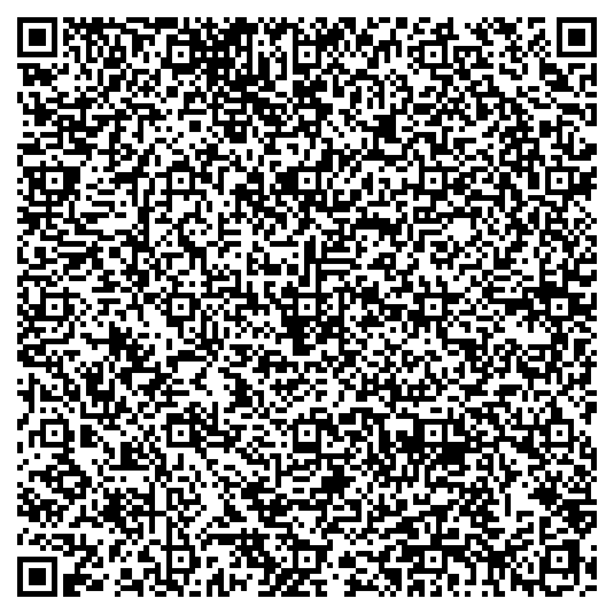

# Inji Verify Setup Guide

Welcome to the Inji Verify Setup Guide tailored specifically for our Collab Environment! This guide is designed to assist you in exploring the [**Inji Verify**](https://docs.mosip.io/inji/inji-verify/overview) portal in our sandbox Collab environment. By following the steps outlined in this guide, you will be able to smoothly utilize the Inji Verify portal, empowering you to explore its features and functionalities effectively. Whether you're a Developer, System Integrator, or an enthusiast eager to dive into the world of verifiable credentials, this guide will provide you with the necessary information to get started with Inji Verify in our [**Collab**](https://collab.mosip.net/) environment. Let's begin this journey of seamless setup and exploration.

### **Explore with mock data** <a href="#explore-with-mock-data" id="explore-with-mock-data"></a>

If you are looking to try out Inji Verify in our Collab environment, please follow the below procedure:

1. To obtain sample verifiable credentials embedded in a QR code, please initiate the process by following the steps to generate the QR code, click [**here**](https://docs.mosip.io/inji/inji-verify/build-and-deploy/creating-verifiable-credentials-and-generating-qr-codes)!
2. To use the QR code with verifiable credentials and test out the Inji Verify application, exploring the scan and upload features, please use the QR codes provided below:

### **Verifiable QR Code - Valid VC**

<div align="left">

<figure><figcaption><p>Valid Verifiable Credentials</p></figcaption></figure>

</div>

### **Sample QR code - Valid VC Data**&#x20;

```json
{
    "credential": {
        "id": "did:cbse:327b6c3f-ce17-4c00-ae4f-7fb2313b0626",
        "type": [
            "VerifiableCredential",
            "UniversityDegreeCredential"
        ],
        "proof": {
            "type": "Ed25519Signature2020",
            "created": "2024-05-16T07:27:43Z",
            "proofValue": "z56crqnnjmvDa46FqmAnVhEttqKtFMTQ1et1mM5dA3WSHtb5ncQ36sS8fG3fxw6dpvtqbqvaE5FzaqwJTBX6dGH3P",
            "proofPurpose": "assertionMethod",
            "verificationMethod": "did:web:Sreejit-K.github.io:VCTest:d40bdb68-6a8d-4b71-9c2a-f3002513ae0e#key-0"
        },
        "issuer": "did:web:Sreejit-K.github.io:VCTest:d40bdb68-6a8d-4b71-9c2a-f3002513ae0e",
        "@context": [
            "https://www.w3.org/2018/credentials/v1",
            "https://sreejit-k.github.io/VCTest/udc-context2.json",
            "https://w3id.org/security/suites/ed25519-2020/v1"
        ],
        "issuanceDate": "2023-02-06T11:56:27.259Z",
        "expirationDate": "2025-02-08T11:56:27.259Z",
        "credentialSubject": {
            "id": "did:example:2002-AR-015678",
            "type": "UniversityDegreeCredential",
            "ChildFullName": "Alex Jameson Taylor",
            "ChildDob": "January 15, 2002",
            "ChildGender": "Male",
            "ChildNationality": "Arandian",
            "ChildPlaceOfBirth": "Central Hospital, New Valera, Arandia",
            "FatherFullName": "Michael David Taylor",
            "FatherDob": "April 22, 1988",
            "FatherNationality": "Arandian",
            "MotherFullName": "Emma Louise Taylor",
            "MotherDob": "June 5, 1990",
            "MotherNationality": "Arandian",
            "RegistrationNumber": "2002-AR-015678",
            "DateOfRegistration": "January 20, 2002",
            "DateOfIssuance": "January 22, 2002"
        }
    },
    "credentialSchemaId": "did:schema:e2e6b5b7-8af7-4018-a472-3f1e396c3c1e",
    "createdAt": "2024-05-16T07:27:43.831Z",
    "updatedAt": "2024-05-16T07:27:43.831Z",
    "createdBy": "",
    "updatedBy": "",
    "tags": [
        "tag1",
        "tag2",
        "tag3"
    ]
}
```

### **Verifiable QR Code - Expired VC**

<div align="left">

<figure><figcaption><p>Expired Verifiable Credentials </p></figcaption></figure>

</div>

### **Sample QR code - Expired VC Data** &#x20;

```json
{
    "id": "did:rcw:ab01ec3f-9f67-4ce8-ade1-8fce82a9bee1",
    "type": [
        "VerifiableCredential",
        "LifeInsuranceCredential",
        "InsuranceCredential"
    ],
    "proof": {
        "type": "Ed25519Signature2020",
        "created": "2024-05-03T12:53:39Z",
        "proofValue": "z4GVSorSVms65uTSLHRdqJB7Km7UuyzGzYbu9uKuwBPRLgHLmBMa8YnBczVh4id2PMsrB31kjCbe6NVLdA9jThURs",
        "proofPurpose": "assertionMethod",
        "verificationMethod": "did:web:challabeehyv.github.io:DID-Resolve:3313e611-d08a-49c8-b478-7f55eafe62f2#key-0"
    },
    "issuer": "did:web:challabeehyv.github.io:DID-Resolve:3313e611-d08a-49c8-b478-7f55eafe62f2",
    "@context": [
        "https://www.w3.org/2018/credentials/v1",
        "https://holashchand.github.io/test_project/insurance-context.json",
        {
            "LifeInsuranceCredential": {
                "@id": "InsuranceCredential"
            }
        },
        "https://w3id.org/security/suites/ed25519-2020/v1"
    ],
    "issuanceDate": "2024-05-03T12:53:39.113Z",
    "expirationDate": "2024-06-02T12:53:39.110Z",
    "credentialSubject": {
        "id": "did:jwk:eyJrdHkiOiJFQyIsInVzZSI6InNpZyIsImNydiI6IlAtMjU2Iiwia2lkIjoic3pGa2cyOVFFalpiQ1VheFRfbFdiZElEU1ZQNWhlREhTeGR6UlhTOW1WZyIsIngiOiJzeVZ2Y2pEX1k0Y0xFS2NUTGR3a1dEWnR1RGpGWGxwcUtLZ2l5TDB2ZUY0IiwieSI6Ii13eGZIMDZRclRCZGljOG1yRDRBM2E0alhGREx1RnlBa0NPMm56Z3BNUGMiLCJhbGciOiJFUzI1NiJ9",
        "dob": "1991-08-13",
        "email": "challarao@beehyv.com",
        "gender": "Male",
        "mobile": "0123456789",
        "benefits": [
            "Critical Surgery",
            "Full body checkup"
        ],
        "fullName": "Challarao V",
        "policyName": "Start Insurance Gold Premium",
        "policyNumber": "1234567",
        "policyIssuedOn": "2023-04-20T20:48:17.684Z",
        "policyExpiresOn": "2033-04-20T20:48:17.684Z"
    }
}
```

### **Verifiable QR Code - Invalid VC**

<div align="left">

<figure><figcaption><p>Invalid Verifiable Credential</p></figcaption></figure>

</div>

### **Sample QR code - Invalid VC Data**&#x20;

```json
{
    "id": "did:cbse:327b6c3f-ce17-4c00-ae4f-7fb2313b0626",
    "type": [
        "VerifiableCredential",
        "UniversityDegreeCredential"
    ],
    "proof": {
        "type": "Ed25519Signature2020",
        "created": "2024-05-16T07:27:43Z",
        "proofValue": "z56crqnnjmvDa46FqmAnVhEttqKtFMTQ1et1mM5dA3WSHtb5ncQ36sS8fG3fxw6dpvtqbqvaE5FzaqwJTBX6dGH3P",
        "proofPurpose": "assertionMethod",
        "verificationMethod": "did:web:Sreejit-K.github.io:VCTest:d40bdb68-6a8d-4b71-9c2a-f3002513ae0e#key-0"
    },
    "issuer": "did:web:Sreejit-K.github.io:VCTest:d40bdb68-6a8d-4b71-9c2a-f3002513ae0e",
    "@context": [
        "https://www.w3.org/2018/credentials/v1",
        "https://sreejit-k.github.io/VCTest/udc-context2.json",
        "https://w3id.org/security/suites/ed25519-2020/v1"
    ],
    "issuanceDate": "2023-02-06T11:56:27.259Z",
    "expirationDate": "2025-02-08T11:56:27.259Z",
    "credentialSubject": {
        "id": "did:example:2002-AR-015678",
        "type": "UniversityDegreeCredential",
        "ChildFullName": "Alex Jameson Taylor",
        "ChildDob": "January 15, 2003",
        "ChildGender": "Male",
        "ChildNationality": "Arandian",
        "ChildPlaceOfBirth": "Central Hospital, New Valera, Arandia",
        "FatherFullName": "Michael David Taylor",
        "FatherDob": "April 22, 1988",
        "FatherNationality": "Arandian",
        "MotherFullName": "Emma Louise Taylor",
        "MotherDob": "June 5, 1990",
        "MotherNationality": "Arandian",
        "RegistrationNumber": "2002-AR-015678",
        "DateOfRegistration": "January 20, 2002",
        "DateOfIssuance": "January 22, 2002"
    }
}
```


Feel free to scan or upload these QR codes to experience the functionality firsthand.


### **Step-by-Step Process** <a href="#step-by-step-process" id="step-by-step-process"></a>

### **Step 1: Access Collab Environment Resources**

* **Launch the link**: [**Collab Environment**](https://collab.mosip.net/)
  * Click the provided link to access the collab environment.

### **Step 2: Launch Inji Verify Portal**

* **Click on the Inji Verify link**:
  * Click the [**Inji Verify Portal**](https://injiverify.collab.mosip.net/) to launch the Inji Verify portal in your browser.

### **Step 3: Exploring Inji Verify Features** <a href="#step-3-exploring-inji-verify-features" id="step-3-exploring-inji-verify-features"></a>

* **Refer to the end-user guide to explore the features of Inji Verify**:
  * Navigate to the [**end-user guide**](https://docs.mosip.io/inji/inji-verify/functional-overview/end-user-guide) page.
* **Scan QR Code Feature :**
  * Use the provided steps to generate a QR code as mentioned above:
    * Utilize this “[**Generate QR Code**](https://docs.mosip.io/inji/inji-verify/build-and-deploy/creating-verifiable-credentials-and-generating-qr-codes)” page to get the QR code to explore the scan feature as per the given instructions in the [**end-user guide**](https://docs.mosip.io/inji/inji-verify/functional-overview/end-user-guide).
  * Use the provided mock data above:
    * Utilize the given QR codes to explore the scan feature of the Inji Verify portal as per the given instructions in the [**end-user guide**](https://docs.mosip.io/inji/inji-verify/functional-overview/end-user-guide).
    * These QR codes contain sample verifiable credentials for testing purposes.
* **Upload QR Code Feature:**
  * Use the provided steps to generate a QR code as mentioned above:
    * Utilize this “[**Generate QR Code**](https://docs.mosip.io/inji/inji-verify/build-and-deploy/creating-verifiable-credentials-and-generating-qr-codes)” page to get the QR code to explore the upload feature as per the given instructions in the [**end-user guide**](https://docs.mosip.io/inji/inji-verify/functional-overview/end-user-guide).
  * Use the provided mock data above:
    * Utilize the given QR codes to explore the upload feature of the Inji Verify portal as per the given instructions in the [**end-user guide**](https://docs.mosip.io/inji/inji-verify/functional-overview/end-user-guide).
    * These QR codes contain sample verifiable credentials for testing purposes.

### **Additional Resources** <a href="#additional-resources" id="additional-resources"></a>

Click [**here**](https://docs.mosip.io/inji/inji-verify/functional-overview/end-user-guide) for detailed information about Inji Verify.

> By following these instructions, you will be equipped to seamlessly set up the Inji Verify portal and effectively verify your Verifiable Credentials.

An informative video of Inji Verify for a visual walk-through of the features will be available soon.

_Thank you. Wishing you a pleasant experience!_
