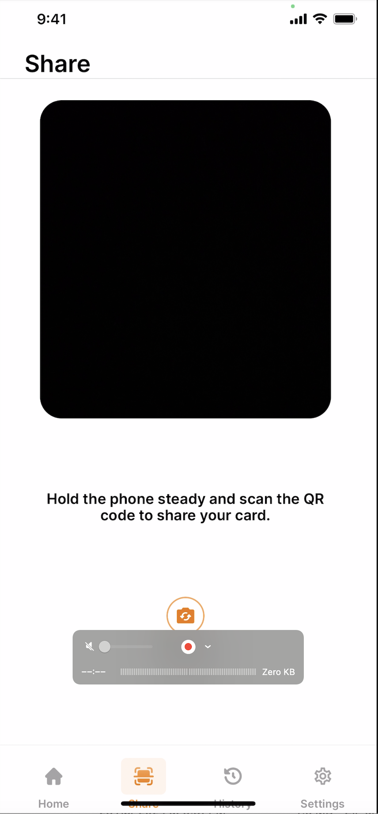
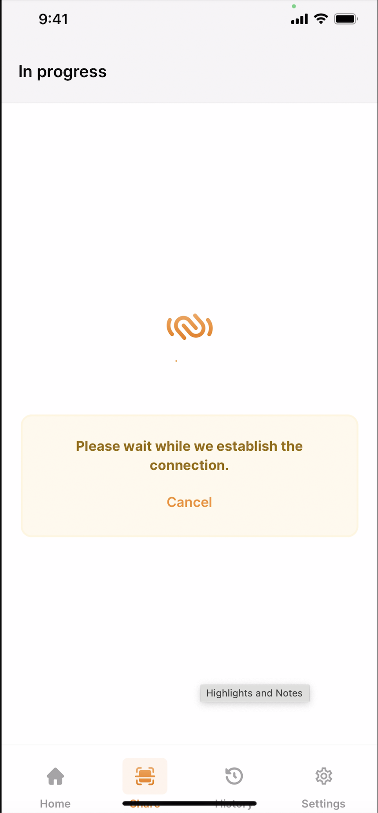
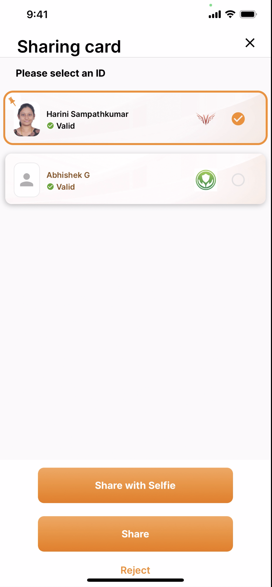
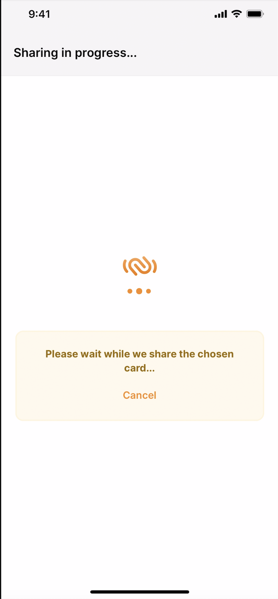
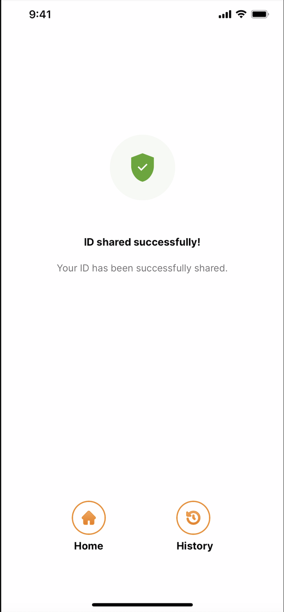
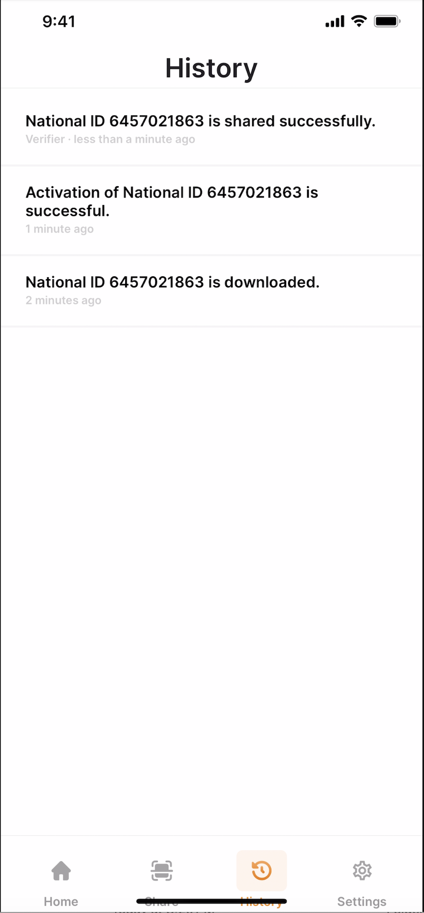
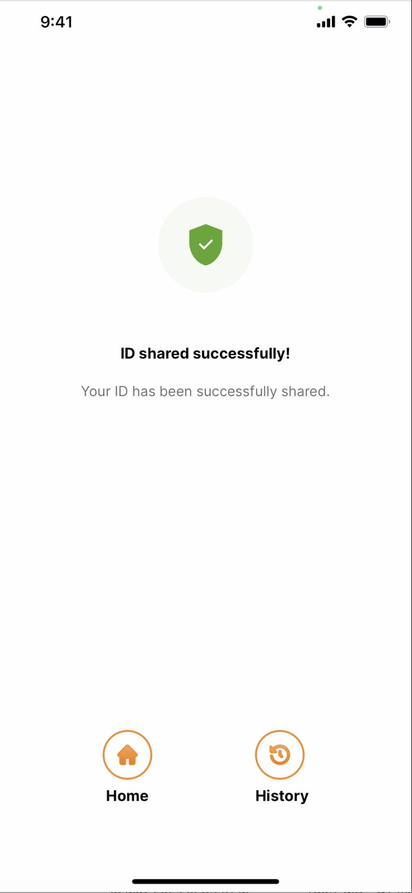

# End User Guide

This document serves as a concise user guide for end users, providing comprehensive information on the features and functionalities offered by Inji Wallet.

## Installing Inji Wallet

The below sections explain the steps for installing the Inji Wallet application on Android and iOS platforms.

#### On Android device

1. To install the Inji Wallet app on an Android smartphone, click [here](https://drive.google.com/drive/folders/1SRHhFxQBNfOc-cdPU8VlKecIdc-WkuGZ) to get the Inji Wallet `apk` file for installation.
2. Transfer the `apk` file onto the smartphone on which it is to be installed.
3. Click on the `apk` file and follow the OS installation instructions.

#### On iOS device

1. Install the test flight app on your device.
2. Follow the steps mentioned [here](https://docs.mosip.io/inji/inji-wallet/sandbox-details/inji-setup-guide#pre-requisites).

The below screenshots explain the next steps after you get access.

<figure><figcaption></figcaption></figure>

 

<figure><figcaption>
Installation of Inji Wallet on iOS mobile device
</figcaption></figure>

 

<figure><figcaption></figcaption></figure>

<figure><figcaption></figcaption></figure>

 

<figure><figcaption>
Installation of Inji Wallet on iOS mobile device
</figcaption></figure>

 

<figure><figcaption></figcaption></figure>

### First launch of the app

* Upon launching the app, the MOSIP logo will be displayed before the language filter appears.
* The chosen language will be reflected within the app interface. Subsequently, a five-page tutorial for the Inji Wallet will be presented, followed by the option to secure the app.
* This can be achieved through a PIN or the device's Biometrics (such as fingerprint or facial recognition). Once the setting is done, users will be directed to the app's home page.

**On Android Device**

<figure><figcaption></figcaption></figure>

 

<figure><figcaption>
First launch on android device
</figcaption></figure>

 

<figure><figcaption></figcaption></figure>

<figure><figcaption></figcaption></figure>

 

<figure><figcaption>
First launch on android device
</figcaption></figure>

 

<figure><figcaption></figcaption></figure>

<figure><figcaption></figcaption></figure>

 

<figure><figcaption>
First launch on android device
</figcaption></figure>

 

<figure><figcaption></figcaption></figure>

<figure><figcaption></figcaption></figure>

 

<figure><figcaption>
First launch on android device
</figcaption></figure>

 

<figure><figcaption></figcaption></figure>

<figure><figcaption></figcaption></figure>

 

<figure><figcaption>
First launch on android device
</figcaption></figure>

 

<figure><figcaption></figcaption></figure>

## Downloading VC

Inji Wallet integrates with eSignet as an authorization layer to perform VC downloads based on OpenID4VCI standards. Let us understand how to download a National ID VC and an Insurance VC into the Mobile Wallet through the below sections:

## Download VC via eSignet

* Download National ID (MOSIP VC)
* Download Insurance VC

### **1. Download National ID (MOSIP VC)**

**Download credentials using UIN / VID**:

* On the home page, a plus "+" symbol will display the list of issuers from which you can download VCs.
* Select the issuer that states **National Identity Department** and choose a credential type (MOSIP National ID). Once clicked, the browser will open and take you to the eSignet page.
* On the authorization page (eSignet page), the user has to enter the UIN / VID and provide the OTP sent to the registered mobile number/email.
* Upon successful validation of OTP, the user will be taken back to the application and land on the loading screen. After the download process is completed, the user will be returned to the home page, where the Downloaded Credential will be available.

<figure><figcaption></figcaption></figure>

 

<figure><figcaption>
Download National ID
</figcaption></figure>

 

<figure><figcaption></figcaption></figure>

<figure><figcaption></figcaption></figure>

 

<figure><figcaption>
Download National ID
</figcaption></figure>

 

<figure><figcaption></figcaption></figure>

<figure><figcaption></figcaption></figure>

 

<figure><figcaption>
Download National ID
</figcaption></figure>

 

<figure><figcaption></figcaption></figure>

<figure><figcaption></figcaption></figure>

 

<figure><figcaption>
Download National ID
</figcaption></figure>

 

<figure><figcaption></figcaption></figure>

### 2. Download Insurance VC

**Download credentials using KBI:**

* A plus "+" symbol on the home page will display the list of issuers from which you can download VCs.
* Select the issuer that states **Veridonia Insurance Company** and choose a credential type (Health Insurance, Life Insurance). Once clicked, the browser will open and take you to the eSignet page.
* On the authorization page (eSignet page), the user has to enter the Policy Number, Full Name, and Date Of Birth(D.O.B).
* Upon successful validation, the user will return to the application and land on the loading screen. Following the completion of the download process, the user will be returned to the home page, where the Downloaded Credential will be available.

<figure><figcaption></figcaption></figure>

 

<figure><figcaption>
Download insurance VC
</figcaption></figure>

 

<figure><figcaption></figcaption></figure>

<figure><figcaption></figcaption></figure>

 

<figure><figcaption>
Download insurance VC
</figcaption></figure>

 

<figure><figcaption></figcaption></figure>

<figure><figcaption></figcaption></figure>

 

<figure><figcaption>
Download insurance VC
</figcaption></figure>

 

<figure><figcaption></figcaption></figure>

<figure><figcaption>
            Download insurance VC   
</figcaption></figure>

 

<figure><figcaption></figcaption></figure>

## Detailed view of the downloaded VC

Once we click on the downloaded VC on the Home Page, the detailed view opens up for the VC.

### Detailed View of National ID VC

Users can see all the details of the National ID in the detailed view. In addition, the user can access the quick access menu (...) on the top right to perform actions such as Pin/Unpin, Share, Share with Selfie, QR Code Login, view Activity Log, and Remove from the detailed view of the VC.

<figure><figcaption>
Detailed view of National ID
</figcaption></figure>

 

<figure><figcaption></figcaption></figure>

### Detailed View of Insurance VC

Users can see all the Insurance policy details in the detailed view along with the QR Code. The QR Code can be magnified which can be presented to the verifier for scanning. Through the quick access menu (...) on the top right user can also perform other actions like Share, Pin, Remove and Activity log on the VC.

<figure><figcaption>
Detailed view of insurance VC
</figcaption></figure>

 

<figure><figcaption></figcaption></figure>

### Viewing the history of the downloaded VC

After completing several scenarios, we can find it by selecting the third icon in the bottom right corner when we navigate to the history page. This page will display a comprehensive list of all the events that have occurred.

<figure><figcaption>
Viewing History
</figcaption></figure>

### Activity Log for a VC:

Users can view the activity logs of a VC from the Home Page or the detailed view by choosing the menu option "View Activity Log" from the quick access menu (...).

<figure><figcaption></figcaption></figure>

 

<figure><figcaption>
Activity Log for a VC
</figcaption></figure>

 

<figure><figcaption></figcaption></figure>

### Sharing Credentials

## Pre-requisites

* Two or more devices with Inji Wallet installed are required for sharing credentials. The relying party's phone should be an Android device.
* All required permissions like Bluetooth, location, and camera access are enabled on both devices.
* The parties involved are usually a Resident (sharing party) who wishes to share their credentials with a Relying party (receiving party), which could be a banker, health worker, or other professional service.

Users can now share their credentials using any of the methods listed below:

1. Share option from the NavBar.
2. Share or Share with Selfie option from the quick access menu (...) from a VC in the **Home Page**
3. Share or Share with Selfie option from quick access menu (...) in **detailed view** of VC.

Let us understand the process of sharing credentials using an example and see the step-wise process for all the above three methods. Suppose a Resident wishes to share their credentials with a Relying/ Requesting party through the receiver's phone, the following steps outline the procedure for both parties involved:

### **Share** **from Share Option in NavBar**

**On the Sharing Party's phone:**

* The resident opens the QR Code Scanner by clicking on the `Share` button in the NavBar. The application now prompts for permissions.
* Upon granting the necessary permissions, the app opens a camera where the resident can scan the QR code of the recipient's (Verifier/Relying Party) phone.
* Once the QR code is successfully scanned, both phones will establish a Bluetooth connection.
* The resident then needs to choose a downloaded VC and select either the Share or the Share with Selfie option.
* The Share button will solely share the VC, while the Share with Selfie option will verify if the sender's face matches the photo in the VC before proceeding to share.

<figure><figcaption></figcaption></figure>

 

<figure><figcaption>
On Resident's wallet
</figcaption></figure>

 

<figure><figcaption></figcaption></figure>

<figure><figcaption></figcaption></figure>

 

<figure><figcaption>
On Resident's wallet
</figcaption></figure>

 

<figure><figcaption></figcaption></figure>

<figure><figcaption></figcaption></figure>

 

<figure><figcaption>
On Resident's wallet
</figcaption></figure>

 

<figure><figcaption></figcaption></figure>

<figure><figcaption>
On Resident's wallet
</figcaption></figure>

**On the Relying Party's phone**

* This functionality is only available on Android devices. To access it, the receiver needs to navigate to the settings page and locate the `Receive Cards` option.
* On selecting this option, it will open the QR code page. For the relying party to be able to receive a card, the resident needs to scan the QR code using a shared phone. Once the QR code is scanned and shared, the relying party will receive the VC and be able to preview its contents.
* To view the received cards, they would need to access the settings page and find the `Received Cards` section. Clicking on this section will display the received cards. If the receiver has not received any card, this section will be empty.
* Please note that the relying party can only view the received cards and will not be able to share or perform other actions with them.

<figure><figcaption></figcaption></figure>

 

<figure><figcaption>
Relying party's device
</figcaption></figure>

 

<figure><figcaption></figcaption></figure>

<figure><figcaption></figcaption></figure>

 

<figure><figcaption>
Relying party's device
</figcaption></figure>

 

<figure><figcaption></figcaption></figure>

### **Share / Share with Selfie from Home Page Quick Access menu**

**On the Sharing Party's phone:**

* The resident clicks on the quick access menu (...) from a VC on the Home Page and chooses the Share or Share with Selfie option from the menu.
* The application now prompts for permissions if not granted already.
* Upon granting the necessary permissions, the app opens a camera where the resident can scan the QR code of the recipient's (Verifier/Relying Party) phone.
* Once the QR code is successfully scanned, both phones will establish a Bluetooth connection.
* The Share button will solely share the VC, while the Share with Selfie option will verify if the sender's face matches the photo in the VC before proceeding to share.

<figure><figcaption></figcaption></figure>

 

<figure><figcaption>
On Resident's wallet
</figcaption></figure>

 

<figure><figcaption></figcaption></figure>

<figure><figcaption></figcaption></figure>

 

<figure><figcaption>
On Resident's wallet
</figcaption></figure>

 

<figure><figcaption></figcaption></figure>

<figure><figcaption></figcaption></figure>

 

<figure><figcaption>
On Resident's wallet
</figcaption></figure>

 

<figure><figcaption></figcaption></figure>

<figure><figcaption>
  On Resident's wallet
</figcaption></figure>

 

<figure><figcaption></figcaption></figure>

**On the Relying Party's phone**:

* This functionality is only available on Android devices. To access it, the receiver needs to navigate to the settings page and locate the `Receive Cards` option.
* On selecting this option, it will open the QR code page. For the relying party to be able to receive a card, the resident needs to scan the QR code using a shared phone. Once the QR code is scanned and shared, the relying party will receive the VC and be able to preview its contents.
* To view the received cards, they would need to access the settings page and find the `Received Cards` section. Clicking on this section will display the received cards. If the receiver has not received any card, this section will be empty.
* Please note that the relying party can only view the received cards and will not be able to share or perform other actions with them.

<figure><figcaption></figcaption></figure>

 

<figure><figcaption>
Relying party's device
</figcaption></figure>

 

<figure><figcaption></figcaption></figure>

<figure><figcaption></figcaption></figure>

 

<figure><figcaption>
Relying party's device
</figcaption></figure>

 

<figure><figcaption></figcaption></figure>

<figure><figcaption>
Relying party's device
</figcaption></figure>

### **Share with a selfie from VC Detailed View Quick Access menu**

**On the Sharing Party's phone**

* The resident clicks on the VC on the Home page and clicks on the quick access menu (...) in the detailed view. Resident can choose either Share or Share with Selfie option from the menu.
* The application now prompts for permissions if not granted already.
* Upon granting the necessary permissions, the app opens a camera where the resident can scan the QR code of the recipient's (Verifier/Relying Party) phone.
* Once the QR code is successfully scanned, both phones will establish a Bluetooth connection.
* The Share button will solely share the VC, while the Share with Selfie option will verify if the sender's face matches the photo in the VC before proceeding to share.

<figure><figcaption></figcaption></figure>

 

<figure><figcaption>
On Resident's wallet
</figcaption></figure>

 

<figure><figcaption></figcaption></figure>

<figure><figcaption></figcaption></figure>

 

<figure><figcaption>
On Resident's wallet
</figcaption></figure>

 

<figure><figcaption></figcaption></figure>

<figure><figcaption></figcaption></figure>

 

<figure><figcaption>
On Resident's wallet
</figcaption></figure>

 

<figure><figcaption></figcaption></figure>

<figure><figcaption>
On Resident's wallet
</figcaption></figure>

**On the Relying Party's phone:**

* This functionality is only available on Android devices. To access it, the receiver needs to navigate to the settings page and locate the `Receive Cards` option.
* On selecting this option, it will open the QR code page. For the relying party to be able to receive a card, the resident needs to scan the QR code using a shared phone. Once the QR code is scanned and shared, the relying party will receive the VC and be able to preview its contents.
* To view the received cards, they would need to access the settings page and find the `Received Cards` section. Clicking on this section will display the received cards. If the receiver has not received any card, this section will be empty.
* Please note that the relying party can only view the received cards and will not be able to share or perform other actions with them.

<figure><figcaption></figcaption></figure>

 

<figure><figcaption>
Relying party's device
</figcaption></figure>

 

<figure><figcaption></figcaption></figure>

<figure><figcaption></figcaption></figure>

 

<figure><figcaption>
Relying party's device
</figcaption></figure>

 

<figure><figcaption></figcaption></figure>

<figure><figcaption>
Relying party's device
</figcaption></figure>

### Pinning a VC

After clicking on the ellipsis button on the downloaded VC, a button will appear allowing for the VC to be pinned. Selecting this option will pin the specific VC to the top of the screen.

<figure><figcaption>
Pinning a VC
</figcaption></figure>

 

<figure><figcaption></figcaption></figure>

<figure><figcaption>
Pinning a VC
</figcaption></figure>

 

<figure><figcaption></figcaption></figure>

### Activating a VC

There are two ways to activate the VC:

* The first option is to click on the "Activate for online login" menu option by clicking on the quick access menu (...) of the card from the Home Page.
* The second option is to click on the "Activate for online login" menu option by clicking on the quick access menu (...) of the card from the detailed view of the VC.
* A confirmation alert message will be prompted upon clicking the "Activate for online login" option. Once permission is granted, the user will be directed to an OTP screen. After entering the correct OTP, the VC will be activated and projected on the screen with the same message.

<figure><figcaption>
Activating a VC
</figcaption></figure>

 

<figure><figcaption></figcaption></figure>

<figure><figcaption></figcaption></figure>

 

<figure><figcaption>
Activating a VC
</figcaption></figure>

 

<figure><figcaption></figcaption></figure>

### Deleting a VC

There are two ways to remove/delete a VC from the wallet:

* The first option is to click on the Remove from Wallet menu option from the quick access menu (...) of the card from the Home Page.
* The second option is to choose the Remove from Wallet menu option from the quick access menu (...) of the card from the detailed view of the VC.
* Upon clicking this option, the user will be prompted with a pop-up for confirmation. If the user chooses, “Yes, I confirm” the VC will be removed from the wallet.

<figure><figcaption>
Deleting a VC
</figcaption></figure>

 

<figure><figcaption></figcaption></figure>

<figure><figcaption>
Deleting a VC
</figcaption></figure>

 

<figure><figcaption></figcaption></figure>

## Search

Users can now search for a VC by providing a search string in the search bar. VCs that match the search criteria will be displayed.

<figure><figcaption>
Search for a VC
</figcaption></figure>

 

<figure><figcaption></figcaption></figure>

<figure><figcaption>
Search for a VC
</figcaption></figure>

 

<figure><figcaption></figcaption></figure>

## Data backup and restore

### Backup

To backup VCs, the user has to choose their preference for the cloud based on the device they are using.

1. Firstly, the user has to go to settings and click on the Backup and Restore menu options.
2. The User should consent for the app to use the drive, and once consented, the application displays a backup and restore screen.
3. In this screen, the user can manually take a backup by clicking on the Backup button and this asynchronously happens allowing the user to use the application.
4. Users will be notified of success or failure.

### Data backup - Android

<figure><figcaption>
Data Backup on Android
</figcaption></figure>

<figure><figcaption>
Data Backup on Android
</figcaption></figure>

### Data backup- ios

<figure><figcaption></figcaption></figure>

 

<figure><figcaption>
Data backup on iOS
</figcaption></figure>

 

<figure><figcaption></figcaption></figure>

<figure><figcaption></figcaption></figure>

 

<figure><figcaption>
Data backup on iOS
</figcaption></figure>

 

<figure><figcaption></figcaption></figure>

### Restore

To restore backed-up VCs, the user has to choose their preference of the cloud based on the device and use the same Google/apple ID that they used for taking backups.

1. Firstly, the user has to go to settings and click on the Backup and Restore menu options.
2. The user should consent for the app to use the drive, and once consented, the application displays a backup and restore screen.
3. Users find the details of latest backup details in the Last Backup Details section.
4. In this screen, the user can manually restore a backup by clicking on the Restore button and this asynchronously happens allowing the user to use the application.
5. Users will be notified of success or failure.

### Restore - Android

<figure><figcaption>
Restore on Android
</figcaption></figure>

### Restore - ios

<figure><figcaption>
Restore on iOS
</figcaption></figure>
