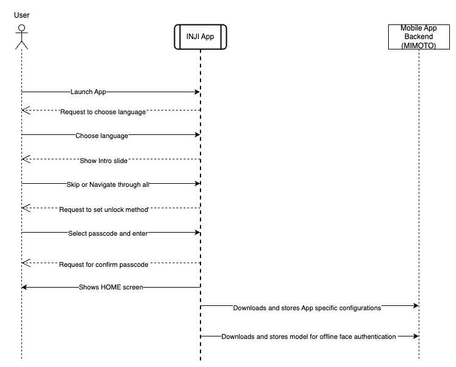
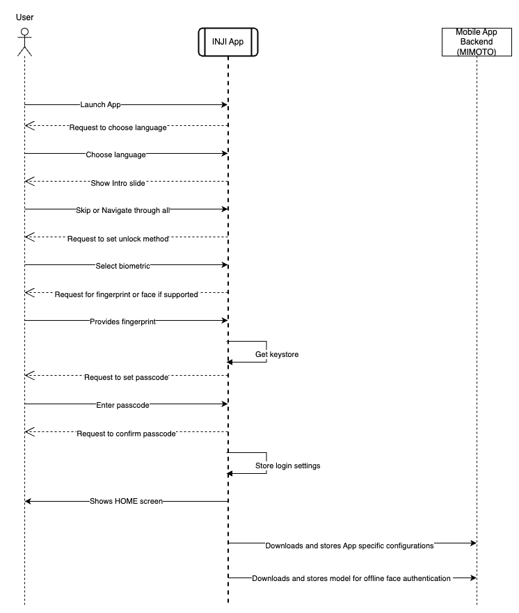

# Workflow

This document delineates the workflow for essential functionalities of Inji Wallet.

### 1. First App Launch

After installing the application for the first time, the user will be asked to set up unlock method for it. The app supports biometric or PIN-based locks. For more details, refer to the [End User Guide](end-user-guide.md).

#### Launch with passcode unlock method

<figure><figcaption></figcaption></figure>

#### Launch with biometric unlock method

<figure><figcaption></figcaption></figure>

### 2. Downloading, Verifying and storing credentials

Residents have the ability to download a Verifiable Credential (VC) for themselves, their family members, or friends using a single mobile device. This can be done through two methods:

While downloading the VCs, the credentials are validated and verified for the authenticity of the issuer using the signature and the proof type provided in the VC.

* Downloading VC using OpenID for VC Issuance Flow (eSignet)

#### Download via eSignet

Below sections are going to detail as how Inji Wallet as an OIDC client to OpenID4VCI method of downloading a VC and illustrated implementations.

**Download credentials using UIN / VID**:

This method of VC download illustrates the **OpenID4VCI** method of download using UIN / VID issued to the resident. In this, eSignet plays the authentication and authorisation end point to connect to the credential provider (Reference Implementation: MOSIP). To understand more about Onboarding Mimoto (Inji BFF) as an OIDC client to support credential issuance from any issuer who support OpenID4VCI protocol refer [here](https://docs.mosip.io/inji/inji-mobile-wallet/customization-overview/credential\_providers).

**Download credentials using Knowledge Based Identification (KBI)**

This method of VC download illustrates the **OpenID4VCI** method of download using KBI (Knowledge Based Identification). In this, eSignet plays the authentication, authorisation and credential issuance end point to connect to the credential provider. To understand more about Onboarding Mimoto (Inji BFF) as an OIDC client to support credential issuance from any issuer who supports **OpenID4VCI** protocol, refer [here](https://docs.mosip.io/inji/inji-mobile-wallet/customization-overview/credential\_providers).

<figure><figcaption></figcaption></figure>

**Appendix**:

* The term “identifier” in the architecture diagram refers to the unique identifier which can be used to download the credential on the esignet login Page
* eSignet supports Various types of authorizations, ACR value is configured based on the Issuers' need to include the authorization mode in the authorization page
* Types of Authorization Supported for Credential Download by eSignet are:
  *   **Login With OTP**: Credential download using OTP Based authentication to authorize the user

      **Illustrated Implementation**: National ID credentials download
  *   **Login With KBI**: Credential download using KBI to authorize the user. The knowledge (as described by the credential issuer to authorize) is exposed to eSignet from Registry (Issuer) through eSignet Issuance Plugins

      **Illustrated Implementation**: Insurance ID credentials download

### 3. Sharing of credentials

The credentials are shared in a peer-to-peer model with the verifier application. The data exchange between devices is done using the BLE Protocol. For more information, refer to [Tuvali](../technical-overview/integration-guide/tuvali/) documentation.

<figure><figcaption></figcaption></figure>

### 4. QR code login process

* Residents can use Inji Wallet to log in to any service provider app (integrated with e-Signet) by just scanning a QR code from their portal.
* The app performs offline face auth after scanning the QR code to verify the user's presence.
* Once the presence is verified, the resident is given the option to choose the optional information to be shared with the service provider portal.
* After consent is provided, the app sends a WLA (Wallet local auth) token which is a JWT token to the relying party.
* The resident is then given the access to the portal after the token verification.

#### Step 1: VC activation process

 

<figure><figcaption></figcaption></figure>

#### Step 2: QR code login

<figure><figcaption></figcaption></figure>

### 5. Data backup and restore

From Settings screen, users can access Backup settings screen. In Backup settings screen, users can configure their preferences for data backup. The setting, configured once during the application's lifecycle, determines whether Google Drive or iCloud will be utilized based on the device platform. To restore backup data to the mobile wallet, users must log in to the same account and configure settings within the app accordingly. Additionally, restored Verifiable Credentials (VCs) should be re-activated to enable QR Code login functionality.

<figure><figcaption></figcaption></figure>

<figure><figcaption></figcaption></figure>
