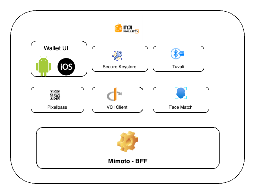

# Components

Inji Wallet utilizes multiple libraries to provide a seamless experience.

These libraries are accessible as NPM modules, allowing seamless integration with other mobile wallets.

The libraries are as follows:

1. Tuvali - Sharing via BLE
2. Face Match
3. Secure Keystore
4. BLE Verifier
5. PixelPass
6. VCI-client
7. Telemetry (coming soon)

<figure><figcaption></figcaption></figure>

### **1. Tuvali - Sharing via BLE**

* The transfer of downloaded Verifiable Credential from the Wallet to Verifier is facilitated by a React Native library named Tuvali.
* [Tuvali](https://github.com/mosip/tuvali) enables offline VC transfer between mobile devices via Bluetooth Low Energy (BLE).\
  \
  The below table represents the supported roles for Android and iOS devices.

<table><thead><tr><th width="134">Wallet</th><th width="131">Verifier</th><th>VC transfer support</th></tr></thead><tbody><tr><td>Android</td><td>Android</td><td>Yes</td></tr><tr><td>iOS</td><td>Android</td><td>Yes</td></tr><tr><td>Android</td><td>iOS</td><td>No</td></tr><tr><td>iOS</td><td>iOS</td><td>No</td></tr></tbody></table>

* Tuvali is actively developed and maintained by MOSIP.
* It does not support iOS for initiating the BLE exchanges, hence preventing two iOS devices from transferring VC.


Note:

* To learn more about Tuvali's implementation, refer [here](https://docs.mosip.io/inji/integration-guide/tuvali).
* For information on Tuvali's permissions and requirements, refer [here](https://docs.mosip.io/inji/integration-guide/tuvali/tuvali-requirements).
* To understand Tuvali and Inji Wallet integration, along with API documentation, refer[ here](https://docs.mosip.io/inji/integration-guide/tuvali/tuvali-inji).
* To check the NPM module, click [here](https://www.npmjs.com/package/@mosip/tuvali).
* Maven snapshots are available [here](https://oss.sonatype.org/content/repositories/snapshots/io/mosip/tuvali/)


### **2. Face Match**

The face matcher SDK internally implements native functionalities for Android and iOS, utilizing [Tensorflow](https://www.tensorflow.org/) and [Google ML Kit](https://developers.google.com/ml-kit) to identify faces.

This SDK internally employs a `tflite` model, which must be created by the integrating party. The model, trained using resident faces, is stored on the MOSIP file server. Inji Wallet currently utilizes the face matcher SDK (soon to be replaced by the NPM module) for offline face authentication.

The SDK is employed in two scenarios:

**During Offline VC Sharing**: Residents can perform selfie authentication before sharing the VC with the relying party. The app opens the camera, allowing residents to take a selfie, which is then validated against the VC image to verify the resident's presence.\
\
**During Online Login**: Residents can scan the QR code from the relying party portal and opt to log in using Inji Wallet for services. In this process, residents undergo selfie authentication against the VC to confirm their presence.

Upon the initial launch of Inji Wallet, the model is downloaded in the background and stored in the cache. Refer [here](integration-guide/face-match.md) to check the API specifications for the face matcher model.

### **3. Secure Keystore**

The [secure-keystore](https://github.com/mosip/secure-keystore) library is designed for the purpose of creating and storing key-pairs in the hardware keystore of Android devices. The library also supports encryption, decryption, and HMAC calculation functionalities.

It also helps to sign with aliases, created as part of key pair generation.

As the description says, this module is only for Android devices which support hardware keystore.

This library is available as Kotlin artefact in maven as well as npm module for react native application. Inji Wallet is integrated with the kotlin artefact of secure-keystore.

In order to reduce the key size during credential download request, Inji Wallet is using RSA-2048 instead of RSA-4096 bits keys.

To check all the APIs supported by this module, refer [here](../../technical-overview/components.md).


Note:

* This feature is exclusive to the Android operating system.
* It is only compatible with devices that have a hardware keystore.
* To understand about the library and the API documentation, refer [here](integration-guide/secure-keystore.md).
* To check the NPM module, click [here](https://www.npmjs.com/package/@mosip/secure-keystore).
* Maven snapshots are available [here](https://oss.sonatype.org/content/repositories/snapshots/io/mosip/secure-keystore/)


### **4. BLE Verifier**

The [BLE Verifier](https://github.com/mosip/ble-verifier-sdk/tree/develop) is the module built for verifiers for receiving VC via BLE. This is a wrapper built on Tuvali with simplified APIs.

To know more about API and how to integrate, refer [here](integration-guide/ble-verifier.md).


Note:

* To check the NPM module, click [here](https://www.npmjs.com/package/@mosip/ble-verifier-sdk).


### 5. PixelPass

The PixelPass library offers a powerful solution for creating and decoding QR codes for Verifiable Credentials (VCs). It is designed to optimize the size of the data encoded within a QR code, making it easier to store and share credential information. The library achieves this by utilizing advanced compression and encoding techniques, ensuring smaller QR codes that maintain the integrity and security of the data.

PixelPass uses zlib compression with a level 9 setting, which significantly reduces the data size before encoding. It then applies base45 encoding to further compress the data into a QR code-friendly format. Additionally, the library can decode any QR code data previously encoded using its own compression and encoding algorithms, ensuring seamless interoperability.

Additionally, for a JSON data, the library employs CBOR encoding and decoding to minimize the size even further. When a JSON Mapper similar to [Claim 169](https://docs.mosip.io/1.2.0/overview/standards-and-specifications/169-qr-code-specification) is provided, PixelPass maps the data, applies CBOR encoding/decoding, and compresses the data, achieving maximum size reduction. Developed and maintained by MOSIP, PixelPass is continually updated to provide reliable and efficient QR code generation and decoding capabilities.


Note:

* Refer to the PixelPass repository [here](https://github.com/mosip/pixelpass/tree/develop/js#readme).
* To understand about the installation and the API documentation, refer [here](integration-guide/pixelpass.md).
* For a hands-on experience of Generate a VC, Generate QR Code for the VC and Verify the same using Inji Verify, please click [here](https://docs.mosip.io/inji/inji-verify/build-and-deploy/creating-verifiable-credentials-and-generating-qr-codes).
* To check the NPM module, click[ here](https://www.npmjs.com/package/@mosip/pixelpass).
* Maven snapshots are available [here](https://oss.sonatype.org/content/repositories/snapshots/io/mosip/pixelpass/)


### **6. VCI-client**

VCI-Client library carries out the credential request from the consumer application (mobile wallet or web) and redirects the issuance/issuer. The library creates a request with the credential format, jwtproof of the wallet, issuer meta data and the access token received for authorization and provides VC as the response back to the consumer application for storage.


Note:

* Refer to the VCI-Client repository [here](https://github.com/mosip/inji-vci-client/blob/develop/README.md).
* To understand about the installation and the API documentation, refer [here](https://docs.mosip.io/inji/inji-mobile-wallet/integration-guide/vci-client).
* To check the NPM module, click [here](https://www.npmjs.com/package/@mosip/inji-vci-client).
* Maven snapshots are available [here](https://oss.sonatype.org/content/repositories/snapshots/io/mosip/inji-vci-client/)


### **7. Telemetry**

The [telemetry](https://github.com/mosip/sunbird-telemetry-sdk) module is derived from the [sunbird telemetry](https://github.com/project-sunbird/sunbird-telemetry-sdk) module. It is responsible for generating events that can provide valuable analytics.

_**Note**_: _The publication of this project is currently a work in progress and has not been released yet. Stay tuned for further announcements!_

> To know more about each of these, refer [Integration Guides](https://docs.mosip.io/inji/integration-guide).
