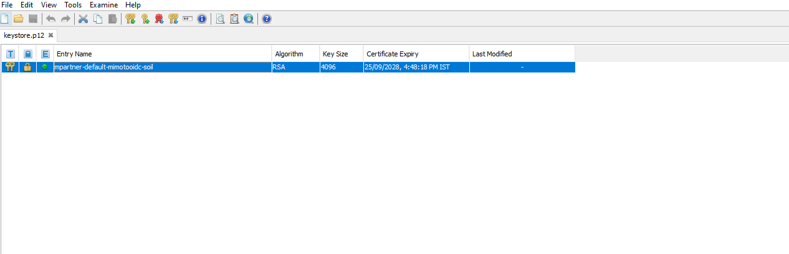
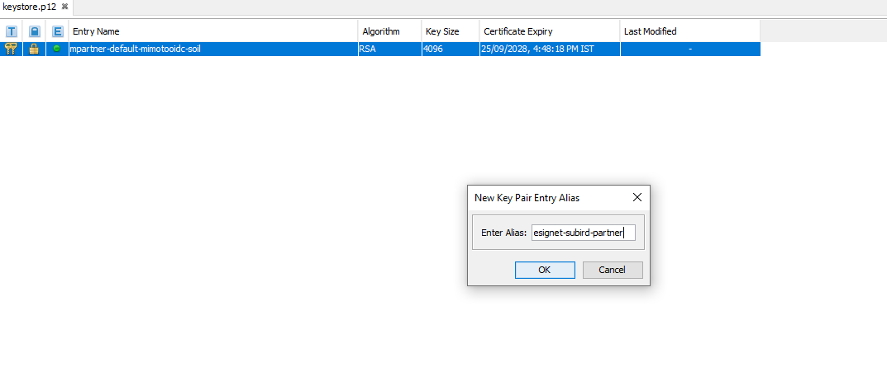

# Credential Providers

Inji Wallet currently provides support for following credential providers:

**Download VC using OpenID for VC Issuance Flow**

* National ID
* Insurance

To set up a new provider that can issue VC, it can be accomplished by making a few configuration changes.


**Steps:**

1. The configuration details can be found in the `mimoto-issuers-config.json` property file. This file is maintained separately for each deployment environment. In this repository, each environment's configuration is stored in a dedicated branch specific to that environment.

> Refer to [mimoto-issuers-config.json](https://github.com/mosip/inji-config/blob/collab/mimoto-issuers-config.json) of Collab environment.

These values will be used by Inji Wallet via Mimoto. Mimoto exposes APIs which is used by the Inji Wallet application to fetch, store the issuers and their configurations in the local storage.

* API used to fetch issuers: `https://api.collab.mosip.net/v1/mimoto/issuers`

2. In `mimoto-issuers-config.json`, new providers can be added as per the `well-known` schema defined by OpenID4VCI standards.

After adding the provider in configuration, it will be displayed on the UI on `Add new card` screen.

* If new provider supports [OpenID4VCI](https://openid.net/specs/openid-4-verifiable-credential-issuance-1_0.html) protocol, it is recommended to use `issuerMachine.ts` for workflow to download VC.

3. At present, Inji Wallet supports verification of VCs which has RSA proof type. If VC is issued with any other proof type, VC verification is bypassed and it is marked as verified.
4. Token endpoint should also use same issuer id. Refer https://github.com/mosip/inji-config/blob/collab/mimoto-issuers-config.json#L140
5. Once the above steps are completed, mimoto should be onboarded as an OIDC client for every issuer. Please check the steps in the below sections.

### **Onboarding Mimoto as OIDC Client for a new Issuer:**

#### Use mock data from collab sandbox env

If you are looking to try out wallet and certify building locally, then you can use collab env eSignet as authorization server. Here are the details:

1. We have configured few UINs/Individual Ids to use. These UINs can be used while configuring the data for credential. (**Few Demo UINs you can use)**:

<table><thead><tr><th width="322">Type</th><th>UIN</th></tr></thead><tbody><tr><td>Male (Adult) </td><td>2154189532 , 5614273165</td></tr><tr><td>Female (Adult)</td><td>2089250384 , 5860356276</td></tr><tr><td>Minor (aged btw 5-18yrs)</td><td>3963293078</td></tr><tr><td>Infant (aged below 5 yrs)</td><td>5134067562</td></tr></tbody></table>

2. Use `wallet-demo` as client id in `mimoto-issuers-config.json`
3. Use `wallet-demo-client` as client alias in `mimoto-issuers-config.json`
4. oidckeystore.p12 file is attached [**here**](../../../../.gitbook/assets/oidckeystore.p12) password to unlock this is `xy4gh6swa2i`
5. authorization server to use in `well-known` is `https://esignet-mock.collab.mosip.net`

After configuring issuers and data as mentioned above, we will be able to successfully authenticate through esigent and download credential in wallet.

#### Create new client-id and onboard mimoto as OIDC client

**Step 1:**

Please find a zip file attached to this document called certgen.zip which will help the user in creating the p12 file as well as the public-key.jwk file.




**Step 2:**

The Userguide.md file explains the working of the script.

**Step 3:**

Create a client ID using the Esignet API which is mentioned below:

```js
RequestURL : {{ESIGNET-URL}}/v1/esignet/client-mgmt/oidc-client
```

**Sample Request Body:**

```js


{
  "requestTime": "2024-06-19T11:56:01.925Z",
  "request": {
    "clientId": "client-id", #ClientId can be given as per user choice
    "clientName": "client-name", #ClientName can be given as per user choice and this name shows on the UI
    "publicKey": "public-key" #This public key you can get from the script results ,
    "relyingPartyId": "client-id", #This value can be same as clientId
    "userClaims":  [       #Claims Section defines the different attributes of User Data taht is accessible to the OIDC client
            "birthdate",
            "address",
            "gender",
            "name",
            "phone_number",
            "picture",
            "email",
            "individual_id"
        ],
    "authContextRefs":  [ #ACR values define the various ways a user can login e.g through INJI,using Bioemtrics and Throguh OTP
            "mosip:idp:acr:linked-wallet",
            "mosip:idp:acr:biometrics",
            "mosip:idp:acr:knowledge",
            "mosip:idp:acr:generated-code"
        ],
    "logoUri": "logourl" #This is logo url which is displayed on UI,
    "redirectUris": [ "io.mosip.residentapp.inji://oauthredirect", http://injiweb.collab.mosip.net/redirect"],#These are the redirectUris for Inji wallet mobile and web both
    "grantTypes": [
      "authorization_code"
    ],
    "clientAuthMethods": [
      "private_key_jwt"
    ]
  }
}

```

**Sample Response :**

```js

{
    "responseTime": "2024-11-13T08:16:42.259Z",
    "response": {
        "clientId": "client-id",
        "status": "ACTIVE"
    },
    "errors": []
}

```


1. Clients can get renewed by demand, but that mean some manual changes are required. It is always recommended to create a client once per environment as it has no expiry. Also note that one public key and p12 file pair can be used only once . ( Unless removed from DB )
2. The install.sh script in mimoto as well as the helm charts inside mimoto repo were changed to allow for the storage and mounting of the oidckeystore.p12 file


**Step 4:**

The logo URL should be uploaded to file server.


For Onboarding any new issuer, Step 1 to 4 has to be followed and p12 has to be generated.


**Step 5:**

Once p12 file is generated, existing keystore file has to be exported from mimoto pod and newly created p12 file has to be imported and remounted in the Mimoto pod.

**Step 6:**

Once mimoto is added as an OIDC client, the new issuer should be added as a partner to mimoto.

### **Using MOSIP services to issue MOSIP Credential:**

1. Create a partner - following is the process of adding a new partner by the name of “esignet--partner “ onto mimoto. Refer [here](https://docs.mosip.io/1.2.0/partners#partner-onboarding) to create a partner and onboard the partner in MOSIP Ecosystem.


We already have a p12 file on the mimoto pod (as explained in above section), we are not replacing or creating a second p12 file, We are only adding another key to the key-store already present.


1. Add this newly created partner into existing keystore - download the existing p12 file from the mimoto pod using this command from the environment's terminal:

```js
kubectl -n mimoto cp <mimoto-podname>:certs/..data/oidckeystore.p12 oidckeystore.p12
```

2. Add the esignet--partner's key as alias “esignet--partner“ onto the same p12 file using a tool like keystore-explorer. Use the password used while generating p12 file

<figure><figcaption><p>Original p12 file as downloaded from environment</p></figcaption></figure>

<figure><figcaption><p>Importing a new keypair</p></figcaption></figure>

3. The below image shows how to browse and select the client-id’s oidckeystore as the second alias. in the decryption password field should have the password of the p12 file. Note: we have used `esignet-sunbird-partner` as client id for reference in the attachment

<figure><figcaption><p>Selection of OIDC Keystore</p></figcaption></figure>

4. The below image shows how to add an alias for the new key pair, here the value is esignet-sunbird-partner.

<figure><figcaption><p>Alias for the new keypair</p></figcaption></figure>

<figure><figcaption><p>Add keypairs to keystore.p12</p></figcaption></figure>

5. To take a backup of the original keystore.p12 use the following command

```js
kubectl -n mimoto get secrets mimotooidc -o yaml | sed "s/name: mimotooidc/name: mimotooidc-backup/g" | kubectl -n mimoto create -f -
```

6. Delete the existing mimotooidc secret using the following command

```js
kubectl delete secret -n mimoto mimotooidc
```

7. To create a new secret containing both the keypair.

```js
kubectl -n mimoto create secret generic mimotooidc --from-file=./oidckeystore.p12
```

8. Create the required secrets in the cluster such as mimoto.oidc.mock.partner.clientid and use the client ID from the response of create oidc-client request.
9. Make sure to add the the mimoto.oidc.mock.partner.clientid inside the config-server deployment yaml file
10. Restart the Mimoto pod to take all the changes.
