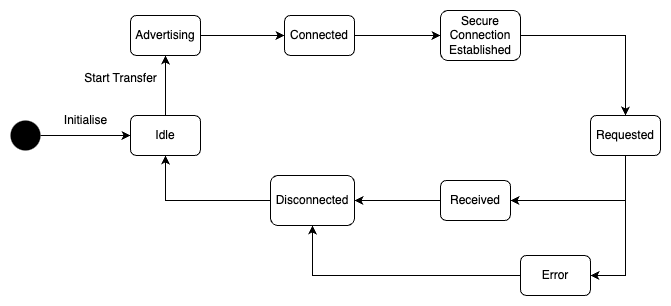
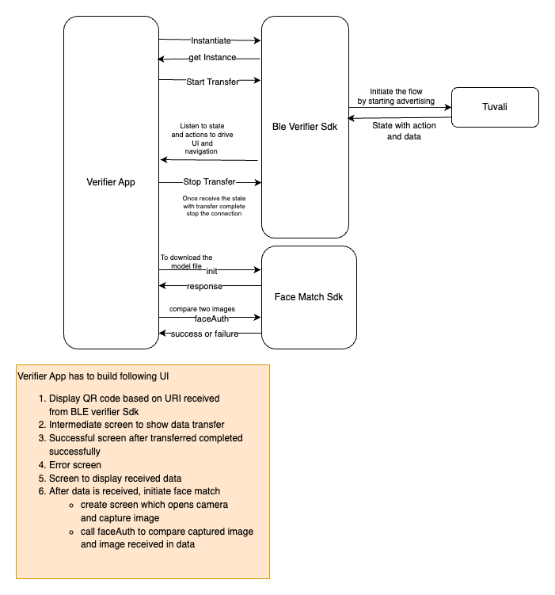

# BLE Verifier

* This is the module built for verifiers to receive VC via BLE. This is a wrapper built on Tuvali with simplified APIs.

## Repository



## Installation

* Add a dependency in package.json
* Publishing npm module is WIP. Once it's published, it can be integrated as any other npm module.

## API Specification

The following APIs are exposed to instantiate, start the transfer and stop the transfer

### Constructor for initialization

* This API initializes the BLE module using the provided configuration. This initialization process allows for the sharing of configuration information for advertisement purposes. A new instance is created with each initialization.
* It is recommended to use one instance per session and to initialize a new instance for each subsequent session.
* The configuration passed to the constructor includes a parameter called `deviceName`. This name is included in the advertisement payload during the BLE advertisement. It is important to note that this field has a character limit of 11 characters.

**Signature**

```
    constructor(configOptions: ConfigOptions) {
      Initialise verifier service with provided configuration
    }
    ConfigOptions {
      deviceName: string;
    }
```

**Parameters**

| **Name**      | **Description**                       | **ConfigOptions**           |
| ------------- | ------------------------------------- | --------------------------- |
| configOptions | device name used during advertisement | deviceName is the parameter |

### API to start transfer

* This API starts with advertisement for establishing the connection
* Internally interacts with Tuvali to start advertisement
* Update state to Advertising
* Once the secure connection is established, navigate through to state to complete the transfer

**Signature**

```
   startTransfer() {
    Start Advertisement
    Interact with tuvali to start advertisement
    update state to Advertising
   }
```

### API to stop transfer

* This API has to be called explicitly to stop the connection
* Connection can be stopped either after successful transfer or user wants to cancel the transfer
* Once the connection is disconnected, state is updated to Idle

**Signature**

```
stopTransfer() {
 disconnect the connection
 update state to Idle
}
```

### Types of states supported

* Idle
* Advertising
* Connected
* Secure Connection Established
* Requested
* Received
* Error
* Disconnected

Transitions between states is shown below:

<figure><figcaption><p>State diagram</p></figcaption></figure>

**Note**_:_ If either the sender or receiver decides to cancel the transfer at any stage, the state will transition to Disconnected and become Idle as a result.

#### Inji Wallet integration workflow with BLE Verifier SDK and Face Match SDK <a href="#inji-integration-workflow-with-ble-verifier-sdk-and-face-match-sdk" id="inji-integration-workflow-with-ble-verifier-sdk-and-face-match-sdk"></a>

<figure><figcaption><p>Verifier App integration</p></figcaption></figure>
