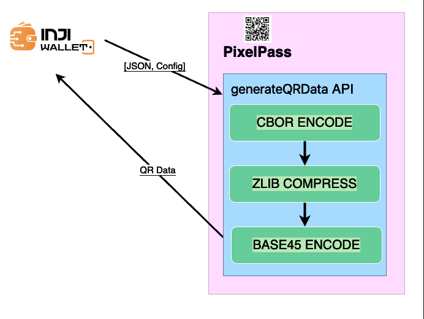
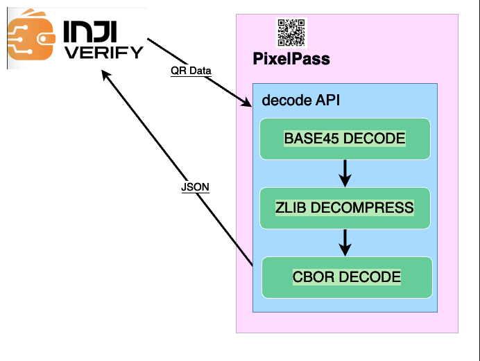

# PixelPass

## PixelPass

PixelPass is a versatile and easy-to-use library designed to simplify working with QR codes and data compression. It allows you to generate QR codes from any given data with just a single function. If you’re working with JSON, PixelPass can take that data, compress it, and convert it into a compact format using CBOR encoding, making it smaller and more efficient for QR code generation. The library can also decode this compressed data, turning CBOR back into the original JSON format. Additionally, for more complex use cases, PixelPass offers the ability to map your JSON data to a specific structure, compress it, and encode it into CBOR. Later, you can also reverse this process, decoding the CBOR back into its mapped JSON structure. With these capabilities, PixelPass makes managing, compressing, and encoding data for QR codes easy and efficient.

PixelPass has NPM, Kotlin, Swift and Java artifacts available.

### Features

* Compresses data using zlib with the highest compression level (level 9).
* Encodes and decodes data with the base45 format.
* For JSON data, applies CBOR encoding/decoding to achieve additional size reduction.
* With JSON and a Mapper provided, maps the JSON and then performs CBOR encoding/decoding to further shrink the data size.

### Usage

1. As a node project:

`npm i @mosip/pixelpass`

2. As a Kotlin/Java dependency:

_Gradle_

`implementation("io.mosip:pixelpass:0.5.0")`

_Maven_

```
<dependency>
  <groupId>io.mosip</groupId>
  <artifactId>pixelpass</artifactId>
  <version>0.5.0</version>
</dependency>
```

3. To include PixelPass in your Swift project, follow the below steps:
   1. Clone the PixelPass library locally.
   2. Create a new Swift project.
   3. Add package dependency: PixelPass

## APIs

Below are the APIs provided by the PixelPass library:

**generateQRCode( data, ecc , header )**

The `generateQRCode` takes a data, ECC (Error correction level) which when not passed defaults to L and header which defaults to empty string if not passed. Returns a base64 encoded PNG image.

* `data` - Data needs to be compressed and encoded.
* `ecc` - Error Correction Level for the QR generated. defaults to `"L"`.
* `header` - Data header need to be prepend to identify the encoded data. defaults to `""`.

```javascript
import { generateQRCode } from '@mosip/pixelpass';

const data = "Hello";
const qrCode = generateQRCode(data, ecc, header);

// ecc is Error Correction Level for the QR generated. defaults to "L".
// header defaults to empty string if not passed.
```

**generateQRData( data, header )**

The `generateQRData` takes a valid JSON string and a header which when not passed defaults to an empty string. This API will return a base45 encoded string which is `Compressed > CBOR Encoded > Base45 Encoded`.

* `data` - Data needs to be compressed and encoded.
* `header` - Data header need to be prepend to identify the encoded data. defaults to `""`.

```javascript
import { generateQRData } from '@mosip/pixelpass';

const jsonString = "{\"name\":\"Steve\",\"id\":\"1\",\"l_name\":\"jobs\"}";
const header = "jsonstring";

const encodedCBORData = generateQRData(jsonString, header);

// header defaults to empty string if not passed.
```

**decode( data )**

The `decode` will take a `string` as parameter and gives us decoded JSON string which is Base45 `Decoded > CBOR Decoded > Decompressed`.

* `data` - Data needs to be decoded and decompressed without header.

```javascript
import { decode } from '@mosip/pixelpass';

const b45EncodedData = "NCFWTL$PPB$PN$AWGAE%5UW5A%ADFAHR9 IE:GG6ZJJCL2.AJKAMHA100+8S.1";
const jsonString = decode(b45EncodedData);
```

**decodeBinary( data )**

The `decodeBinary` will take a `UInt8ByteArray` as parameter and gives us unzipped string. Currently only zip binary data is only supported.

* `data` - Data needs to be decoded and decompressed without header.

```javascript
import { decodeBinary } from '@mosip/pixelpass';

const zipdata = <zip-byte-array>;
const decompressedData = decodeBinary(zipdata);
```

**getMappedData( jsonData, mapper, cborEnable )**

The `getMappedData` takes 3 arguments a JSON and a map with which we will be creating a new map with keys and values mapped based on the mapper. The third parameter is an optional value to enable or disable CBOR encoding on the mapped data.

* `jsonData` - A JSON data.
* `mapper` - A Map which is used to map with the JSON.
* `cborEnable` - A Boolean which is used to enable or disable CBOR encoding on mapped data. Defaults to `false` if not provided.

```javascript
import { getMappedData } from '@mosip/pixelpass';

const jsonData = {"name": "Jhon", "id": "207", "l_name": "Honay"};
const mapper = {"id": "1", "name": "2", "l_name": "3"};

const byteBuffer = getMappedData(jsonData, mapper,true);

const cborEncodedString = byteBuffer.toString('hex');
```

The example of a converted map would look like, `{ "1": "207", "2": "Jhon", "3": "Honay"}`

**decodeMappedData( data, mapper )**

The `decodeMappedData` takes 2 arguments a string which is CBOR Encoded or a mapped JSON and a map with which we will be creating a JSON by mapping the keys and values. If the data provided is CBOR encoded string the API will do a CBOR decode first ad then proceed with re-mapping the data.

* `data` - A CBOREncoded string or a mapped JSON.
* `mapper` - A Map which is used to map with the JSON.

```javascript
import { decodeMappedData } from '@mosip/pixelpass';

const cborEncodedString = "a302644a686f6e01633230370365486f6e6179";
const mapper = {"1": "id", "2": "name", "3": "l_name"};

const jsonData = decodeMappedData(cborEncodedString, mapper);
```

The example of the returned JSON would look like, `{"name": "Jhon", "id": "207", "l_name": "Honay"}`

### Errors / Exceptions

Shall you encounter any errors while using the APIs, please refer to the below:

1. **Cannot read properties of null (reading 'length')** - This error denotes that the string passed to encode is null.
2. **Cannot read properties of undefined (reading 'length')** - This error denotes that the string passed to encode is undefined.
3. **byteArrayArg is null or undefined.** - This error denotes that the string passed to encode is null or undefined.
4. **utf8StringArg is null or undefined**. - This error denotes that the string passed to decode is null or undefined.
5. **utf8StringArg has incorrect length**. - This error denotes that the string passed to decode is of invalid length.
6. **Invalid character at position X**. - This error denotes that the string passed to decode is invalid with an unknown character then base45 character set. Also denotes the invalid character position.
7. **incorrect data check** - This error denotes that the string passed to decode is invalid.

## PixelPass & Inji Wallet Integration:

The below diagram shows how Inji Wallet utilises PixelPass library.

<figure><figcaption></figcaption></figure>

## PixelPass & Inji Verify Integration:

The below diagram shows how Inji Verify utilises PixelPass library.

<figure><figcaption></figcaption></figure>
