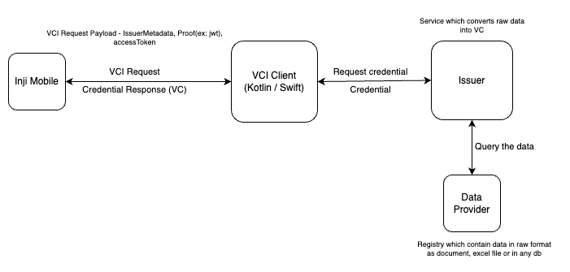

# VCI-Client

## VCI-Client

vci-client library enables to carry out the credential request from the consumer application (mobile wallet or web) and download the VC.

## Features:

* Creates a credential request with access token, issuer metadata, holder jwt proof.
* Provide credential response (VC) to the consumer application.
* Kotlin and Swift artefacts are available to integrate with the native mobile applications.

Below sections details on the steps for integrating the Kotlin and Swift packages into the app.

## Android: Kotlin package for vci-client:

### Repository

* inji-vc-client repo is [here](https://github.com/mosip/inji-vci-client)
* inji-vc-client-ios-swift repo is [here](https://github.com/mosip/inji-vci-client-ios-swift)
* Maven snapshots available [here](https://repo1.maven.org/maven2/io/mosip/inji-vci-client/)

### Installation

Snapshot builds are available [here](https://oss.sonatype.org/content/repositories/snapshots/io/mosip/inji-vci-client/).


Note: implementation "io.mosip:inji-vci-client:0.1.0-SNAPSHOT"


### APIs

**1. Request Credential**

Request for credential from the providers (credential issuer), and receive the credential.

```
val credentialResponse: CredentialResponse? = VCIClient().requestCredential(
                        IssuerMetaData( CREDENTIAL_AUDIENCE, CREDENTIAL_ENDPOINT, DOWNLOAD_TIMEOUT, CREDENTIAL_TYPE, CREDENTIAL_FORMAT ),
                        proofJwt,
                        accessToken
                    )

```

**Parameters**

| Name           | Type           | Description                                                                | Sample                                                                                                    |
| -------------- | -------------- | -------------------------------------------------------------------------- | --------------------------------------------------------------------------------------------------------- |
| issuerMetaData | IssuerMetaData | Data object of the issuer details                                          | IssuerMetaData(credentialAudience, credentialEndpoint, downloadTimeout, credentialType, credentialFormat) |
| proofJwt       | Proof          | The proof used for making credential request. Supported proof types : JWT. | JWTProof(jwtValue)                                                                                        |
| accessToken    | String         | token issued by providers based on auth code                               | ""                                                                                                        |

### **Exceptions**

* DownloadFailedException is thrown when the credential issuer did not respond with credential response
* NetworkRequestTimeoutException is thrown when the request is timedout

### **More details**

An example app is added under /example folder which can be referenced for more details.

## iOS: Swift package for vci-client:

### Repository

```
https://github.com/mosip/inji-vci-client-ios-swift/
```

### Installation

1. Clone the repo
2. In your swift application go to file > add package dependency > add thehttps://github.com/mosip/inji-vci-client-ios-swift in git search bar> add package
3. Import the library and use.

### APIs

**1. Request Credential**

Request for credential from the issuer, and receive the credential response back in string.

```
let requestCredential = try await VCIClient().requestCredential(issuerMeta: IssuerMeta, proofJwt: Proof, accessToken: String)
```

**Parameters**

| Name        | Type       | Description                                                                    | Sample                                                                                                |
| ----------- | ---------- | ------------------------------------------------------------------------------ | ----------------------------------------------------------------------------------------------------- |
| issuerMeta  | IssuerMeta | struct of the issuer details like audience, endpoint, timeout, type and format | IssuerMeta(credentialAudience, credentialEndpoint, downloadTimeout, credentialType, credentialFormat) |
| proofJwt    | Proof      | The proof type ProofJwt ex jwt                                                 | JWTProof(jwt: proofJWT)                                                                               |
| accessToken | String     | token issued by providers based on auth code                                   | ""                                                                                                    |

**Exceptions**

* DownloadFailedError is thrown when the credential issuer did not respond with credential response
* NetworkRequestTimeOutError is thrown when the request is timedout

**More details**

An example app is added under /SwiftExample folder which can be referenced for more details. Extract the swift example app out of the library and then follow the installation steps.

### VCI-Client and Inji Wallet integration:

The below diagram shows how Inji Wallet utilises vci-client library.

<figure><figcaption></figcaption></figure>
