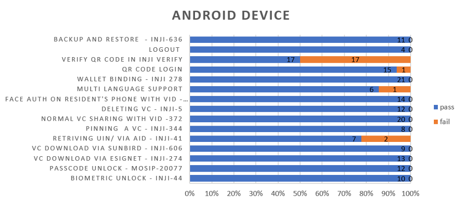
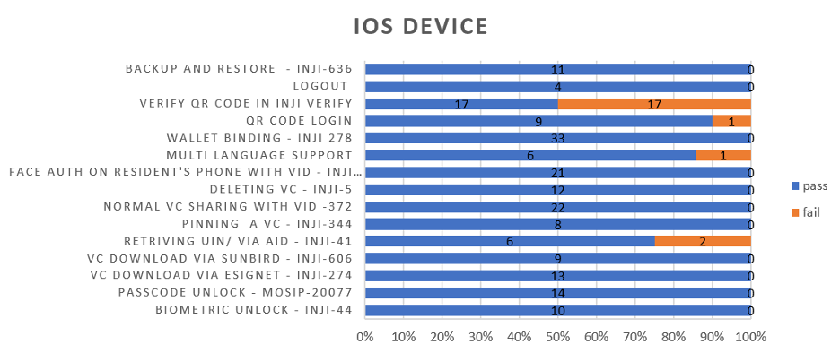
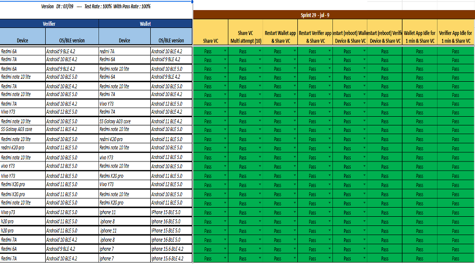

# Test Report

## Testing Scope

The scope of testing is to verify fitment to the specification from the perspective of

* Functionality
* Deployability
* Configurability
* Customizability

Verification is performed not only from the end user perspective but also from the System Integrator (SI) point of view. Hence Configurability and Extensibility of the software is also assessed. This ensures the readiness of software for use in multiple countries. Since MOSIP is an “API First” product platform, Verification scope required comprehensive automation testing for all the MOSIP APIs. An automation Test Rig is created for the same.

The Inji testing scope revolves around the following flows:

* Biometric unlock
* Passcodes unlock
* VC download via MOSIP
* VC download via eSignet
* VC download via Sunbird
* Retrieving UIN/ via AID
* Pinning a VC
* Normal VC sharing with VID
* Deleting VC
* Face Auth on Resident's phone with VID
* Multi language support
* Credential registry
* Backup and restore
* Wallet binding
* QR code Login
* Logout

## Test Approach

Persona based approach has been adopted to perform the IV\&V, by simulating test scenarios that resemble a real-time implementation.

A Persona is a fictional character/user profile created to represent a user type that might use a product/or a service in a similar way. Persona based testing is a software testing technique that puts software testers in the customer's shoes, assesses their needs from the software and thereby determines use cases/scenarios that the customers will execute. The persona needs may be addressed through any of the following.

* Functionality
* Deploy ability
* Configurability
* Customizability

The verification methods may differ based on how the need was addressed.

For regression check, “MOSIP Test Rig” - an automation testing suite - which is indigenously designed and developed for supporting persona-based testing. MOSIP Test Rig covers the end-to-end test execution and reporting. The end-to-end functional test scenarios are written starting from pre-registration to creation of packet in registration center, processing the packet through the registration processor, generating UIN and authenticating identity using IDA through various permutation and combinations of cases being covered. MOSIP Test Rig will be an open-source artifact which can also be enhanced and used by countries to validate the SI deliveries before going live. Persona classes include both negative and positive personas. Negative persona classes include users like Bribed Registration Office, Malicious Insider etc. The needs of positive persona classes must be met, whereas the needs of negative persona classes must be effectively restricted by the software.

## Verified configuration

Verification is performed on various configurations as mentioned below

* Default configuration - with 3 Lang
* Virtual countries
  * 1 Lang configuration
  * 2 Lang configuration
  * 3 Lang configuration

## Feature Health

On Android Device:

<figure><figcaption></figcaption></figure>

On iOS Device:

<figure><figcaption></figcaption></figure>

## Test execution statistics

### Functional test results by modules

Below are the test metrics by performing functional testing using mock MDS and mock ABIS. The process followed was black box testing which based its test cases on the specifications of the software component under test. The functional test was performed in combination with individual module testing as well as integration testing. Test data were prepared in line with the user stories. Expected results were monitored by examining the user interface. The coverage includes GUI testing, System testing, End-To-End flows across multiple languages and configurations. The testing cycle included simulation of multiple identity schema and respective UI schema configurations.

|                                    |            |            |                   |
| :--------------------------------: | :--------: | :--------: | :---------------: |
|              **Total**             | **Passed** | **Failed** | **Skipped (N/A)** |
|                2303                |    2034    |     226    |         43        |
| Test Rate: 98% With Pass Rate: 90% |            |            |                   |

Here is the detailed breakdown of metrics for each module:

|                   |               |                |
| :---------------: | :-----------: | :------------: |
|                   |               | **Test cases** |
| On Android Device |     Total     |      1236      |
|                   |     Passed    |      1085      |
|                   |     Failed    |       124      |
|                   | Skipped (N/A) |       27       |
|   On iOS Device   |     Total     |      1067      |
|                   |     Passed    |       949      |
|                   |     Failed    |       102      |
|                   | Skipped (N/A) |       16       |

### External API verification results by modules

Below section provides details on API test metrics by executing MOSIP functional automation Framework. All external API test executions were performed at module level isolation. Each end point is tested with the test data and expectations of each test data are mapped to assert the test case.

|                                        |            |            |             |
| :------------------------------------: | :--------: | :--------: | :---------: |
|                **Total**               | **Passed** | **Failed** | **Skipped** |
|                  1335                  |    1275    |     32     |      28     |
| Test Rate: 97.9% With Pass Rate: 97.5% |            |            |             |

Here is the detailed breakdown of metrics

|           |         |                |
| :-------: | :-----: | :------------: |
|           |         | **Test cases** |
| Mobile ID |  Total  |       63       |
|           |  Passed |       61       |
|           |  Failed |        2       |
|           | Skipped |        0       |
|  eSignet  |  Total  |      1272      |
|           |  Passed |      1214      |
|           |  Failed |       30       |
|           | Skipped |       28       |

### UI Automation results

Below section provides details on Ui Automation by executing MOSIP functional automation Framework.

|                                        |            |            |             |
| :------------------------------------: | :--------: | :--------: | :---------: |
|                **Total**               | **Passed** | **Failed** | **Skipped** |
|                   120                  |     107    |     13     |      0      |
| Test Rate: 100% With Pass Rate: 89.16% |            |            |             |

Here is the detailed breakdown of metrics

|         |         |                |
| :-----: | :-----: | :------------: |
|         |         | **Test cases** |
| Android |  Total  |       63       |
|         |  Passed |       54       |
|         |  Failed |        9       |
|         | Skipped |        0       |
|   iOS   |  Total  |       57       |
|         |  Passed |       53       |
|         |  Failed |        4       |
|         | Skipped |        0       |

Functional and test rig code base branch which is used for the above metrics is:

Hash Tag:

SHA: sha256: b477f64889c7340a1d1ca6b17601473c30d206de8de9c8a69e8879be38e1dbb5

### Testing with various device combinations

Below are the test metrics by performing VC Sharing functionality on various device combinations

<figure><figcaption></figcaption></figure>

|                                      |            |            |             |
| :----------------------------------: | :--------: | :--------: | :---------: |
|               **Total**              | **Passed** | **Failed** | **Skipped** |
|                  192                 |     192    |      0     |      0      |
| Test Rate: 100% With Pass Rate: 100% |            |            |             |

### Detailed Test metrics

Below are the detailed test metrics by performing manual/automation testing. The project metrics are derived from Defect density, Test coverage, Test execution coverage, test tracking and efficiency.

The various metrics that assist in test tracking and efficiency are as follows:

* Passed Test Cases Coverage: It measures the percentage of passed test cases. (Number of passed tests / Total number of tests executed) x 100
* Failed Test Case Coverage: It measures the percentage of all the failed test cases. (Number of failed tests / Total number of test cases executed) x 100

Git hub link for the xls file is [here](https://github.com/mosip/test-management/tree/master/inji/0.13.0).
