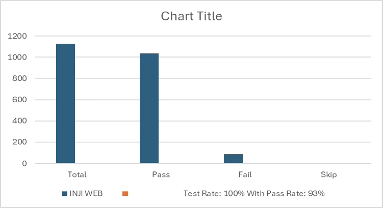

# Test Report

### Testing Scope

The scope of testing is to verify fitment to the specification from the perspective of&#x20;

● Functionality&#x20;

● Deployability&#x20;

●  Configurability&#x20;

●  Customizability

Verification is performed not only from the end user perspective but also from the System Integrator (SI) point of view. Hence Configurability and Extensibility of the software is also assessed. This ensures the readiness of software for use in multiple countries.

The Inji testing scope revolves around the following flows:

● Biometric unlock

● Passcodes unlock

● VC download via MOSIP

● VC download via e-signet

● VC downloads via Sunbird

● Pinning a VC

● Normal VC sharing with VID

● Deleting VC

● Face Auth on Resident's phone with VID

●  Multi language support

●  Credential registry

●   Backup and restore

●   Wallet binding

●    Deep link navigation

●   OpenID4VP

●   QR code Login

●    Key Management

●    Credential Offer

●    Logout

## Test Approach

Persona based approach has been adopted to perform the IV\&V, by simulating test scenarios that resemble real-time implementation.

A Persona is a fictional character/user profile created to represent a user type that might use a product/or a service in a similar way. Persona based testing is a software testing technique that puts software testers in the customer's shoes, assesses their needs from the software and thereby determines use cases/scenarios that the customers will execute. The persona needs may be addressed through any of the following.

●  Functionality&#x20;

●  Deployability&#x20;

●  Configurability&#x20;

●  Customizability

The verification methods may differ based on how the need was addressed.

## Verified configuration

Verification is performed on various configurations as mentioned below

&#x20;    ●  Default configuration - with 1 Lang

## Feature Health

On Android Device:

<figure><figcaption></figcaption></figure>

On iOS Device:

<figure><figcaption></figcaption></figure>

## Test execution statistics

### Functional test results by modules

Below are the test metrics by performing functional testing using mock MDS and mock ABIS. The process followed was black box testing which based its test cases on the specifications of the software component under test. The functional test was performed in combination with individual module testing as well as integration testing. Test data were prepared in line with the user stories. Expected results were monitored by examining the user interface. The coverage includes GUI testing, System testing, End-To-End flows across multiple languages and configurations. The testing cycle included simulation of multiple identity schema and respective UI schema configurations.&#x20;

<table data-header-hidden><thead><tr><th valign="top"></th><th valign="top"></th><th valign="top"></th><th valign="top"></th></tr></thead><tbody><tr><td valign="top"><mark style="color:orange;"><strong>Total</strong></mark></td><td valign="top"><mark style="color:$success;"><strong>Passed</strong></mark></td><td valign="top"><mark style="color:red;"><strong>Failed</strong></mark></td><td valign="top"><mark style="color:purple;"><strong>Skipped (N/A)</strong></mark></td></tr><tr><td valign="top">3874</td><td valign="top">3095</td><td valign="top">401</td><td valign="top">0</td></tr><tr><td valign="top">Test Rate: 100% With Pass Rate: 89%</td><td valign="top"></td><td valign="top"></td><td valign="top"></td></tr></tbody></table>

&#x20;Here is the detailed breakdown of metrics for each module:

<table data-header-hidden><thead><tr><th valign="top">Andriod</th><th valign="top">Number of testcase</th></tr></thead><tbody><tr><td valign="top">Total Test cases</td><td valign="top">2025</td></tr><tr><td valign="top">Passed</td><td valign="top">1829</td></tr><tr><td valign="top">Failed</td><td valign="top">196</td></tr><tr><td valign="top">Skipped (N/A)</td><td valign="top">0</td></tr><tr><td valign="top"><strong>iOS</strong> </td><td valign="top"><strong>Number of testcases</strong></td></tr><tr><td valign="top"><strong>Total Test cases</strong></td><td valign="top"><mark style="color:$info;"><strong>1849</strong></mark></td></tr><tr><td valign="top">Passed</td><td valign="top">1644</td></tr><tr><td valign="top">Failed</td><td valign="top">205</td></tr><tr><td valign="top">Skipped (N/A)</td><td valign="top">0</td></tr></tbody></table>

### Testing with various device combinations

Below are the test metrics by performing VC Sharing functionality on various device combinations

<figure><figcaption></figcaption></figure>

<table data-header-hidden><thead><tr><th valign="top"></th><th valign="top"></th><th valign="top"></th><th valign="top"></th></tr></thead><tbody><tr><td valign="top">Total</td><td valign="top">Passed</td><td valign="top">Failed</td><td valign="top">Skipped</td></tr><tr><td valign="top">240</td><td valign="top">217</td><td valign="top">23</td><td valign="top">0</td></tr><tr><td valign="top">Test Rate: 100% With Pass Rate: 90.41%</td><td valign="top"></td><td valign="top"></td><td valign="top"></td></tr></tbody></table>

### Device and Component Details:

<table data-header-hidden><thead><tr><th valign="bottom">Tested with Inji components qa-inji1</th></tr></thead><tbody><tr><td valign="bottom">mosipqa/inji-verify-service:0.14.x</td></tr><tr><td valign="bottom">mosipqa/inji-verify-ui:0.14.x</td></tr><tr><td valign="bottom">mosipqa/inji-certify-with-plugins:0.12.x</td></tr><tr><td valign="bottom">mosipqa/apitest-mimoto:0.18.x</td></tr><tr><td valign="bottom">mosipqa/mimoto:0.18.x</td></tr><tr><td valign="bottom">mosipqa/inji-web:0.13.x</td></tr><tr><td valign="bottom"><mark style="color:$info;"><strong>Tested with components - Released env</strong></mark></td></tr><tr><td valign="bottom">mosipid/mimoto:0.18.1</td></tr><tr><td valign="bottom">mosipid/apitest-mimoto:0.18.1</td></tr><tr><td valign="bottom">mosipid/inji-verify-service:0.13.0</td></tr><tr><td valign="bottom">mosipid/inji-verify-ui:0.13.0</td></tr><tr><td valign="bottom">mosipid/apitest-inji-certify:0.11.0</td></tr><tr><td valign="bottom">mosipid/inji-web:0.13.1</td></tr><tr><td valign="bottom">mosipid/esignet-with-plugins:1.5.1</td></tr><tr><td valign="bottom">mosipid/authentication-service:1.2.1.0</td></tr><tr><td valign="bottom">mosipid/authentication-internal-service:1.2.1.0</td></tr><tr><td valign="bottom">mosipid/authentication-otp-service:1.2.1.0</td></tr><tr><td valign="bottom">mosipid/kernel-notification-service:1.2.0.1</td></tr><tr><td valign="bottom">mosipid/registration-processor-stage-group-1:1.2.1.1</td></tr></tbody></table>

<table data-header-hidden><thead><tr><th valign="bottom">Devices Used For Testing</th></tr></thead><tbody><tr><td valign="bottom">Vivo Y73 with Android 13 BLE 5.0</td></tr><tr><td valign="bottom">SS Galaxy A03 core with Android 11 BLE 4.2</td></tr><tr><td valign="bottom">iPhone 11 with iOS 18.3.2 BLE 5.0</td></tr><tr><td valign="bottom">iPhone 8 with i-OS 16.7 BLE 5.0</td></tr><tr><td valign="bottom">iPhone 7 with iphone 15.8 BLE 4.2</td></tr><tr><td valign="bottom">Redmi 7A Android 10 BLE 4.2</td></tr><tr><td valign="bottom">Redmi 6A Android 9 BLE 4.2</td></tr><tr><td valign="bottom">Techno POVA 6 NEO - Android 14</td></tr><tr><td valign="bottom">iTel - Android 14</td></tr><tr><td valign="bottom">iPhone 14 - iOS 18.5</td></tr><tr><td valign="bottom">OPPO A59 5G - Android 15</td></tr><tr><td valign="bottom">ONE PLUS 12R - Android 15</td></tr><tr><td valign="bottom">Xiaomi RedMi NOTE 13 PRO - Android 15</td></tr><tr><td valign="bottom">Infinix NOTE 50X 5G - Android 15</td></tr><tr><td valign="bottom">iPhone 13 - iOS 18.5</td></tr></tbody></table>

### Detailed Test Metrics

Below are the detailed test metrics by performing manual testing. The project metrics are derived from Defect density, Test coverage, Test execution coverage, test tracking and efficiency.

The various metrics that assist in test tracking and efficiency are as follows:

● Passed Test Cases Coverage: It measures the percentage of passed test cases. (Number of tests passed / Total number of tests executed) x 100

● Failed Test Case Coverage: It measures the percentage of all failed test cases. (Number of failed tests / Total number of test cases executed) x 100

### Execution Test Summary

Special keys used to identify the face for rendering a credential are verified for the available positive flow, since support for other types of verification is not yet available.
