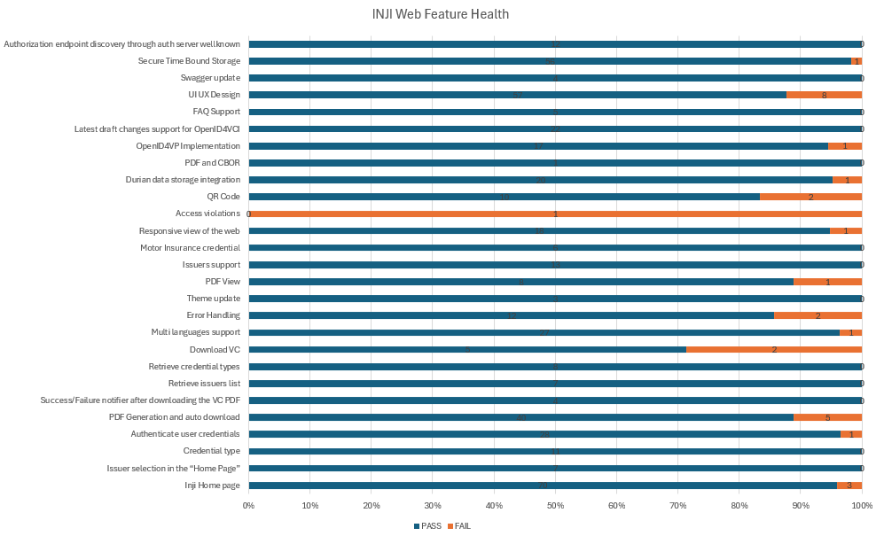

# Test Report

# Testing Scope

The scope of testing is to verify fitment to the specification from the
perspective of

-   Functionality

-   Deployability

-   Configurability

-   Customizability

Verification is performed not only from the end user perspective but
also from the System Integrator (SI) point of view. Hence
Configurability and Extensibility of the software is also assessed. This
ensures the readiness of software for use in multiple countries. MOSIP
is an "API First" product platform.

Testing scope has been focused on the following features:

-   Inji Home page

-   Issuer and Credential selection

-   Authenticating with user credentials

-   PDF Generation and Auto download

-   Success/Failure notification after downloading the VC PDF

-   Retrieve Issuers and Credential list

-   Downloading VC

-   Multi languages support

-   Error Handling

-   Theme update

-   PDF View

-   Issuers support

-   Responsive view of the web

-   Access violations

-   QR Code

-   Durian data storage integration

-   PDF and CBOR

-   OpenID4VP Implementation

-   Latest draft changes support for OpenID4VCI

-   FAQ Support

-   UI UX Design updates

-   Swagger update

-   Secure Time Bound Storage

-   Locale Support

-   PDF Template Support

-   Authorization endpoint discovery through auth server well-known

# Test Approach

A personal based approach has been adopted to perform the IV&V, by
simulating test scenarios that resemble a real-time implementation.

A Persona is a fictional character/user profile created to represent a
user type that might use a product/or a service in a similar way.
Persona based testing is a software testing technique that puts software
testers in the customer\'s shoes, assesses their needs from the software
and thereby determines use cases/scenarios that the customers will
execute. The persona needs may be addressed through any of the
following.

-   Functionality

-   Deployability

-   Configurability

-   Customizability

The verification methods may differ based on how the need was addressed.

# Verified configuration 

[Verification is performed on various configurations as mentioned
below]{.mark}

-   [Default configuration - with 7 Lang]{.mark}

    -   English

    -   French

    -   Arabic

    -   Hindi

    -   Tamil

    -   Kannada

    -   Portuguese

The UI will render in all the above languages but the PDF file after
download will only be in English language as certify is currently only
supporting English. When any language is selected in UI, as a fall back
the pdf will be in Eng.

# Feature Health

<figure><figcaption>
Feature Health
</figcaption></figure>

# Test execution statistics 

## Functional test results

Below are the test metrics by performing functional testing. The process
followed was black box testing which based its test cases on the
specifications of the software component under test. Functional test was
performed in combination of individual module testing as well as
integration testing. Test data were prepared in line with the user
stories. Expected results were monitored by examining the user
interface. The coverage includes GUI testing, System testing, and
End-To-End flows across multiple configurations. The testing cycle
included simulation of multiple identity schema and respective UI schema
configurations.

-----------------------------------------------------------------------
**Total**         **Passed**        **Failed**        **NA**
----------------- ----------------- ----------------- -----------------
501               471               30                0
-----------------------------------------------------------------------

Test Rate: 100%, With Pass Rate: 94%                                                   

## UI Automation and API Test Rig test results

Below are the test metrics by performing UI Automation and API Test rig.

  ---------------------------------------------------------------------------
  **Total**         **Passed**        **Unsuccessful**  **Skipped/Ignored**
  ----------------- ----------------- ----------------- ---------------------
  195               162               0                 33

Test Rate: 83%, With Pass Rate: 100%                                                  

Here is the detailed breakdown of metrics for each module:

  -------------------------------------------------------------------------
                                                         **Test cases**
  ------------------------------------ ----------------- ------------------
  Inji Web UI Automation               Total             19
                                       Passed            19
                                       Failed            0
                                       Skipped           0

  Inji Web API Test Rig                Total             176
                                       Passed            143
                                       Failed            0
                                       Skipped/Ignored   33
  -------------------------------------------------------------------------

**Note**: Ignored 33 OTP related test cases which are descoped and not applicable

Functional and test rig code base branch which is used for the above
metrics is:

UI Automation: 93b15078140b6db88d30c91101369e14e326d3bf

API automation: b61429f06ec50fc1dcc9eff1de67b016168c2f7c

## Detailed Test Metrics

Below are the detailed test metrics by performing manual/automation
testing. The project metrics are derived from Defect density, Test
coverage, Test execution coverage, test tracking and efficiency.

The various metrics that assist in test tracking and efficiency are as
follows:

-   Passed Test Cases Coverage: It measures the percentage of passed
    test cases. (Number of tests passed / Total number of tests
    executed) x 100

-   Failed Test Case Coverage: It measures the percentage of all the
    failed test cases. (Number of failed tests / Total number of test
    cases executed) x 100

Git hub link for the xls file is [**here**](https://github.com/mosip/test-management/tree/master/inji-web/inji%20web%200.12.0).

