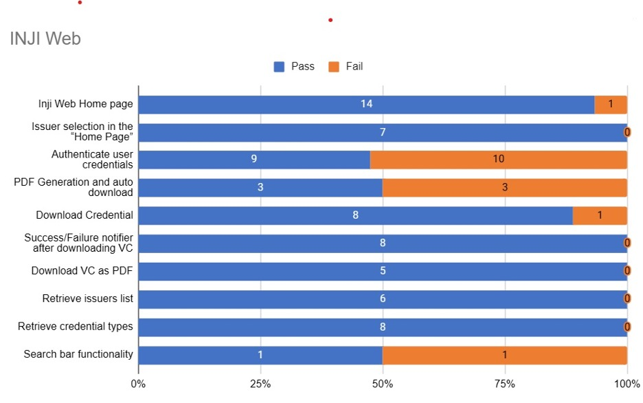

# Test Report

## Testing Scope

The scope of testing is to verify fitment to the specification from the perspective of &#x20;

* Functionality&#x20;
* Deployability
* Configurability
* Customizability

Verification is performed not only from the end user perspective but also from the System Integrator (SI) point of view. Hence Configurability and Extensibility of the software is also assessed. This ensures readiness of software for use in multiple countries. Since MOSIP is an “API First” product platform.&#x20;

Testing scope has been focused around the below features:

* Inji Web Home page
* Issuer selection in the “Home Page”
* Authenticate user credentials
* PDF Generation and auto download
* Download Credential
* Success/Failure notifier after downloading VC&#x20;
* Download VC as PDF
* Retrieve issuers list
* Retrieve credential types
* Search bar functionality

## Test Approach

Persona based approach has been adopted to perform the IV\&V, by simulating test scenarios that resemble a real-time implementation.&#x20;

A Persona is a fictional character/user profile created to represent a user type that might use a product/or a service in a similar way. Persona based testing is a software testing technique that puts software testers in the customer's shoes, assesses their needs from the software and thereby determines use cases/scenarios that the customers will execute. The persona needs may be addressed through any of the following.&#x20;

* Functionality
* Deployability
* Configurability
* Customizability

&#x20;The verification methods may differ based on how the need was addressed.

## Verified configuration&#x20;

Verification is performed on various configurations as mentioned below&#x20;

* Default configuration - with 1 Lang
  * English

## Feature Health

<figure><figcaption></figcaption></figure>

## Test execution statistics&#x20;

### Functional test results 

Below are the test metrics by performing functional testing. The process followed was black box testing which based its test cases on the specifications of the software component under test. Functional test was performed in combination of individual module testing as well as integration testing. Test data were prepared in line with the user stories. Expected results were monitored by examining the user interface. The coverage includes GUI testing, System testing, End-To-End flows across multiple configurations. The testing cycle included simulation of multiple identity schema and respective UI schema configurations.

| Total                               | Passed | Failed | Skipped |
| ----------------------------------- | ------ | ------ | ------- |
| 89                                  | 57     | 21     | 11      |
| Test Rate: 87%, With Pass Rate: 73% |        |        |         |

Here is the detailed breakdown of metrics for each module:

|                                                         |         | Test cases |
| ------------------------------------------------------- | ------- | ---------- |
| 
 

 

 

INJI Web Ui Verification
 | Total   | 89         |
|                                                         | Passed  | 57         |
|                                                         | Failed  | 21         |
|                                                         | Skipped | 11         |

### Detailed Test metrics

Below are the detailed test metrics by performing manual/automation testing. The project metrics are derived from Defect density, Test coverage, Test execution coverage, test tracking and efficiency.&#x20;

The various metrics that assist in test tracking and efficiency are as follows:

* Passed Test Cases Coverage: It measures the percentage of passed test cases. (Number of passed tests / Total number of tests executed) x 100
* Failed Test Case Coverage: It measures the percentage of all the failed test cases. (Number of failed tests / Total number of test cases executed) x 100

Git hub link for Test-Report files (MS Word and Excel):

[INJI-Web 0.8.0 - Verification - Report](https://github.com/mosip/test-management/tree/master/inji-web)
