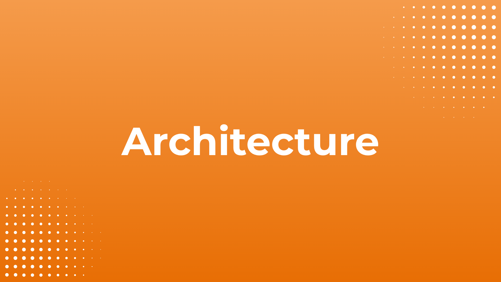

# Technical Overview

This section offers an overview of the architecture and technologies utilized in Inji Web, ensuring compatibility, security, and efficiency in the management of Verifiable Credentials.

<table data-view="cards"><thead><tr><th></th><th></th><th></th><th data-hidden data-card-target data-type="content-ref"></th></tr></thead><tbody><tr><td></td><td></td><td><strong>Technology Stack</strong></td><td><a href="https://docs.mosip.io/inji/inji-web/technical-overview/technical-stack">https://docs.mosip.io/inji/inji-web/technical-overview/technical-stack</a></td></tr><tr><td></td><td></td><td><strong>Architecture</strong></td><td><a href="https://docs.mosip.io/inji/inji-web/technical-overview/architecture">https://docs.mosip.io/inji/inji-web/technical-overview/architecture</a></td></tr><tr><td></td><td></td><td><strong>Supported Browsers</strong></td><td><a href="https://docs.mosip.io/inji/inji-web/technical-overview/supported-browsers">https://docs.mosip.io/inji/inji-web/technical-overview/supported-browsers</a></td></tr><tr><td></td><td></td><td><strong>Backend Services</strong></td><td><a href="https://docs.mosip.io/inji/inji-web/technical-overview/backend-services">https://docs.mosip.io/inji/inji-web/technical-overview/backend-services</a></td></tr></tbody></table>
