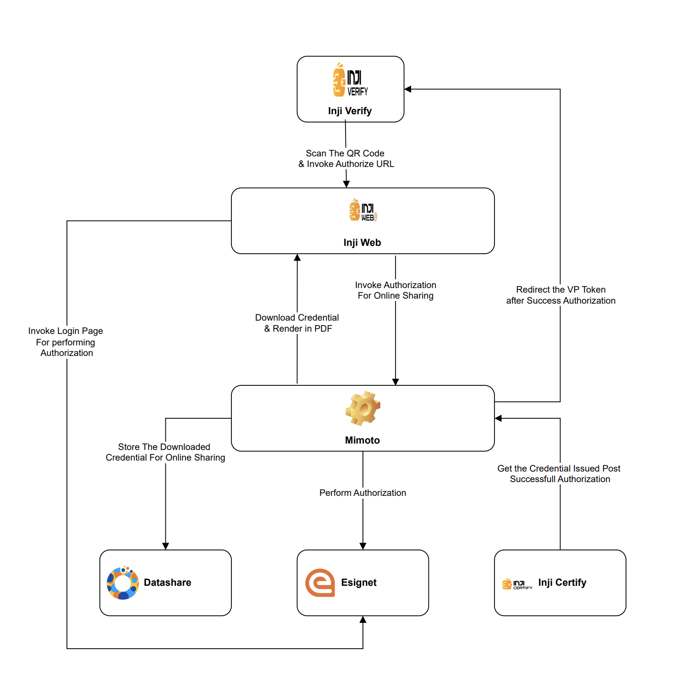

# Architecture

Inji Web is an intuitive, user-friendly portal designed to helps users to access Verifiable Credentials.

The architecture diagram below illustrates the structure and components of Inji Web, offering a detailed explanation of how the platform operates and how its various elements interact to deliver its features and functionality.

<figure><figcaption></figcaption></figure>

<figure><figcaption></figcaption></figure>

### Architecture Components

Let's briefly explore the key components of the architecture that constitute Inji Web:

1. **Inji Web:** A React-based, user-friendly web portal that allows users to easily download Verifiable Credentials.
2. **Backend for Frontend (BFF):** Mimoto acts as the BFF layer for Inji Web, managing both authentication and credential requests. It processes authentication through eSignet for secure user authorization and token issuance, while handling credential issuance requests via Certify.
3. **Authentication Layer:** eSignet handles the authentication process, authorizing users, issuing access tokens, and preparing credentials by retrieving necessary data from the credential issuer.
4. **Credential Issuer:** Any credential issuer that supports the OpenID4VCI protocol can be listed as a trusted issuer. These issuers provide the user data required for creating and downloading Verifiable Credentials.
5. **Durian:** Durian provides persistent storage for Verifiable Credentials, allowing them to be securely stored and accessed later.
