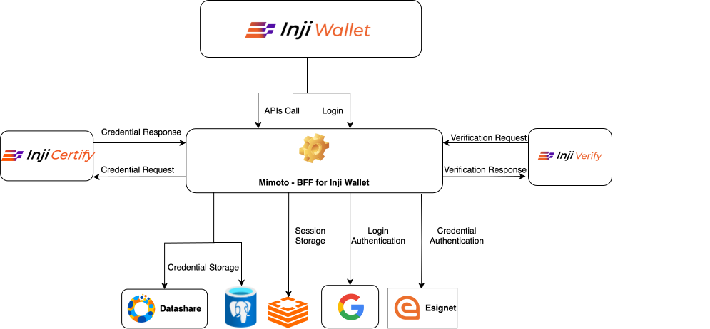

# Architecture

Inji Web is an intuitive, user-friendly portal designed to helps users to access Verifiable Credentials.

The architecture diagram below illustrates the structure and components of Inji Web, including the new login functionality with Google and storage of downloaded Verifiable Credentials in the database.

<figure><figcaption></figcaption></figure>

### Architecture Components

Let's briefly explore the key components of the architecture that constitute Inji Web:

1. **Inji Wallet:**  
   A React-based frontend portal that enables users to initiate credential-related workflows. It supports both guest and logged-in flows, allowing users to request, download, and verify Verifiable Credentials (VCs).

2. **Backend for Frontend (Mimoto):**  
   Acts as the central processing layer between Inji Wallet and backend services. It handles API calls, session management, login, and orchestrates communication with services like Certify, Verify, and credential storage systems.

3. **Credential Issuer (Inji Certify):**  
   Responds to credential requests from Mimoto and returns signed Verifiable Credentials. It adheres to protocols like OpenID4VCI to maintain secure and standardized issuance.

4. **Credential Verifier (Inji Verify):**  
   Validates the authenticity and integrity of credentials by processing verification requests from Mimoto. Ensures credentials are genuine and unaltered.

5. **Credential Storage - Datashare:**  
   Offers temporary storage for Verifiable Credentials, especially useful for guest sessions or public credential sharing scenarios.

6. **Persistent Storage - PostgreSQL:**  
   Stores Verifiable Credentials securely for logged-in users, enabling persistent access and history tracking of previously issued credentials.

7. **Session Store - Redis:**  
   Manages logged-in user sessions, and other volatile state data for performance-optimized authentication and session lifecycle handling.

8. **Login Provider - Google Login:**  
   Facilitates OAuth 2.0 based user authentication. Users can log in using their Google accounts, and the login state is managed by Mimoto.

9. **Authentication Layer - eSignet:**  
   Handles the authentication process, authorizing users, issuing access tokens, and preparing credentials by retrieving necessary data from the credential issuer.

  