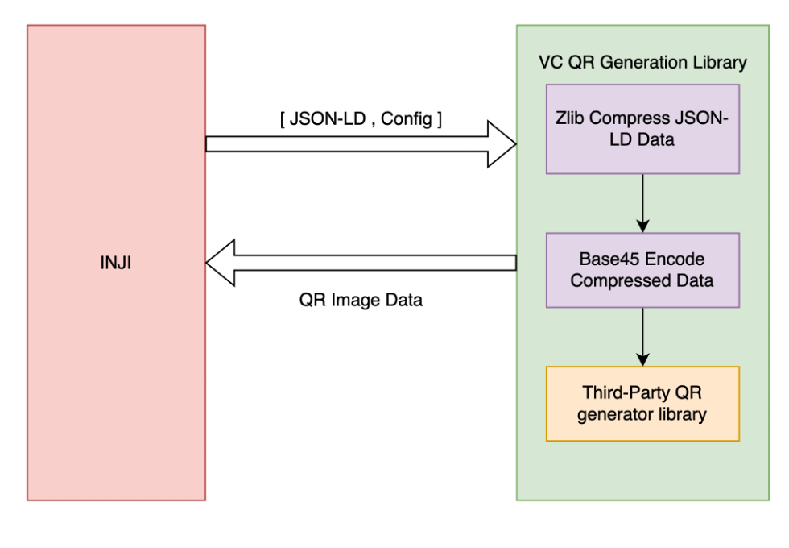

# PixelPass

## PixelPass

PixelPass is a versatile and easy-to-use node library designed to simplify working with QR codes and data compression. It allows you to generate QR codes from any given data with just a single function. If you’re working with JSON, PixelPass can take that data, compress it, and convert it into a compact format using CBOR encoding, making it smaller and more efficient for QR code generation. The library can also decode this compressed data, turning CBOR back into the original JSON format. Additionally, for more complex use cases, PixelPass offers the ability to map your JSON data to a specific structure, compress it, and encode it into CBOR. Later, you can also reverse this process, decoding the CBOR back into its mapped JSON structure. With these capabilities, PixelPass makes managing, compressing, and encoding data for QR codes easy and efficient.

PixelPass also has Kotlin, Swift and Java artifacts available.

### Features

* Compresses data using zlib with the highest compression level (level 9).
* Encodes and decodes data with the base45 format.
* For JSON data, applies CBOR encoding/decoding to achieve additional size reduction.
* With JSON and a Mapper provided, maps the JSON and then performs CBOR encoding/decoding to further shrink the data size.

### Snapshots

Below snapshots provide the mobile platform native artifacts along with the java library:

**Kotlin**: Index of /repositories/snapshots/io/mosip/pixelpass-aar 

**Swift**: GitHub - mosip/pixelpass-ios-swift: Swift library to generate QR code from VC and decode the data 

**Java:** Index of /repositories/snapshots/io/mosip/pixelpass-jar 

**Maven repo:** [pixelpass](https://repo1.maven.org/maven2/io/mosip/pixelpass/)


### Installation

1. As a node project:
   
npm i @mosip/pixelpass

[npm](https://www.npmjs.com/package/@mosip/pixelpass)

2. To include PixelPass in your Swift project, follow the below steps:

    1.    Clone the PixelPass library locally.

    2.    Create a new Swift project.

    3.    Add package dependency: PixelPass


### APIs

Below are the APIs provided by the PixelPass library:

### To Generate QR Data:

**generateQRData( data, header )**

    data - Data needs to be compressed and encoded

    header - Data header needs to be prepended to identify the encoded data. It defaults to ""

```
import { generateQRData } from '@mosip/pixelpass';

const jsonString = "{\"name\":\"Steve\",\"id\":\"1\",\"l_name\":\"jobs\"}";
const header = "jsonstring";

const encodedCBORData = generateQRData(jsonString, header);

// header defaults to empty string if not passed.
```

The API returns a zlib compressed and base45 encoded string with header prepended if provided.

### To Generate QR Code:

**generateQRCode( data, ecc , header )**

    data - Data needs to be compressed and encoded

    ecc - Error Correction Level for the QR generated. defaults to "L"

    header - Data header needs to be prepended to identify the encoded data. defaults to ""

```
import { generateQRCode } from '@mosip/pixelpass';

const data = "Hello";
const qrCode = generateQRCode(data, ecc, header);

// ecc is Error Correction Level for the QR generated. defaults to "L".
// header defaults to empty string if not passed.
```

The API returns a base64 encoded PNG image with header prepended if provided.

### To Decode the QR Code:

**decode(data)**

    data - Data needs to be decoded and decompressed without header

```
import { decode } from '@mosip/pixelpass';

const encodedData = "NCFWTL$PPB$PN$AWGAE%5UW5A%ADFAHR9 IE:GG6ZJJCL2.AJKAMHA100+8S.1";
const jsonString = decode(encodedData);
```

The API returns a base45 decoded and zlib decompressed string.

### To get Mapped CBOR data from JSON:

**getMappedData( jsonData, mapper, cborEnable );**

jsonData - A JSON data.

mapper - A Map which is used to map with the JSON.

cborEnable - A Boolean which is used to enable or disable CBOR encoding on mapped data. Defaults to false if not provided.

```
import { getMappedData } from '@mosip/pixelpass';

const jsonData = {"name": "Jhon", "id": "207", "l_name": "Honay"};
const mapper = {"id": "1", "name": "2", "l_name": "3"};

const byteBuffer = getMappedData(jsonData, mapper,true);

const cborEncodedString = byteBuffer.toString('hex');
```

The getMappedData function accepts three arguments: a JSON object and a map used to create a new set of key-value pairs based on the provided mapper. The third argument is a boolean value and an optional parameter that enables or disables CBOR encoding for the newly mapped data.

**Eg:** The converted map would look like, 

{ 
"1": "207",
"2": "Jhon",
"3": "Honay"
}

### To decode mapped CBOR data:

**decodeMappedData( data, mapper )**

data - A CBOREncoded string or a mapped JSON.

mapper - A Map which is used to map with the JSON.

```
import { decodeMappedData } from '@mosip/pixelpass';

const cborEncodedString = "a302644a686f6e01633230370365486f6e6179";
const mapper = {"1": "id", "2": "name", "3": "l_name"};

const jsonData = decodeMappedData(cborEncodedString, mapper);
```

The decodeMappedData function accepts two arguments: a string that can be either CBOR-encoded or a mapped JSON, and a map used to create a JSON by mapping the keys and values. If the input string is CBOR-encoded, the API will first decode it using CBOR, and then proceed with re-mapping the data based on the provided map.

**Eg:** The returned JSON would look like, 

{
"name": "Jhon",
"id": "207",
"l_name": "Honay"
}

### Errors / Exceptions

Shall you encounter any errors while using the APIs, please refer to the below:

1. **Cannot read properties of null (reading 'length')** - This error denotes that the string passed to encode is null.&#x20;
2. **Cannot read properties of undefined (reading 'length')** - This error denotes that the string passed to encode is undefined.&#x20;
3. **byteArrayArg is null or undefined.** - This error denotes that the string passed to encode is null or undefined.&#x20;
4. **utf8StringArg is null or undefined**. - This error denotes that the string passed to decode is null or undefined.&#x20;
5. **utf8StringArg has incorrect length**. - This error denotes that the string passed to decode is of invalid length.&#x20;
6. **Invalid character at position X**. - This error denotes that the string passed to decode is invalid with an unknown character then base45 character set. Also denotes the invalid character position.&#x20;
7. **incorrect data check** - This error denotes that the string passed to decode is invalid.

## PixelPass & Inji Wallet Integration:

The below diagram shows how Inji Wallet utilises PixelPass library.

<figure><figcaption></figcaption></figure>


\
\
\


