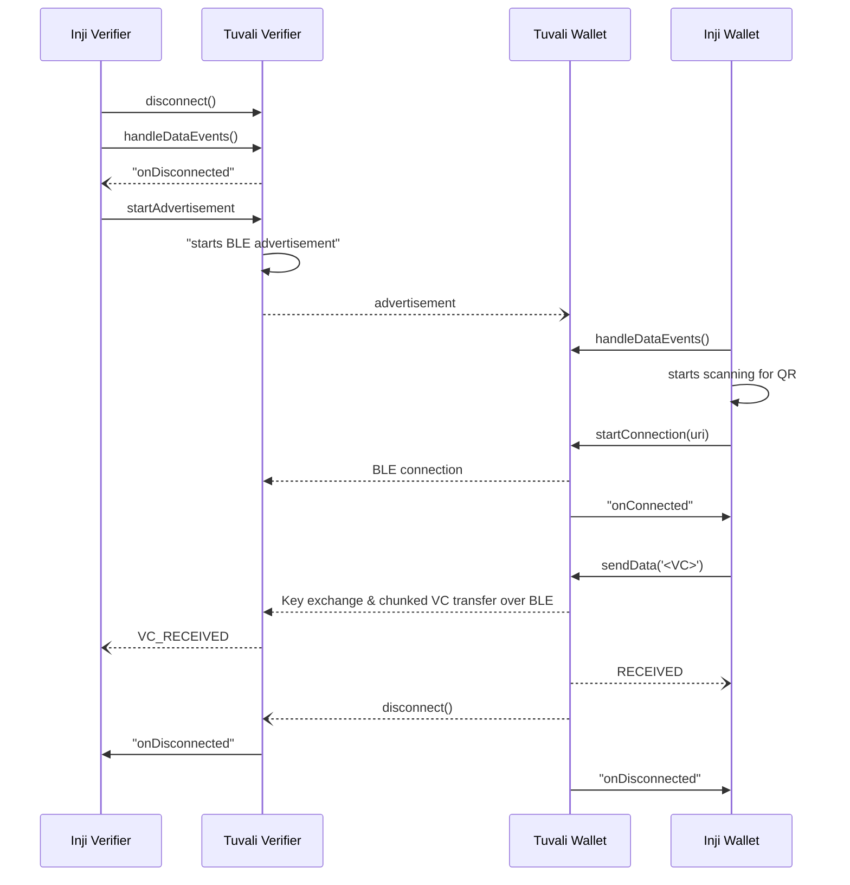

# Tuvali API Documentation

Tuvali module is based on the OpenID for Verifiable Presentations over BLE implementation to support sending vc/vp using Bluetooth Low Energy local channel. 
The below sections explains the APIs of the library in detail.

Firstly, for establishing the secured connection over BLE the connection params which include `name` and `key` needs to be exchanged between the two devices. This exchange of parameters can be accomplished but is not limited to by using a QR code.

For example, use a QR code generator to visually display params and a QR code scanner to get params. A mobile app that displays a QR code can act as an `Verifier` by including its connection params as data in the QR code and another device can act as `Wallet` which scans the QR code, it can extract the connection parameters and initiate a BLE connection with the advertising device.


## URI Exchange and Establishing Connection

### Verifier

The Verifier device generates a URI using the `startAdvertisement()` method and displays it as a QR code. Once the advertisement starts, the Verifier continuously advertises with a payload derived from the URI.

#### URI contains:
```
OPENID4VP://connect?name=STADONENTRY&key=8520f0098930a754748b7ddcb43ef75a0dbf3a0d26381af4eba4a98eaa9b4e6a
```
URI structure can be found in the [spec](https://bitbucket.org/openid/connect/src/master/openid-4-verifiable-presentations-over-ble/openid-4-verifiable-presentations-over-ble-1_0.md).
Currently the library doesnot support iOS as a verifier.But it can act as a wallet for android verifier.

```
var verifier = Verifier()
var uri = verifier.startAdvertisement()
println(uri)
```
### Wallet

### Start Connection

The device that scans the QR code will extract the connection parameters from the QR code and set its connection parameters using the `startConnection()` method :

```
var wallet = Wallet()
wallet.startConnection(uri)
```

The connection param is a URI with a name & a key. The `name` is the client's name & the `key` is the verfier's public key.

```log
OPENID4VP://connect:?name=OVPMOSIP&key=69dc92a2cc91f02258aa8094d6e2b62877f5b6498924fbaedaaa46af30abb364
```

* The `key` part of the data is the same data that will be advertised by the `verifier` device but in hex-encoded form.

&#x20;  E.g: OVPMOSIP://connect:?name=\<\>&key=\<verifier public key\>


## Share data

Once the connection is established, wallet app can send the data in a secured way to the Verifier.
**Note:** At this moment, we currently support data transfer from Wallet to Verifier only.

```
wallet.sendData(payload);
```
and verifier app can acknowledge it.

```
verifier.sendVerificationStatus(status);
```

The following sequence of actions should be performed to transfer data over BLE:

1. Verifier must start advertising by calling `verifier.startAdvertisement(name)` method
2. Subscribe to events using `wallet.handleDataEvents`
3. Initiate the secure connection using `wallet.startConnection(uri)`. The Wallet public keys are exchanged with verifier on successful connection.
4. Wallet calls `wallet.sendData(payload)` to transfer requisite data over BLE.
5. Send VC response - Verifier can exchange "Accept/Reject" status to Wallet with the following message type for `verifier.sendVerificationStatus` method

## Subscribe to events

Data received from other apps via BLE can be subscribed to using:
Tuvali sends multiple events to propagate connection status, received data etc. These events can be subscribed to by calling:

on Wallet:

```
wallet.subscribe {
  event  ->
  // Add the code that needs to run once event is received
}
```

on Verifier:

```
verifier.subscribe {
  event  ->
  // Add the code that needs to run once data is received
}
```
Here are the different types of events that can be received

### Common Events
Events which are emitted by both Wallet and Verifier

1. ConnectedEvent
   * on BLE connection getting established between Wallet and Verifier
2. SecureChannelEstablishedEvent
   * on completion of key exchange between Wallet and Verifier
3. ErrorEvent
   * on any error in Wallet or Verifier
4. DisconnectedEvent
   * on BLE disconnection between Wallet and Verifier


### Wallet Specific Events

1. DataSentEvent
   * on completion of Data transfer from the Wallet Side
2. VerificationStatusReceivedEvent
   * on received verification status from Verifier

### Verifier Specific Events

1. DataReceivedEvent
  * on receiving data from the Wallet Side

## Connection closure

The device on which app is running can destroy the connection by calling disconnect() method:

```
wallet.disconnect();
verifier.disconnect();
```

## Tuvali & Inji Integration

The below diagram explains the series of handshakes between the Verifier and the Wallet device.


