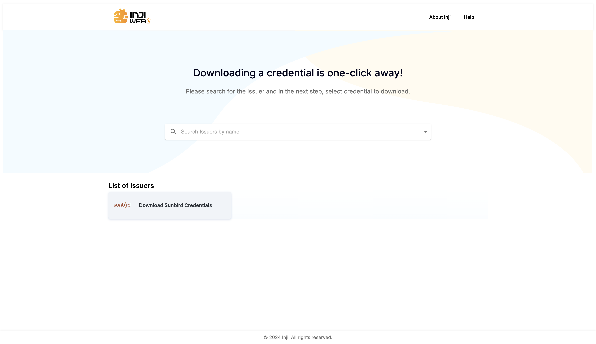
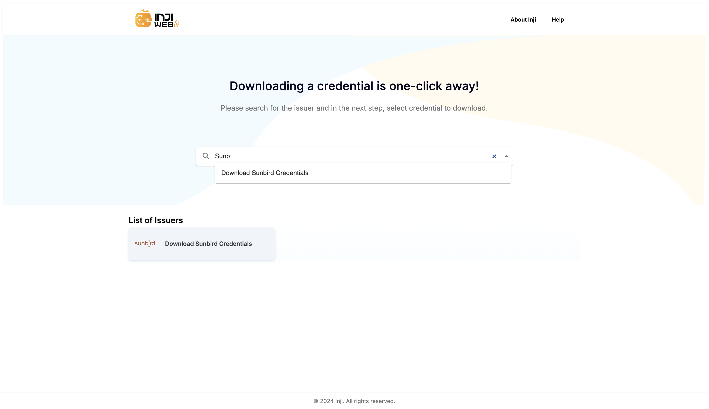
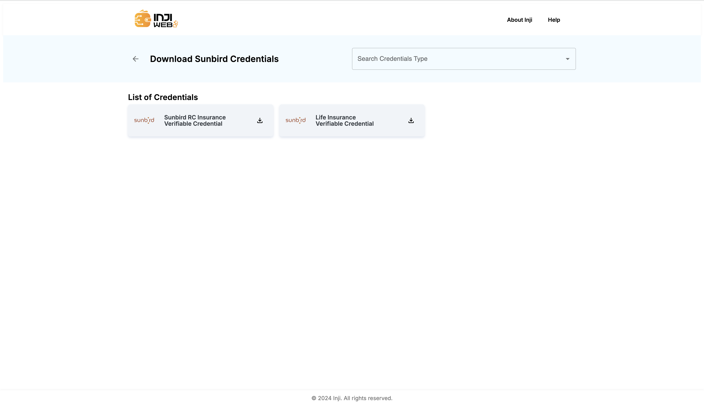
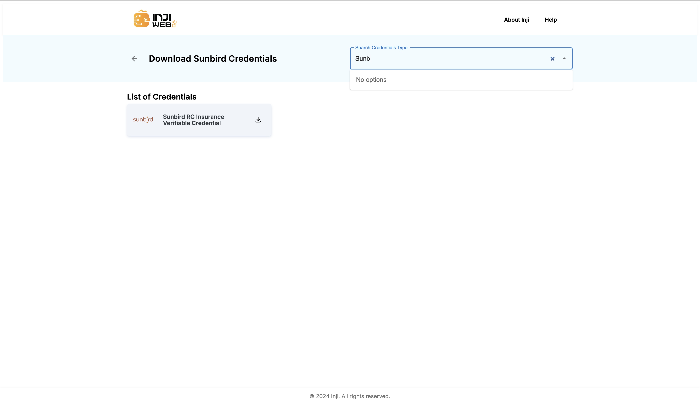
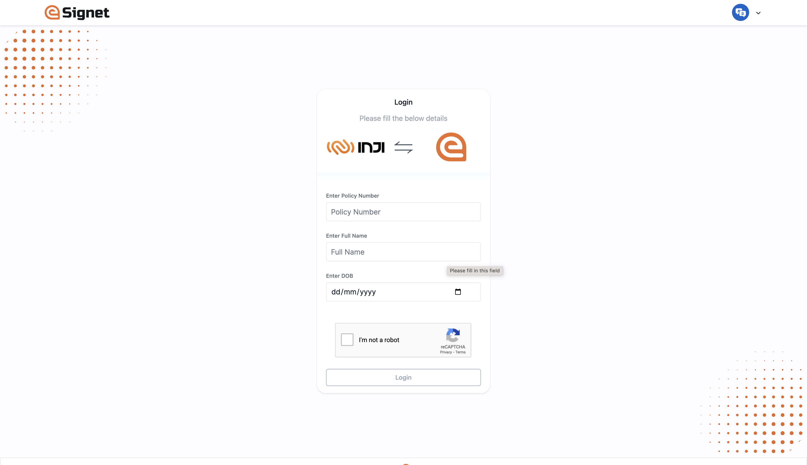
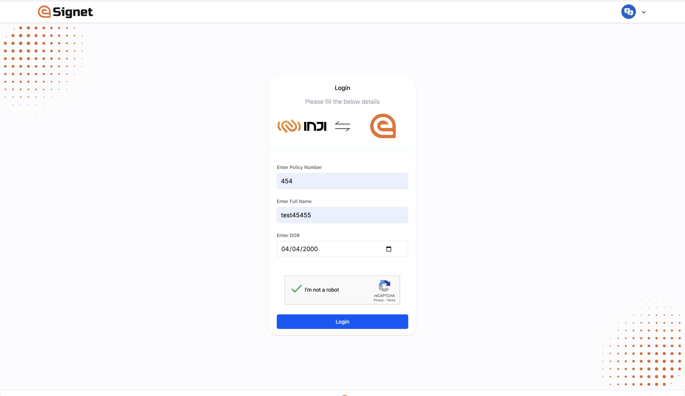
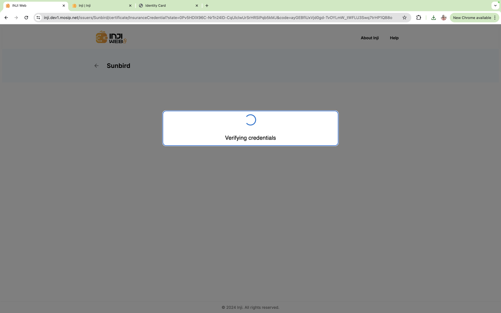
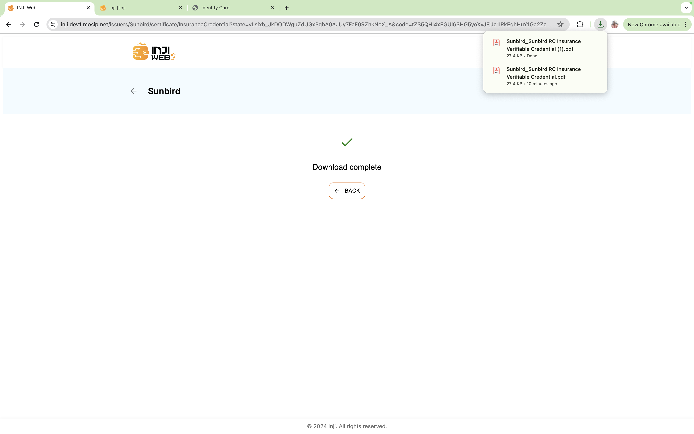
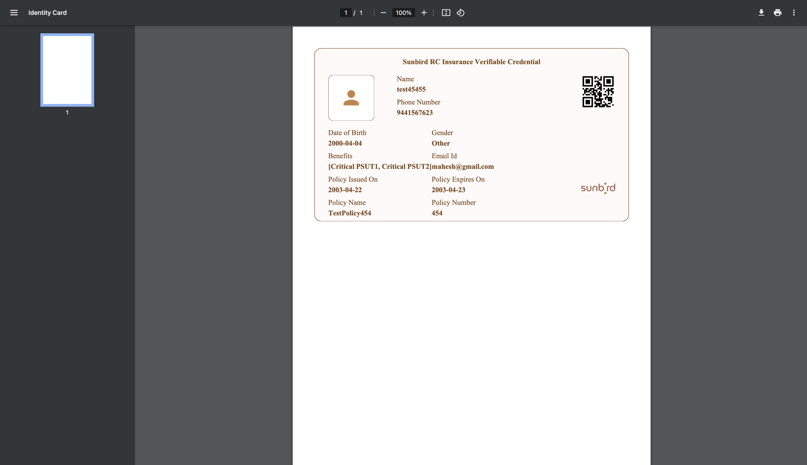

# End User Guide

This document serves as a concise guide for end users, providing comprehensive step-by-step information on the features and functionalities offered by Inji Web.

## Download of VC as PDF

To download a VC using eSignet as an authentication layer, please follow the below mentioned steps:

**Step1**: Launch the Inji Web application in your web browser.

<figure><figcaption>
Launch application
</figcaption></figure>

**Step2**: Search for an issuer by name in **Search** box.

<figure><figcaption>
Search issuer
</figcaption></figure>

**Step3**: In the Home page, from the section, **List of Issuers** section, click on any issuers' tile to land in **Credential Types** selection page.

<figure><figcaption>
Credential Type page
</figcaption></figure>

**Step4**: In the **Credentials Types** selection page, choose a credential type from the List of Credentials section or Search for a credential type in the search box.

<figure><figcaption>
Search credential type
</figcaption></figure>

**Step5**: Click on a Credential Type tile and authenticate in the eSignet page by providing the required details.

**Note**: All the fields are mandatory.

<figure><figcaption>
Authentication page
</figcaption></figure>

<figure><figcaption>
Enter details page
</figcaption></figure>

**Step6**: Credential is downloaded in the background and PDF will be generated and stored in the Downloads folder of the system.

<figure><figcaption>
Verification in background
</figcaption></figure>

<figure><figcaption>
PDF generation
</figcaption></figure>

**Step7**: Upon successful PDF generation, application displays the below mentioned page.

<figure><figcaption>
Success screen
</figcaption></figure>

<figure><figcaption>
Downloaded PDF of VC
</figcaption></figure>

## Help

Help section can be accessed from any page of the application. You can find some FAQs as mentioned here.
