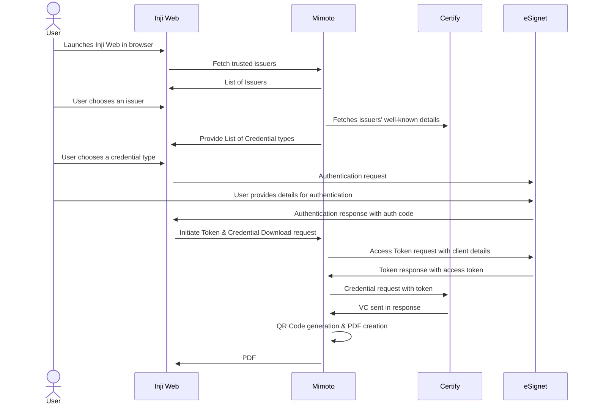

# Workflow

This document outlines the workflow for key functionalities of Inji Web.

### Download Verifiable Credentials as PDF

The image below illustrates the workflow for the VC download process and explains the various components involved in this flow.

_**Reference Implementation**: Download of Insurance VC (Veridonia Insurance) with_ [_eSignet KBI (Knowledge Based Identification)_](https://docs.esignet.io/end-user-guide/knowledge-based-authentication) _as identification partner_

### Components

* **Inji Web**: A web application featuring an intuitive, user-friendly interface for easy VC downloads by the user

* **Mimoto**: The BFF (Backend for Frontend) for Inji Web, which retrieves default configurations and provides all necessary APIs to facilitate downloads. Mimoto receives requests from Inji, performs validations, and forwards them to respective services.

* **eSignet**: Inji Web showcases the VC download process using the **OpenID4VCI** method with **eSignet**. In this workflow, eSignet provides the authentication, authorization and credential issuance end points to connect to the credential provider

* **Durian:** A secure data storage solution integrated with Inji Web, used to store Verifiable Credentials securely. Durian ensures that the credentials are safely stored and readily accessible for users whenever needed, providing strong protection against unauthorized access.

### Understanding the workflow

1.  **User accesses Inji Web portal in browser**:

    i. Users navigate to the Inji Web portal from their web browser

    ii. The portal features a user-friendly interface accessible to all
    
2.  **Selection of Issuer and credential type**:

    i. Users can select an Issuer from the list of trusted issuers

    ii. Users can choose a credential type from the available options provided by the issuers
    
3.  **Verification**:

    i. In this reference implementation, the Insurance use case is demonstrated using Veridonia Insurance Credentials

    ii. Users are required to provide their Policy Number, Date of Birth, and Name for verification

    iii. The provided information is then verified against the issuer's records

4. **Data Storage:**

    i. After successful verification, the Verifiable Credential is securely stored in Durian, the platform’s secure storage solution.

    ii. This ensures that users have reliable and convenient access to their credentials whenever needed, while maintaining strong protection against unauthorized access.

5. **QR Code Generation:**

    i. During the download process, after securely storing the Verifiable Credential, Inji Web generates a QR code that is embedded within the PDF of the Verifiable Credential.

    ii. Based on the set configuration as per the issuer, the QR Code will either contain a Verifiable Presentation request or an embedded Verifiable Credential.

    iii. The QR code facilitates easy sharing and verification of the credential by scanning it or uploading the PDF file to the verifier's system.
    
6. **Credentials Download**:
  
   i. Upon successful verification, the Verifiable Credential is downloaded in PDF format.

   ii. The downloaded PDF, containing the QR code, is saved in the “Downloads” folder on the user’s device.
