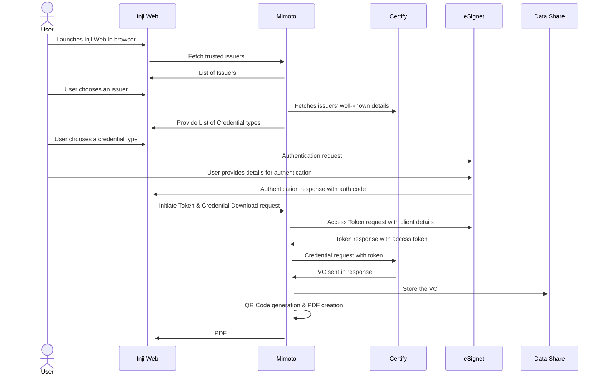
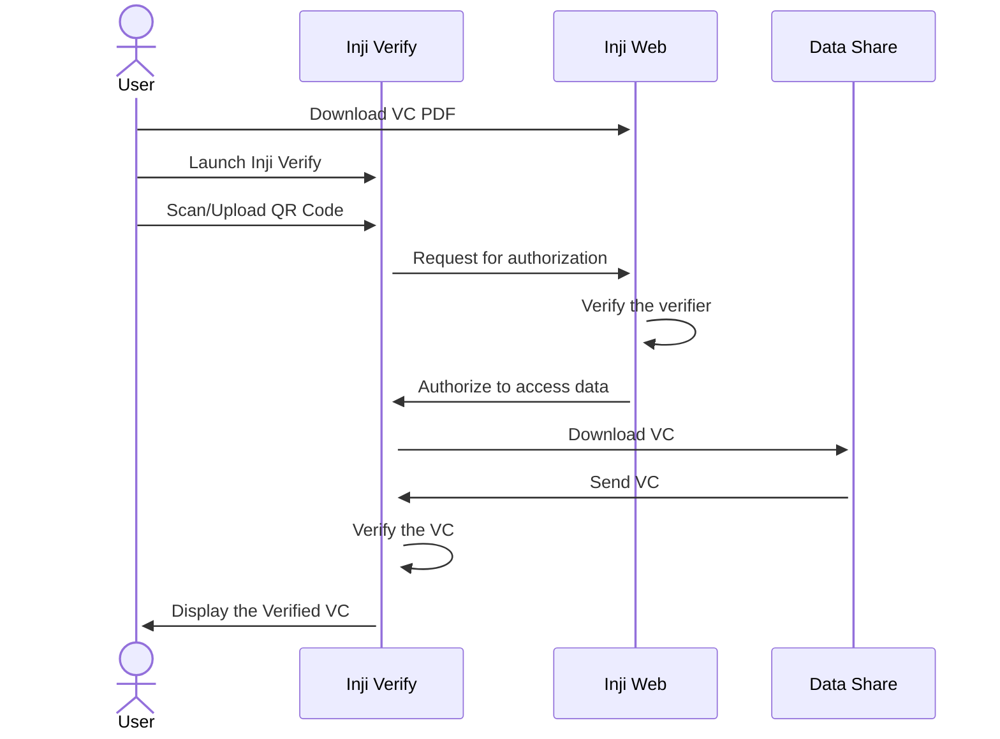

# Workflow

This document outlines the workflow for key functionalities of Inji Web.

### Download & Store Verifiable Credentials as PDF

The image below illustrates the workflow for the VC download process and explains the various components involved in this flow.

_**Reference Implementation**: Download of Insurance VC (Veridonia Insurance) with_ [_eSignet KBI (Knowledge Based Identification)_](https://docs.esignet.io/end-user-guide/knowledge-based-authentication) _as identification partner_

## Components

* **Inji Web**: A web application featuring an intuitive, user-friendly interface for easy VC downloads by the user

* **Mimoto**: The BFF (Backend for Frontend) for Inji Web, which retrieves default configurations and provides all necessary APIs to facilitate downloads. Mimoto receives requests from Inji, performs validations, and forwards them to respective services.

* **eSignet**: Inji Web showcases the VC download process using the **OpenID4VCI** method with **eSignet**. In this workflow, eSignet provides the authentication, authorization and credential issuance end points to connect to the credential provider

* **Durian:** A secure data storage solution integrated with Inji Web, used to store Verifiable Credentials securely. Durian ensures that the credentials are safely stored and readily accessible for users whenever needed, providing strong protection against unauthorized access.

## Understanding the workflow

1.  **Accessing Inji Web**:

    i. Users navigate to the Inji Web portal from their web browser

    ii. The portal features a user-friendly interface accessible to all
    
2.  **Choose an Issuer and credential type**:

    i. Users can select an Issuer from the list of trusted issuers

    ii. Users can choose a credential type from the available options provided by the issuers
    
3.  **Authentication**:

    i. In this reference implementation, the Insurance use case is demonstrated using Veridonia Insurance Credentials

    ii. Users are required to provide their Policy Number, Date of Birth, and Name for verification

    iii. The provided information is then verified against the issuer's records

4. **Verifiable Credentials Storage:**

    i. After successful verification, the Verifiable Credential is securely stored in Durian, the platform’s secure storage solution.

    ii. This ensures that users have reliable and convenient access to their credentials whenever needed, while maintaining strong protection against unauthorized access.

5. **QR Code Generation:**

    i. During the download process, after securely storing the Verifiable Credential, Inji Web generates a QR code that is embedded within the PDF of the Verifiable Credential.

    ii. Based on the set configuration as per the issuer, the QR Code will either contain a Verifiable Presentation request or an embedded Verifiable Credential.

    iii. The QR code facilitates easy sharing and verification of the credential by scanning it or uploading the PDF file to the verifier's system.
    
6. **Credentials Download**:
  
   i. Upon successful authentication, the Verifiable Credential is downloaded in PDF format.

   ii. The downloaded PDF, containing the QR code, is saved in the “Downloads” folder on the user’s device.

### Share Verifiable Credentials as PDF

The image below illustrates the workflow for the VC Share process and explains the various components involved in this flow.

_**Reference Implementation**: Sharing of Insurance VC (Veridonia Insurance) 

## Components

* **Inji Web**: A web application featuring an intuitive, user-friendly interface for easy VC downloads by the user

* **Inji Verify**: Inji Verify is a powerful verification platform designed to authenticate and validate Verifiable Credentials (VCs). It allows users or organizations to scan QR codes or upload credential files for secure and efficient verification. Built with flexibility and compliance with OpenID standards, Inji Verify ensures seamless integration with trusted credential providers for smooth and reliable credential validation.

* **Mimoto**: The BFF (Backend for Frontend) for Inji Web, which retrieves default configurations and provides all necessary APIs to facilitate downloads. Mimoto receives requests from Inji, performs validations, and forwards them to respective services.

* **Data Share:** A secure data storage solution integrated with Inji Web, used to store Verifiable Credentials securely. Data Share ensures that the credentials are safely stored and readily accessible for users whenever needed, providing strong protection against unauthorized access.

## Understanding the workflow

**Downloading the Verifiable Credential:**

i. The user accesses Inji Web to download the Verifiable Credential in PDF format, which contains an embedded QR code.

ii. The QR code is used for sharing and allows verifiers to easily verify the credential by scanning or uploading it.

**Launching Inji Verify:**

i. Once the user is ready to share their Verifiable Credential, they launch the Inji Verify platform.

ii. Inji Verify is where verifiers can either scan the QR code from a printed or digital PDF or upload the PDF containing the QR code.

**Authorization and Verification Request:**

i. After the user uploads the QR code to Inji Verify, the platform sends a request to Inji Web for authorization to access the user's credential data.

ii. Inji Web verifies the legitimacy of the verifier and proceeds to authorize the request.

**Retrieving Verifiable Credential:**

i. Once authorized, Inji Verify communicates with the Data Share component to retrieve the stored Verifiable Credential.

ii. Data Share securely provides the Verifiable Credential to Inji Verify.

**Verification and Display:**

i. Inji Verify checks the authenticity of the Verifiable Credential and confirms its validity.

ii. The user or verifier is then shown the verified Verifiable Credential, confirming that the sharing process was successful.

