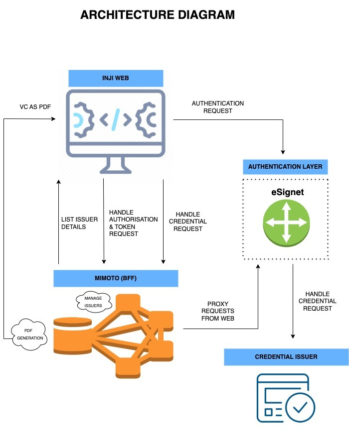

# Architecture

Inji Web is an intuitive, user-friendly portal designed to helps users to access Verifiable Credentials.

The architecture diagram below illustrates the structure and components of Inji Web, offering a detailed explanation of how the platform operates and how its various elements interact to deliver its features and functionality.

<figure><figcaption></figcaption></figure>

### Architecture Components

Let's briefly explore the key components of the architecture that constitute Inji Web:

1. **INJI WEB**: The user-facing web portal, built on React, that facilitates the download of Verifiable Credentials
2. **BFF**: Mimoto serves as the Backend For Frontend (BFF) layer for Inji Web. Onboarded as an OIDC client for the credential provider, Mimoto help Inji Web in routing requests from the web to the authentication layer
3. **AUTHENTICATION LAYER**: In this implementation, eSignet functions as the Authentication layer to authorise the client (user), provide access tokens and to prepare the credentials by fetching data from the credential issuer
4. **CREDENTIAL ISSUER**: Any credential issuer that supports the OpenID4VCI protocol, is listed as a trusted issuer. These issuers provide user data necessary for Verifiable Credential creation and download
