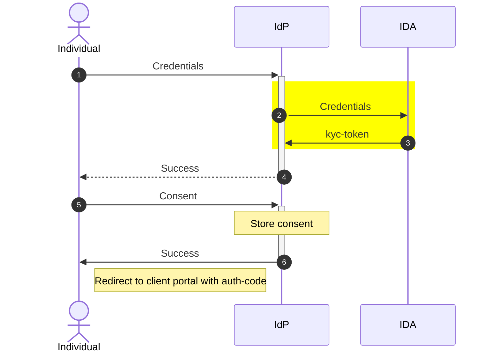
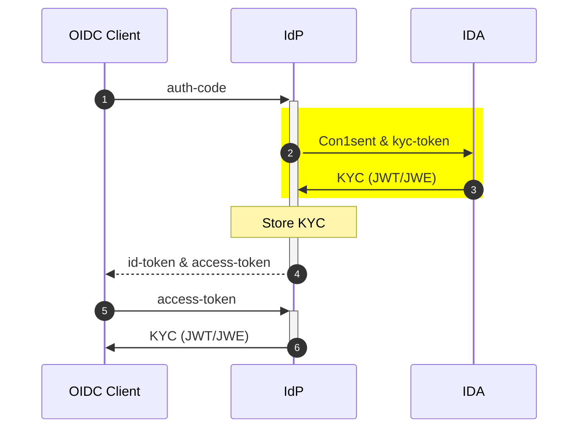

# Authentication System

## Overview

System to authenticate an individual and provide consented details of the authenticated individual. Adhering to this principle we have the integration with the authentication system divided into two APIs:

### KYC-AUTH API: Authenticate the end user and return a KYC-token



### KYC-EXCHANGE API: Exchanges KYC-token for the user



## Interface

The authentication system must implement the below authentication wrapper interface.

```java
public interface AuthenticationWrapper {

    /**
     * Delegate request to authenticate the user, and get KYC token
     * @param relyingPartyId Relying Party (RP) ID. This ID will be provided during partner self registration process
     * @param clientId OIDC client Id. Auto-generated while creating OIDC client in PMS
     * @param kycAuthDto
     * @return KYC Token and Partner-specific User Token (PSUT)
     * @throws KycAuthException
     */
    KycAuthResult doKycAuth(String relyingPartyId, String clientId, KycAuthDto kycAuthDto)
            throws KycAuthException;

    /**
     * Delegate request to exchange KYC token with encrypted user data
     * @param relyingPartyId Relying Party (RP) ID. This ID will be provided during partner self registration process
     * @param clientId OIDC client Id. Auto-generated while creating OIDC client in PMS
     * @param kycExchangeDto
     * @return signed and encrypted KYC data.
     * @throws KycExchangeException
     */
    KycExchangeResult doKycExchange(String relyingPartyId, String clientId, KycExchangeDto kycExchangeDto)
            throws KycExchangeException;

    /**
     * Delegate request to send out OTP to provided individual Id on the configured channel
     * @param relyingPartyId Relying Party (RP) ID. This ID will be provided during partner self registration process
     * @param clientId OIDC client Id. Auto-generated while creating OIDC client in PMS
     * @param sendOtpDto
     * @return status of send OTP response.
     * @throws SendOtpException
     */
    SendOtpResult sendOtp(String relyingPartyId, String clientId, SendOtpDto sendOtpDto)
            throws SendOtpException;

    /**
     * supported OTP channel to validate in Send-OTP request.
     * @return true if supported, otherwise false
     */
    boolean isSupportedOtpChannel(String channel);

    /**
     * Get the list of KYC signing certificates and their details.
     * @return list
     */
    List<KycSigningCertificateData> getAllKycSigningCertificates();

}
```

The authentication wrapper implementation class must be annotated with ConditionalOnProperty based on "mosip.idp.authn.wrapper.impl" property as below:

```
@ConditionalOnProperty(value = "mosip.idp.authn.wrapper.impl", havingValue = "mock-authentication-service")
@Component
@Slf4j
public class MockAuthenticationService implements AuthenticationWrapper {
...
}
```

## Plan

#### Case 1

The authentication system has a single endpoint (authenticate and returns KYC)

#### Case 2

The authentication system has an endpoint only to authenticate.

```
```
