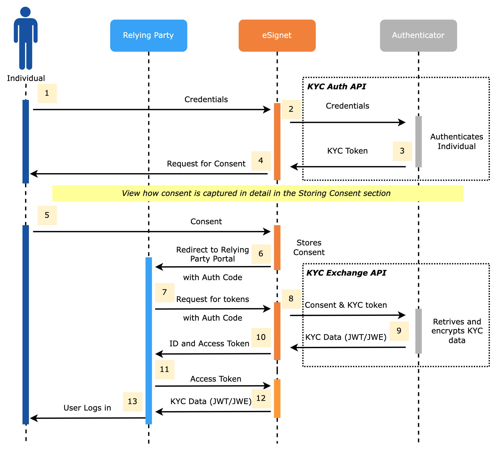
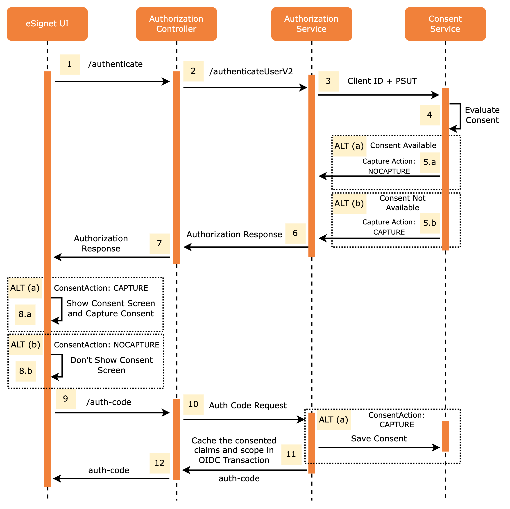
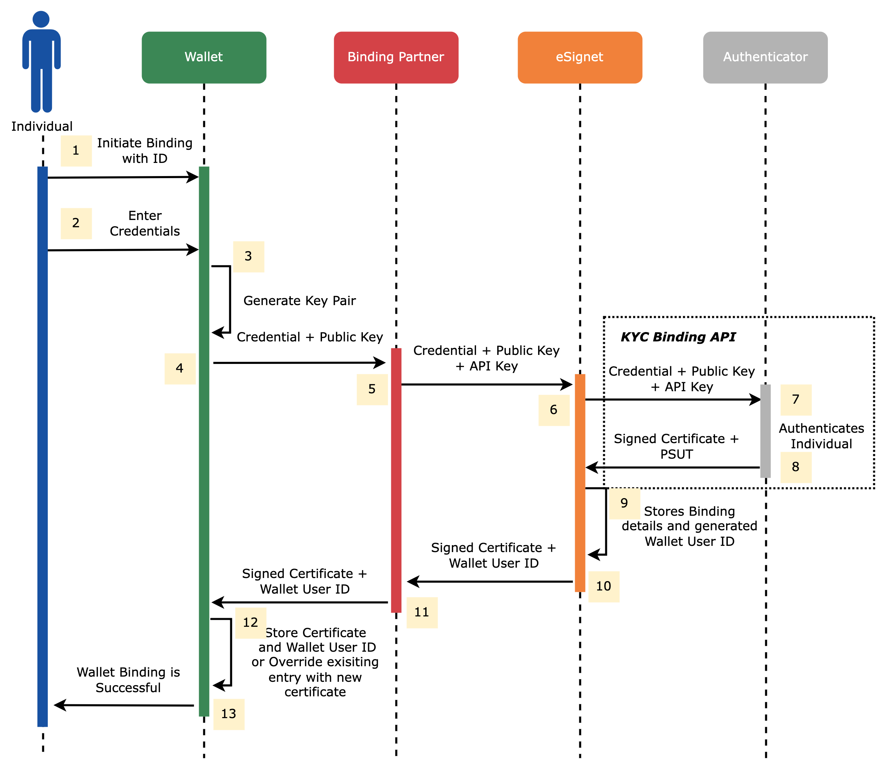

# ID System

This system is an identity repository that stores the individual's demographic and biometric information to authenticate and provide user information. As part of this integration with eSignet, the authentication system should implement the below interfaces.

## Authenticator

This is the main interface for eSignet. Provides methods to authenticate the end-user with control of the supported authentication factors. If OTP is one of the supported authentication factors, the interface provides a method to define the supported OTP channels and implement the send-OTP functionality.

As per OIDC standards, all the certificates used to verify the user data must be published at [_**/.well-known/jwks.json**_](../../build-and-deploy/configuration/.well-known/jwks.json.md) the endpoint. This interface provides a method to return a list of X509 certificates (both active and expired).

Refer to this [link](https://github.com/mosip/esignet/blob/1.0.0/esignet-integration-api/src/main/java/io/mosip/esignet/api/spi/Authenticator.java#L22-L69) to check out the interface in detail.

The two main functionalities of this interface, **KYC Auth** and **KYC Exchange,** are depicted in the diagram below:

<figure><figcaption></figcaption></figure>

The Authenticator implementation class must be annotated with `ConditionalOnProperty` with `mosip.esignet.integration.authenticator` property. Ex:

```java
@ConditionalOnProperty(value = "mosip.esignet.integration.authenticator", havingValue = "mock-authentication-service")
@Component
@Slf4j
public class MockAuthenticationService implements Authenticator {
    //Implement authenticator methods
}
```

### Storing Consent

Storing consent in eSignet is now done via the built-in **Consent Registry** designed to store user consent on claims and scopes requested during login to a relying party application using eSignet or the Wallet application ([Inji](https://docs.mosip.io/inji/)).

Key highlights of this feature are:

* Storage of user consent against the requested claims and scopes in the database
* If consent is already provided, the consent screen is bypassed when the user logs in using eSignet.
* Recapture consent in event of changes in requested claims or scopes.

The diagram below illustrates the internal mechanism of storing consent in eSignet.



## Key Binder

This interface provides a method to bind a `individualId` with a public key. On successful binding, it returns a signed certificate `walletUserId` which uniquely identifies the user. It is expected that the `KeyBinder` implementation takes care of overriding previously bound certificates with the newly generated signed certificate for a user.

The individual needs to be authenticated before binding the key. It is structured to accept any type of auth challenge, namely OTP/ BIO.

The bound certificate will then be usable to do token-based authentication like WLA (Wallet Local Authentication) from any digital wallet app.

Refer to this [link](https://github.com/mosip/esignet/blob/1.0.0/esignet-integration-api/src/main/java/io/mosip/esignet/api/spi/KeyBinder.java#L17-L45) to check the interface in detail.

### Key Binding Process



### Authentication with Bound Key

.png>)

The KeyBinder implementation class must be annotated with `ConditionalOnProperty` with `mosip.esignet.integration.key-binder` property. Ex:

```java
@ConditionalOnProperty(value = "mosip.esignet.integration.key-binder", havingValue = "mock-keybinder-service")
@Component
@Slf4j
public class MockKeyBindingWrapperService implements KeyBinder {
    //Implement keybinder methods
}
```

## AuditPlugin

This interface provides two methods to audit any action in eSignet. An instance of this audit plugin is injected into all the services of eSignet, and almost all the events are audited.

Refer to this [link](https://github.com/mosip/esignet/blob/1.0.0/esignet-integration-api/src/main/java/io/mosip/esignet/api/spi/AuditPlugin.java#L12-L34) to check the interface in detail.

The Audit plugin implementation class must be annotated with `ConditionalOnProperty` with `mosip.esignet.integration.audit-plugin` property. Ex:

```java
@ConditionalOnProperty(value = "mosip.esignet.integration.audit-plugin", havingValue = "mock-audit-service")
@Component
@Slf4j
public class LoggerAuditService implements AuditPlugin {
    //Implement audit plugin methods
}
```
