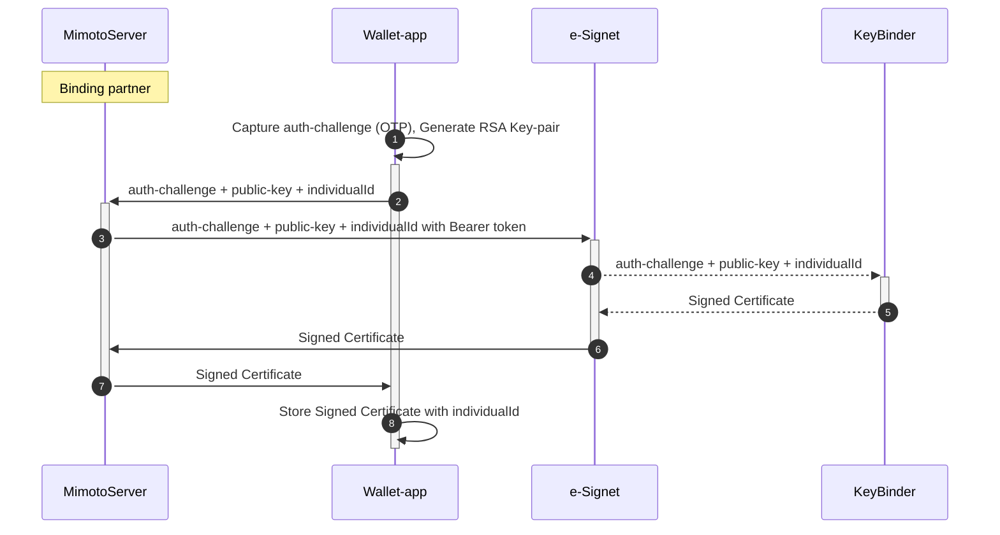

# Digital Wallet

## What is a digital ID wallet?

A digital ID wallet is a tool or software-based system that stores and manages personal information and identity credentials securely in a digital format. It helps people keep their information organized and protected. This wallet ensures the safety of personal data and makes it easily accessible when needed.


To learn more about Digital ID Wallets and their use, you can refer this article on [Digital ID Wallet Comprehensive Guide](https://www.identity.com/digital-id-wallet-comprehensive-guide/).


## How is digital wallet used in eSignet?

Digital Wallet in eSignet can be used as,

* An application to store verifiable credentials for a holder
* An authenticator application to provide wallet local authentication

### Digital Wallet as Credential Holder

### Digital Wallet as Authenticator

eSignet provides endpoints to bind a public key to an individual.


[e-Signet.yml](../../.gitbook/assets/e-Signet.yml)


Once the public key is successfully bound to an individual ID, the server-signed certificate and it's `walletUserId` is returned to the wallet app. Wallet-app should store the certificate in a secure storage mapped with `walletUserId`.

_Note_: Binding multiple VIDs with a public key through a particular binding partner will always return the same `walletUserId`. However, only the latest server-signed certificate is valid.

### How to use a Server-signed certificate?

A server-signed certificate is used in the QR-code login flow of eSignet.

1. The end user scans the QR code on the eSignet UI using the digital wallet app.
2. The digital wallet app reads the link code in the scanned QR code.
3. The digital wallet sends a request to the eSignet server to start a transaction with the link code.


[e-Signet.yml](../../.gitbook/assets/e-Signet.yml)


4. On a successful link, the e-Signet server responds back with a supported list of authentication factors namely WLA(Wallet Local Auth).
5. Digital wallet app locally authenticates the end user. (Ex: selfie authentication)
6. On successful local verification of the end user, the wallet app creates a JWT signed with a certificate bound to the end user. This signed JWT is sent to the eSignet server.


[e-Signet.yml](../../.gitbook/assets/e-Signet.yml)


7. Digital wallet captures the end-user consent to share his/her data with the relying party.


[e-Signet.yml](../../.gitbook/assets/e-Signet.yml)


8\. eSignet UI now automatically detects the successful consent on the link code and redirects the end-user to the relying party portal with an authorization code.
