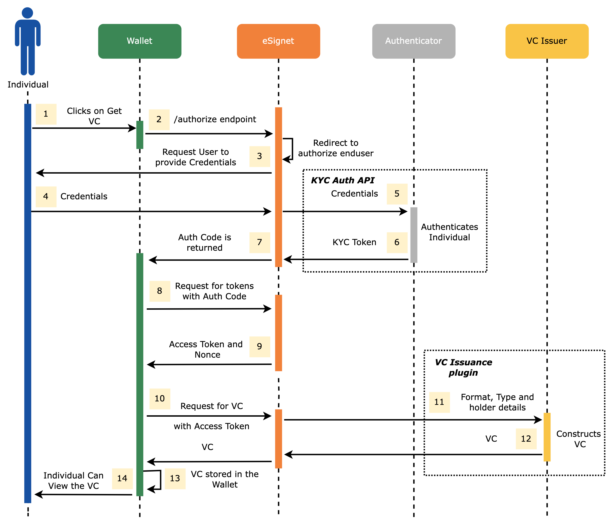

# VC Issuance

VC Issuer is a system that can issue a verifiable credential (VC) in [W3C formats](https://www.w3.org/TR/vc-data-model/) for an entity. As eSignet is an OAuth and OIDC-based solution, we have enhanced it to support [OpenID4VCI](https://openid.github.io/OpenID4VCI/openid-4-verifiable-credential-issuance-wg-draft.html) flow, in particular wallet-initiated flow.

This document explains the VC Issuance flow and provides a guide to how a VI Issuer and Wallet can integrate with eSignet for VC Issuance.

## VC Issuance Flow

[OpenID4VCI](https://openid.github.io/OpenID4VCI/openid-4-verifiable-credential-issuance-wg-draft.html) specification by the OpenID Foundation defines a wallet-initiated flow and an issuer-initiated flow for VC issuance. eSignet currently supports only the wallet-initiated flow, with VC being directly sent in the response (just in time) for credential requests.

Below is the flow diagram of the wallet-initiated flow for VC issuance.

<figure><figcaption></figcaption></figure>

## VC Issuer Integration

As part of this integration with eSignet, the verifiable credential system should implement the below [VCIssuancePlugin](vc-issuer.md#vc-issuance-plugin) interface.

### VC Issuance Plugin

This interface currently supports linked data-proof VC (as JSON-LD) and VC as JWT. The type of VC requested and the format in which VC is expected is passed as input to the implementation. Authorization details about the holder present in the bearer token are also one of the inputs to the VC plugin implementation. eSignet currently mandates the cryptographic binding of the VC to the holder.

The public key proved to be possessed by the holder is used to generate "`did:jwk`" and the same is passed to the "_**holderId**_". It is expected that the implementation will add the "_**holderId**_" as the "_**credentialSubjectID**_".


Cryptographic binding of the VC to the holder proves that the VC was issued to the key holder and also enables the VC verifier to guarantee that the presenter is indeed the holder of the VC.


The `VCIssuancePlugin` implementation class must be annotated with `ConditionalOnProperty` with `mosip.esignet.integration.vci-plugin` property.

```java
@ConditionalOnProperty(value = "mosip.esignet.integration.vci-plugin", havingValue = "TestVCIPluginImpl")
@Component
@Slf4j
public class TestVCIPluginImpl implements VCIssuancePlugin {
	//Implement methods
}
```

## Wallet Integration

In the VC Issuance flow, we consider the digital wallets as a relying party where an individual would try to authenticate with eSignet and get his/her credentials onboarded into the wallet.

### Get a valid redirect deep link

eSignet follows the OpenID4VCI wallet-initiated flow, hence, once authentication is successful, eSignet will be sharing an auth code to the wallet. Hence, for the integration, the wallet would need to create a valid redirect deep link first.

### Get an OAuth client credentials

The relying party (here, the wallet) can use the eSignet client management APIs to register as an OAuth client and get the client credentials which would help them connect with eSignet.


[e-Signet.yml](../.gitbook/assets/e-Signet.yml)


### Call the authorize endpoint

Call the "_**/authorize**_" endpoint of eSignet from the wallet to authenticate the credential holder and receive consent.


[e-Signet.yml](../.gitbook/assets/e-Signet.yml)


Once the user successfully authenticates and provides consent, the authorization code is returned to the wallet app via the configured **redirect deep link.**

### Retrieving the access token and c\_nonce

The authorization code parameter in the redirected deep link should be extracted and **exchange authorization code to access token and c\_nonce** from the eSignet server.


Many OAuth 2.0 client libraries are available in most programming languages to perform this action.


### Generate key pair

Generate a key pair for the wallet holder, and use the private key from the key pair to sign the c\_nonce. This is used to prove the possession(PoP) of the private key is the wallet holder.

### Get the credential using VCI credential API

Invoke `/vci/credential` REST endpoint of e-Signet with PoP and the credential format metadata to get the VC.

### Store the credentials in the wallet

Securely store acquired VC in the wallet.
