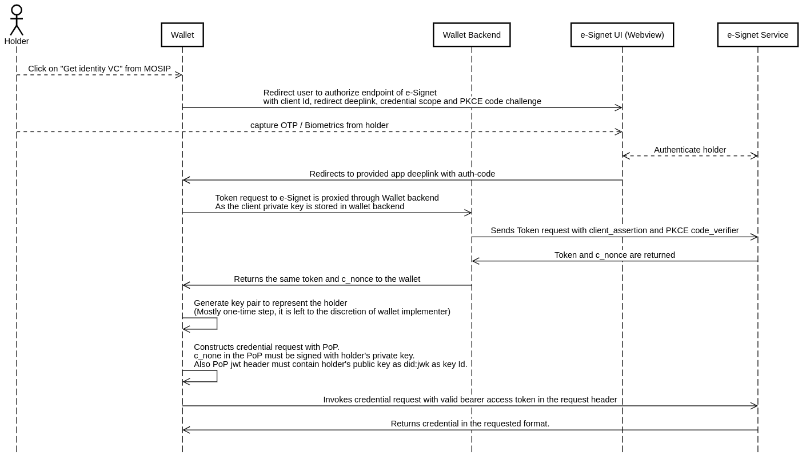

# Credential Holder

A digital wallet that aims to function as a credential holder application in eSignet must go through the onboarding process as a relying party. This document outlines the necessary steps for a wallet to utilize eSignet for downloading credentials issued by a VC Issuer using the[ OpenID4VCI authorization code flow](https://openid.net/specs/openid-4-verifiable-credential-issuance-1\_0.html#name-authorization-code-flow).

The sequence diagram below illustrates the steps involved in the authorization code flow that are required for downloading a verified credential.

<figure><figcaption></figcaption></figure>

**Note**:

* Currently, only the `ldp_vc` format in the [Credential request](https://openid.net/specs/openid-4-verifiable-credential-issuance-1\_0.html#name-credential-request-4) is supported.
* Also, the [Pre-Authorized Code Flow](https://openid.net/specs/openid-4-verifiable-credential-issuance-1\_0.html#name-pre-authorized-code-flow) is not supported as yet.
* The `private-key-jwt` is supported to enforce better security.


To gain a better understanding of the VC Issuance flow in eSignet, please refer to the [activity diagram ](../vc-issuance.md#appendix-vc-issuance)provided in the [VC Issuance Plugin](../vc-issuance.md) document.


Below are the steps for on-boarding a digital wallet as an OAuth Client and using the eSignet APIs to download verifiable credentials.

### Onboard as OAuth Client

#### 1. Get a valid redirect deep link

eSignet adheres to the OpenID4VCI wallet-initiated flow. Consequently, after authentication is successfully completed, eSignet will provide the wallet with an authorization code. Thus, in order to integrate, the wallet must first generate a valid redirect deep link.

#### 2. Get OAuth client credentials

The wallet can utilize the eSignet client management APIs to formally register as an OAuth client and obtain the necessary client credentials. This will facilitate their connection with eSignet.


[esignet-1.2.0 (1).yml](<../../.gitbook/assets/esignet-1.2.0 (1).yml>)


To register the client in our Sandbox environment, click [here](../../try-it-out/).

### **Authorization Code flow**

#### 1. Call the authorize endpoint

In order to initiate the credential issuance flow, the credential holder needs to authenticate and provide consent. Hence, the wallet needs to create a button to initiate authentication using eSignet by calling the "_**/authorize**_" endpoint.


[esignet-1.2.0 (1).yml](<../../.gitbook/assets/esignet-1.2.0 (1).yml>)


This process would redirect the user to a web view of eSignet's authentication screen. In this screen, the user will need to authenticate their identity and give consent to share their credentials.

Upon successful authentication and consent, the authorization code will be sent back to the wallet application through the designated **redirect deep link** that has been configured.

#### 2. Retrieving the access token and c\_nonce

The wallet app now needs to extract the authorization code (auth-code) parameter in the redirected deep link and exchange the **authorization code** to get the **access token and c\_nonce** from the eSignet server.


[esignet-1.2.0 (1).yml](<../../.gitbook/assets/esignet-1.2.0 (1).yml>)



Many OAuth 2.0 client libraries are available in most programming languages to perform this action.


#### 3. Generate key pair

The wallet now needs to generate a key pair for the wallet holder and use the private key from the key pair to sign the _**c\_nonce**_. This will be used to determine that the [Proof of Possession](https://openid.net/specs/openid-4-verifiable-credential-issuance-1\_0.html#name-proof-types) (PoP) of the private key is the wallet holder.

Corresponding public key is accepted as `did:jwk` in the PoP.

**Note:**

* eSignet does not mandate to create a different key pair for a holder on each credential request. it is left to the discretion of the wallet implementer.
* Only `jwt` Proof Type is currently supported.

#### 4. Get the credential using VCI credential API

Now, the wallet can invoke the "_**/vci/credential**_" endpoint of eSignet with PoP (Proof of Possession) and share the credential format metadata to get the Verifiable Credential in the requested format.

Only the `ldp_vc` format in the [Credential request](https://openid.net/specs/openid-4-verifiable-credential-issuance-1\_0.html#name-credential-request-4) is supported.


[esignet-1.2.0 (1).yml](<../../.gitbook/assets/esignet-1.2.0 (1).yml>)


Once the credential is obtained, the wallet should be responsible for securely storing it.
