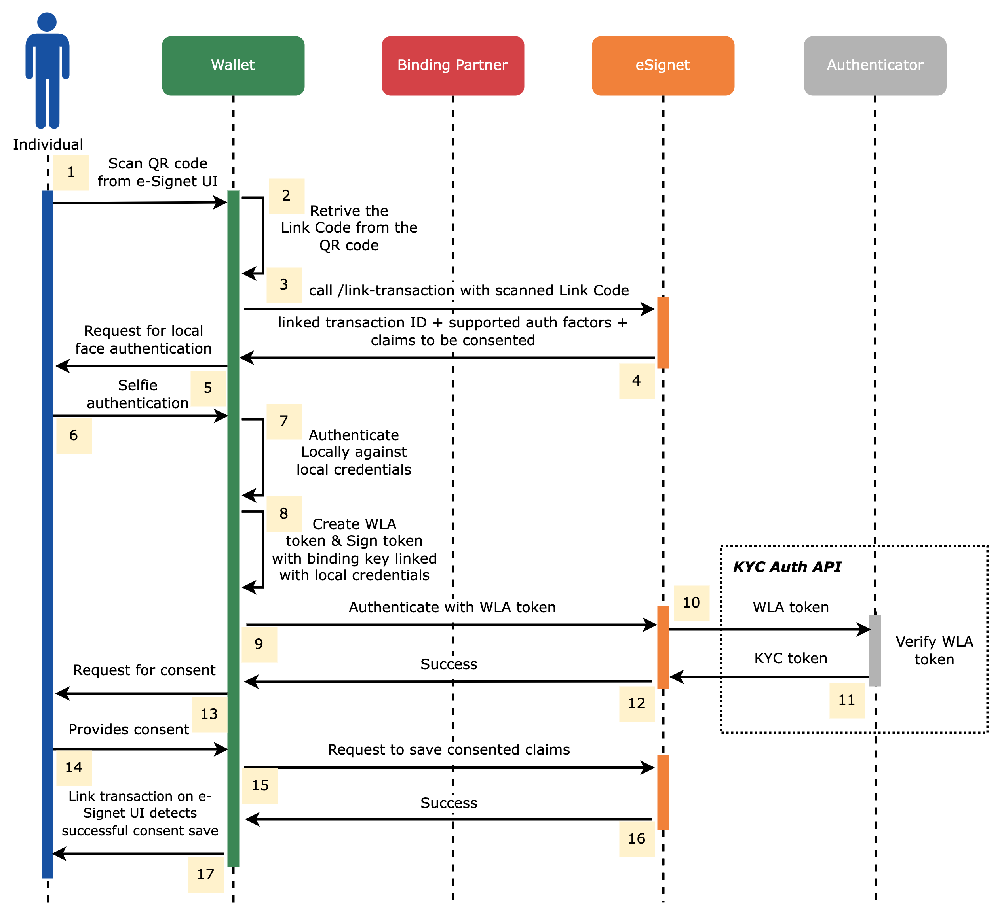

# Wallet Authenticator

In order for a digital wallet to function as an authenticator using eSignet, it is necessary to have the user's credentials and ensure that the user's ID in the credential is securely linked to eSignet.


For details on how to get the user's credentials downloaded on eSignet, go through our document on - [How a digital wallet can be used as credential holder?](credential-holder.md)

For details on how binding is performed in eSignet, refer to the document on - [eSignet's Key Binding Plugin](../key-binder.md).


In this document, we will be discussing the application programming interfaces (APIs) that need to be invoked by the wallet application for executing the process of binding and subsequently performing wallet local authentication.

## Wallet Binding APIs

As previously stated, prior to initiating authentication in eSignet, it is necessary to associate the user's ID with the wallet's public key.

eSignet offers endpoints to request a one-time password (OTP) for this association, followed by another API to bind the public key of the wallet to the user's ID.


[esignet-1.2.0 (1).yml](<../../.gitbook/assets/esignet-1.2.0 (1).yml>)



[esignet-1.2.0 (1).yml](<../../.gitbook/assets/esignet-1.2.0 (1).yml>)


Here, the challenge can be the OTP, or any other authentication type supported by eSignet, like biometrics.

Once the user successfully completes the binding process, their wallet will be assigned a unique user ID and receive a signed certificate from eSignet. This certificate will have an expiration time, and as a result, it will be necessary for the user to periodically reinitiate the wallet binding. It is important for the wallet to securely store this certificate and associate it with the respective Wallet User ID for proper mapping.


When multiple VIDs are bound to a public key using a specific type of wallet, they will consistently produce the same Wallet User ID. However, only the most recent certificate signed by eSignet will hold validity. Therefore, if a user switches to a new device and proceeds to bind their wallet on that device, any signed certificates saved on the previous device will no longer be valid.


## Wallet Authentication APIs

To utilize the wallet with a secured credential for authentication, users are required to follow these steps:

* Firstly, users need to visit a relying party website that has enabled eSignet authentication through the wallet.
* Next, users should use the wallet application to scan the QR code provided on the website. This will establish a connection and initiate the authentication process.
* The wallet application will identify a link code within the QR code, which is essential for initiating the authentication.
* To begin the authentication, the wallet will send the link code to the eSignet server using the _**"/linked-authorization/v2/link-transaction"**_ endpoint.


[esignet-1.2.0 (1).yml](<../../.gitbook/assets/esignet-1.2.0 (1).yml>)


* Once the transaction has been successfully initiated, the eSignet server will respond by providing a list of authentication factors known as WLA (Wallet Local Authentication).
* The wallet will then proceed to authenticate the user locally, possibly by comparing a selfie with the existing credentials stored on the phone.
* Upon successful local authentication on the wallet, it should generate a signed JWT (JSON Web Token) using the provided signed certificate from the wallet binding process.
* Subsequently, the wallet will send the signed JWT to the eSignet server via the "/link-authorization/v2/authenticate" endpoint, using WLA as the challenge.


[esignet-1.2.0 (1).yml](<../../.gitbook/assets/esignet-1.2.0 (1).yml>)


* After the process of authentication is completed successfully, the eSignet server will proceed to send the consent action.
* The consent action can have two possible values: CAPTURE or NO CAPTURE. These values indicate whether the user should capture their consent or not.
* In the event that the authentication response includes a consent action of CAPTURE, the wallet will prompt the user to provide their consent. The wallet will then proceed to share the captured consent with the eSignet server through the use of the _**"/link-authorization/v2/consent"**_ endpoint.


[esignet-1.2.0 (1).yml](<../../.gitbook/assets/esignet-1.2.0 (1).yml>)


* The eSignet user interface now has the capability to automatically detect when consent has been given by the user. Subsequently, the authentication code will be sent to the redirect URI of the relying party.

## Appendix - Wallet Local Authentication

The diagram below illustrates the process of wallet local authentication in eSignet through the use of a digital wallet.

<figure><figcaption></figcaption></figure>
