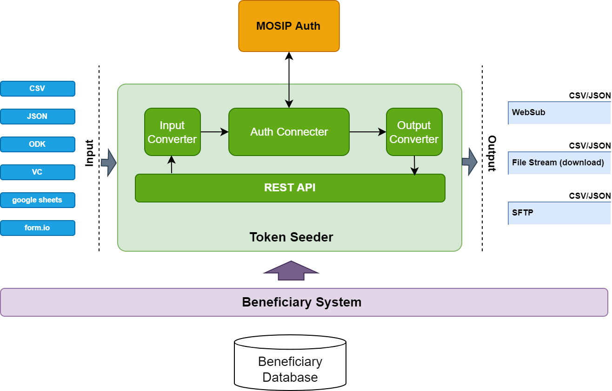
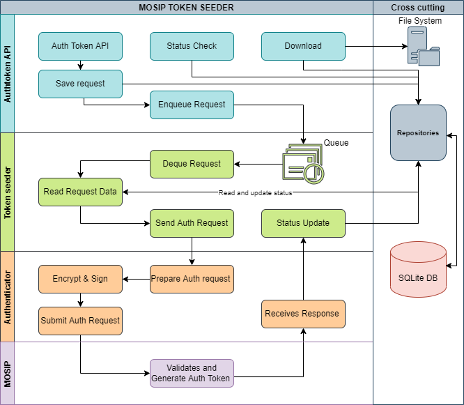

# MOSIP Token Seeder

## Overview

MOSIP Token Seeder (**MTS**) is a standalone service that outputs [MOSIP Token ID](https://docs.mosip.io/1.2.0/id-lifecycle-management/identifiers#token-id) for a given input list of UIN/VIDs after performing authentication with [IDA](https://docs.mosip.io/1.2.0/id-authentication). The service is a convenience module that makes it easy for [Relying parties](https://docs.mosip.io/1.2.0/id-authentication#relying-parties-and-policies) to perform bulk authentication to onboard users to their systems. Refer [use cases](./#use-cases) section for details on the usage of MTS.

## Features of MTS

* Bulk upload
* Support for multiple [inputs ](./#inputs)and [outputs ](./#outputs)(see diagram below). For instance, a CSV file may be uploaded, and the downloaded file will contain a column with tokens populated.
* Support for multiple [delivery types](./#delivery-type)
* REST interface
* PII at rest is encrypted. Further, the PII is erased after processing
* Works in asynchronous mode - queues all the requests
* [Processing](./#processing):
  * Processes multiple records per request
  * Processes multiple requests simultaneously
* Enables [configurations](./#configurations):
  * Output formatting of fields
  * Setting up fields as mandatory/optional
  * Defining data clean-up policy

<figure><figcaption></figcaption></figure>

## Use cases

One of the intended use cases of MTS is to seed existing beneficiary registries for deduplication.

## Inputs

1. [CSV](https://mosip.atlassian.net/browse/MOSIP-23029)
2. [ODK ](https://mosip.atlassian.net/browse/MOSIP-23224)based
3. [JSON](https://mosip.atlassian.net/browse/MOSIP-23029)
4. Google Sheets (_TBD_)
5. Form.IO Sheets (_TBD_)
6. Verifiable Credentials (VC) (_TBD_)

## Outputs

1. CSV
2. JSON

### Delivery type

1. Download
2. [Callback](https://mosip.atlassian.net/browse/MOSIP-23775)
3. Synchronous response
4. WebSub (_TBD_)
5. SFTP (_TBD_)

## Processing

**Process multiple records per request**

MTS is capable of processing millions of records per request. There is no specific limitation to the number of records it can handle per request. Refer [here](https://mosip.atlassian.net/browse/MOSIP-24300) for details.

**Process multiple requests simultaneously**

MTS processes multiple requests in a simultaneous manner, rather than a sequential pattern. Refer [here ](https://mosip.atlassian.net/browse/MOSIP-24300)for details.

## Configurations

**Output formatting of fields**

When MTS receives an authentication and tokenization request, it processes the request and sends out the output, in the requested format. Additionally, whilst formulating the output response, MTS is capable of sending the response back, based on the preferred field mapping.\
e.g. A request received may carry fields First name and Last name. However, the requesting party may need the response to carry fields as per the mapped naming convention: First name to FN and Last name to LN. MTS enables this requirement, through configuration of the output format template which provides the flexibility to define the field mapping as preferred. Refer [here ](https://mosip.atlassian.net/browse/MOSIP-24298)for details.

**Setting up fields as mandatory/optional**

Every request that MTS receives comprises of a set of fields. However, MTS provides the flexibility of defining which field is mandatory/optional as part of the request. This is a one time activity that will have to be carried out at the time of initial installation setup of MTS. Based on this definition, MTS validates each request for the presence of mandatory fields. If this config file is not setup distinctly, then the default IDA setup will be considered. Refer [here ](https://mosip.atlassian.net/browse/MOSIP-24299)for details. Refer \<installation guide> for setup related information.

**Defining data clean-up policy**

For each request received and processed, the data is held in MTS. Whilst the data is held in-memory, MTS provides a feature to clean-up the data held and also define the timeframe based on which the data clean-up job may be run. This will help control the volume of data stored and also limit the availability of data for potential security threats. The process of defining the policy is a one time activity that will have to be carried out at the time of initial installation setup of MTS. Refer [here ](https://mosip.atlassian.net/browse/MOSIP-24305)for details. Refer \<installation guide> for setup related information.

## Design

### Authtoken API

Authtoken API is a RESTful interface to accept various auth request input for the Token Seeder system. The API works in a complete asynchronous mode. [Relying party](https://docs.mosip.io/1.2.0/id-authentication#relying-parties-and-policies) is returned a request identifier when they make successful authtoken request. Status check API can be used to poll the status of the request placed. In case the status returns a processed state, the output can be accessed, as configured in the primary request for. Eg. If the request was for a file download, the file download API can be called to return the output file.\
\
Refer [MOSIP Token Seeder API](https://mosip.stoplight.io/docs/mosip-token-seeder/branches/main) for a detailed API documentation.

### Token seeder

Token seeder is a batch processing module which initiates the token authentication process. Once a new request is enqueued into the token seeder, it fetches the same and sends the request on a record level to the authenticator module. Token seeder is also responsible for updating the success and failure status to the database.\
There is also a expiry program for clearing off the request already processed from the system based on the expiry settings configured.

### Authenticator

Authenticator process takes in a valid authentication request and performs the demographic authentication with the [MOSIP IDA](https://docs.mosip.io/1.2.0/id-authentication) server. Each auth request is well formed, encrypted and signed before its sent to the [MOSIP IDA](https://docs.mosip.io/1.2.0/id-authentication). It passes on the response received to the caller regardless of the status received.\
Authenticator module can also be used as a individual library outside of MOSIP token seeder for any use case it applies to.

## Other links

### API documentation

Refer [API](https://mosip.stoplight.io/docs/mosip-token-seeder/branches/main)

### Source code

Refer [GitHub](https://github.com/mosip/mosip-token-seeder)

### Test

Refer [Test cases](https://github.com/mosip/test-management/tree/master/integration/MTS)

### Installation

Refer [README](https://github.com/mosip/mosip-token-seeder/blob/release-1.0.1/README.md)
