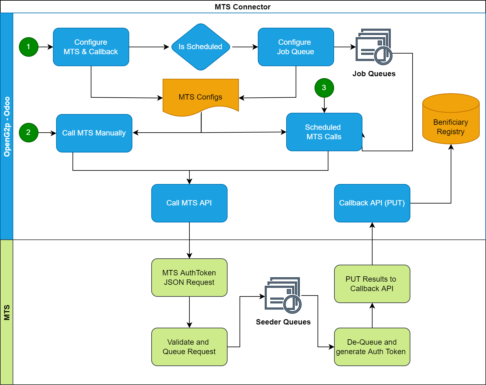

# OpenG2P-registry MTS Connector

## Overview

OpenG2P-registry MTS Connector (OMC) is a OpenG2P module which will be an addon to [Odoo](https://www.odoo.com/). OMC can generate a MOSIP Auth Token against the any record in OpenG2P registry by calling [MOSIP Token Seeder](./) (MTS) and store the same in beneficiary registry. This will be an important module in deduplication process when OpenG2P system uses MOSIP as its ID platform.

## Features of OMC

* Generates MOSIP token against the OpenG2P registry by calling [MTS](./).
* Uses `callback` delivery type of MTS
* Completely asynchronous execution
* OpenG2P can schedule a daily job to fetch the delta for the day
* A manual import feature will also be provided
* Removes VID if MOSIP Auth Token is generated

<figure><figcaption></figcaption></figure>

## Input

In OpenG2P, the user can configure for following fields to setup an interface with MTS through OMC.

**Name**: A string to identify the connector

**URL to reach MTS**: URL for MTS API

**MTS Input type**: OMC option could be proceeded by selecting "_OpenG2P Registry_".

**Mapping**: MTS Field mapping as required by the API. Please refer MTS Documentation. Format of Mapping would be JSON.

**Output Type**: MTS-C only supports JSON output type of MTS.

**Output Format**: Output format is a [JQ ](https://stedolan.github.io/jq/)string which will be used by MTS to format its output to suite the caller's requirement.

**Delivery Type**: Currently supporting only "Callback". Callback feature can be used to make MTS do a submission of results onto an API within Odoo. The output formatting will help in making the desired input for the api.

**Job Type**: MTS-C provide both recurring and one time execution. Recurring can be configured to do continuous pull from the ODK over MTS.

**MOSIP Language**: Mosip language setup. Default is "_eng_".

**Interval in minutes**: Interval at which the MTS-C job runs.

**Filters to apply to Registry**: A [domain filter](https://odootricks.tips/about/building-blocks/domain-in-odoo/) can be used to identify the records for tokenization. For. eg. Only records which have VID associated with it and is not tokenized need to be picked for tokenization.

**List of fields to be used**: List of fields which will be supplied as auth data. This field list may be a superset of fields required for auth as it may contain data required by the callback API. This list should be a valid JSON string array.

**Callback URL**: A URL end point which would be called upon successful processing at MTS

**Callback HTTP Method**: HTTP Method (POST/PUT/GET/PATCH) used while MTS makes the callback

**Callback Timeout**: Timeout awaited by the callback until acknowledged with a response.

**Callback Auth Type**: Type of authentication expected by callback URL. MTS-C currently support Odoo type which uses the session-based authentication implemented by Odoo.

**Callback Auth Database**: DB instance used by Odoo.

**Callback auth username**: Username to access callback api

**Callback auth password**: Password to access callback api
