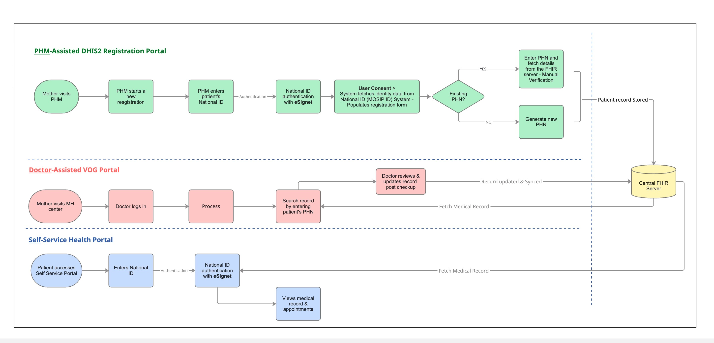

# DHIS2

**DHIS2** (District Health Information Software 2) is an open-source, web-based platform developed at the University of Oslo, deployed in more than 80 countries for health, logistics, and education data management.&#x20;

This document provides an overview of how eSignet integrates with DHIS2 powered ANC (Ante Natal Care) ecosystem across three portals: the **PHM-Assisted DHIS2 Registration Portal**, the **Doctor-Assisted VOG Portal**, and the **Self-Service Health Portal**.

## Purpose

This document outlines the integration of eSignet (a digital identity verification system) with DHIS2 healthcare portals to streamline maternal health record management across three user-facing applications.

**eSignet's Role**: eSignet serves as the primary identity verification and authentication backbone, enabling secure National ID-based authentication across all portals. It verifies patient identity, fetches verified demographic details from the identity system, and manages user consent for data access—ensuring that every interaction within the healthcare ecosystem is tied to a verified identity.

### Use Cases

This use case outlines an end-to-end **ANC (Ante Natal Care)** patient journey, integrating identity verification with healthcare systems using eSignet.

The solution is implemented across three distinct portals, each serving a specific role in the patient lifecycle:

* **PHM (Public Health Midwife)-Assisted DHIS2 Registration Portal**: For initial patient registration and new PHN issuance
* **Doctor-Assisted VOG Portal**: For accessing and updating patient medical records
* **Self-Service Health Portal**: For patients to view their own medical records and appointments

Across all portals, eSignet-based authentication using National ID is used to ensure secure access and accurate identification of the patient.

The system also integrates with backend systems such as:

* **FHIR (Fast Healthcare Interoperability Resources)** server for storing and exchanging health data across multiple portals - only this point we can keep

### eSignet-DHIS2 ANC Use Case Flow

This diagram shows the end-to-end ANC journey across registration, consultation, and self-service portals, with eSignet-based identity verification and consent.

<figure><figcaption><strong>Figure:</strong> eSignet-DHIS2 ANC Use Case Flow</figcaption></figure>

## Portal Workflows and User Journeys

### 1. PHM-Assisted DHIS2 Registration Portal

**Purpose**: To register the pregnant mother in the health registry system and issue a Patient Health Number (PHN).

**User Journey**:

* The pregnant mother visits the PHM center.
* The Public Health Midwife (PHM) accesses the DHIS2 Registration Portal and logs in using National ID.
* The PHM initiates the registration process by selecting the **New Registration** option.

**Identity Verification using eSignet**:

* The PHM enters the patient’s National ID.
* eSignet triggers an OTP to the mobile number linked with the National ID.
* The patient provides the OTP and is authenticated successfully.
* The PHM obtains explicit consent from the patient and submits it on her behalf.

**Fetch userinfo**:

* Upon successful authentication, demographic details of patient such as **name, date of birth, and address** are fetched from the identity system **via eSignet** and auto-populated in the registration form.
* The PHM completes the remaining health-related information manually and submits the form.

**PHN Handling**:

* **If the patient already has a PHN**:
  * The patient registration form includes a field for **Existing PHN**.
  * If the patient has a PHN, the Public Health Midwife (PHM) enters it in this field to fetch demographic details from the PHN system.
  * The PHM then performs a **manual verification** by comparing the data retrieved from the PHN system with the demographic details obtained from the National ID system via eSignet.
  * If the information matches, the PHM proceeds with the registration.
* **If the patient does not have a PHN**:
  * The PHM completes the registration.
  * A new PHN is generated and assigned to the patient.
* The captured data is then pushed to the FHIR server.

### 2. Doctor-Assisted VOG Portal

**Purpose**: To allow doctors to access and review patient medical history for diagnosis and treatment.

**User Journey**:

* The pregnant mother visits the maternal health (MH) center.
* The doctor logs into the VOG portal using their National ID.
* The doctor initiates a search by entering the patient’s PHN and selects **Search Record**.
* The patient’s health records are fetched from the FHIR server and become accessible to the doctor
* The doctor reviews the medical history, updates relevant information, and provides treatment.
* All updates made by the doctor are pushed to the FHIR server.

### 3. Self-Service Health Portal

**Purpose**: To enable patients to access their own ANC records and upcoming appointments.

**User Journey**:

* The pregnant mother accesses the DHIS2 Self-Service Health Portal.

**Identity Verification using eSignet**:

* The patient enters her National ID.
* An OTP is sent to the registered mobile number.
* The patient enters the OTP and is authenticated successfully.

**Post Authentication**:

* The portal displays:
  * Patient medical records
  * ANC visit history
  * Upcoming appointments

## How does eSignet integrate

* eSignet is used as the primary authentication mechanism during patient registration in the DHIS2 patient registration portal.
* Upon successful authentication using the National ID, the fetched user information is used to pre-populate PII fields in the registration form.
* eSignet is also used in the Patient Self-Service Portal, allowing patients to log in and access their medical records.
* eSignet manages user consent for data access and sharing across systems.

## Benefits

* **Secure Identity Verification**: Ensures that all access to health records is tied to a verified National ID.
* **Improved Data Accuracy**: Reduces manual data entry errors through auto-population from the identity system.
* **Streamlined Patient Journey**: Enables seamless transitions across registration, treatment, and self-service access.
* **Interoperability**: Integration with FHIR server allows standardized data exchange across systems.
* **Reduced Duplication**: PHN verification prevents duplicate patient records.
* **Enhanced Accessibility**: Patients can access their health data independently through the self-service portal.

## High-Level Architecture

Refer to a [comprehensive article](https://developers.dhis2.org/blog/2026/02/mosip-integration-demo/) detailing the architecture and outlining this integration. This article illustrates the overall system architecture, including:

* Integration between DHIS2 portals and eSignet
* Interaction with the identity system
* Data flow to and from the PHN system
* Storage and exchange of health records via the FHIR server

## Integration Demo

A recording of the demonstration conducted for this use case is available below:



### Abbreviations

| Abbreviation | Full Form                                  |
| ------------ | ------------------------------------------ |
| ANC          | Ante Natal Care                            |
| FHIR         | Fast Healthcare Interoperability Resources |
| MH           | Maternal Health                            |
| NeHR         | National e-Health Registry                 |
| PHM          | Public Health Midwife                      |
| PHN          | Patient Health Number                      |
