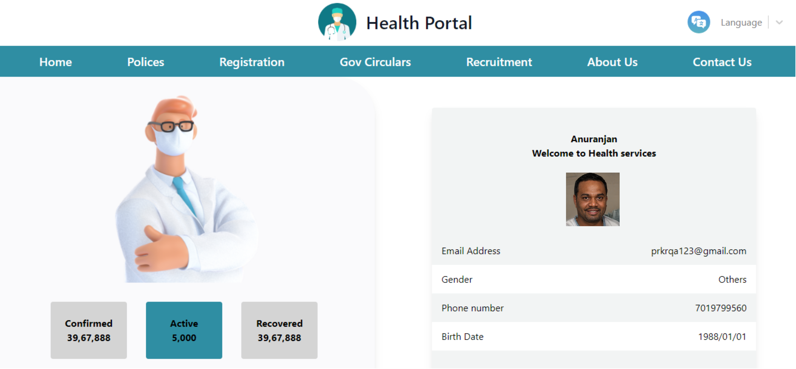

## Log in with OTP authentication

Pre-requisite: The resident is issued with a unique virtual ID for a country's foundation ID. In the below demo application, the resident is registered with MOSIP and has a valid UIN or VID.

1\. Resident clicks `Sign In with MOSIP`.

The login screen appears and the resident is displayed with the options they can choose for login.

2\. To get started with login with OTP authentication, the resident clicks on `Log in here`.

**Login with OTP** screen is displayed to the resident.

3\. Resident needs to enter valid VID in the "Enter Your VID" text field. 

4\. Next, the resident clicks on the "Get OTP" button.

5\. The resident receives the OTP on the registered channel (either the phone or email).

6\. The resident needs to enter the valid OTP received and click on the "Verify" button.

7\. The resident is then navigated to the Consent page. On this page, the **Essential** and **Voluntary** claims are displayed.

8\. The resident has the choice to select from the list of Voluntary claims while the Essential claims are mandatory and cannot be edited.

9\. The resident then clicks on the "Allow" button. The system navigates the resident to the User Profile page and the page displays their personal information based on the consent provided.

