# Resident Mobile Application User Guide

## Prerequisite

For Android devices, `Google Nearby Connections API` and the `Google SafetyNet Attestation API` require that the device has access to the Google Play Services and related APIs. This implies that a Google Account is set up and configured on the device.



## Installing the MOSIP Resident Mobile Application

1\. Build `Inji` code to generate an `apk` file. Transfer the `apk` file on to a smart phone on which it is to be installed.

2\. Tap **Install** to proceed with installation.

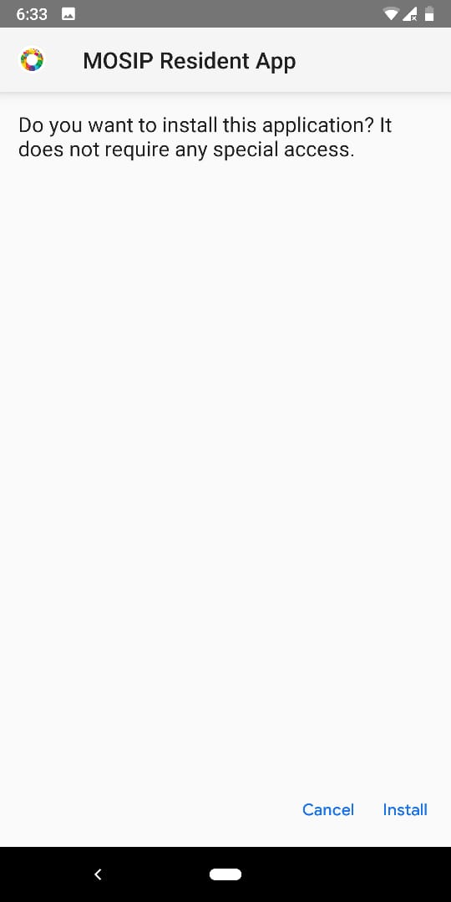  

You can see the installation in progress.

  

3\. On successful installation, click **Open**.

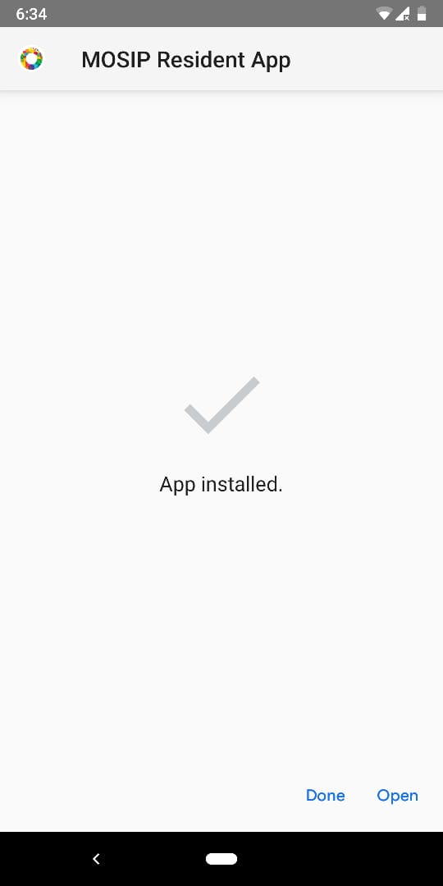  

## First launch of the app and initial setup

1\. On the first launch, you will see a prompt asking you to `Allow MOSIP Resident App to access the device's location?`.

2\. Tap **Allow** to continue.


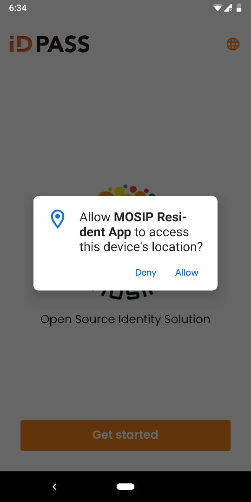  

3\. Click **Get started** to setup the app.


  

4\. You will now be given an option to either setup your biometrics or a passcode for unlocking the application. For now, the app supports the passcode option.

5\. Choose `I'd rather use a passcode`.

  

6\. Re-enter the passcode to confirm the same.

  

7\. On the Home screen, a few tooltips are displayed after the initial setup to guide you through the next steps.

 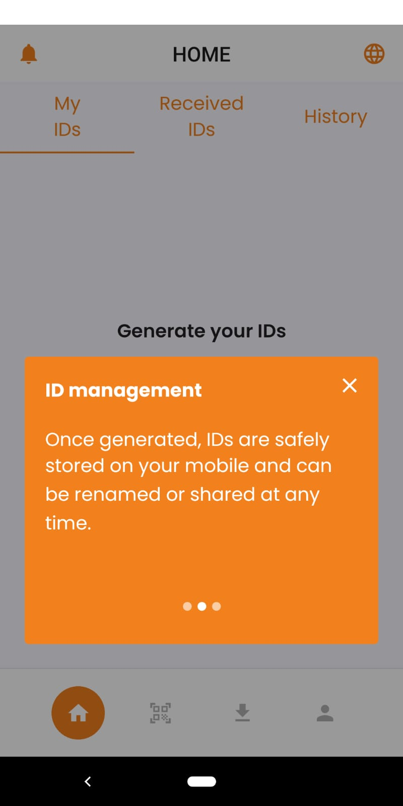 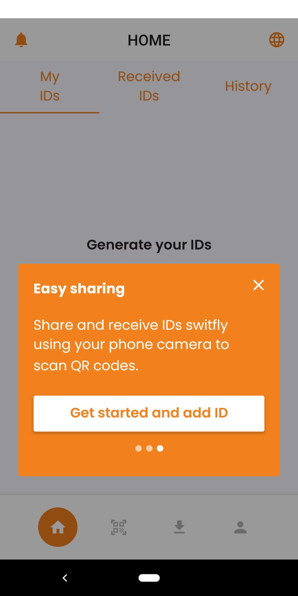  

## Generating credentials

It is recommended to keep your digital credentials (ID) with you at all times. To get started with the app, **Add IDs** to your profile.

1\. On the Home screen, tap **Add ID**.

  

2\. From the dropdown, select either the UIN or VID that will be used to generate the credential.

  

3\. Enter the corresponding value for UIN/ VID and tap **Generate ID**.

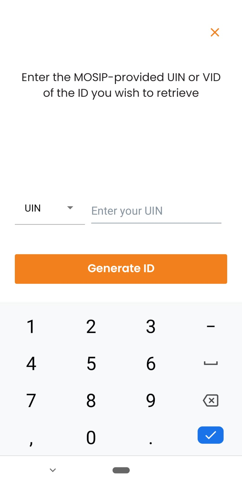  

4\. Enter the 6-digit verification code (OTP) sent on your registered phone number/e-mail.

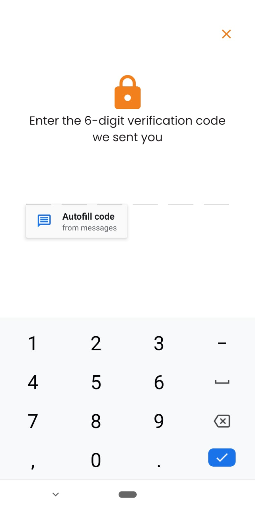  

5\. Click **Back Home** and wait till your credentials are generated.

  

6\. Under `My IDs` tab, you will be able to view your digital credentials.

  

7\. For more details, click on the arrow mark towards the right corner in the ID generated. You can view the following details:

```
 * Generated date
 * UIN
 * Status
 * Details like the photograph, name, address, email, etc. 
 
```
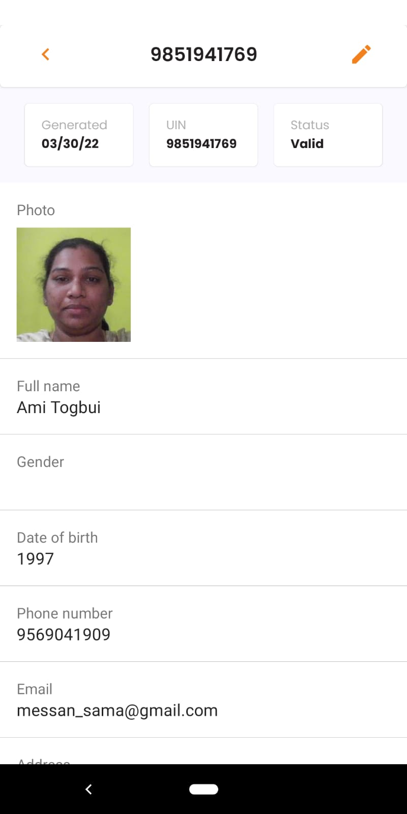  

8\. Click **Edit Tag** (pencil icon in detailed view) and update the ID name as required.

  

9\. Enter the new name and click **Save**. You will now see the updated ID name being displayed.

  

Likewise, the resident can tap `Add ID` to generate the credentials for their family or friends.

  

10\. You can view the history of the credentials downloaded under the `History` tab on the top right corner.

## Sharing credentials

Prerequisites:

* Two or more devices with the Resident Mobile app installed are required for sharing credentials.
* All required permissions like Bluetooth, location and camera access are enabled on both the devices.
* The parties involved are mostly likely a Resident who would want to share their credentials with a Relying party (can be with a banker/ health worker/ etc).

Let us understand sharing of credentials with an example.

Assuming that a Resident having Device A wants to share their credentials with a Relying/ requesting party having Device B. The steps that both the parties have to follow is illustrated below:

1\. The Resident taps on `Scan` icon on their phone (on the bottom menu, second icon from left).

Click **OK** to turn on the device' location.


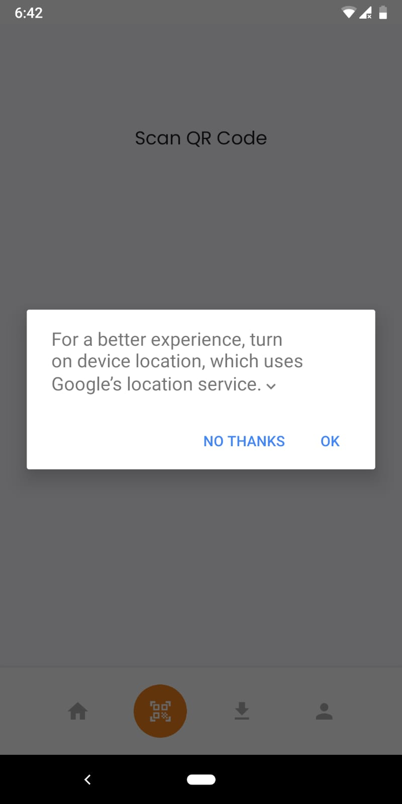  

2\. Tap **Allow** to `Allow MOSIP Resident App to take pictures and record videos.`

  

3\. The Resident' device is ready for scanning the QR code that will be displayed on the Relying party' phone.

4\. On the Relying party' phone, tap the `Request icon`(on the bottom menu, third icon from left).

Tap **Allow** to enable bluetooth on Device B.

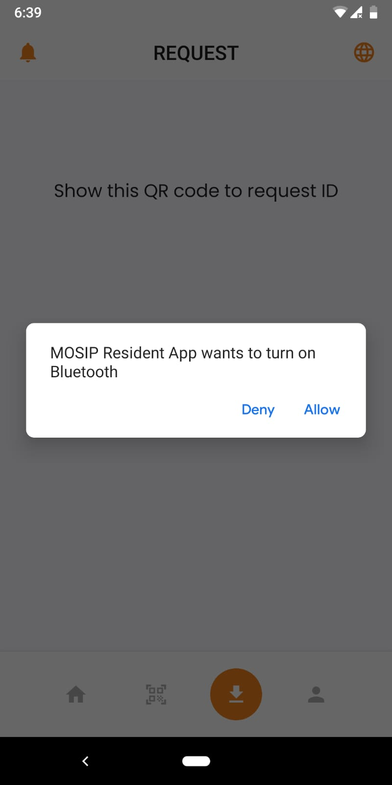  

5\. Resident scans the QR code displayed on Device B using Device A.

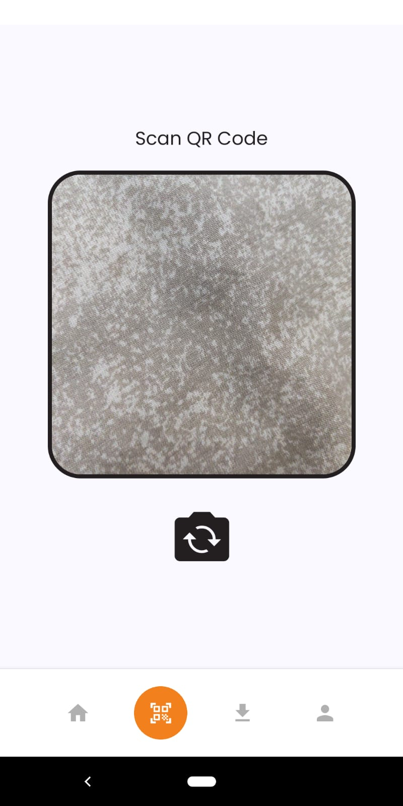   

6\. The status on the Resident' device is displayed as "Connecting..".

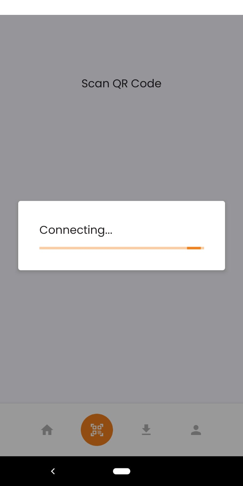  

7\. Once the connection is made, the `Sharing ID` screen is displayed on the Resident' phone. This screen has the following details:

* Requested by: Device B model
* Device name of the Relying party
* Device Reference number
* Reason for sharing (optional)

 

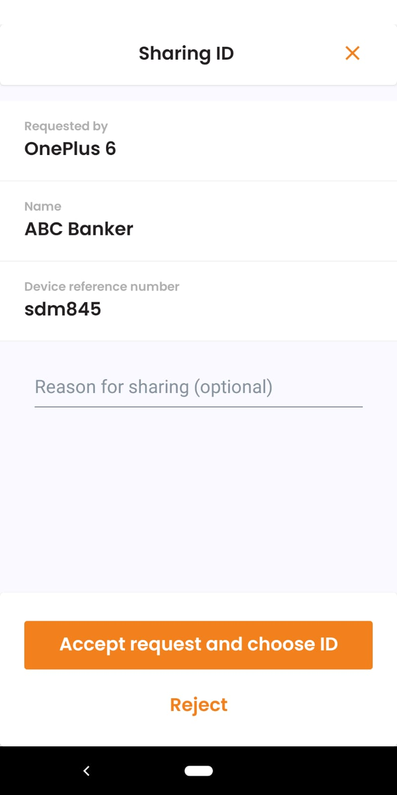  

8\. Resident enters the reason for sharing the credentials and taps `Accept request and choose ID`.


  

9\. The Resident now selects the ID to be shared with the Relying party and taps on **Share**.

  

10\. Sharing gets initiated from Device A to B.

  

11\. The Relying party' phone displays `Accept request and receive ID`.

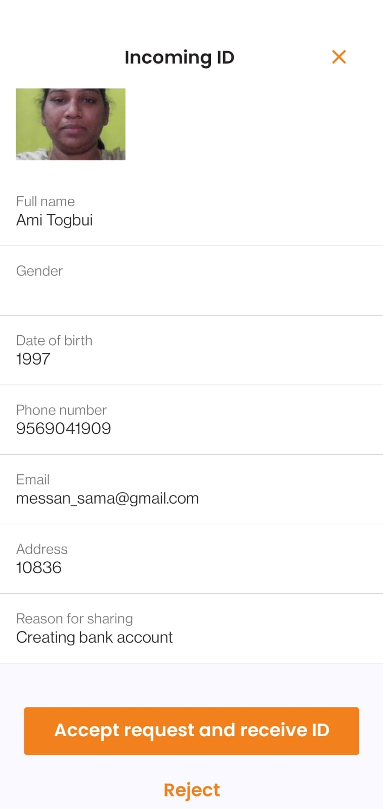  

Clicking Accept is followed by a success message on both the phones.

  

This above image shows the success message displayed on Device A.

12\. Relying party taps on `Received IDs` to view the ID received on Device B.

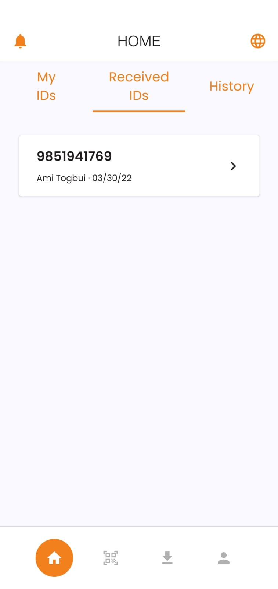  

13\. `History` tab on the devices displays the details of the activities performed.

For instance,

* On the Relying party' phone, the `History` tab shows the history of the received credentials.
* On the Resident' phone, the `History` tab displays the history of the downloaded credentials.

 

   
