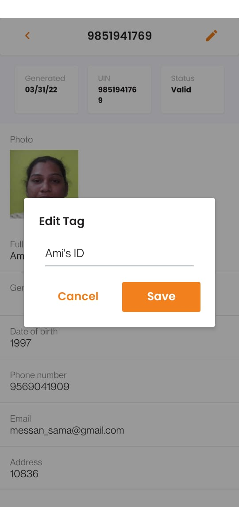

# Mobile Resident Application

## Overview

The mobile Resident app is like a digital wallet wherein a resident can generate their credentials, store it and use it as required. Additionaly, they can also generate and share the credentials of their family members and avail services in the private and public sectors.

In this phase, the mobile Resident app is currently available for Android users only. Shortly, the support will be extended to iOS users as well.

## Installing the MOSIP Mobile Resident Application (app)

1. Locate the app on Play Store for Android devices./ Download xyz.apk file to install the Mobile Resident app.
2. Confirm installation of the app. Tap **Install**  to proceed.

  

You can see the installation in progress.

3. On successful installation, click **Open**.

## First launch of the app and initial setup

1. On the first launch, you will see a prompt asking you to `Allow Mosip Resident App to access the device's location`.
2. Tap **Allow/ Deny** as per your wish.

3. Click **Get Started** to setup the app.

4. You will now be given an option to either setup your biometrics or a passcode for unlocking the application. For now, the app supports the passcode option.

5. Choose `I'd rather use a passcode`.

6. Re-enter the passcode to confirm the same.

7. On the Home screen, you will now see a few options and icons alongwith some tooltips.

## Generating credentials

It is recommended to keep your digital credentials (ID) with you at all times. To get started with the app, **add IDs** to your profile.
   * Once generated, IDs are safely stored on your mobile and can be renamed or shared at any time.
   * Easy sharing option: Share and receive IDs swiftly using your phone camera to scan QR codes.

1. On the Home screen, tap **Add ID**.

2. From the dropdown, select either UIN or VID of the ID you wish to retrieve. 

3. If you have selected UIN as the option, enter the UIN and tap **Generate ID**. 

4. Enter the 6-digit verification code (OTP) sent on your registered number (can autofill the number from messages).

5. Wait while your ID is getting downloaded and click **Back Home**.

6. Under `My IDs` tab, you will be able to view your digital credentials/ ID against the UIN entered.

7. For more details, click on the arrow mark towards the right corner in the ID generated. You can view the following details:

        * Generated date
        * UIN
        * Status
        * Details like the photograph, name, address, email, etc. 
        
     
      
7. Click **Edit Tag** (pencil icon in detailed view) and update the ID name as required.

8. Enter the new name and click **Save**. You will now see the updated labels being displayed.
    

Likewise, the resident can tap `Add ID` to generate the credentials for their family or friends.

9. You can view the history of the credentials downloaded under the `History` tab on the top right corner.

## Sharing credentials

Pre-requisites:

* Two devices with the Mobile Resident app installed are required for sharing credentials.
* All required permissions like Bluetooth, location and camera access are enabled on both the devices.
* The parties involved are mostly likely a Resident who would want to share their credentials with a Relying party (can be with a banker/ health worker/ etc).

Let us understand sharing of credentials with an example. 

Assuming that a Resident having Device A wants to share their credentials with a health worker having Device B. The steps that both the parties have to follow is illustrated below:

1. The Resident taps on the `Scan` icon on their phone (second icon from left). 

    

2. Tap **Allow** to `Allow Mosip Resident App for taking pictures and recording videos.`

   

3. scans the QR code displayed on the Relying party' phone.

