# Admin Portal User Guide

## Overview

Admin application is a web-based application used by a privileged group of administrative personnel to manage various master data. The various resources that can be managed by an Admin are:

1. Center (Registration centers)
2. Device
3. Machine
4. Users (Admin, Registration staff)

Along with the resource and data management, the admin can generate master keys, check registration status, retrieve lost RID, resume processing of paused packets. To start using the Admin portal, an admin user must be assigned to a zone.

To learn more, refer the videos below!

**Session1**



**Session2**



## First Admin user

1. Setup of hierarchial zones
2. Create Admin roles in KeyCloak
3. Create first admin user in KeyCloak and assign "GLOBAL\_ADMIN" role

_Note_- On login of first admin user, user zone mapping is handled automatically.

The above are done automatically as part of [default sandbox installation](https://github.com/mosip/mosip-infra/tree/release-1.2.0/deployment/v3).

### Login

1. Select the preferred language.
2. Login with KeyCloak credentials.

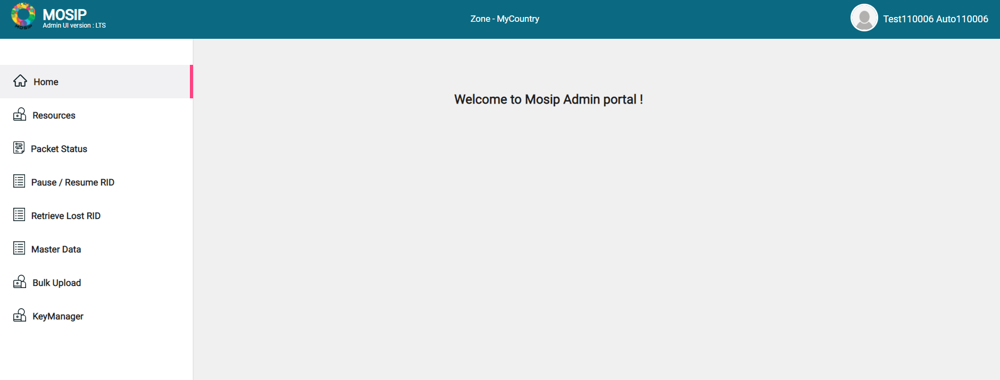

### Actions

1. Map the other users(admins/registration operators/supervisors) to respective zones
2. Create centers and assign the users to a particular center
3. _Highly recommended_: Ensure to revoke the first super user's zone mapping and role after first user actions are completed.

## Admin roles and their default accessibility matrix

* GLOBAL\_ADMIN
* ZONAL\_ADMIN
* REGISTRATION\_ADMIN
* MASTERDATA\_ADMIN
* KEY\_MAKER

| GLOBAL\_ADMIN          | ZONAL\_ADMIN           | REGISTRATION\_ADMIN | MASTERDATA\_ADMIN      | KEY\_MAKER                   |
| ---------------------- | ---------------------- | ------------------- | ---------------------- | ---------------------------- |
| Centers                | Devices                | Packet Status       | Devices                | GenerateMasterKey            |
| User Zone Mapping      | Machines               | Pause/ Resume RID   | Machines               | GenerateCSR                  |
| All Master Data        | User Zone Mapping      | Retrieve Lost RID   | All Master Data        | GetCertificate               |
| Masterdata Bulk Upload | User Center Mapping    | Packet Bulk Upload  | Masterdata Bulk Upload | UploadCertificate            |
|                        | All Master Data        |                     |                        | UploadOtherDomainCertificate |
|                        | Masterdata Bulk Upload |                     |                        |                              |

## Center

* This portal allows an Admin to view, create, edit, activate, deactivate and decommission registration centers.
* An Admin can manage only centers under their [administrative zones](./#administrative-zones).

The administrator can filter the list of registration centers based on parameters like _Center name, Center type, Status, Location code_.

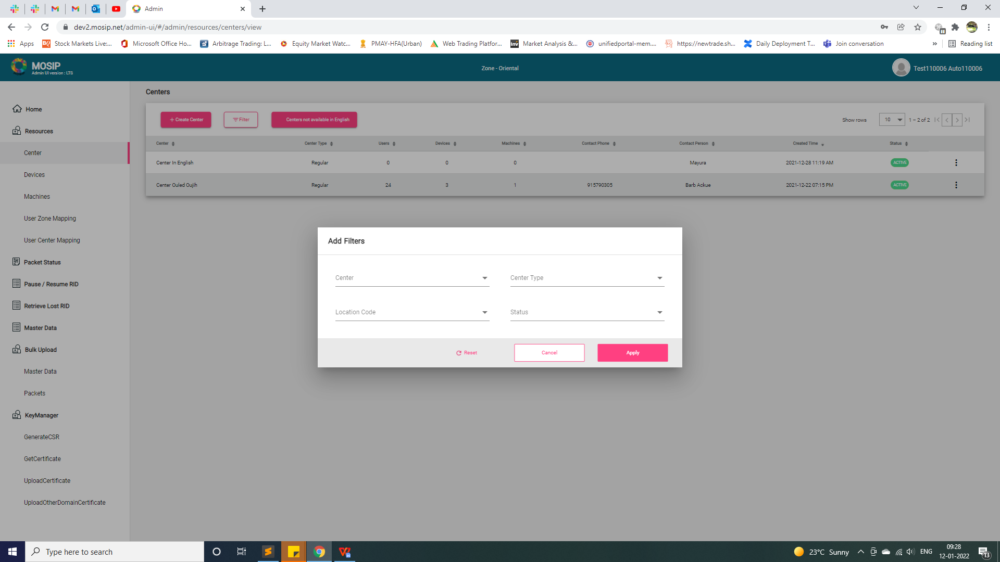

* The system does not fetch the details of decommissioned registration centers but only active and inactive centers are displayed.
* If the admin does not find a center, they can click the _Center not available in logged in language_ button. Clicking on this button, displays the list of centers that are already created in other languages. On selecting a particular center, the information will be auto-populated in the Create page and be made available to the admin for modifications.
* Language specific fields can be modified to create a center with the currently logged in language.

### Create center

* A center is created with multiple attributes and is mapped to the administrative zone that it belongs to.
* A center can only be mapped to the configured location hierarchy level.
* While defining centers, an admin can also define the working days of the week for a center and any exceptional holidays that might be applicable for a particular center.

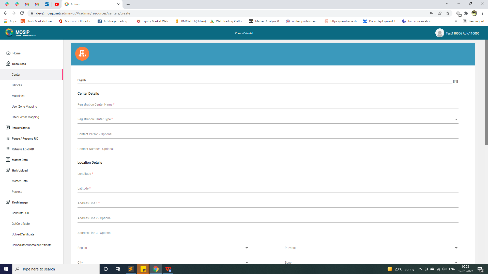

### Update center

* An admin can update a center even after it has been created. The updates can include adding the details that were missed during creation of the center or changing the details of a center as required.
* To update, click the **Edit** option from the Actions menu against a center name.

_Note_- Updates made to language specific fields updates data only for that language in the database while updates made to non-language dependent fields updates data against all the language entries for that center.

### Activate/deactivate/decommission center

* Select the **Deactivate/Decommission** option from the Actions menu against the center.
* Activation/Deactivation/Decommission of a center in one language will be applied to the same center created in all the languages.

To know more, refer [Activate/deactivate/decommission resources](./#Activate/deactivate/decommission-resources)

## Devices

* Using this portal, an admin can manage the devices a country will use for registering residents like devices used for bio-metric capture (Fingerprint, Iris, Web camera, etc.), printers, scanners.
* This portal allows an Admin to view, create, edit, activate, deactivate and decommission registration centers.
* The admin portal allows an admin to view the list of all the devices available in the jurisdiction of their administrative zone.
* The system does not fetch the details of decommissioned devices but only the active and inactive devices.

_Note_

* Device entity is language agnostic (independent of languages).
* The data collected about Devices is used only for book keeping, i.e., MOSIP system does not use this data for any validation.

The Admin can filter the list of Registration centers based on parameters like _Device Name, Mac Address, Serial Number, Status, Map Status, Device Type, Device Spec ID_.

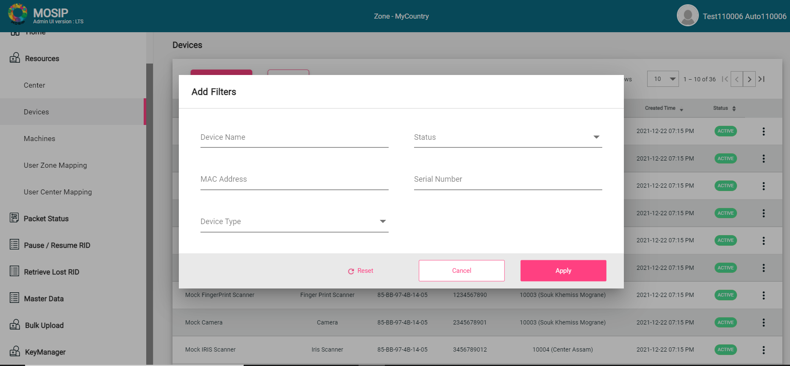

### Create devices

A Device can be created with the multiple attributes and be mapped to the Administrative Zone it belongs to.

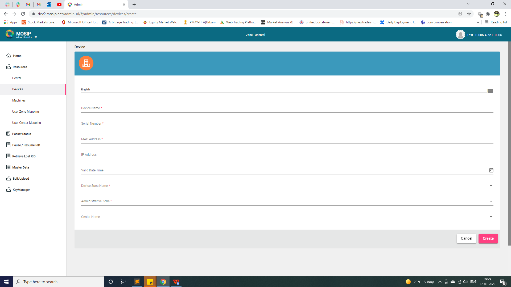

### Update devices

* An admin can update missing information or change device details even after it is created.
* To update, click the **Edit** option from the Actions menu against a device.

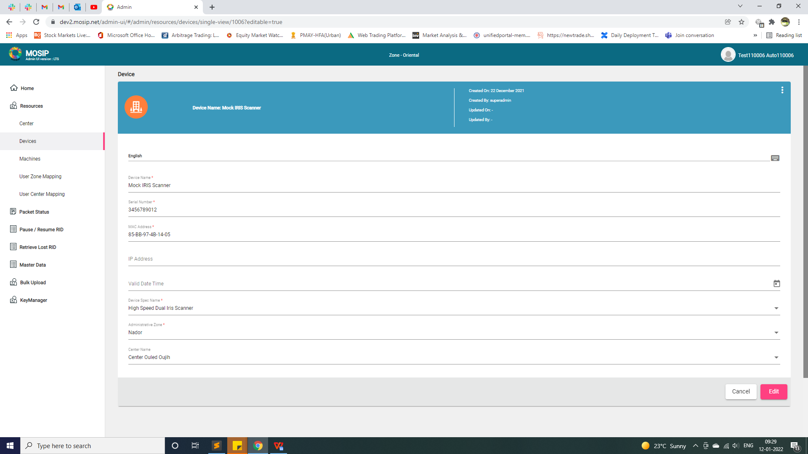

### Activate/deactivate/decommission device

Select the **Deactivate/Decommission** option from the Actions menu against the device.

### Map/un-map/re-map device to a center

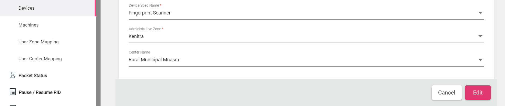

* Admin portal allows an Admin to map/un-map each device to a center.
* This mapping specifies as to which center the device will be used in.
* A device can only be mapped to a center which belongs under the device’s Administrative Zone.
* To do so, select the device and choose a **Center Name** from the dropdowm.

## Machines

* Admin portal allows an administrator to manage the machines a country will use for registering residents.
* This portal allows an Admin to view, create, edit, activate, deactivate and decommission machines.
* The admin portal allows an admin to view the list of all the machines available in the jurisdiction of their administrative zone.
* The system does not fetch the details of decommissioned machines but only shows the active and inactive machines.

_Note_:

* Machine entity is also language agnostic.

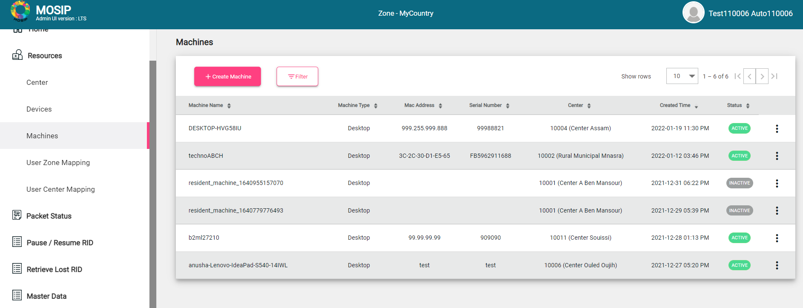

The administrator can filter the list of machines based on parameters like _Machine name, Mac address, Serial number, Status, Machine type._

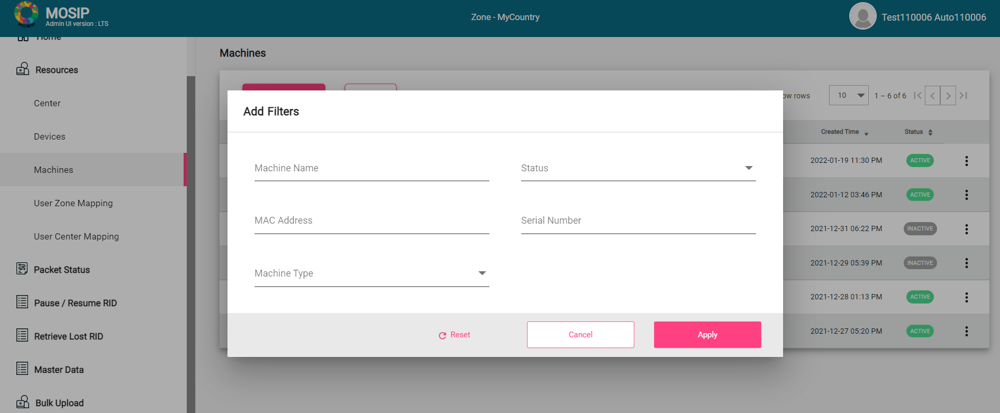

### Create machines

* A machine can be created with the attributes like _Machine ID, machine name, mac address, serial number, machine spec ID and administrative zone_ the machine belongs to.
* A machine needs to be mapped to an administrative zone.

### Update machines

* An admin can update missing details or make changes to machine details even after it is created.
* To update, click the **Edit** option from the Actions menu against a machine.

_Note_- Updates made to language specific fields updates data only for that language in the database while updates made to non-language dependent fileds updates data against all the language entries for that center.

### Activate/deactivate/decommission machine

An admin can deactivate or decommission a machine through the admin portal.

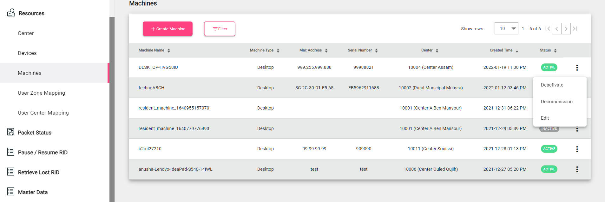

### Map/un-map/re-map machine to a center

* Admin portal allows an Admin to map/un-map each machine to a center.
* This mapping specifies as to which center the machine will be used in.
* A machine can only be mapped to a center which belongs under the machine’s Administrative Zone.
* To do so, select the machine and choose a **Center Name** from the dropdowm.

## Users

* MOSIP uses Keycloak as an IAM (Identity access management tool) for managing Users. These users are internal users of MOSIP including Registration Officers, Registration Supervisors, Zonal Admins, Global Admins etc.
* using this portal, an Admin can map the users to a zone and a center.

### User Zone Mapping

* Once the user is created in KeyCloak, they need to be mapped to a zone to get access to specific information available in that zone.
* Admin portal allows an admin to map users to a zone. This mapping specifies as to which zone the user will belong to.
* A user can only be mapped to a zone which belongs under the user’s Administrative Zone.
* A user can later be un-mapped from the zone in case a user needs to be moved to another zone. In such cases, the user will later need to be mapped to the new zone. Below image displays the list of users that are mapped to a zone.

#### Map/Un-map/re-map user to a zone

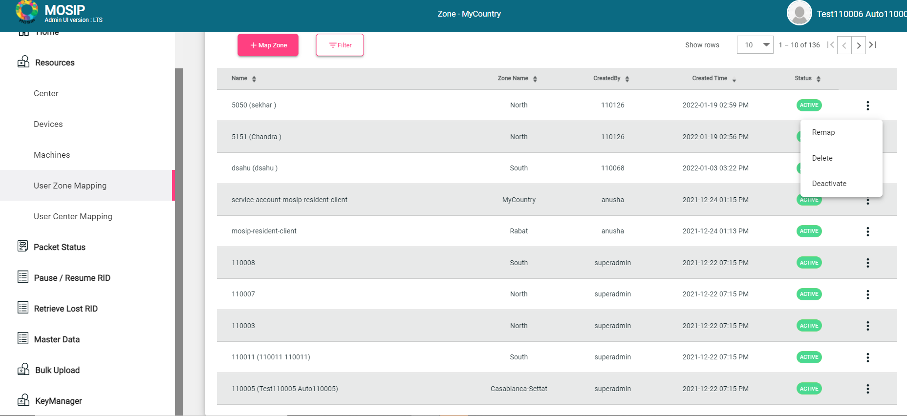 To map a user to a zone,

1. Click Resources-> User Zone mapping
2. Click **+Map Zone**
3. Select the _User Name, Administrative Zone_ from the dropdown.
4. Click **Save**.

To re-map a user to a zone,

1. Click Resources-> User Zone mapping
2. Select **Remap** from the Actions menu against the mapped user.
3. Update the _User Name/ Administrative Zone_ from the dropdown.
4. Click **Save**.

_Note_- If the center is already mapped, the admin needs to unmap the center to remap the zone.

### User Center Mapping

* Once the user is mapped to a zone, they will be listed in the screen below. Now, the user will be mapped to a center to be able to manage their assigned center.
* Admin portal allows an admin to map users to a center. This mapping specifies as to which center the user will be used in.
* A user can only be mapped to a center which belongs under the user’s Administrative Zone.
* A user can later be un-mapped from the Center in cases where a User is needed to be moved to another Center. In such cases, the user will later need to be mapped to the new center. In case the user is required to be mapped to a Registration center outside the Administrative Zonal restriction, the Administrative Zone of the user must be changed.

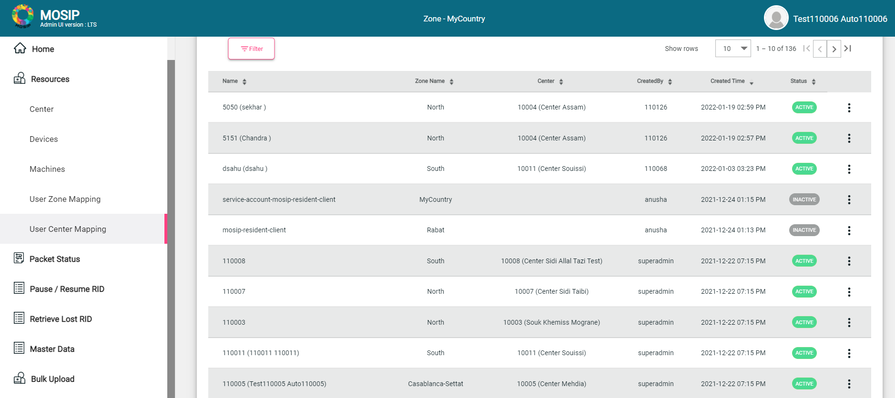

**Map/un-map/re-map user to a registration center**

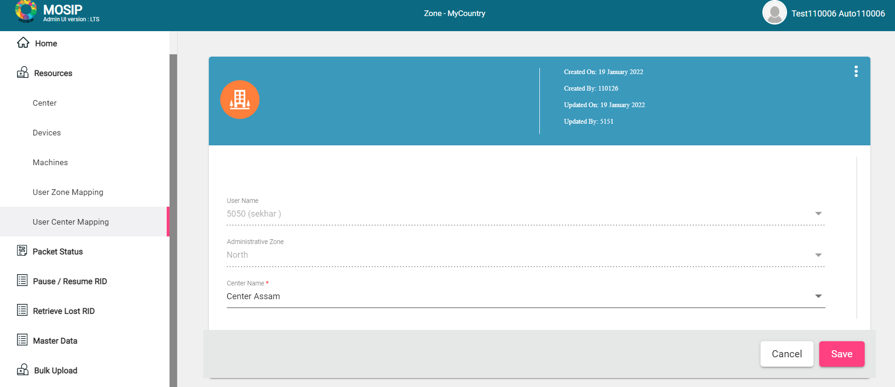

To map a user to a center,

1. Click Resources-> User Center Mapping
2. Select **Map** from the Actions menu against the mapped user.
3. Select the **Center Name** from the dropdown against the User Name, Administrative Zone.
4. Click **Save**.

### Search and dropdowns

* To get the results starting with specific character/ set of characters, prepend that specific character/set of characters with `asterisk` symbol.
* Similarly to get the results ending with specific character/ set of characters, append that specific character/ set of characters with `asterisk`.
* For the results containing a specific character/ set of characters, prepend and append that specific character/ set of characters with `asterisk`.

Below is the image illustrating the same.

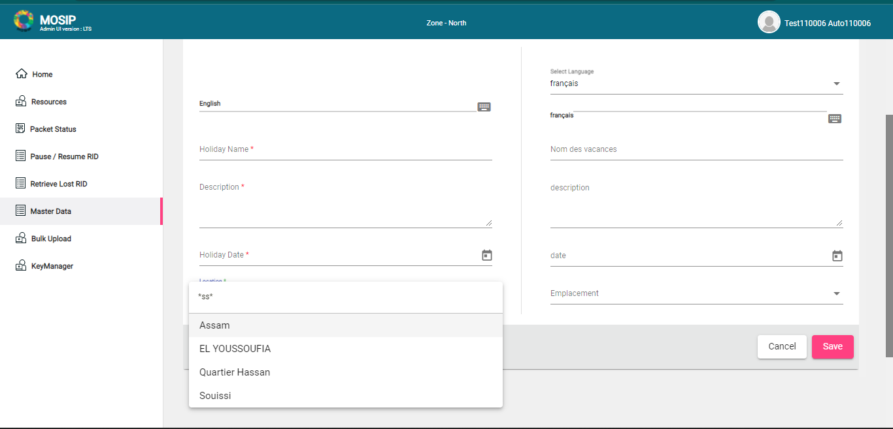

## Packet status (based on RID)

* A Registration packet generated in Registration client is sent to Registration Processor for further processing and UIN generation.
* Using this Portal, A Registration Admin can view the status of a packet by entering the RID of the packet.
* The packet status will contain all the stages the packet has passed through along with the last stage the packet is in.
* In case the packet has not been processed or is marked for _Re-Send/Re-Register_, the admin will be able to view specific comments indicating the reason for that particular status.

## Pause/Resume RID

* The Registration Admin has the privilege to view the registration packets that are in a paused state.
* Admin can use this portal to resume or reject paused packets. They would have 3 options:
  * Resume processing (from where it was paused)
  * Resume from the beginning
  * Reject

Once processing of a packet is resumed, it will be removed from this list

## Retrieve lost RID

* The Registration Admin can use this feature to retrieve lost RID.
* For instance, if the resident did not provide any valid email and/or phone number and has lost the RID slip received during the registration, in order to find their RID details, the resident contact MOSIP helpline and share details such as name, centre name, registration date and postal code to the admin, who will use the lost RID feature and try to retrieve the RID number.

A few filters may be applied to retrieve the RID.

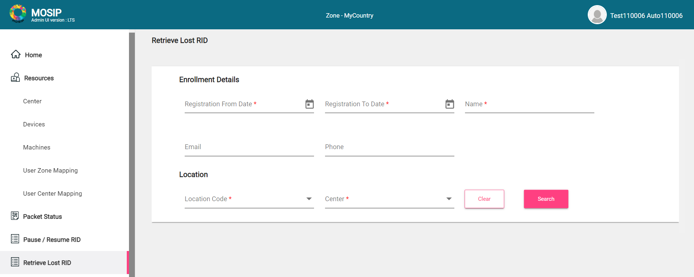

_Note_: This feature is currently under development.

## Master Data

* Admin portal allows an Admin to manage the Masterdata applicable for a country.
* These data includes list of Genders, list of Holidays, Templates, Center Types, Machine Types etc.

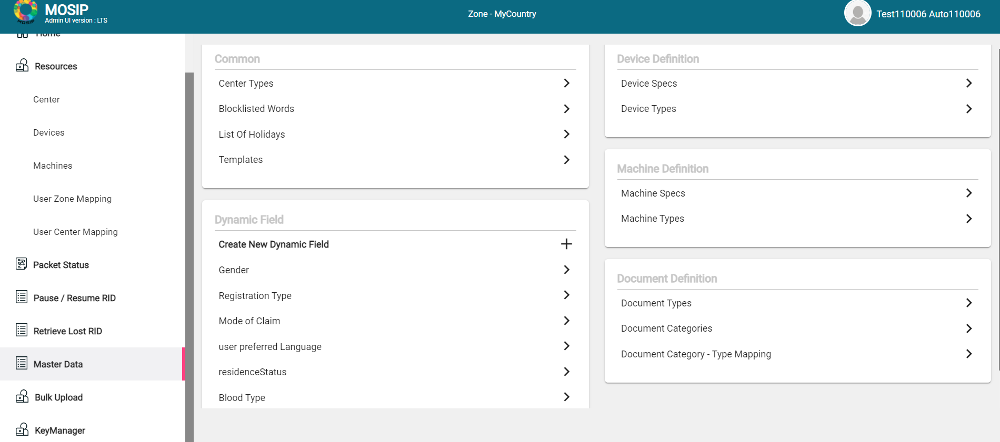

To know more, refer to [Masterdata guide](masterdata-guide.md).

## Bulk upload

* If a country decides to uplaod the data through the _.csv_ files, they could use this feature to upload the existing data into the MOSIP platform.
* The listing screen displays the uploaded data transaction information.
* As the information inside .csv files may be huge, it would go through the batch job to process the information and store it in the tables. Also, it may take time to get unique transaction ID against the particular action.

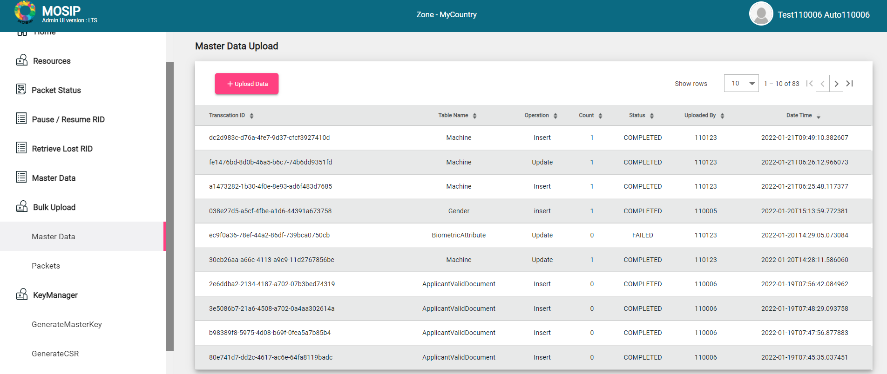

### Master Data

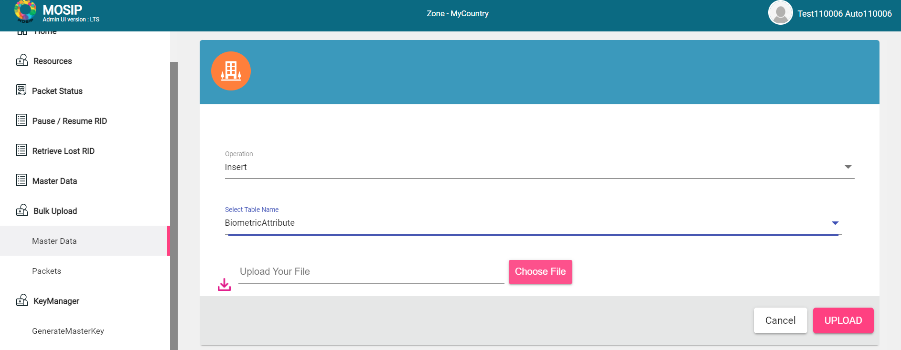

To upload Master data using Admin portal,

1. Go to Bulk Upload > Master Data
2. On the master data dashboard, click **Upload Data**.
3. Select the operation (insert/update/delete)
4. Select the table name into which the data needs to be uploaded into.
5. Click **Choose file** to select the data and click **Upload**

* To view the format for inserting data in a particular table, click on the Download icon.
* A CSV file gets downloaded in which the first row represents the column names and the rest of the rows are the data which will be inserted into the table(sample).
* From 1.2.0.1-B2 version, apart from comma, other special characters (i.e., '|','$'etc.) can also be used as a separator in the csv file used for masterdata bulk upload. This can be done by updating the property `mosip.admin.batch.line.delimiter` with the same special character.

_Note:_ While editing CSV files, it is recommended to keep track of the Date format and Time format to be the same as the acceptable formats. The acceptable Date format is _YYYY-MM-DD_ and the acceptable Time format is _HH:MM:SS_. Any other Date and Time formats in CSV files will result in a `DataType Mismatch Error`.

### Packets

To upload packets using Admin portal,

1. Go to Bulk Upload > Packets
2. On the packet upload dashboard, click **Upload Packet**.
3.  Select the following from the dropdown:

    * Center name
    * Source (currently displays Registration Client)
    * Process (New, Update UIN, Lost, Biometric correction)
    * Supervisor status (Approved/Rejected)

    These details are important if the packet needs to be synced before upload.
4. Click **Choose file** to select the packets and click **Upload**.

How is the packet upload performed with or without DATA\_READ role?

| LoggedIn User Role | Packet Sync | Packet Upload              |
| ------------------ | ----------- | -------------------------- |
| With DATA\_READ    | Yes         | only after successful sync |
| Without DATA\_READ | No          | Yes                        |

_For uploading the packets through the Admin portal, ensure that the packets are available in the machine or the external hard disk connected from where the Admin Portal is being used._

## Key Manager

With the help of this feature, the Admin user can generate and manage the keys required in MOSIP.

### GenerateMasterKey

* The logged in user with `KEY_MAKER` role will have access to view and generate the master key in the Admin portal.
* Using this option, the logged in user will be able to generate only the [Root](../keymanager/#Key-hierarchy) key and [Module](../keymanager/#Key-hierarchy) master key. To generate the key, the user has to select the Application ID from the options available in the drop down, leave the Reference ID as blank for [Root](../keymanager/#Key-hierarchy) and [Module](../keymanager/#Key-hierarchy) master key and provide other certificate attributes to be used at the time of generation of certificate for the key.
* This certificate attributes in the portal are optional, if not provided, default values configured in Key Manager service will be used.
* For Kernel signature key (which is considered as the master key and stored in [HSM](../keymanager/hsm.md)), Reference ID needs to be provided and the value has to be `SIGN`.
* **Force** flag option is available in key generation. The logged in user can select option value **True** to force invalidating existing key and generate new key in [Key Manager](../keymanager/) service.
* The logged in user has to select the return object after the generation of key.
* The user can select either _Certificate_ or _CSR (Certificate Signing Request)_. The key will be generated only when the key is not available in [Key Manager](../keymanager/) service otherwise already generated key certificate will be returned for the generation request.

### GenerateCSR

* _CSR (certificate signing request)_ is required when there is a need to procure a valid certificate from a valid CA.
* _GenerateCSR_ option can be used to request for a CSR and this option will be visible to all the users who log in to the Admin portal.
* The logged in user can request for generation of CSR for any key generated in [Key Manager](../keymanager/) service.
* The user has to provide the Application ID and Reference ID to get a CSR.
* New key will be auto-generated in case the key does not exist and the already existing key has expired for the Module Encryption keys.
* Whereas, for [Module](../keymanager/#Key-hierarchy) master key or [Root](../keymanager/#Key-hierarchy) key, new key will not get auto-generated in case the key does not exist, but new key will get auto generated if the key exists and has expired. Current valid key will always be used to generate a CSR.

### GetCertificate

* The user can get certificate for all the keys generated in Keymanager and any partner certificates uploaded in Keymanager service for partner data share purpose.
* _GetCertificate_ option is visible to all the users who log in to the Admin portal.
* The user has to provide the Application ID and Reference ID to get a certificate.
* New key will be auto generated in case the key does not exist and the already existing key has expired for Module encryption keys.
* Whereas, for [Module](../keymanager/#Key-hierarchy) master key or [Root](../keymanager/#Key-hierarchy) key, new key will not get auto-generated in case the key does not exist, but new key will get auto-generated if the key exists and has expired. For partner certificate, new key will not get generated in Key Manager service.
* Only current valid certificates will be returned when the user requests for a certificate.

### UploadCertificate

* The logged in user can use this option to update the certificate for all the keys generated in [Key Manager service](../keymanager/).
* This option is used in scenarios where a valid CA certificate has been procured for a key available in [Key Manager service](../keymanager/).

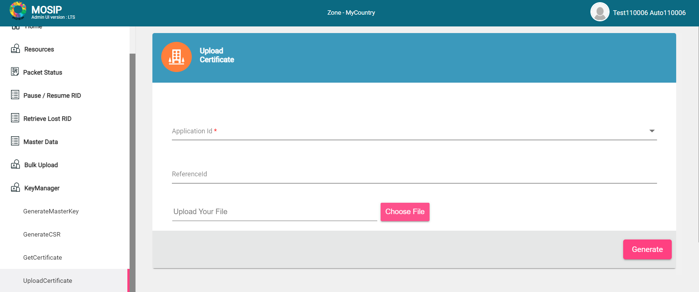

### UploadOtherDomainCertificate

* The logged in use can use this option to upload partner certificate in [Key Manager service](../keymanager/).
* Partner certificates will be used in Key Manager service to encrypt any sharable data using the partner certificate required in datashare from MOSIP to any partner.
* Partner certificates can also be used in Key Manager service for signature verification purpose.

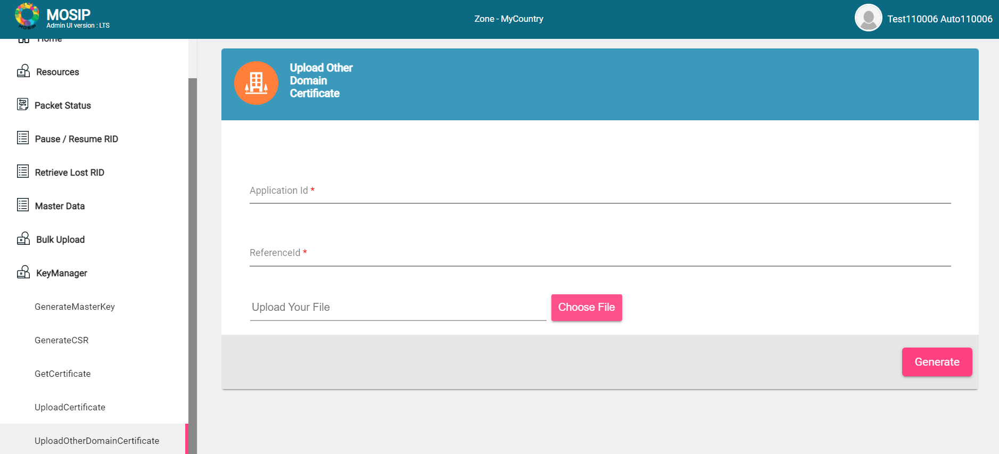
