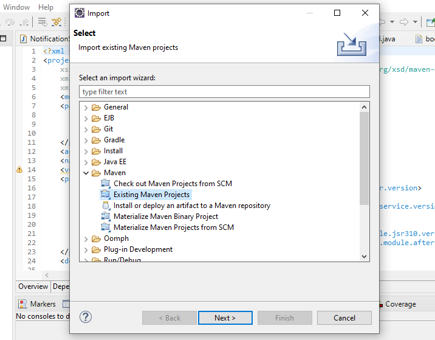
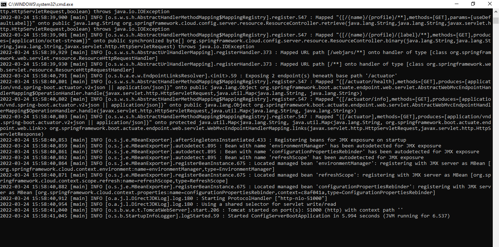

# Audit Manager Developers Guide

## Overview

[Audit Manager](https://docs.mosip.io/1.2.0/modules/commons) module provides audit-related functionalities.

Below is a list of tools required for auditing:

1. JDK 11
2. Any IDE (like Eclipse, IntelliJ IDEA)
3. Apache Maven (zip folder)
4. PostgreSQL
5. Any DB client (like DBeaver, pgAdmin)
6. Postman (any HTTP Client)
7. Git
8. Any Editor (like Vscode, Notepad++ etc optional)
9. lombok.jar (jar file)
10. settings.xml (document)

### Software setup

1\. Download [lombok.jar](https://projectlombok.org/download) and [settings.xml](https://github.com/mosip/documentation/tree/1.2.0/docs/\_files/commons/settings.xml).

2\. Unzip Apache Maven and move `settings.xml` to the "conf" folder `<apache maven unzip path>\conf`.

3\. Install Eclipse, open the `lombok.jar` file, and click `Install/Update`. 

4\. Check the Eclipse installation folder to see if the `lombok.jar` is added.

5\. Configure the JDK (Standard VM) with your Eclipse by traversing through `Preferences → Java → Installed JREs`.


### Source code setup

For the code setup, clone the repository and follow the guidelines mentioned in the [Code Contributions](https://docs.mosip.io/1.2.0/community/code-contributions).

### Importing and building

1. Open the project folder where `pom.xml` is present.
2. Open the command prompt from the same folder.
3. Run the command `mvn clean install -Dgpg.skip=true -DskipTests=true` to build the project.
4. After building, open Eclipse and select `Import Projects → Maven → Existing Maven Projects → Next → Browse to project directory → Finish`.
5. After successfully importing of project, update the project by right-clicking on `Project → Maven → Update Project`.



## Environment setup

1\. Download [Auth adapter](https://oss.sonatype.org/#nexus-search;gav\~\~kernel-auth-adapter\~1.2.0-SNAPSHOT\~\~) and add to project `Libraries → Classpath → Add External JARs → Select Downloaded JAR → Add → Apply and Close`.


2\. Clone [mosip-config repository](https://github.com/mosip/mosip-config).

3\. Refer [Audit-DB-deploy](https://github.com/mosip/audit-manager/tree/release-1.2.0/db\_scripts/README.md) to deploy local DB.

4\. The audit uses two property files, `kernel-default` and `application-default`. Please configure them as needed. For instance,

* Update the `mosip.kernel.auditmanager-service-logs-location` property to update the location of log files.
* Secrets can be encrypted using [config server](https://cloud.spring.io/spring-cloud-config/reference/html/#\_encryption\_and\_decryption).
* Update URL's in property files.(It can be either pointed to any remotely or locally deployed services)

5\. Download [kernel-config-server.jar](https://oss.sonatype.org/#nexus-search;gav\~\~kernel-config-server\~1.2.0-SNAPSHOT\~\~). For Windows, download [config-server-start.bat](../../\_files/commons/config-server-start.bat), linux users can run

`java -jar -Dspring.profiles.active=native -Dspring.cloud.config.server.native.search-locations=file:{mosip-config-mt_folder_path}/config -Dspring.cloud.config.server.accept-empty=true -Dspring.cloud.config.server.git.force-pull=false -Dspring.cloud.config.server.git.cloneOnStart=false -Dspring.cloud.config.server.git.refreshRate=0 {jarName}` .

6\. Run the server by opening the `config-server-start.bat` file.



7\. To verify the config-server, hit the below URL:

`http://localhost:51000/config/{spring.profiles.active}/{spring.cloud.config.name}/{spring.cloud.config.label}` for instance `http://localhost:51000/config/kernel/env/master`.

## Initialization and utilization of module

1. Audit REST service consist of `bootstrap.properties` file in `src/main/resources`.
2.  Below properties needed to be modified in order to connect to the config server:

    ```
    spring.cloud.config.uri=<config server uri>
    spring.cloud.config.label=<branch of config repo>
    spring.profiles.active=default
    ```
3. Services can be run using `Run As -> Spring Boot App/Java Application`.
4. For API documentation, refer [here](https://docs.mosip.io/1.2.0/api).
5. The API's can be tried with the help of **Swagger-UI** and **Postman**.
6. Swagger-UI of service can be accessed from `(https/http)://(<domain>/<host>:<port>)/<context-path>/swagger-ui/index.html?configUrl=<contect-path>/v3/api-docs/swagger-config` for instance `https://dev2.mosip.net/v1/auditmanager/swagger-ui/index.html?configUrl=/v1/auditmanager/v3/api-docs/swagger-config`.
7. The API's can be tried using postman by copying CURL command below, updating host and importing in Postman.

```
curl -X 'POST' \
  'https://<host>/v1/auditmanager/audits' \
  -H 'accept: application/json' \
  -H 'Content-Type: application/json' \
  -d '{
  "id": "string",
  "version": "string",
  "requesttime": "2022-04-20T12:23:59.300Z",
  "metadata": {},
  "request": {
    "eventId": "string",
    "eventName": "string",
    "eventType": "string",
    "actionTimeStamp": "2022-04-20T12:23:59.300Z",
    "hostName": "string",
    "hostIp": "string",
    "applicationId": "string",
    "applicationName": "string",
    "sessionUserId": "string",
    "sessionUserName": "string",
    "id": "string",
    "idType": "string",
    "createdBy": "string",
    "moduleName": "string",
    "moduleId": "string",
    "description": "string"
  }
}'
```


