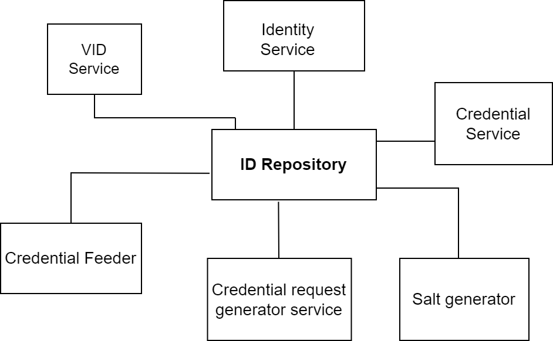

# ID Repository

## Overview

ID Repository contains the records of the identity of an individual and provides API based mechanism to store, retrieve, and update identity details by other MOSIP modules. ID Repository is used by [Registration Processor](../registration-processor/), [ID Authentication](../id-authentication-services/), and [Resident Services](../resident-services/).



## Services

ID Repository module consists of the following components:

1. Identity service
2. VID service
3. Credential service
4. Credential Request Generator service
5. Credential Feeder
6. Salt generator

## Identity service

* Stores, updates, and retrieves identity information.
* Also, retrieves and updates [UIN](../../id-lifecycle-management/identifiers.md#uin) status.

Identity service uses Biometric SDK (server) to extract templates from provided biometric data.

Above is the entity relationship diagram illustrated for the Identity service. _NOTE:_ The numbers do not signify a sequence of operations or control flow. Arrows indicate the data flow.

1. [Key Manager](../keymanager/) encrypts/decrypts data.
2. The credential request generator issues credentials for new/updated UIN data.
3. [Object Store](../persistence/object-store.md) stores/retrieves biometrics and demographic documents.
4. All demographic data of UIN and references to biometric and demographic files stored in the object store are stored in `mosip_idrepo` DB.
5. [Partner management service](../partner-management-services/) retrieves online verification partners to issue credentials.
6. Audit logs are logged into Audit Manager.
7. Biometric SDK extracts the templates for input biometric data.
8. Auth Adapter integrates with KeyCloak for authentication.
9. Masterdata service retreives Identity schema based on input schema version.
10. [WebSub](../websub/) publishes events related to UIN updation and auth type status updates.
11. Kernel ID generator generates UIN.
12. VID service fetches the list of VIDs associated with UIN to issue credential of update UIN and to create and activate draft VID.

## VID service

VID Service provides functionality to create/update Virtual IDs mapped against a UIN. It also provides the facility to update the status of VID. VIDs are created based on the VID policy defined in the configuration.

.png>)

1. Key Manager encrypts/decrypts data.
2. The credential request generator issues credentials for new/updated UIN data.&#x20;
3. All VID related data is stored in `mosip_idmap` DB.
4. Partner management service retrieves online verification partners to issue credentials.
5. Audit logs are logged into Audit Manager.
6. The Auth Adapter integrates with KeyCloak for authentication.
7. WebSub publishes events related to VID updation.
8. The kernel ID generator generates VID.
9. The identity service checks the status of UIN to create a VID.

## Credential service

1. Key Manager encrypts/decrypts data and also used to sign data.
2. WebSub subscribes to get notifications related to credential status from IDA.
3. [DataShare](../datashare.md) creates datashare url for sharable attributes.
4. Identity service retrieves identity data for UIN/VID.
5. Partner management service retrieves policies related to credential type and also retrieves policy for bio-extraction.
6. Auth Adapter integrates with KeyCloak for authentication.

### Credential types

A credential can be defined as any document, object, or data structure that vouches for the identity of a person through some method of trust and authentication. Simply put, a credential is the thing that a person presents—in person or remotely—to say "this is who I am." The types of credentials issued in an ID system vary along multiple dimensions, depending on whether they are physical (i.e., they must be physically carried by a person in order to use them), or digital (i.e., they are machine readable and therefore can be used in a digital environment).

A credential type essentially maps to partner and data share policy.

Default credential types provided as part of [sandbox deployment](../../sandbox-details.md) are given below:

1. `auth`: Represents individual's data shared with Online Verification Partners (further used for Authentication and eKYC).
2. `qrcode`: qrcode type is used for qrcode partners to issue qrcode related credential data.
3. `euin`: It is used to issue credential data to partners who wish to download euin card using euin policy.
4. `reprint`: Reprint auth type is used for issuing credential information to reprint partners.
5. `vercred`: To issue verifiable credentials to partners, vercred credential type is used.

These types are defined in [`partner_policy_credential_type` table](https://github.com/mosip/partner-management-services/blob/release-1.2.0/db\_scripts/mosip\_pms/ddl/pms-partner\_policy\_credential\_type.sql) of [`mosip_pms` database](https://github.com/mosip/partner-management-services/blob/release-1.2.0/db\_scripts/mosip\_pms/).

New credential types may be defined as per needs of a country.

## Credential request generator service

This service creates request for credential issuance.

.png>)

1. Key Manager encrypts/decrypts data.
2. The Auth Adapter integrates with KeyCloak for authentication.

## Credential feeder

This job will feed the existing UIN/ VID identity information to the newly deployed IDA instance.

## Salt generator

This is a one-time job that populates salts that are used to hash and encrypt data for Identity and VID services. This job must be executed before deploying these services. The following tables are populated:

* `uin_hash_salt` in `mosip_idrepo` DB.
* `uin_encrypt_salt` in `mosip_idmap` DB.

In the MOSIP sandbox, the job is run [here](https://github.com/mosip/mosip-infra/blob/release-1.2.0/deployment/v3/mosip/idrepo/install.sh).

## Developer Guide

To know more about the developer setups, read:

1. [Credential Request Generator Service Developers Guide](https://docs.mosip.io/1.2.0/modules/id-repository/id-repository-credential-request-generator-service-developer-guide)
2. [Identity Service Developers Guide](https://docs.mosip.io/1.2.0/modules/id-repository/id-repository-identity-service-developer-guide)
3. [VID Service Developers Guide](https://docs.mosip.io/1.2.0/modules/id-repository/id-repository-vid-service-developer-guide)
4. [Handle Implementation Guide](https://docs.mosip.io/1.2.0/modules/id-repository/custom-handle)

## API

Refer to [API Documentation](https://mosip.github.io/documentation/1.2.0/1.2.0.html).

## Source code

[Github repo](https://github.com/mosip/id-repository/tree/release-1.2.0).
