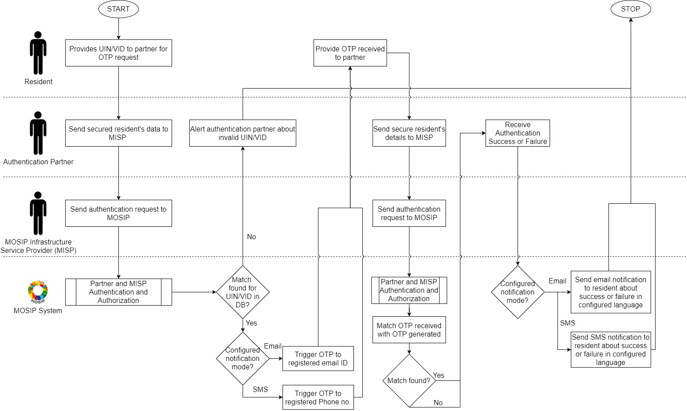
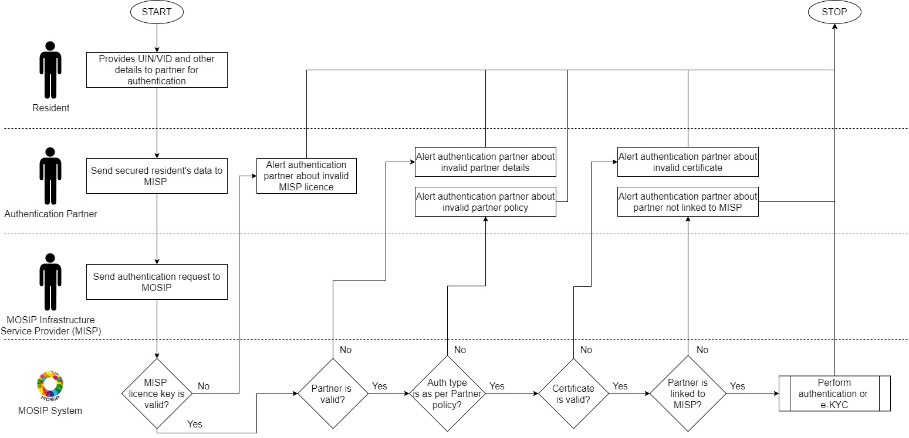
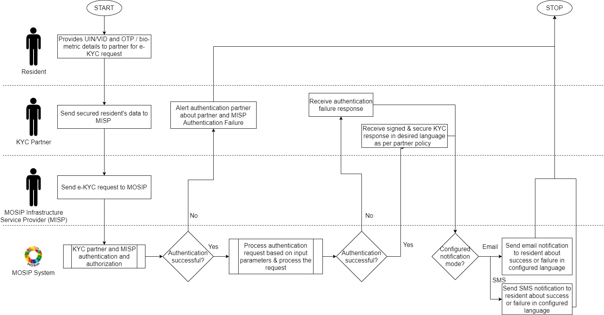

# Overview
ID Authentication (ID Auth) provides an API based authentication mechanism for entities to validate individuals. ID Authentication is the primary mode for entities to validate an individual before providing any service.

Following are the pre-requisites for an entity to do authentication of an individual
* ID Authentication requests must come to MOSIP only via trusted parties who are white listed in MOSIP. The trusted parties are referred to as partners in MOSIP.
* The biometric devices used for authentication must be registered with MOSIP.

ID Auth allows only partners to make authentication requests.  The requests are cryptographically secured and verified.  A partner that captures data from a biometric device must conform to standards to ensure interoperability. 

An individual is authenticated based on the following: 
* Demographic data
    * name 
    * date of birth
    * gender 
    * address
* Biometrics
    * fingerprint
    * iris 
    * face

To enhance security a second factor of authentication is supported:
* OTP based 
* Static pin based 
* Challenge response

To analyze and generate authentication patterns, all authentication requests are audited. These audit logs may be used to determine any frauds during authentication process.

# Detailed functionality
[ID Authentication Functionality](ID-Authentication-Functionality.md)

# Process flow

## Demographic authentication

## Biometric authentication 

## Multifactor authentication 

## OTP authentication

## Partner and MISP authentication

## eKYC authentication

# Logical View    

# Services
For detailed description of ID Auth services, code and design refer to [ID authentication repo](https://github.com/mosip/id-authentication).

# Build and deploy
Refer to build and deploy instructions in [ID authentication repo](https://github.com/mosip/id-authentication).

# APIs
[ID Authentication APIs](ID-Authentication-APIs.md)

