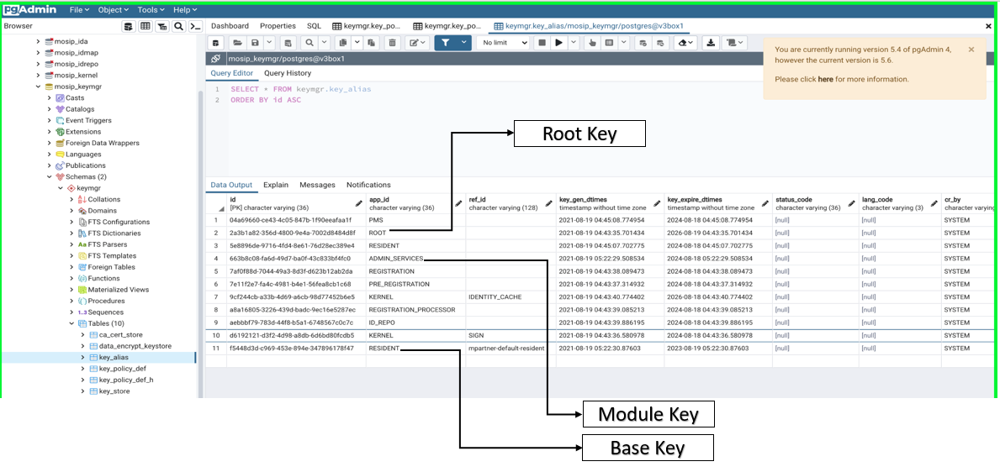

# Key Manager

## Overview

The Key Manager Service provides secure storage, provisioning and management of secret data. It provides all the cryptographic operations like encryption/decryption and digital signature/verification making one trust store for all partner trust path validation. It manages the lifecycle of encryption/decryption keys, including generation, distribution, administration, and deletion.

This includes keying material such as symmetric keys, asymmetric keys, certificates and algorithm data. It is a web-based key management solution that helps consolidate, control, manage, monitor, all key generation and maintenance of key life cycle required in MOSIP.

Key Manager interfaces with key store like [Hardware Security Module (HSM)](hsm.md) and [`mosip_keymgr` DB](https://github.com/mosip/keymanager/tree/release-1.2.0/db\_scripts/mosip\_keymgr).

## Encryption algorithms

* RSA-2048 for all data encryption
* AES-256 for [zero-knowledge encryption](../../privacy-and-security/data-protection.md#zero-knowledge-encryption)

## Key hierarchy

| Key type | Location      | Issuer      | Purpose                                | Example         | [Generation method](./#key-generation-process) | Updation method(on expiry) | [Default validity](./#validity) |
| -------- | ------------- | ----------- | -------------------------------------- | --------------- | ---------------------------------------------- | -------------------------- | ------------------------------- |
| Root     | [HSM](hsm.md) | Self signed | Root                                   | [K1](keys.md)   | Key Generator job or Admin Portal              | Automatic                  | 5 years                         |
| Module   | [HSM](hsm.md) | Root        | Signing, encryption of Base keys       | [K7](keys.md)   | Key Generator job or Admin Portal              | Automatic                  | 3 years                         |
| Base     | Database      | Module      | Encryption of registration packet etc. | [K7.5](keys.md) | Automatic                                      | Automatic                  | 2 years                         |

Root and Module keys reside in HSM while Base key pair reside in the DB encrypted by Module keys. All references (aliases) containing metadata of keys are present in [`mosip_keymgr/key_alias`](../../db\_scripts/mosip\_keymgr/ddl/keymgr-key\_alias.sql) table. The [`key_store`](../../db\_scripts/mosip\_keymgr/ddl/keymgr-key\_store.sql) table contains encrypted Base keys.

The keys are identified as tuple of `app_id` and `ref_id`.

* `app_id` (or `applicationId`): Typically, module name e.g. `REGISTRATION`.
* `ref_id` (or `referenceId`): Specified only for Base keys (except SIGN\*). Eg. `10001_110011`

\* `SIGN`: _TBD_

## Key generation process

Root and Module keys are generated by any one of these methods:

1. Using Key Generator job or
2. Using **Key Manager** option in [Admin portal](../administration/admin-portal-user-guide.md#Key-Manager).

After the deployment, the initial set of pre-requisite keys has to be generated by the Administrator to complete the Key Manager setup. This generation is a one-time activity, and afterwards, the Key Manager will auto-generate all the required Root key and Module master keys upon expiry of key duration.

Base keys are auto-generated (and updaded on expiry) - the administrator is not required to request for generation. The keys reside in the DB. A new key pair is generated if not found in the DB.

## Validity

The default validity of the keys may be modified by updating [`mosip_keymgr/key_policy_def` table](https://github.com/mosip/keymanager/blob/release-1.2.0/db\_scripts/mosip\_keymgr/ddl/keymgr-key\_policy\_def.sql) before generating keys.

## Key revoke/rotate

You can revoke Root or Module key by invoking [`generateMasterKey`](https://mosip.github.io/documentation/1.2.0/kernel-keymanager-service.html#operation/generateMasterKey) API with **force** attribute as **true**. API invalidates existing key and immediately generates new key.

You can revoke Base key by invoking [`revokeKey`](https://mosip.github.io/documentation/1.2.0/kernel-keymanager-service.html#operation/revokeKey) API with the respective `applicationId` and `referenceId`.

## Encryption process

* Random AES 256-bit key will be generated, generated random key will be used to encrypt the actual registration packet.
* Random generated key will be encrypted using the certificate received from server. Certificate contains RSA 2048 bit key.
* Certificate Thumbprint will be computed.
* Thumbprint will be prepend to encrypted random key for key identification.
* Finally, the encrypted random key with prepended thumbprint will be concated with encrypted registration packet using #KEY\_SPLITTER# as separator.

## Decryption process

* Registration packet data will be split to get the encrypted random key, encrypted registration data, certificate thumbprint.
* Identifies the respective private key to decryption process.
* Identified private key will be decrypted with the mapped master key.
* Decrypted private key will be used to decrypt the encrypted random key.
* Decrypt the registration packet using the decrypted random key.
* Returns the decrypted data to REG\_PROC.

## Encryption in Registration Client

* [Registration Client](../registration-client/) sends request to sync data service for the client configuration data.
* Sync Data service requests Key Manager service to provide the reg-client specific certificate. Key identifier will be APP\_ID - REGISTRATION, REF\_ID - CENTER-ID\_MACHINE-ID.
* Key Manager service generate a new key pair, encrypts the private key with REGISTRATION master key and creates a new certificate using same master.
* Returns the certificate to Sync data service. If key pair is already available and is valid, returns the available certificate.
* Sync data service sends the certificate to Registration Client.
* The registration packet will be encrypted using the certificate received from the server after collecting all the required data for registration, including adding the digital signatures required to the registration data, and before saving/writing the data on the Registration Client hard-disk.
* REG\_PROC sends request to decrypt the data to Key Manager service with same app\_id and ref\_id.

## Developer Guide

To know more about the developer setup, read [Key Manager Developers Guide](https://docs.mosip.io/1.2.0/modules/keymanager/keymanager-developer-guide).

## API

Refer [API Documentation](https://mosip.github.io/documentation/1.2.0/1.2.0.html).

## Source code

[Github repo](https://github.com/mosip/keymanager/tree/release-1.2.0).
