# PMS User Guide

## Authentication Partner

Partner user is an entity who uses the Partner Management Portal to perform functions on behalf of Partner Organisation. Hence partner user / user / partner are referred interchangeably in this document.

**Partner Management Portal (PMP) is used by both;**

* Partner Administrator: Partner Admin
* Partners: Partner User (Relying Party)

Caution:


While we are improving/revamping the PMS (Partner Management Service) and it’s interface which we will frequently call as PMP (Partner Management Portal) this will be worth noting that there are still some dependencies on older ‘**Partner Management Portal**’ and therefore we will still be doing few activities from an older PMP, this we have mentioned at appropriate places with ‘**Prerequisites**’.


### Interface Overview

After registering User is now in Home Page/ Dashboard where the following features are provided to Auth Partner:

These features can also be accessed by clicking on side panel (in the form of icons) or clicking on the hamburger menu on the top left which is available across all screens of PMP to help user to easily navigate.

\<image>

## Partner Admin

As ‘Partner Admin’ you can do following:

* Partner Root CA and Sub CA Upload
* Create Policy Group and Policy
* Approve Policy

### Partner Certificate Upload

As a process of Partner onboarding onto PMP after successful registration Partner is required to **Upload CA signed Partner Certificate** on behalf of their organisation which would be used to build a trust store in MOSIP to cryptographically validate that they are from a trusted organisation to perform authentication of citizens. Also this certificate is used to encrypt the response shared in e-KYC.


**Note**:

You will have to use older Partner Admin interface, Yes! you read it correct! before a Partner will be able to ‘**Upload ‘CA Signed Certificate**’ it is prerequisite that the ‘Partner Admin’ must upload the **Root CA** and **Sub CA** certificates and this you can do from ‘Older PMP Interface’.


#### Uploading Root CA and Sub CA (From Older PMP Interface)

1. Go to **Older PMP Interface** and click on **Upload CA Certificate** option on the left navigation pane.
2. Select the Partner Domain.
3. Choose the **Root certificate** to upload (only files with extensions as .cer or .pem).
4. Click Upload.
5. Similarly, sub/intermediate CA certificate should be uploaded by following the above steps (1-4).

<figure><figcaption></figcaption></figure>

### Policy Group and Policy

As Partner Admin you need to ‘**Create Policy Group**’ and ‘**Create Policy(s)**’ which a ‘Partner’ will be able to select while self-registering on PMP.

As an admin you will also have privilege to ‘**Approve Policy Request**’. You can read more about this here.

#### Create Policy group

* Login as Partner Admin into the PMS portal
* Click on **Policy** > **Policy Group**. The existing policy groups are listed on the screen and the new ones can be created.

<figure><figcaption>
Create Policy Group
</figcaption></figure>

* Click on Create Policy Group (+).
* Enter the ‘**Policy Group Name**’ and ‘**Description**’.
* Click **Save**.

<figure>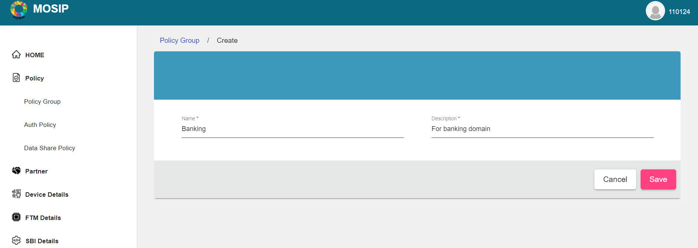<figcaption></figcaption></figure>

#### Create an Auth Policy

On successful creation of **Policy Group(s)**, Polices can be created under that group.

Note: **MOSIP** supports two types of policies, i.e. **Auth Policy** and **Datashare Policy**. Only **Auth Policy** is used by **Authentication Partners**.

1. Click on **Policy** > **Policy Group** on the left navigation pane, The existing policy groups are listed on the screen and the new ones can be created. You can also search or filter any data pertaining to policy groups, use the filter menu.\
   \<image>
2. Click **Auth Policy** > **Create Policy**.
3. Add the **Name** and **Description**.
4. Select the **Policy Group** from the dropdown.
5. Add the Policies Data.
6. Click Save.

<figure>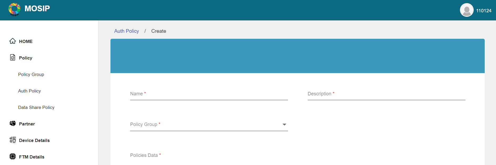<figcaption></figcaption></figure>

**Note**: Once the policy is created, it will be in Inactive state. You have to **Activate a Policy** before a Partner will be able to select it while ‘**Requesting a Policy**’.

#### Activate/edit Auth policy

You can also change the status of **Policy Group**( Deactivate/Re-activate) or edit it using the Action menu as shown below.

1. Select the policy you want to activate or edit.
2. From the Actions menu, select Activate/Edit.

<figure><figcaption></figcaption></figure>

### Approve Policy Request

You can approve a ‘**Policy Request**’ initiated by a Partner using ‘**Request Policy**’ screen.

* Click on **Partner Policy Mapping** in the left navigation pane.
* Select the policy mapping that needs an approval.
* Click on **Manage Policy** on the ‘Action Menu’ appearing against the Policy.
* Click on **Approve**.

<figure>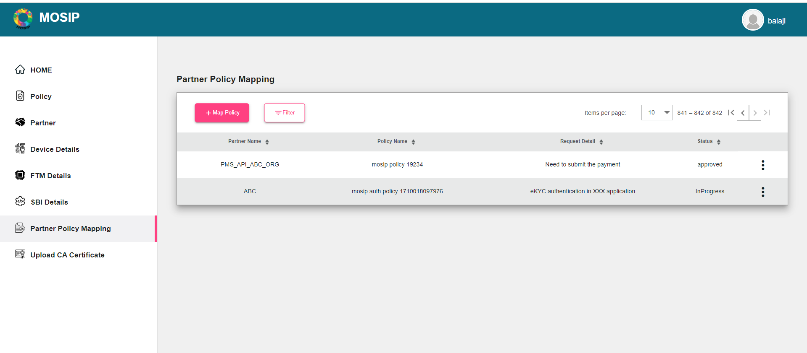<figcaption></figcaption></figure>

<figure>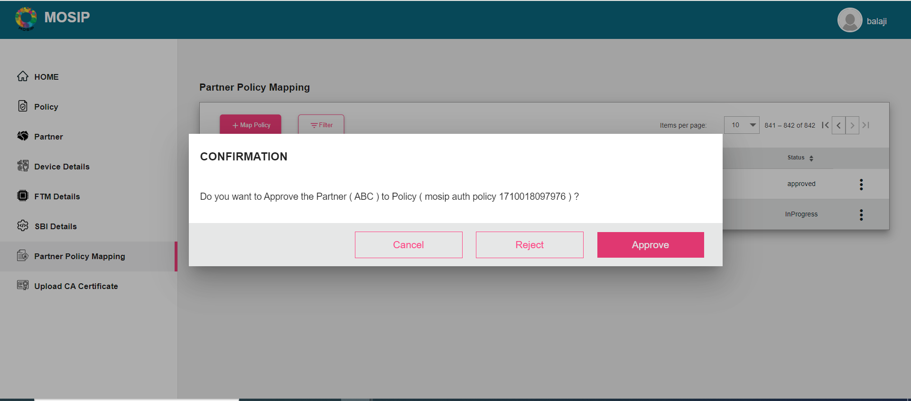<figcaption></figcaption></figure>

<figure>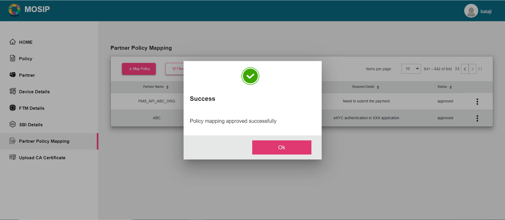<figcaption></figcaption></figure>

<figure><figcaption></figcaption></figure>

## Partner

### Self-Register on PMP as Auth Partner

Go to PMP

Click on ........ ...........a form appears.

1. Enter the following details:
   1. Partner type (Authentication Partner)
   2. First and Last name
   3. Organization Name
   4. Address
   5. Phone number
   6. e-mail
   7. Username and password

<figure><figcaption></figcaption></figure>

2. Click on Register, After you filled the form and click on ‘Register’ you will now be presented with a popup which seeks to take your consent .....
3. **Select Policy Group** popup opens, Select the relevant/applicable **Policy Group** from **Policy Group** dropdown which then will ask you read through ‘Terms and Condition’ and having carefully read through it you can agree and accept it. Before hit the ‘Submit’ read through the **Policy Group** description.

<figure>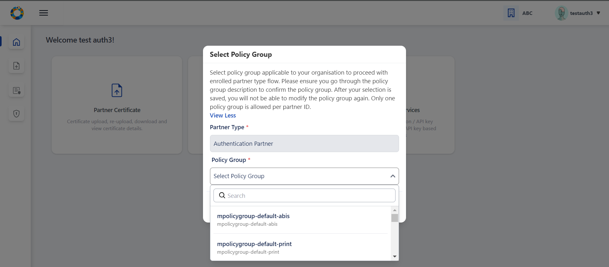<figcaption></figcaption></figure>

<figure>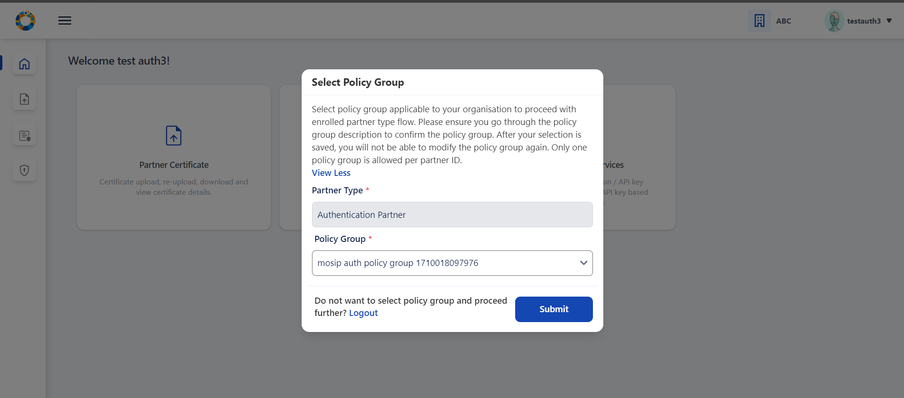<figcaption></figcaption></figure>

<figure>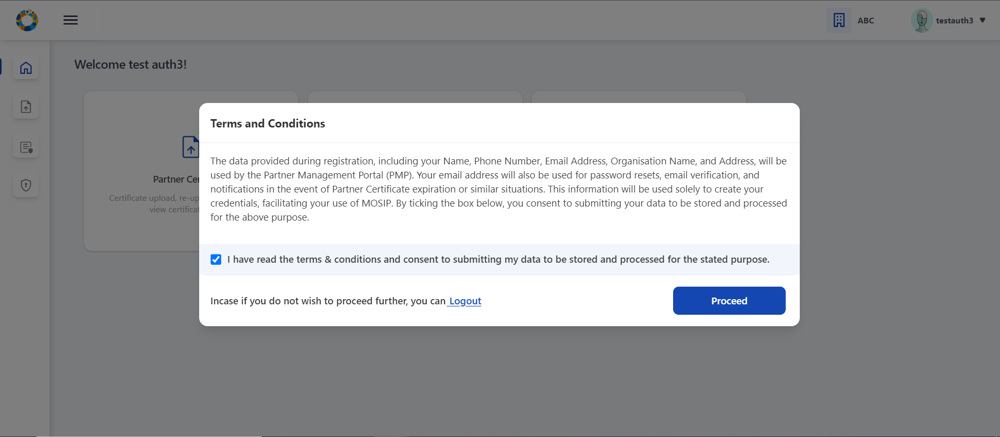<figcaption></figcaption></figure>

**Validations**:

* User can select only one **Policy Group** per **Partner Type**.
* Policy selected once cannot be edited later.
* Terms & Conditions: Partner consent refers to voluntary and informed agreement provided by a partner user on behalf of the Partner Organisation, to a specific action or process where the users have a clear understanding of what they are consenting to. User consent is important to ensure data privacy, where it is compliant to obtain explicit consent from partners before collecting, processing, or sharing their personal/ organisation level data.
* A detailed description explaining which of their personal and organisation data is used and for what purposes it will be used in PMP will be informed while seeking user consent.
* If the user does not wish to agree to the terms and conditions at the moment, he can logout from the application.

### Partner Certificate Upload and Validate, CA Certificate Upload /Download and Authentication Services

Once registered a Partner would need to upload a ‘CA Signed Certificate’. Partner can also ‘Download Certificate’ and ‘Re-Upload Certificate’

As a process of Partner onboarding onto PMP after successful registration, user is required to upload CA signed Partner Certificate on behalf of their organisation. Which would be used to build a trust store in MOSIP to cryptographically validate that they are from a trusted organisation to perform authentication of citizens. Also this certificate is used to encrypt the response shared in e-KYC.

* Partner Certificate:
  * Upload Certificate:
  * Download Certificate: CA Signed Partner Certificate and corresponding MOSIP Signed Certificate
  * Reupload Certificate: CA Signed Partner Certificate ... In case needed
* Requesting Policy: Request to select a Policy from Policy Group - Request for a policy within the selected policy group, tabular list of requested policies along with status of admin approval, view requested policy details along with admin comments/status.
* Define / Configure Authentication Services:
  * OIDC Client : Create OIDC Client for approved policy, tabular list and individual view of submitted OIDC Client details along with OIDC Client ID, Edit OIDC Client details and Deactivate OIDC Client
  * API Key : Generate API Key for approved policy, tabular list and individual view of submitted API Key details and Deactivate API Key.

#### Uploading Partner Certificate

**Note**: Before a Partner can upload a ‘CA Signed Certificate’ it is prerequisite that the ‘Partner Admin’ should have already had uploaded the **Root CA** and **Sub CA** certificates (From older PMP interface).

Authentication Partner (new UI): On clicking Partner Certificate option in user dashboard, user can upload the partner certificate signed by CA by clicking on the upload button.

<figure>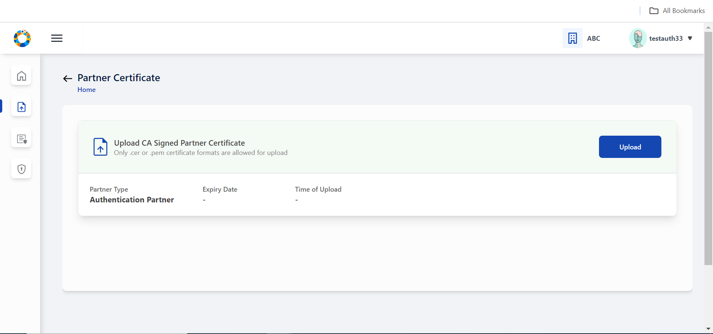<figcaption></figcaption></figure>

Select the CA signed partner certificate from local system by tapping on the upload section (blue area)

<figure>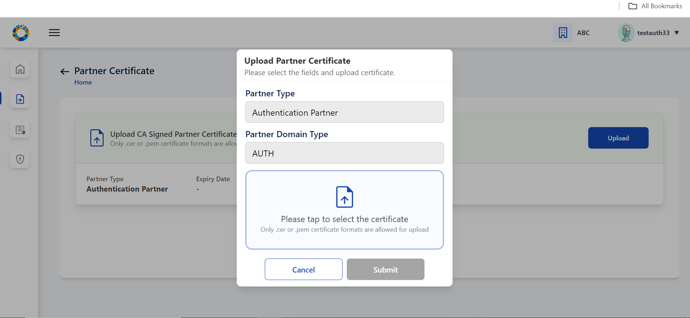<figcaption></figcaption></figure>

Certificate is successfully fetched from local system.

<figure>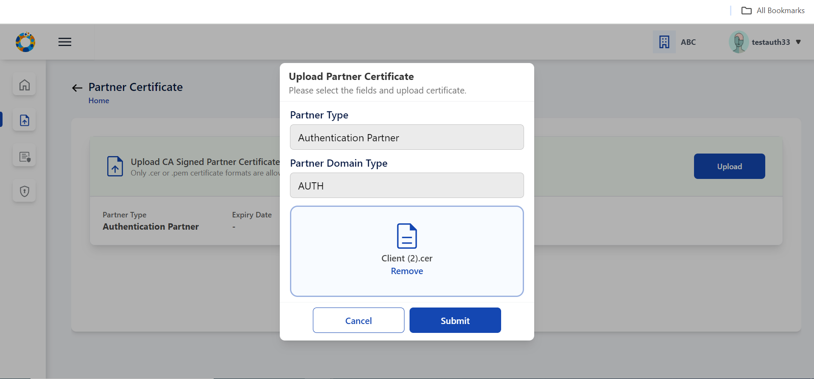<figcaption></figcaption></figure>

Partner Certificate is uploaded successfully on clicking Submit.

<figure>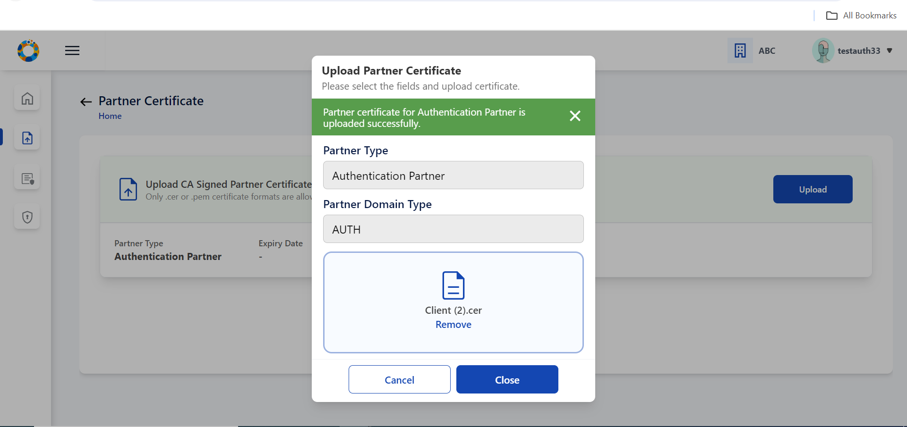<figcaption></figcaption></figure>

On closing the popup, The user can view the uploaded certificate details in the form of a list view.

<figure>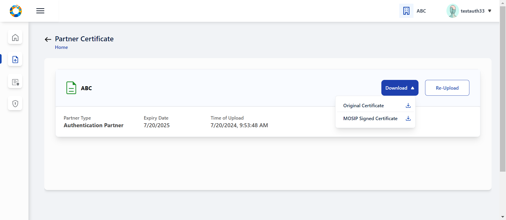<figcaption></figcaption></figure>

#### Download Certificate

There is also an option to download initially uploaded CA signed certificate and also MOSIP Signed Certificate.

#### Re-Upload Certificate

Content

### Request Policy

Pre-Requisite:

**Policy Manager** must have created a **Policy Group** and then created a **Policy** within it for the Partner to be able to ‘**Request a Policy**’.

#### Requesting a Policy

1. Go to **Request Policy** On PMP Interface. You can also use search to filter data.\\
   1. Each policy is provided with policy description for user can make a suitable policy selection.
   2.  You can provide appropriate request comments and submit the policy request details. A message conveying Policy request submitted successfully to admin is displayed.\
       \
       \

       <figure>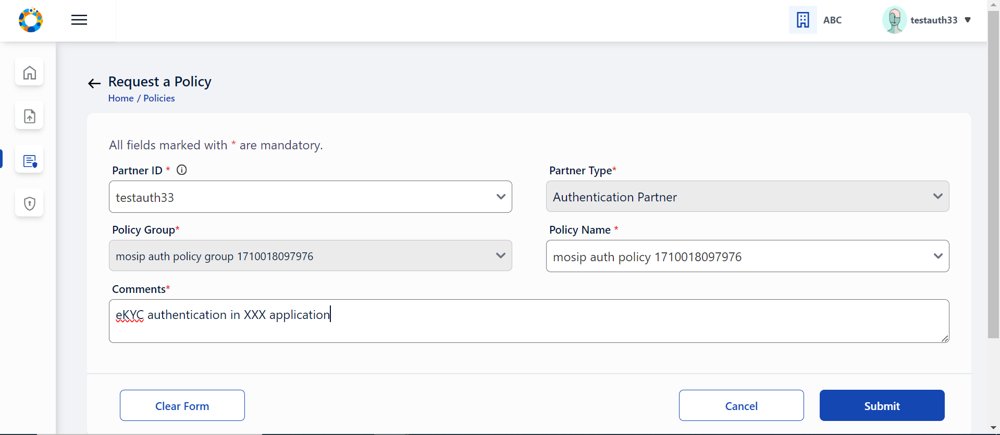<figcaption></figcaption></figure>

<figure>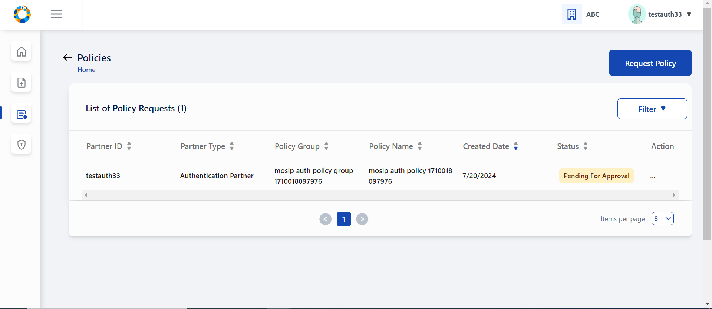<figcaption></figcaption></figure>

3. This newly created policy request will be in ‘Pending for Approval’status. You can also click on action menu to see all the submitted policy details irrespective of its status. The details will also display the comments by admin, if any.
4. Once the request is approved (Partner Admin will then **Approve Policy Request**). Once the request is approved you can view the status turns to ‘Approved’ status.\

<figure>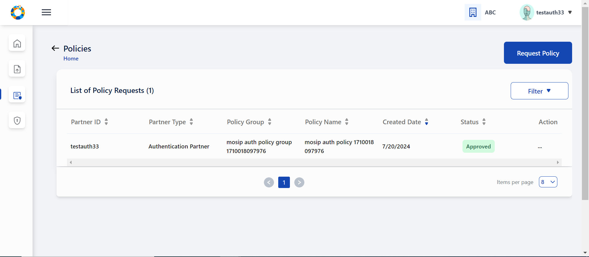<figcaption></figcaption></figure>

### Setup Authentication Services

After you have self registered, selected a policy group, requested for policy and also got approval now you can 'Setup Authentication Services':

* OIDC Client: Create OIDC Client for approved policy
*   API Key : Generate API Key for approved policy, tabular list and individual view of submitted API Key details and Deactivate API Key.

    **Pre-Requisite**:

**Prerequisites**: Policy requested by the **Partner** must be already approved by **Policy Manager**.

#### Creating OIDC Client

* The authentication partner needs to provide the following details to create OIDC Client
  * Select suitable Authentication policy for OIDC Client creation. Only the policies that are APPROVED by admin will be available in dropdown for selection.
  * Enter the public key in JWK format, name or label for OIDC Client, LogoURI and one or more Redirect URI.
  * On successful submission, user can find this record in tabular list of submitted OIDC Client details in ‘Activated’ status. Tabular list and individual view of submitted OIDC Client details along with OIDC Client ID, Edit OIDC Client details and Deactivate OIDC Client can be done from here.

<figure>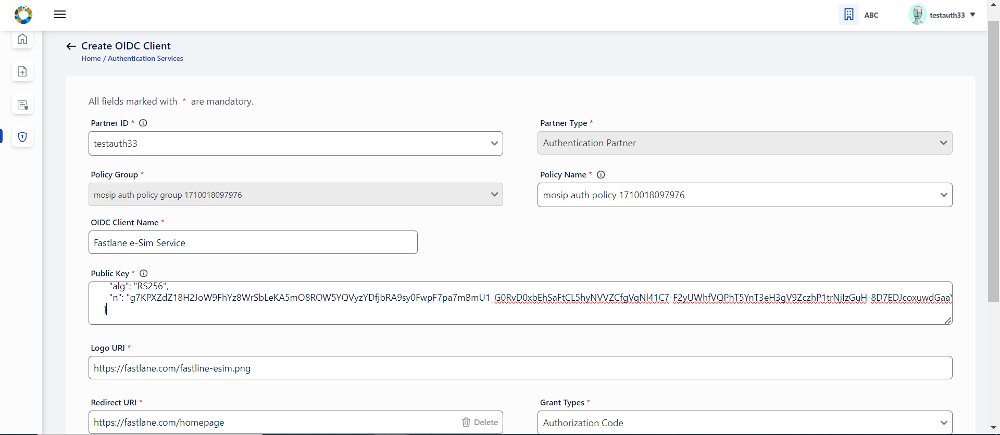<figcaption></figcaption></figure>

\

* Once the details are in Activated status, user will be able to view the OIDC Client ID generated, by clicking on the eye icon ( ). clicking on the OIDC Client ID eye icon, opens a popup window which displays the Client ID and a copy button.
* This Client ID can then be consumed in eSignet to perform authentication. Client ID can be accessed by clicking on eye icon

\<image>

* User can utilize this OIDC Client ID to perform eSignet based authentication of citizens.\
  \<image>
* The user can also view every OIDC Client detail individually using the View option\
  \<image>
* The user can also edit the OIDC Client details in Activated (only OIDC Client Name, LogoURI and RedirectURI are editable) by selecting the edit option in Action Menu.\
  \<image>
* User can deactivate the OIDC Client ID by clicking on deactivate option . The deactivate popup window appears and on clicking confirm, the OIDC Client record is changed to Deactivated status. **Once deactivated, the client ID can not be used anymore for authentication**.

\<image>

#### API Key Generation

The authentication partner needs to provide the following details to generate API Key

* Select suitable Authentication policy for API Client. Only the policies that are **Approved** by admin will be available in dropdown for selection.

1. Enter an appropriate name or label for API Key to be generated and submit, On successful submission, a popup window displays API Key along with a copy button.

<figure>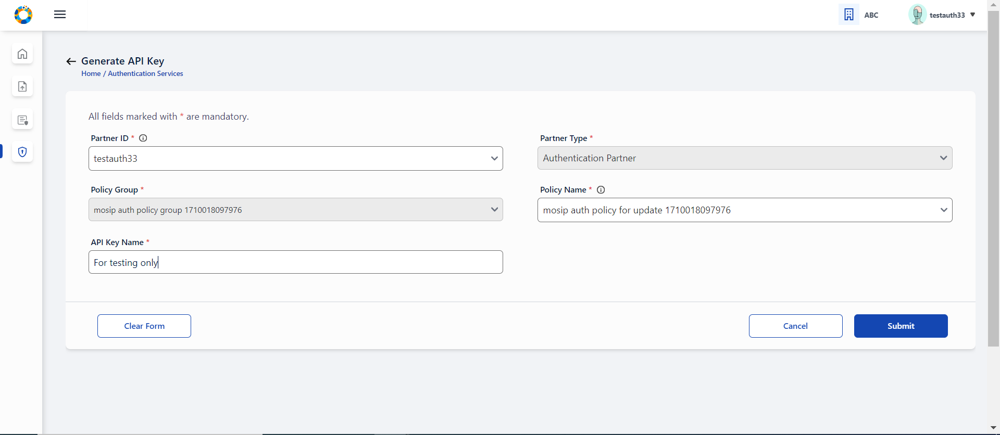<figcaption></figcaption></figure>

2.  This API Key can be viewed by user in PMS application only once due to security reasons, hence the user is well notified with an appropriate message in the same API Key popup window to avoid closing the window unless user has not copied the API Key.\

    <figure><figcaption></figcaption></figure>
3.  User can find this record in tabular list of submitted API details in ‘Activated’ status.\

    <figure>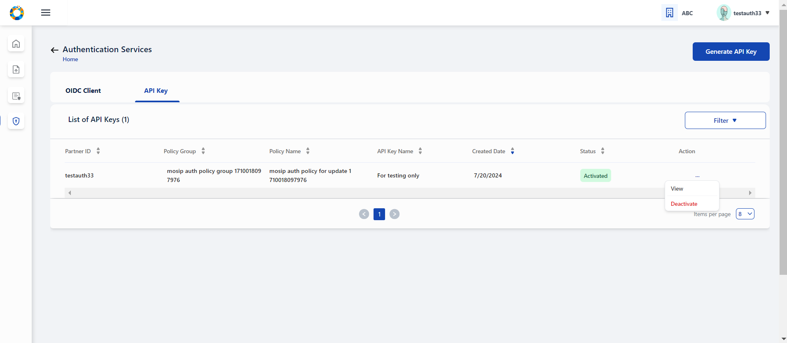<figcaption></figcaption></figure>
4. User can either view individual API Key entries or view the consolidated list in tabular view.

<figure>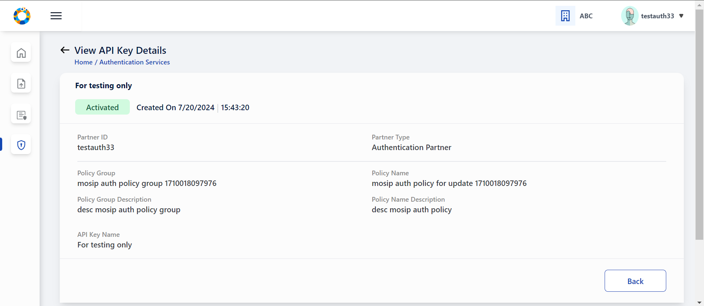<figcaption></figcaption></figure>

5. You also have an option to deactivate an API Key, which thereafter cannot be used for authentication. On clicking confirm, the API Key record is changed to Deactivated status. Once deactivated, it cannot be activated again. You may need to generate a new API key as per requirement.

<figure>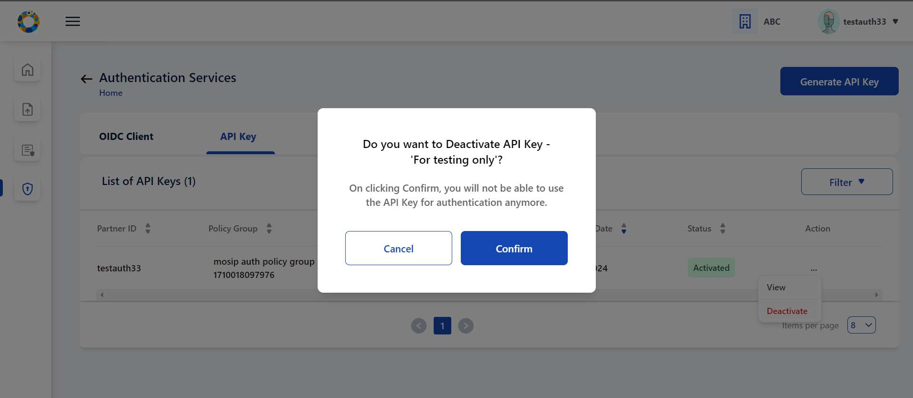<figcaption></figcaption></figure>

## Existing User

As an existing user, the following steps are to be taken before reaching the home page of PMS:

1. Partner logs into the portal via the login page using username/email and password.

\
\<image>

* Partner is now in Home Page/ Dashboard.

\<image>

Existing user can perform these functionalities on a need basis:

### Reupload a new partner certificate through the following steps

* Click on Partner Certificate option in the dashboard/ side panel / hamburger menu.
* The user is navigated to list view of partner certificate and click on Re- Upload button of Authentication Partner Type.

\<image>

*   Re- upload certificate pop-up window appears . The time and date of previous certificate upload is also displayed for user reference.\
    \<image>

    \<image>
* Click on the certificate upload section (blue area) to upload a new partner certificate from the local system. After selecting the certificate from local system , the fetched certificate name is displayed:

\<image>

On click of Submit, Partner certificate upload success message is displayed.\
\<image>

* On click of Close, the user is navigated to list view of partner certificate.

\<image>

2. Request Policy (if not done earlier) as covered in b) above.
3. Perform Authentication Services as covered in c) above.

### Forgot Password

If a user is unable to remember his password at the time of login, he can click on **Forgot Password** link displayed on login page to reset his password.\
\<image>

* On clicking Forgot password, the user enters his registered email address and submits.
* A message is displayed informing user that further instructions to reset password has been sent to his email address entered.

\<image>

* The user clicks on the Reset password link received on his email address where he is navigated to Change Password screen to enter a new password that adheres password policy and reenter the same password before saving it.

\<image>

\<image>

* After clicking submit, This new password will be further used in subsequent logins.
