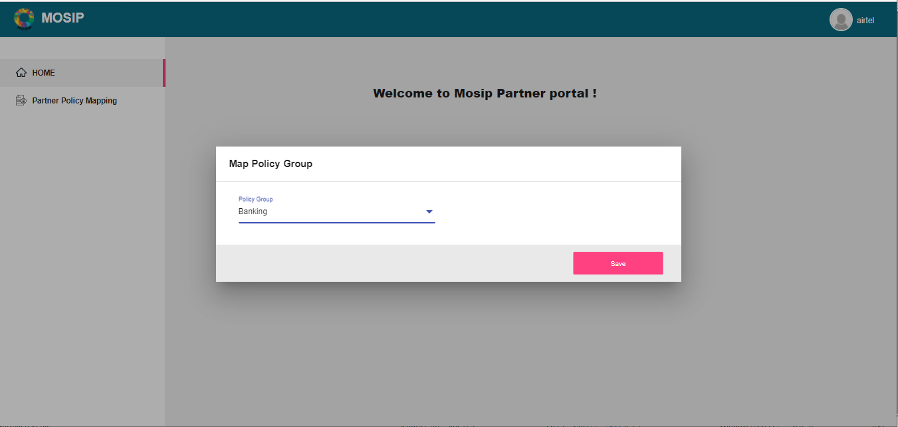
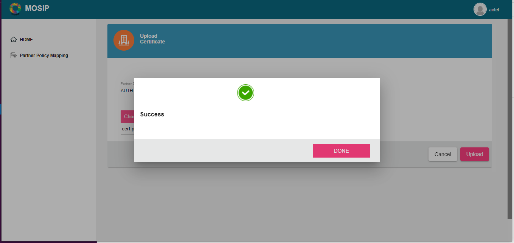
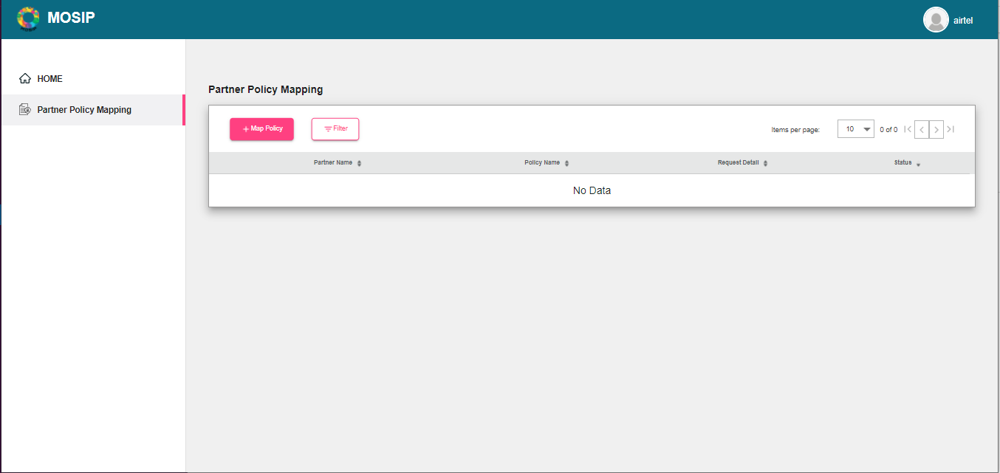
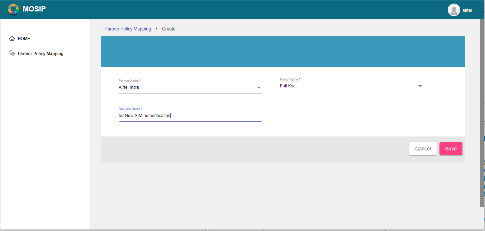
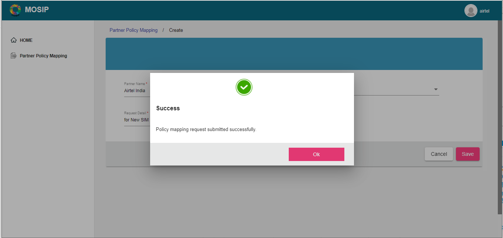
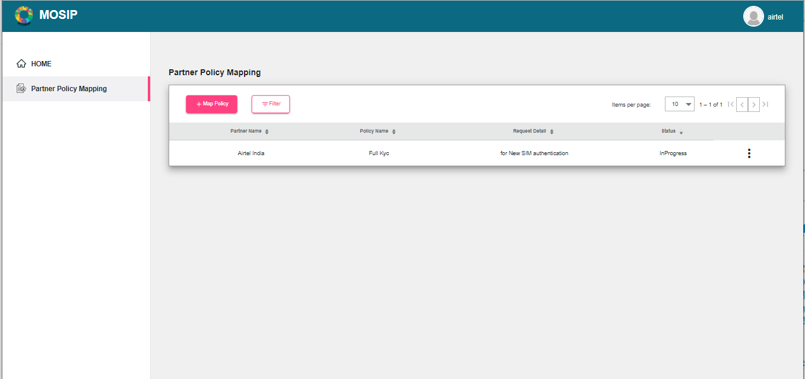
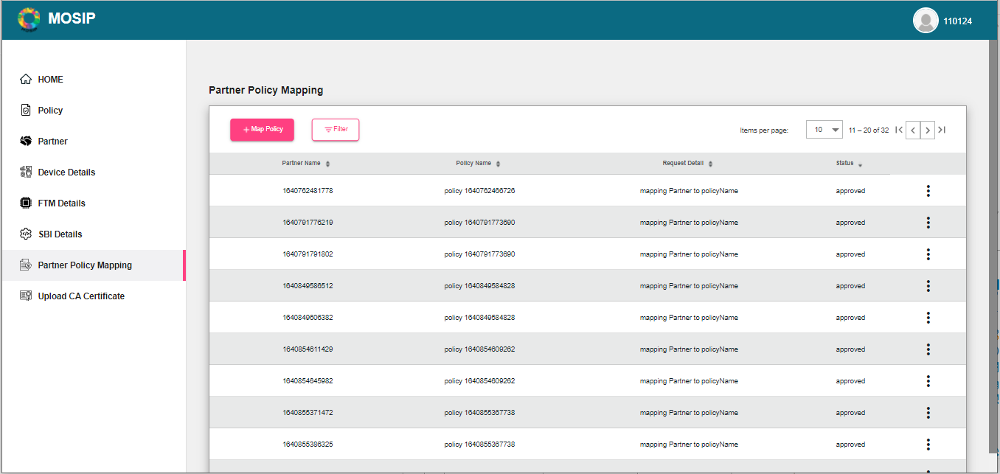
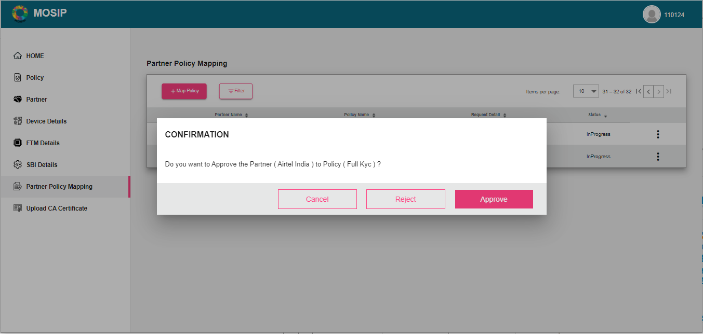
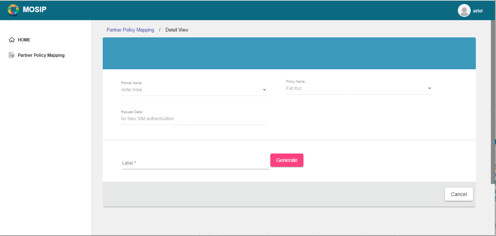
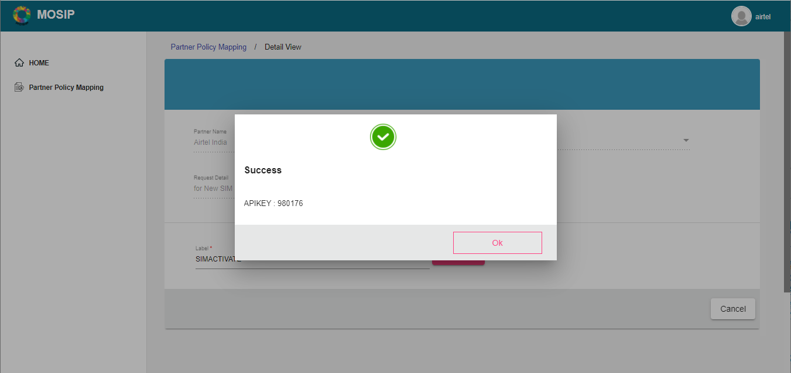

# Auth Partner

## Overview

Below is the workflow that includes the registration process for an Auth or Credential partner and the steps that need to be followed for using the partner portal.

* The partner self-registers through the portal.
* Partner selects the relevant Policy Group.
* Partner admin uploads the CA certificate.
* Partner admin or partner uploads the partner certificate.
* Partner admin or Partner maps the Partner Policy.
* Partner admin approves or rejects partner policy mapping.
* Partner logins after the approval and generates the API key for the approved partner policy mapping using an unique label.

### Self-registration

* The Auth/ Credential partner can register themselves on MOSIP PMS portal by clicking **Register** on the landing page.
* They need to fill up a form with the details below:
  * First and Last name
  * Organization Name
  * Partner type (Authentication Partner/ Credential Partner)
  * Address, e-mail, phone number
  * Username and password

To view the details entered, click **Home** to see the dashboard.

.PNG>)

### Policy Group mapping

On successful registration, the partner can see their username displayed on the top right corner.

1. Partner selects the relevant Policy Group from **Map Policy Group** dropdown.
2. Clicks **Save**.

### Upload of Certificates

#### CA Certificate upload

The Partner admin needs to upload the CA certificate to enable the partner for using the portal. To do so, the Partner admin:

1. Clicks **Upload CA Certificate** option on the left navigation pane of the partner portal.
2. Selects the Partner Domain.
3. Chooses the certificate to upload (only files with extensions as .cer or .pem).
4. Clicks **Upload**.

The uploaded certificates can be viewed by clicking on `View Certificates-> View`.

#### Partner Certificate upload

Similarly, the Partner certificates can be added by the Partner admin/ partner.

### Mapping policy to policy group

Once the certificates are uploaded,

1. Partner maps the policy to the Policy group by clicking on **Partner Policy Mapping -> +Map Policy**.
2. Partner enters the Partner Name.
3. Selects the Auth Policy Name from the dropdown.
4. Enters a value for the Request Details (unique value) and clicks **Save**.

* Once this is done, you will see a message saying `Policy mapping grequest submitted successfully`.
* Also, the status is displayed as "In progress" and this means that the partner cannot generate the API key until the request is approved by the Partner admin.

### Approval/ Rejection of partner policy mapping

Once the Partner Policy Mapping request is raised by the partner, the Partner admin has the privilege to approve/ reject the mapping. To do so,

1. Partner admin logs into the PMS portal and clicks on `Partner Policy Mapping` in the left navigation pane.
2. Selects the policy mapping that needs an approval.
3. From the action menu against the policy mapping, selects **Manage Policy**.
4. Clicks **Approve**.

Once the request is approved, the partner can view the status being updated to `Approved` instead of `InProgress`.

### Generating the API Key

Partner logins after the Partner Policy Mapping is approved by the Partner admin and generates the API key with an unique label. To do so,

1. Partner clicks `Partner Policy Mapping` on the left navigation pane.
2. From the actions menu, click **Generate API Key**.
3. Partner enters a unique value for the `Label` field.
4. Click **Generate**.

The API key is generated and can be used by the partner.

The partner can also deactivate a particular API Key by clicking on the cross-mark (X) next to it. Please note, once deactivated, it cannot be activated again. You may need to generate a new API key as per requirement.
