# Device Provider

## Overview

This guide enables the Device provider partner to use the partner portal effectively. Below is the workflow:

* The partner self-registers through the portal.
* Partner admin uploads the CA certificate.
* Partner admin or Partner uploads the partner certificate.
* Partner admin or Partner creates device details.
* Partner admin approves or rejects device details.
* Partner admin or Partner creates SBI details.
* Partner admin approves or rejects SBI details.
* Partner admin or Partner maps devices and SBI.

### Self-registration

* The Device Provider partner can register themselves on the MOSIP PMS portal by clicking **Register** on the landing page.
* They need to fill up a form with the details below:
  * First and Last name
  * Organization Name
  * Partner type (Device Provider)
  * Address, e-mail, phone number
  * Username and password

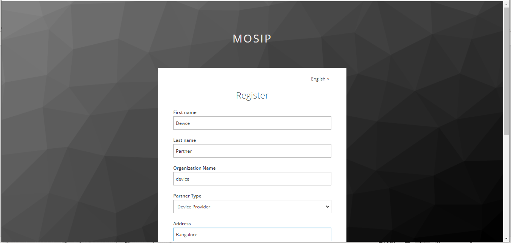 

To view the details entered, click **Home** to see the dashboard.

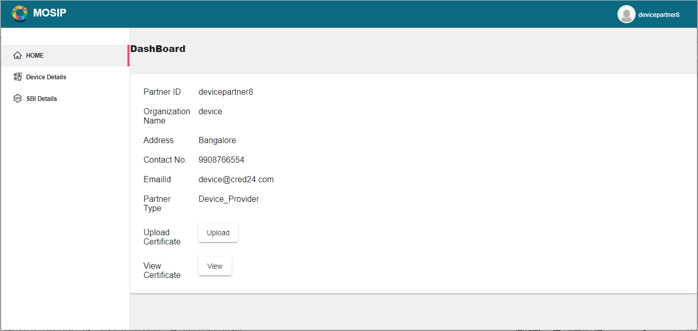

### Upload of Certificates

#### CA Certificate upload

The Partner admin needs to upload the CA certificate to enable the partner for using the portal. To do so, the Partner admin:

1. Clicks **Upload CA Certificate** option on the left navigation pane of the partner portal.
2. Selects the Partner Domain.
3. Chooses the certificate to upload (only files with extensions such as .cer or .pem).
4. Clicks **Upload**.

The uploaded certificates can be viewed by clicking on `View Certificates-> View`.

#### Partner Certificate upload

Similarly, the Partner certificates can be added by the Partner admin/ partner.

The certificate can be uploaded by clicking **Home-> Upload Certificate -> Upload**.

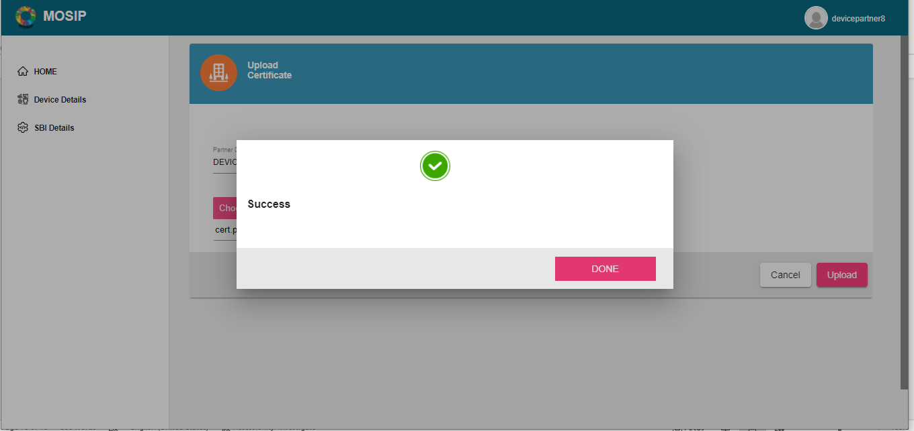

The certificate can be viewed by clicking **Home-> View Certificate ->View**.

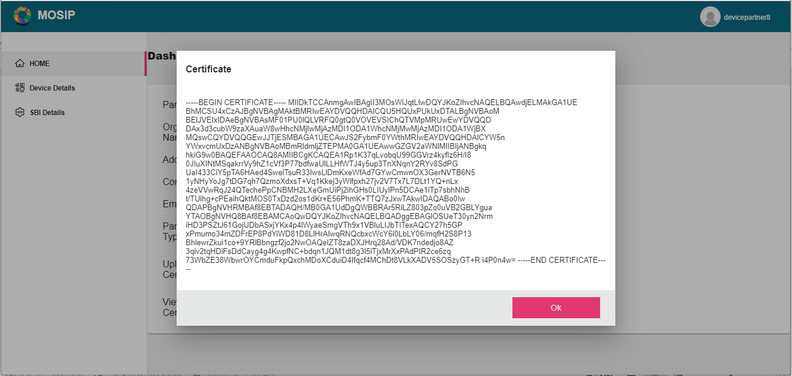

## Device make and model

### Creating Device details

The partner can add devices to the portal. To do so,

1. Partner clicks `Device details-> Create Device`.
2. Enters the necessary details to create/add devices like:
   * Partner Name
   * Device Type and Sub Type
   * Make and Model
3. Click **Save**.

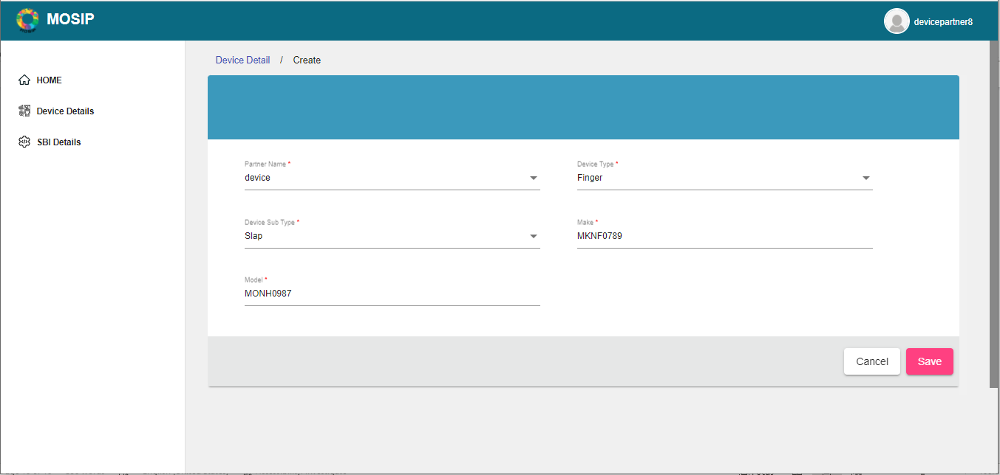

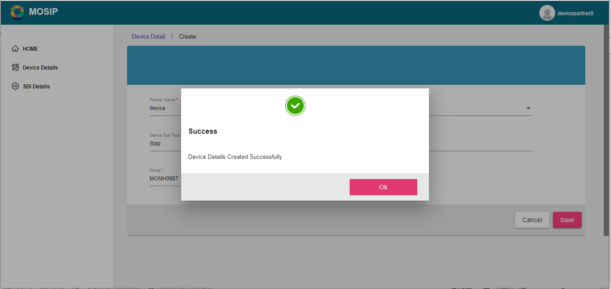

### Approval/ Rejection of Device details

The Partner Admin can choose to approve/reject the device details entered by the partner.

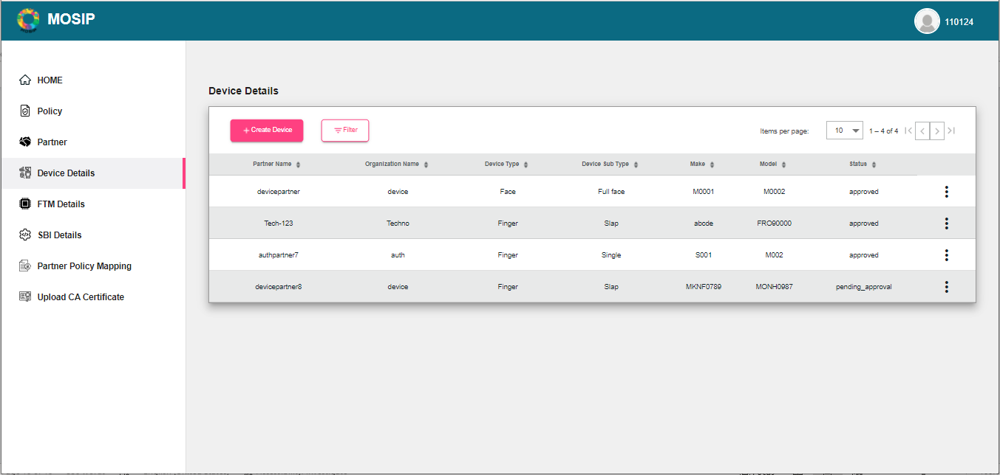

## SBI (Secure Biometric Interface)

### Creating SBI

The Partner can create SBI by filling in the required details.

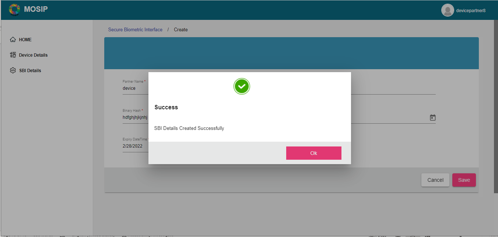

### Approval/Rejection of SBI

The Partner Admin can choose to approve/reject the SBI details entered by the partner.

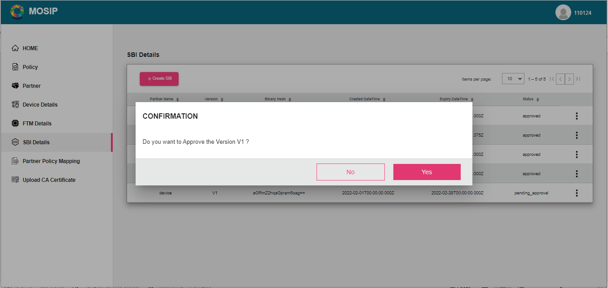

## Mapping Device make and model with SBI

The partner can map the device with an SBI.

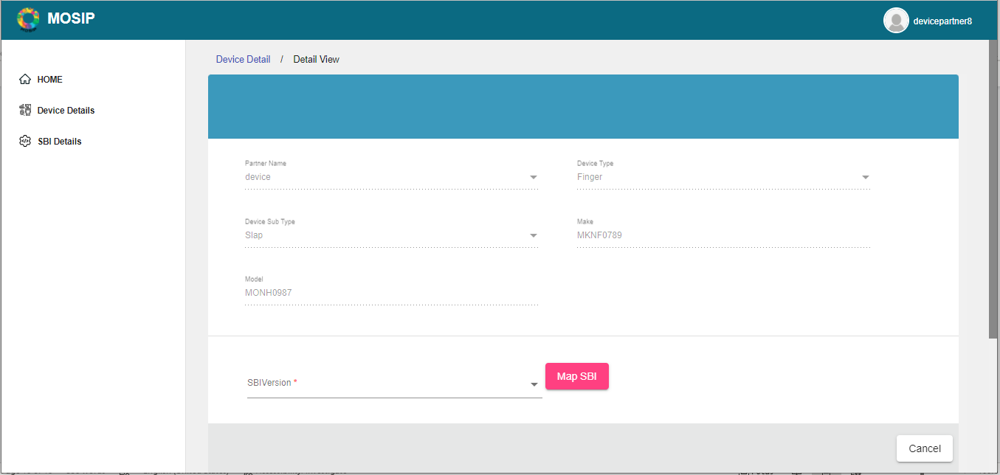

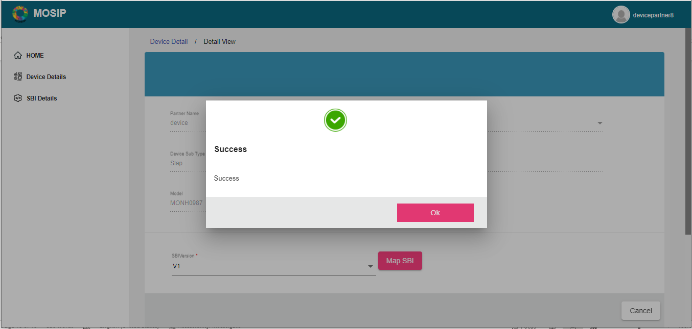

